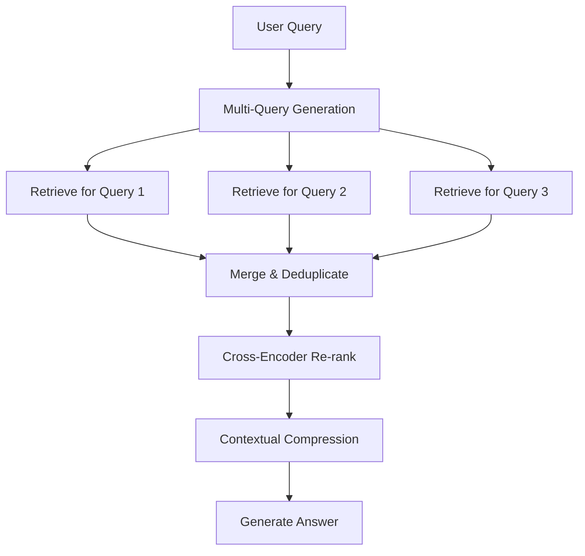
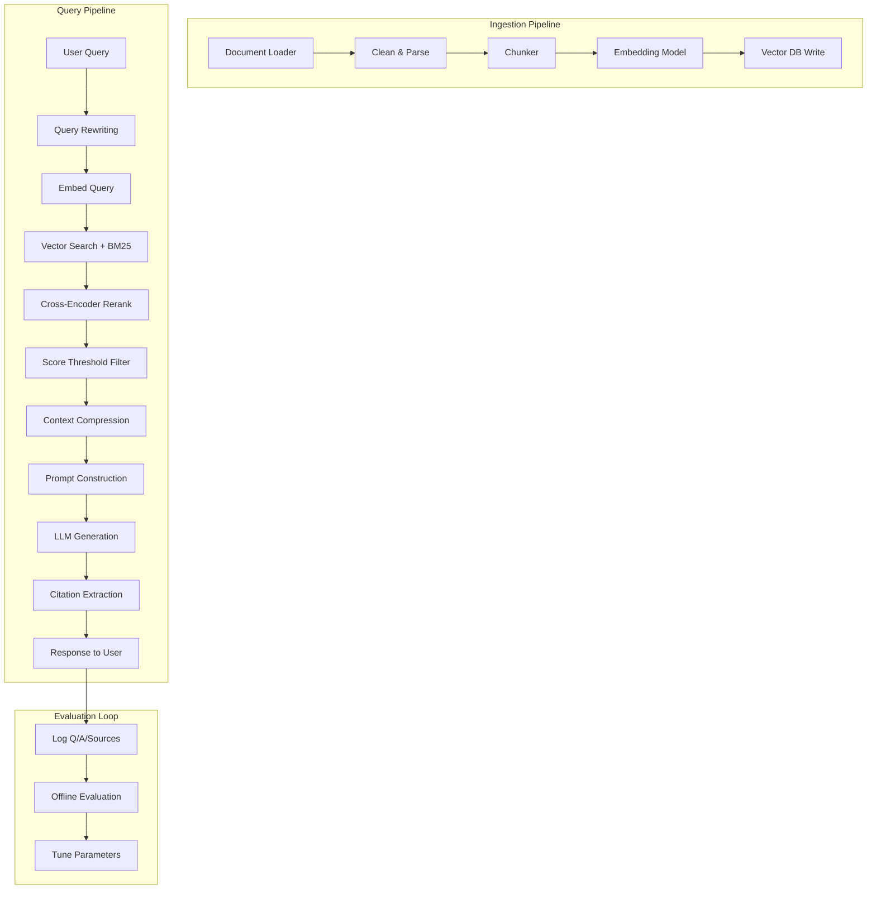

# Topic 14: RAG (Retrieval-Augmented Generation)

> **Goal**: Build production RAG pipelines from scratch and with frameworks. Master chunking, embedding, retrieval, re-ranking, and evaluation.

---

## Table of Contents

1. [RAG Fundamentals — What & Why](#1-rag-fundamentals)
2. [Document Loading](#2-document-loading)
3. [Chunking Strategies](#3-chunking-strategies)
4. [Embedding Models](#4-embedding-models)
5. [Vector Stores — FAISS from Scratch](#5-vector-stores-faiss)
6. [Basic RAG Pipeline — No Framework](#6-basic-rag-pipeline)
7. [Retrieval Strategies](#7-retrieval-strategies)
8. [Hybrid Search — BM25 + Dense](#8-hybrid-search)
9. [Re-Ranking with Cross-Encoders](#9-re-ranking)
10. [Advanced RAG Patterns](#10-advanced-rag-patterns)
11. [RAG with LangChain](#11-rag-with-langchain)
12. [RAG with LlamaIndex](#12-rag-with-llamaindex)
13. [Evaluation — RAGAS & Custom Metrics](#13-evaluation)
14. [Production RAG — Architecture & Optimization](#14-production-rag)
15. [Mini-Project: Chat with Your PDF](#15-mini-project)
16. [Interview Questions & Answers](#16-interview-qa)

---

## 1. RAG Fundamentals

**The Problem**: LLMs have fixed training data. They hallucinate on domain-specific or recent information.

**The Solution**: Retrieve relevant context at query time and inject it into the prompt.

```
┌─────────────────────────────────────────────────────────┐
│                    RAG Pipeline                         │
│                                                         │
│  ┌─────────┐    ┌──────────┐    ┌─────────────────┐    │
│  │  Query   │───▶│ Retrieve │───▶│ Generate Answer  │   │
│  │         │    │ Top-K    │    │ (Query+Context)  │   │
│  └─────────┘    │ Chunks   │    └─────────────────┘    │
│                  └──────────┘                           │
│                       ▲                                 │
│                       │                                 │
│              ┌────────┴────────┐                        │
│              │  Vector Store   │                        │
│              │  (Embeddings)   │                        │
│              └────────┬────────┘                        │
│                       ▲                                 │
│              ┌────────┴────────┐                        │
│              │ Indexing Pipeline│                        │
│              │ Load→Chunk→Embed│                        │
│              └─────────────────┘                        │
└─────────────────────────────────────────────────────────┘
```

**Two phases**:
1. **Indexing** (offline): Load docs → Chunk → Embed → Store in vector DB
2. **Querying** (online): Embed query → Retrieve top-K → Augment prompt → Generate

$$\text{RAG}(q) = \text{LLM}\big(q \,\|\, \text{Top-K}(\text{sim}(E(q), E(d_i)))\big)$$

where $E(\cdot)$ is the embedding function and $\text{sim}$ is cosine similarity.

---

## 2. Document Loading

```python
"""Document loaders for common formats."""
import os
from dataclasses import dataclass, field
from pathlib import Path
from typing import Optional


@dataclass
class Document:
    """A document with content and metadata."""
    content: str
    metadata: dict = field(default_factory=dict)
    doc_id: Optional[str] = None


def load_text(path: str) -> Document:
    """Load plain text file."""
    text = Path(path).read_text(encoding="utf-8")
    return Document(
        content=text,
        metadata={"source": path, "type": "text"},
        doc_id=os.path.basename(path),
    )


def load_pdf(path: str) -> Document:
    """Load PDF using PyMuPDF (fitz)."""
    import fitz  # pip install PyMuPDF

    doc = fitz.open(path)
    pages = []
    for i, page in enumerate(doc):
        text = page.get_text()
        pages.append(text)

    return Document(
        content="\n\n".join(pages),
        metadata={"source": path, "type": "pdf", "num_pages": len(pages)},
        doc_id=os.path.basename(path),
    )


def load_html(url: str) -> Document:
    """Load and parse HTML from URL."""
    import requests
    from bs4 import BeautifulSoup  # pip install beautifulsoup4

    resp = requests.get(url, timeout=30)
    soup = BeautifulSoup(resp.text, "html.parser")

    # Remove scripts, styles
    for tag in soup(["script", "style", "nav", "footer"]):
        tag.decompose()

    text = soup.get_text(separator="\n", strip=True)
    return Document(
        content=text,
        metadata={"source": url, "type": "html"},
        doc_id=url,
    )


def load_markdown(path: str) -> Document:
    """Load markdown file, preserving structure."""
    text = Path(path).read_text(encoding="utf-8")
    return Document(
        content=text,
        metadata={"source": path, "type": "markdown"},
        doc_id=os.path.basename(path),
    )


# --- Usage ---
# doc = load_pdf("paper.pdf")
# doc = load_html("https://example.com/docs")
# doc = load_text("notes.txt")
```

---

## 3. Chunking Strategies

Chunking is **the most impactful** RAG design decision. Bad chunking = bad retrieval = bad answers.

### 3.1 Fixed-Size Chunking

```python
def chunk_fixed(text: str, chunk_size: int = 500, overlap: int = 50) -> list[str]:
    """
    Split text into fixed-size character chunks with overlap.

    Overlap prevents cutting sentences mid-thought.
    """
    chunks = []
    start = 0
    while start < len(text):
        end = start + chunk_size
        chunks.append(text[start:end])
        start = end - overlap
    return chunks


# --- Example ---
text = "A" * 1200
chunks = chunk_fixed(text, chunk_size=500, overlap=50)
print(f"Text length: {len(text)}, Chunks: {len(chunks)}")
# Text length: 1200, Chunks: 3
```

### 3.2 Recursive Character Splitting

Split on natural boundaries (paragraphs → sentences → words) until chunks fit.

```python
def chunk_recursive(
    text: str,
    chunk_size: int = 500,
    overlap: int = 50,
    separators: list[str] | None = None,
) -> list[str]:
    """
    Recursively split text using a hierarchy of separators.
    Tries largest separators first, falls back to smaller ones.
    """
    if separators is None:
        separators = ["\n\n", "\n", ". ", " ", ""]

    chunks = []
    sep = separators[0]
    remaining_seps = separators[1:]

    # Split on current separator
    parts = text.split(sep) if sep else list(text)

    current_chunk = ""
    for part in parts:
        candidate = current_chunk + sep + part if current_chunk else part

        if len(candidate) <= chunk_size:
            current_chunk = candidate
        else:
            if current_chunk:
                chunks.append(current_chunk)
            # If single part exceeds chunk_size, recurse with smaller separator
            if len(part) > chunk_size and remaining_seps:
                chunks.extend(
                    chunk_recursive(part, chunk_size, overlap, remaining_seps)
                )
                current_chunk = ""
            else:
                current_chunk = part

    if current_chunk:
        chunks.append(current_chunk)

    # Add overlap between consecutive chunks
    if overlap > 0 and len(chunks) > 1:
        overlapped = [chunks[0]]
        for i in range(1, len(chunks)):
            prev_tail = chunks[i - 1][-overlap:]
            overlapped.append(prev_tail + chunks[i])
        chunks = overlapped

    return chunks


# --- Example ---
text = """Chapter 1: Introduction

Machine learning is a subset of AI. It allows computers to learn from data.

The main types are:
- Supervised learning
- Unsupervised learning
- Reinforcement learning

Chapter 2: Supervised Learning

In supervised learning, we have labeled data. The model learns a mapping from inputs to outputs."""

chunks = chunk_recursive(text, chunk_size=150, overlap=30)
for i, c in enumerate(chunks):
    print(f"Chunk {i} ({len(c)} chars): {c[:60]}...")
```

### 3.3 Semantic Chunking

Split where the topic actually changes, using embedding similarity.

```python
import numpy as np


def chunk_semantic(
    text: str,
    embed_fn,  # callable: list[str] -> np.ndarray
    threshold: float = 0.5,
    min_chunk_size: int = 100,
) -> list[str]:
    """
    Split text at points where semantic similarity drops.

    1. Split into sentences
    2. Embed each sentence
    3. Compute cosine similarity between consecutive sentences
    4. Split where similarity drops below threshold
    """
    import re

    # Split into sentences
    sentences = re.split(r"(?<=[.!?])\s+", text)
    if len(sentences) <= 1:
        return [text]

    # Embed all sentences
    embeddings = embed_fn(sentences)  # shape: (n, dim)

    # Cosine similarity between consecutive sentences
    similarities = []
    for i in range(len(embeddings) - 1):
        a, b = embeddings[i], embeddings[i + 1]
        sim = np.dot(a, b) / (np.linalg.norm(a) * np.linalg.norm(b) + 1e-8)
        similarities.append(sim)

    # Find split points (where similarity drops)
    chunks = []
    current_sentences = [sentences[0]]

    for i, sim in enumerate(similarities):
        if sim < threshold and len(" ".join(current_sentences)) >= min_chunk_size:
            chunks.append(" ".join(current_sentences))
            current_sentences = [sentences[i + 1]]
        else:
            current_sentences.append(sentences[i + 1])

    if current_sentences:
        chunks.append(" ".join(current_sentences))

    return chunks
```

### 3.4 Chunking Comparison

```
┌──────────────────────────────────────────────────────────────┐
│              Chunking Strategy Comparison                     │
├─────────────┬──────────────┬──────────────┬──────────────────┤
│  Strategy   │    Speed     │   Quality    │   Best For       │
├─────────────┼──────────────┼──────────────┼──────────────────┤
│ Fixed-size  │ ★★★★★ Fast  │ ★★☆ Low     │ Quick prototype  │
│ Recursive   │ ★★★★☆ Fast  │ ★★★★ Good   │ General purpose  │
│ Semantic    │ ★★☆☆☆ Slow  │ ★★★★★ Best  │ Topic-diverse    │
│ Markdown    │ ★★★★☆ Fast  │ ★★★★ Good   │ Structured docs  │
└─────────────┴──────────────┴──────────────┴──────────────────┘

Rule of thumb:
- Chunk size 200-500 tokens for Q&A
- Chunk size 500-1000 tokens for summarization
- Always use overlap (10-20% of chunk size)
```

---

## 4. Embedding Models

Embeddings convert text to dense vectors for similarity search.

$$\text{sim}(q, d) = \cos(E(q), E(d)) = \frac{E(q) \cdot E(d)}{\|E(q)\| \cdot \|E(d)\|}$$

```python
"""Embedding model wrappers — unified interface."""
import numpy as np
from typing import Protocol


class Embedder(Protocol):
    """Protocol for embedding models."""
    def embed(self, texts: list[str]) -> np.ndarray: ...


# --- Option 1: OpenAI Embeddings ---
class OpenAIEmbedder:
    def __init__(self, model: str = "text-embedding-3-small"):
        from openai import OpenAI
        self.client = OpenAI()
        self.model = model

    def embed(self, texts: list[str]) -> np.ndarray:
        resp = self.client.embeddings.create(input=texts, model=self.model)
        return np.array([e.embedding for e in resp.data])


# --- Option 2: Sentence-Transformers (Local, Free) ---
class SentenceTransformerEmbedder:
    def __init__(self, model_name: str = "all-MiniLM-L6-v2"):
        from sentence_transformers import SentenceTransformer
        self.model = SentenceTransformer(model_name)

    def embed(self, texts: list[str]) -> np.ndarray:
        return self.model.encode(texts, normalize_embeddings=True)


# --- Option 3: Cohere Embeddings ---
class CohereEmbedder:
    def __init__(self, model: str = "embed-english-v3.0"):
        import cohere
        self.client = cohere.Client()
        self.model = model

    def embed(self, texts: list[str]) -> np.ndarray:
        resp = self.client.embed(
            texts=texts,
            model=self.model,
            input_type="search_document",
        )
        return np.array(resp.embeddings)


# --- Embedding Model Comparison ---
"""
┌────────────────────────────┬──────────┬───────┬──────────────┐
│ Model                      │ Dim      │ Cost  │ Quality      │
├────────────────────────────┼──────────┼───────┼──────────────┤
│ text-embedding-3-small     │ 1536     │ $     │ Good         │
│ text-embedding-3-large     │ 3072     │ $$    │ Very Good    │
│ all-MiniLM-L6-v2           │ 384      │ Free  │ Good         │
│ all-mpnet-base-v2          │ 768      │ Free  │ Better       │
│ BAAI/bge-large-en-v1.5     │ 1024     │ Free  │ Very Good    │
│ Cohere embed-english-v3.0  │ 1024     │ $$    │ Very Good    │
└────────────────────────────┴──────────┴───────┴──────────────┘
"""
```

---

## 5. Vector Stores — FAISS from Scratch

```python
"""Vector store with FAISS — the workhorse of RAG."""
import json
import numpy as np
import faiss  # pip install faiss-cpu


class FAISSVectorStore:
    """
    FAISS-backed vector store with metadata support.

    FAISS does fast approximate nearest-neighbor search.
    We wrap it with document/chunk metadata tracking.
    """

    def __init__(self, dimension: int):
        self.dimension = dimension
        # L2 index (can also use IndexFlatIP for inner product)
        self.index = faiss.IndexFlatL2(dimension)
        self.documents: list[dict] = []  # parallel array of metadata

    def add(self, embeddings: np.ndarray, metadatas: list[dict]) -> None:
        """Add embeddings with metadata."""
        assert embeddings.shape[1] == self.dimension
        assert len(embeddings) == len(metadatas)
        self.index.add(embeddings.astype(np.float32))
        self.documents.extend(metadatas)

    def search(self, query_embedding: np.ndarray, k: int = 5) -> list[dict]:
        """Search for top-k most similar documents."""
        query = query_embedding.astype(np.float32).reshape(1, -1)
        distances, indices = self.index.search(query, k)

        results = []
        for dist, idx in zip(distances[0], indices[0]):
            if idx < 0:
                continue  # FAISS returns -1 for empty slots
            results.append({
                "metadata": self.documents[idx],
                "distance": float(dist),
                "score": 1.0 / (1.0 + float(dist)),  # convert distance to score
            })
        return results

    def save(self, path: str) -> None:
        """Save index and metadata to disk."""
        faiss.write_index(self.index, f"{path}.faiss")
        with open(f"{path}.meta.json", "w") as f:
            json.dump(self.documents, f)

    def load(self, path: str) -> None:
        """Load index and metadata from disk."""
        self.index = faiss.read_index(f"{path}.faiss")
        with open(f"{path}.meta.json") as f:
            self.documents = json.load(f)

    @property
    def size(self) -> int:
        return self.index.ntotal


# --- Usage ---
# store = FAISSVectorStore(dimension=384)
# embeddings = embedder.embed(chunks)
# metadatas = [{"text": c, "source": "doc.pdf", "chunk_idx": i} for i, c in enumerate(chunks)]
# store.add(embeddings, metadatas)
# results = store.search(embedder.embed(["What is attention?"]), k=5)
```

### FAISS Index Types

```python
"""Different FAISS index types for different scale."""


def create_faiss_index(dimension: int, num_vectors: int) -> faiss.Index:
    """
    Choose FAISS index based on dataset size.

    < 10K vectors  → Flat (exact search)
    10K-1M vectors → IVF (inverted file index)
    > 1M vectors   → IVFPQ (product quantization)
    """
    if num_vectors < 10_000:
        # Exact search — always correct, O(n)
        return faiss.IndexFlatL2(dimension)

    elif num_vectors < 1_000_000:
        # IVF: cluster vectors, search only nearby clusters
        nlist = int(np.sqrt(num_vectors))  # number of clusters
        quantizer = faiss.IndexFlatL2(dimension)
        index = faiss.IndexIVFFlat(quantizer, dimension, nlist)
        return index  # must call index.train(data) before add!

    else:
        # IVFPQ: IVF + product quantization for compression
        nlist = int(np.sqrt(num_vectors))
        m = 8  # number of sub-quantizers
        nbits = 8  # bits per sub-quantizer
        quantizer = faiss.IndexFlatL2(dimension)
        index = faiss.IndexIVFPQ(quantizer, dimension, nlist, m, nbits)
        return index  # must call index.train(data) before add!
```

---

## 6. Basic RAG Pipeline — No Framework

The complete pipeline from query to answer, using only raw components.

```python
"""Complete RAG pipeline from scratch — no LangChain, no LlamaIndex."""
import numpy as np
from openai import OpenAI


class RAGPipeline:
    """
    End-to-end RAG: Load → Chunk → Embed → Store → Retrieve → Generate.

    This is the 'from scratch' version — understand every component.
    """

    def __init__(
        self,
        embedding_model: str = "text-embedding-3-small",
        llm_model: str = "gpt-4o-mini",
        chunk_size: int = 500,
        chunk_overlap: int = 50,
        top_k: int = 5,
    ):
        self.client = OpenAI()
        self.embedding_model = embedding_model
        self.llm_model = llm_model
        self.chunk_size = chunk_size
        self.chunk_overlap = chunk_overlap
        self.top_k = top_k

        # Storage
        self.chunks: list[str] = []
        self.embeddings: np.ndarray | None = None
        self.metadata: list[dict] = []

    # --- Indexing ---

    def add_document(self, text: str, source: str = "unknown") -> int:
        """Chunk and index a document. Returns number of chunks added."""
        new_chunks = self._chunk(text)
        new_metadata = [
            {"text": c, "source": source, "chunk_idx": i}
            for i, c in enumerate(new_chunks)
        ]

        # Embed chunks
        new_embeddings = self._embed(new_chunks)

        # Store
        self.chunks.extend(new_chunks)
        self.metadata.extend(new_metadata)

        if self.embeddings is None:
            self.embeddings = new_embeddings
        else:
            self.embeddings = np.vstack([self.embeddings, new_embeddings])

        return len(new_chunks)

    def _chunk(self, text: str) -> list[str]:
        """Recursive character splitting."""
        separators = ["\n\n", "\n", ". ", " "]
        return self._recursive_split(text, separators)

    def _recursive_split(self, text: str, separators: list[str]) -> list[str]:
        if len(text) <= self.chunk_size:
            return [text] if text.strip() else []

        sep = separators[0] if separators else ""
        remaining = separators[1:] if separators else []

        parts = text.split(sep) if sep else [text[i:i+self.chunk_size] for i in range(0, len(text), self.chunk_size)]

        chunks = []
        current = ""
        for part in parts:
            candidate = current + sep + part if current else part
            if len(candidate) <= self.chunk_size:
                current = candidate
            else:
                if current:
                    chunks.append(current)
                if len(part) > self.chunk_size and remaining:
                    chunks.extend(self._recursive_split(part, remaining))
                    current = ""
                else:
                    current = part
        if current:
            chunks.append(current)

        return chunks

    def _embed(self, texts: list[str]) -> np.ndarray:
        """Embed texts using OpenAI."""
        resp = self.client.embeddings.create(
            input=texts, model=self.embedding_model
        )
        return np.array([e.embedding for e in resp.data])

    # --- Retrieval ---

    def retrieve(self, query: str) -> list[dict]:
        """Retrieve top-K chunks by cosine similarity."""
        query_emb = self._embed([query])[0]

        # Cosine similarity against all stored embeddings
        # Normalize
        norms = np.linalg.norm(self.embeddings, axis=1, keepdims=True)
        normalized = self.embeddings / (norms + 1e-8)
        query_norm = query_emb / (np.linalg.norm(query_emb) + 1e-8)

        similarities = normalized @ query_norm  # (n,)

        # Top-K
        top_indices = np.argsort(similarities)[::-1][: self.top_k]

        results = []
        for idx in top_indices:
            results.append({
                "text": self.chunks[idx],
                "score": float(similarities[idx]),
                "metadata": self.metadata[idx],
            })
        return results

    # --- Generation ---

    def query(self, question: str) -> dict:
        """Full RAG: retrieve context, then generate answer."""
        # Retrieve
        retrieved = self.retrieve(question)
        context = "\n\n---\n\n".join(
            f"[Source: {r['metadata']['source']}, Score: {r['score']:.3f}]\n{r['text']}"
            for r in retrieved
        )

        # Generate
        prompt = f"""Answer the question based on the provided context.
If the context doesn't contain enough information, say so.
Always cite which source(s) you used.

Context:
{context}

Question: {question}

Answer:"""

        response = self.client.chat.completions.create(
            model=self.llm_model,
            messages=[
                {"role": "system", "content": "You are a helpful assistant that answers questions based on provided context. Always cite your sources."},
                {"role": "user", "content": prompt},
            ],
            temperature=0.1,
        )

        return {
            "answer": response.choices[0].message.content,
            "sources": retrieved,
            "num_chunks_searched": len(self.chunks),
        }


# --- Usage ---
# rag = RAGPipeline(top_k=5)
# rag.add_document(open("paper.txt").read(), source="paper.txt")
# result = rag.query("What is the main contribution of this paper?")
# print(result["answer"])
```

---

## 7. Retrieval Strategies

### 7.1 Similarity Search (Baseline)

Plain cosine similarity — the default. Already implemented above.

### 7.2 MMR — Maximal Marginal Relevance

Balances **relevance** and **diversity**. Prevents returning 5 chunks that say the same thing.

$$\text{MMR} = \arg\max_{d_i \in R \setminus S} \Big[ \lambda \cdot \text{sim}(d_i, q) - (1 - \lambda) \cdot \max_{d_j \in S} \text{sim}(d_i, d_j) \Big]$$

- $\lambda = 1$: pure relevance (same as top-K)
- $\lambda = 0$: pure diversity
- $\lambda = 0.5$: balanced (typical default)

```python
def mmr_search(
    query_embedding: np.ndarray,
    doc_embeddings: np.ndarray,
    documents: list[dict],
    k: int = 5,
    lambda_param: float = 0.5,
    initial_k: int = 20,
) -> list[dict]:
    """
    Maximal Marginal Relevance selection.

    1. Fetch initial_k candidates by similarity
    2. Iteratively select documents that are relevant AND diverse
    """
    # Normalize
    query_norm = query_embedding / (np.linalg.norm(query_embedding) + 1e-8)
    doc_norms = doc_embeddings / (
        np.linalg.norm(doc_embeddings, axis=1, keepdims=True) + 1e-8
    )

    # Step 1: Get initial candidates by similarity
    similarities = doc_norms @ query_norm
    candidate_indices = np.argsort(similarities)[::-1][:initial_k]

    # Step 2: Iteratively select with MMR
    selected = []
    remaining = list(candidate_indices)

    for _ in range(min(k, len(remaining))):
        best_score = -float("inf")
        best_idx = -1

        for idx in remaining:
            # Relevance to query
            relevance = similarities[idx]

            # Max similarity to already-selected docs
            if selected:
                selected_embs = doc_norms[selected]
                diversity_penalty = max(doc_norms[idx] @ emb for emb in selected_embs)
            else:
                diversity_penalty = 0.0

            # MMR score
            mmr_score = lambda_param * relevance - (1 - lambda_param) * diversity_penalty

            if mmr_score > best_score:
                best_score = mmr_score
                best_idx = idx

        selected.append(best_idx)
        remaining.remove(best_idx)

    return [
        {"text": documents[i]["text"], "score": float(similarities[i]), "index": i}
        for i in selected
    ]
```

---

## 8. Hybrid Search — BM25 + Dense

Dense embeddings miss exact keyword matches. BM25 misses semantic similarity. Combine both.

$$\text{score}_{\text{hybrid}}(q, d) = \alpha \cdot \text{score}_{\text{dense}}(q, d) + (1 - \alpha) \cdot \text{score}_{\text{BM25}}(q, d)$$

```python
"""Hybrid search: BM25 (sparse) + Dense embeddings."""
import math
import numpy as np
from collections import Counter


class BM25:
    """
    BM25 — the classic sparse retrieval algorithm.

    TF-IDF on steroids: adds document length normalization
    and term frequency saturation.
    """

    def __init__(self, k1: float = 1.5, b: float = 0.75):
        self.k1 = k1
        self.b = b
        self.doc_lengths: list[int] = []
        self.avg_doc_length: float = 0.0
        self.doc_freqs: dict[str, int] = {}  # term → num docs containing it
        self.term_freqs: list[dict[str, int]] = []  # per-document term counts
        self.num_docs: int = 0

    def index(self, documents: list[str]) -> None:
        """Build BM25 index."""
        self.num_docs = len(documents)
        self.doc_lengths = []
        self.term_freqs = []
        self.doc_freqs = {}

        for doc in documents:
            tokens = doc.lower().split()
            self.doc_lengths.append(len(tokens))
            tf = Counter(tokens)
            self.term_freqs.append(tf)

            # Update document frequencies
            for term in set(tokens):
                self.doc_freqs[term] = self.doc_freqs.get(term, 0) + 1

        self.avg_doc_length = sum(self.doc_lengths) / max(len(self.doc_lengths), 1)

    def score(self, query: str) -> np.ndarray:
        """Score all documents against query. Returns array of scores."""
        query_tokens = query.lower().split()
        scores = np.zeros(self.num_docs)

        for token in query_tokens:
            if token not in self.doc_freqs:
                continue

            df = self.doc_freqs[token]
            idf = math.log((self.num_docs - df + 0.5) / (df + 0.5) + 1.0)

            for i in range(self.num_docs):
                tf = self.term_freqs[i].get(token, 0)
                dl = self.doc_lengths[i]

                # BM25 formula
                numerator = tf * (self.k1 + 1)
                denominator = tf + self.k1 * (
                    1 - self.b + self.b * dl / self.avg_doc_length
                )
                scores[i] += idf * numerator / denominator

        return scores


class HybridSearch:
    """Combines BM25 sparse search with dense vector search."""

    def __init__(self, embedder, alpha: float = 0.5):
        """
        Args:
            embedder: Has .embed(texts) -> np.ndarray method.
            alpha: Weight for dense score. (1-alpha) = BM25 weight.
        """
        self.embedder = embedder
        self.alpha = alpha
        self.bm25 = BM25()
        self.chunks: list[str] = []
        self.embeddings: np.ndarray | None = None

    def index(self, chunks: list[str]) -> None:
        """Index chunks for both sparse and dense search."""
        self.chunks = chunks
        self.bm25.index(chunks)
        self.embeddings = self.embedder.embed(chunks)

    def search(self, query: str, k: int = 5) -> list[dict]:
        """
        Hybrid search with Reciprocal Rank Fusion (RRF).

        RRF is more robust than raw score combination because
        BM25 and cosine similarity are on different scales.
        """
        # Dense scores
        query_emb = self.embedder.embed([query])[0]
        norms = np.linalg.norm(self.embeddings, axis=1, keepdims=True)
        dense_scores = (self.embeddings / (norms + 1e-8)) @ (
            query_emb / (np.linalg.norm(query_emb) + 1e-8)
        )

        # BM25 scores
        bm25_scores = self.bm25.score(query)

        # Reciprocal Rank Fusion
        dense_ranks = np.argsort(np.argsort(-dense_scores)) + 1  # rank 1 = best
        bm25_ranks = np.argsort(np.argsort(-bm25_scores)) + 1

        rrf_constant = 60  # standard RRF constant
        rrf_scores = (
            self.alpha / (rrf_constant + dense_ranks)
            + (1 - self.alpha) / (rrf_constant + bm25_ranks)
        )

        top_indices = np.argsort(rrf_scores)[::-1][:k]

        return [
            {
                "text": self.chunks[i],
                "rrf_score": float(rrf_scores[i]),
                "dense_score": float(dense_scores[i]),
                "bm25_score": float(bm25_scores[i]),
            }
            for i in top_indices
        ]


# --- Usage ---
# hybrid = HybridSearch(embedder=SentenceTransformerEmbedder(), alpha=0.5)
# hybrid.index(chunks)
# results = hybrid.search("What is attention mechanism?", k=5)
```

---

## 9. Re-Ranking with Cross-Encoders

**Problem**: Bi-encoders (embedding models) are fast but less accurate. They encode query and document independently.

**Solution**: Cross-encoders see query and document **together** — much more accurate, but slower. Use as a second-stage re-ranker.

```
┌─────────────────────────────────────────────────────┐
│          Two-Stage Retrieval Pipeline               │
│                                                     │
│  Query ──▶ Bi-Encoder ──▶ Top-50 ──▶ Cross-Encoder │
│            (fast, broad)              (slow, precise)│
│                                       ──▶ Top-5     │
└─────────────────────────────────────────────────────┘
```

$$\text{score}_{\text{cross}}(q, d) = \sigma\big(\text{CrossEncoder}([q; \text{SEP}; d])\big)$$

```python
"""Cross-encoder re-ranking for better retrieval precision."""
from sentence_transformers import CrossEncoder
import numpy as np


class Reranker:
    """Re-rank retrieved documents using a cross-encoder."""

    def __init__(self, model_name: str = "cross-encoder/ms-marco-MiniLM-L-6-v2"):
        self.model = CrossEncoder(model_name)

    def rerank(
        self, query: str, documents: list[dict], top_k: int = 5
    ) -> list[dict]:
        """
        Re-rank documents by cross-encoder score.

        Args:
            query: User query.
            documents: List of dicts with 'text' key.
            top_k: Number of results to return.
        """
        if not documents:
            return []

        # Create query-document pairs
        pairs = [(query, doc["text"]) for doc in documents]

        # Score all pairs
        scores = self.model.predict(pairs)

        # Sort by cross-encoder score
        scored_docs = []
        for doc, score in zip(documents, scores):
            scored_docs.append({**doc, "rerank_score": float(score)})

        scored_docs.sort(key=lambda x: x["rerank_score"], reverse=True)
        return scored_docs[:top_k]


# --- Full Two-Stage Pipeline ---
class TwoStageRetriever:
    """Bi-encoder retrieval + cross-encoder re-ranking."""

    def __init__(self, embedder, reranker: Reranker, initial_k: int = 30, final_k: int = 5):
        self.embedder = embedder
        self.reranker = reranker
        self.initial_k = initial_k
        self.final_k = final_k
        self.chunks: list[str] = []
        self.embeddings: np.ndarray | None = None

    def index(self, chunks: list[str]) -> None:
        self.chunks = chunks
        self.embeddings = self.embedder.embed(chunks)

    def search(self, query: str) -> list[dict]:
        # Stage 1: Fast bi-encoder retrieval
        query_emb = self.embedder.embed([query])[0]
        norms = np.linalg.norm(self.embeddings, axis=1, keepdims=True)
        sims = (self.embeddings / (norms + 1e-8)) @ (
            query_emb / (np.linalg.norm(query_emb) + 1e-8)
        )
        top_indices = np.argsort(sims)[::-1][: self.initial_k]

        candidates = [
            {"text": self.chunks[i], "bi_encoder_score": float(sims[i])}
            for i in top_indices
        ]

        # Stage 2: Cross-encoder re-ranking
        return self.reranker.rerank(query, candidates, top_k=self.final_k)
```

---

## 10. Advanced RAG Patterns

### 10.1 Parent-Child Chunking

Retrieve small chunks (precise), but pass their parent chunk (more context) to the LLM.

```python
class ParentChildChunker:
    """
    Two-level chunking: small children for retrieval, large parents for context.

    Why: Small chunks are better for precise matching, but the LLM needs
    more context to generate good answers.
    """

    def __init__(self, parent_size: int = 1500, child_size: int = 300, overlap: int = 50):
        self.parent_size = parent_size
        self.child_size = child_size
        self.overlap = overlap

    def chunk(self, text: str) -> tuple[list[str], list[str], list[int]]:
        """
        Returns:
            parents: Large chunks for LLM context
            children: Small chunks for embedding/retrieval
            child_to_parent: Maps each child index to its parent index
        """
        # Create parent chunks
        parents = []
        start = 0
        while start < len(text):
            end = min(start + self.parent_size, len(text))
            parents.append(text[start:end])
            start = end - self.overlap

        # Create child chunks within each parent
        children = []
        child_to_parent = []

        for parent_idx, parent in enumerate(parents):
            child_start = 0
            while child_start < len(parent):
                child_end = min(child_start + self.child_size, len(parent))
                children.append(parent[child_start:child_end])
                child_to_parent.append(parent_idx)
                child_start = child_end - self.overlap

        return parents, children, child_to_parent


class ParentChildRAG:
    """RAG with parent-child chunking: retrieve children, pass parents."""

    def __init__(self, embedder, llm_client):
        self.embedder = embedder
        self.llm = llm_client
        self.parents: list[str] = []
        self.children: list[str] = []
        self.child_to_parent: list[int] = []
        self.child_embeddings: np.ndarray | None = None

    def index(self, text: str) -> None:
        chunker = ParentChildChunker()
        self.parents, self.children, self.child_to_parent = chunker.chunk(text)
        self.child_embeddings = self.embedder.embed(self.children)

    def retrieve(self, query: str, k: int = 5) -> list[str]:
        """Retrieve children, return their parents (deduplicated)."""
        query_emb = self.embedder.embed([query])[0]
        norms = np.linalg.norm(self.child_embeddings, axis=1, keepdims=True)
        sims = (self.child_embeddings / (norms + 1e-8)) @ (
            query_emb / (np.linalg.norm(query_emb) + 1e-8)
        )
        top_child_indices = np.argsort(sims)[::-1][:k]

        # Map to parents, deduplicate while preserving order
        seen_parents = set()
        parent_chunks = []
        for ci in top_child_indices:
            pi = self.child_to_parent[ci]
            if pi not in seen_parents:
                seen_parents.add(pi)
                parent_chunks.append(self.parents[pi])

        return parent_chunks
```

### 10.2 Multi-Query Retrieval

Generate multiple query variants to improve recall.

```python
def multi_query_retrieve(
    original_query: str,
    rag_pipeline,  # has .retrieve(query) method
    llm_client,
    num_variants: int = 3,
) -> list[dict]:
    """
    Generate query variants with LLM, retrieve for each, merge results.

    Why: A single query might miss relevant documents phrased differently.
    """
    # Generate query variants
    response = llm_client.chat.completions.create(
        model="gpt-4o-mini",
        messages=[{
            "role": "user",
            "content": f"""Generate {num_variants} different versions of this search query.
Each version should capture a different aspect or phrasing.
Return only the queries, one per line.

Original query: {original_query}""",
        }],
        temperature=0.7,
    )

    variants = response.choices[0].message.content.strip().split("\n")
    variants = [v.strip("- 0123456789.") for v in variants if v.strip()]

    # Retrieve for each variant (including original)
    all_queries = [original_query] + variants
    all_results = {}

    for query in all_queries:
        results = rag_pipeline.retrieve(query)
        for r in results:
            key = r["text"][:100]  # dedup key
            if key not in all_results or r["score"] > all_results[key]["score"]:
                all_results[key] = r

    # Sort by best score and return
    merged = sorted(all_results.values(), key=lambda x: x["score"], reverse=True)
    return merged
```

### 10.3 Contextual Compression

Compress retrieved chunks to keep only the parts relevant to the query.

```python
def compress_context(
    query: str, chunks: list[str], llm_client
) -> list[str]:
    """
    Extract only the relevant parts from each retrieved chunk.
    Reduces noise in the LLM context window.
    """
    compressed = []
    for chunk in chunks:
        response = llm_client.chat.completions.create(
            model="gpt-4o-mini",
            messages=[{
                "role": "user",
                "content": f"""Extract only the sentences from the following text that are
relevant to answering the question. If nothing is relevant, respond with "NOT_RELEVANT".

Question: {query}

Text: {chunk}

Relevant extract:""",
            }],
            temperature=0.0,
            max_tokens=300,
        )
        result = response.choices[0].message.content.strip()
        if result != "NOT_RELEVANT":
            compressed.append(result)

    return compressed
```



---

## 11. RAG with LangChain

```python
"""RAG pipeline using LangChain — the popular framework approach."""
from langchain_community.document_loaders import PyMuPDFLoader, TextLoader
from langchain.text_splitter import RecursiveCharacterTextSplitter
from langchain_openai import OpenAIEmbeddings, ChatOpenAI
from langchain_community.vectorstores import FAISS
from langchain.chains import RetrievalQA
from langchain.prompts import PromptTemplate


def build_langchain_rag(file_path: str) -> RetrievalQA:
    """Build a complete RAG chain with LangChain."""

    # 1. Load document
    if file_path.endswith(".pdf"):
        loader = PyMuPDFLoader(file_path)
    else:
        loader = TextLoader(file_path)
    documents = loader.load()

    # 2. Split into chunks
    splitter = RecursiveCharacterTextSplitter(
        chunk_size=500,
        chunk_overlap=50,
        separators=["\n\n", "\n", ". ", " ", ""],
    )
    chunks = splitter.split_documents(documents)
    print(f"Split into {len(chunks)} chunks")

    # 3. Create vector store
    embeddings = OpenAIEmbeddings(model="text-embedding-3-small")
    vectorstore = FAISS.from_documents(chunks, embeddings)

    # 4. Build retrieval chain
    prompt = PromptTemplate(
        template="""Use the following context to answer the question.
If you can't answer from the context, say so. Cite your sources.

Context: {context}

Question: {question}

Answer:""",
        input_variables=["context", "question"],
    )

    chain = RetrievalQA.from_chain_type(
        llm=ChatOpenAI(model="gpt-4o-mini", temperature=0.1),
        chain_type="stuff",  # stuff all context into one prompt
        retriever=vectorstore.as_retriever(
            search_type="mmr",  # MMR for diversity
            search_kwargs={"k": 5, "lambda_mult": 0.5},
        ),
        chain_type_kwargs={"prompt": prompt},
        return_source_documents=True,
    )

    return chain


# --- Usage ---
# chain = build_langchain_rag("paper.pdf")
# result = chain.invoke({"query": "What is the main contribution?"})
# print(result["result"])
# for doc in result["source_documents"]:
#     print(f"  Source: {doc.metadata['source']}, Page: {doc.metadata.get('page', '?')}")
```

### LangChain with Hybrid Search

```python
"""LangChain hybrid search with BM25 + FAISS."""
from langchain_community.retrievers import BM25Retriever
from langchain.retrievers import EnsembleRetriever


def build_hybrid_langchain_rag(chunks):
    """Combine BM25 and FAISS retrievers."""
    embeddings = OpenAIEmbeddings(model="text-embedding-3-small")

    # Dense retriever
    faiss_store = FAISS.from_documents(chunks, embeddings)
    faiss_retriever = faiss_store.as_retriever(search_kwargs={"k": 10})

    # Sparse retriever
    bm25_retriever = BM25Retriever.from_documents(chunks)
    bm25_retriever.k = 10

    # Ensemble with equal weights
    ensemble = EnsembleRetriever(
        retrievers=[bm25_retriever, faiss_retriever],
        weights=[0.5, 0.5],
    )

    return ensemble
```

---

## 12. RAG with LlamaIndex

```python
"""RAG pipeline using LlamaIndex — the data framework for LLM apps."""
from llama_index.core import (
    VectorStoreIndex,
    SimpleDirectoryReader,
    Settings,
    StorageContext,
    load_index_from_storage,
)
from llama_index.embeddings.openai import OpenAIEmbedding
from llama_index.llms.openai import OpenAI
from llama_index.core.node_parser import SentenceSplitter
import os


def build_llamaindex_rag(data_dir: str, persist_dir: str = "./storage"):
    """Build RAG with LlamaIndex — handles chunking, embedding, and retrieval."""

    # Configure global settings
    Settings.embed_model = OpenAIEmbedding(model="text-embedding-3-small")
    Settings.llm = OpenAI(model="gpt-4o-mini", temperature=0.1)
    Settings.node_parser = SentenceSplitter(chunk_size=512, chunk_overlap=50)

    # Load or create index
    if os.path.exists(persist_dir):
        storage_context = StorageContext.from_defaults(persist_dir=persist_dir)
        index = load_index_from_storage(storage_context)
        print("Loaded existing index")
    else:
        documents = SimpleDirectoryReader(data_dir).load_data()
        index = VectorStoreIndex.from_documents(documents)
        index.storage_context.persist(persist_dir=persist_dir)
        print(f"Created index from {len(documents)} documents")

    # Create query engine
    query_engine = index.as_query_engine(
        similarity_top_k=5,
        response_mode="compact",  # compact context before sending to LLM
    )

    return query_engine


# --- Usage ---
# engine = build_llamaindex_rag("./documents/")
# response = engine.query("What is the main finding?")
# print(response.response)
# for node in response.source_nodes:
#     print(f"  Score: {node.score:.3f}, Text: {node.text[:100]}...")
```

### LangChain vs LlamaIndex

```
┌────────────────────────────────────────────────────────────┐
│          LangChain vs LlamaIndex Comparison                │
├──────────────────┬───────────────────┬─────────────────────┤
│  Dimension       │  LangChain        │  LlamaIndex         │
├──────────────────┼───────────────────┼─────────────────────┤
│ Focus            │ General LLM apps  │ Data/RAG focused    │
│ Abstraction      │ Chains & agents   │ Index & query       │
│ Flexibility      │ Very high         │ High for RAG        │
│ Learning curve   │ Steeper           │ Gentler for RAG     │
│ Best for         │ Complex pipelines │ Data-heavy RAG      │
│ Community        │ Larger            │ Growing fast        │
│ When to use      │ Multi-step agents │ Pure RAG/search     │
│ When NOT to use  │ Simple RAG only   │ Non-RAG LLM apps   │
└──────────────────┴───────────────────┴─────────────────────┘

Recommendation: For production RAG, consider building from scratch
(Section 6) for full control, or use LlamaIndex for rapid prototyping.
```

---

## 13. Evaluation — RAGAS & Custom Metrics

RAG evaluation has two halves: **retrieval quality** and **generation quality**.

### 13.1 Retrieval Metrics

$$\text{Recall@K} = \frac{|\text{relevant docs in top-K}|}{|\text{total relevant docs}|}$$

$$\text{MRR} = \frac{1}{|Q|} \sum_{i=1}^{|Q|} \frac{1}{\text{rank}_i}$$

where $\text{rank}_i$ is the position of the first relevant document for query $i$.

```python
"""RAG retrieval evaluation metrics."""
import numpy as np


def recall_at_k(
    retrieved_ids: list[str], relevant_ids: list[str], k: int
) -> float:
    """What fraction of relevant docs appear in top-K?"""
    top_k = set(retrieved_ids[:k])
    relevant = set(relevant_ids)
    if not relevant:
        return 0.0
    return len(top_k & relevant) / len(relevant)


def precision_at_k(
    retrieved_ids: list[str], relevant_ids: list[str], k: int
) -> float:
    """What fraction of top-K docs are relevant?"""
    top_k = set(retrieved_ids[:k])
    relevant = set(relevant_ids)
    return len(top_k & relevant) / k


def mrr(retrieved_ids: list[str], relevant_ids: list[str]) -> float:
    """Reciprocal rank of first relevant document."""
    relevant = set(relevant_ids)
    for i, doc_id in enumerate(retrieved_ids):
        if doc_id in relevant:
            return 1.0 / (i + 1)
    return 0.0


def ndcg_at_k(
    retrieved_ids: list[str], relevant_ids: list[str], k: int
) -> float:
    """Normalized Discounted Cumulative Gain."""
    relevant = set(relevant_ids)

    # DCG
    dcg = 0.0
    for i, doc_id in enumerate(retrieved_ids[:k]):
        rel = 1.0 if doc_id in relevant else 0.0
        dcg += rel / np.log2(i + 2)  # +2 because i is 0-indexed

    # Ideal DCG
    ideal_rels = sorted(
        [1.0 if did in relevant else 0.0 for did in retrieved_ids[:k]],
        reverse=True,
    )
    idcg = sum(r / np.log2(i + 2) for i, r in enumerate(ideal_rels))

    return dcg / idcg if idcg > 0 else 0.0


# --- Evaluate a retriever ---
def evaluate_retriever(retriever, eval_set: list[dict]) -> dict:
    """
    Evaluate retriever on a set of (query, relevant_doc_ids) pairs.

    eval_set: [{"query": str, "relevant_ids": list[str]}, ...]
    """
    metrics = {"recall@5": [], "precision@5": [], "mrr": [], "ndcg@5": []}

    for item in eval_set:
        results = retriever.search(item["query"], k=10)
        retrieved_ids = [r["metadata"]["doc_id"] for r in results]
        relevant = item["relevant_ids"]

        metrics["recall@5"].append(recall_at_k(retrieved_ids, relevant, 5))
        metrics["precision@5"].append(precision_at_k(retrieved_ids, relevant, 5))
        metrics["mrr"].append(mrr(retrieved_ids, relevant))
        metrics["ndcg@5"].append(ndcg_at_k(retrieved_ids, relevant, 5))

    return {k: float(np.mean(v)) for k, v in metrics.items()}
```

### 13.2 Generation Evaluation with RAGAS

```python
"""RAG generation evaluation using RAGAS framework."""
# pip install ragas

from ragas import evaluate
from ragas.metrics import (
    faithfulness,
    answer_relevancy,
    context_precision,
    context_recall,
)
from datasets import Dataset


def evaluate_rag_with_ragas(
    questions: list[str],
    answers: list[str],
    contexts: list[list[str]],
    ground_truths: list[str],
) -> dict:
    """
    Evaluate RAG output using RAGAS metrics.

    Metrics:
    - Faithfulness: Is the answer grounded in the context? (no hallucination)
    - Answer Relevancy: Does the answer address the question?
    - Context Precision: Are retrieved contexts relevant?
    - Context Recall: Did we retrieve all needed information?
    """
    dataset = Dataset.from_dict({
        "question": questions,
        "answer": answers,
        "contexts": contexts,
        "ground_truth": ground_truths,
    })

    result = evaluate(
        dataset,
        metrics=[
            faithfulness,
            answer_relevancy,
            context_precision,
            context_recall,
        ],
    )

    return result


# --- Custom Faithfulness Check (without RAGAS) ---
def check_faithfulness(answer: str, context: str, llm_client) -> dict:
    """
    LLM-as-judge: check if answer is faithful to context.
    """
    response = llm_client.chat.completions.create(
        model="gpt-4o-mini",
        messages=[{
            "role": "user",
            "content": f"""Evaluate if the answer is fully supported by the context.

Context: {context}

Answer: {answer}

Respond in JSON:
{{"faithful": true/false, "unsupported_claims": ["list of claims not in context"], "score": 0.0-1.0}}""",
        }],
        temperature=0.0,
    )
    import json
    return json.loads(response.choices[0].message.content)
```

### 13.3 End-to-End RAG Evaluation

```python
"""Full RAG evaluation pipeline."""


class RAGEvaluator:
    """Evaluate a RAG pipeline end-to-end."""

    def __init__(self, rag_pipeline, llm_client):
        self.rag = rag_pipeline
        self.llm = llm_client

    def evaluate(self, eval_dataset: list[dict]) -> dict:
        """
        eval_dataset: [{
            "question": str,
            "expected_answer": str,
            "relevant_doc_ids": list[str]  # optional
        }]
        """
        results = {
            "faithfulness_scores": [],
            "relevance_scores": [],
            "retrieval_scores": [],
        }

        for item in eval_dataset:
            # Run RAG
            rag_result = self.rag.query(item["question"])
            answer = rag_result["answer"]
            sources = rag_result["sources"]
            context = "\n".join(s["text"] for s in sources)

            # Check faithfulness
            faith = check_faithfulness(answer, context, self.llm)
            results["faithfulness_scores"].append(faith["score"])

            # Check answer relevance
            relevance = self._check_relevance(
                item["question"], answer, item["expected_answer"]
            )
            results["relevance_scores"].append(relevance)

        return {
            "avg_faithfulness": np.mean(results["faithfulness_scores"]),
            "avg_relevance": np.mean(results["relevance_scores"]),
            "num_evaluated": len(eval_dataset),
        }

    def _check_relevance(
        self, question: str, answer: str, expected: str
    ) -> float:
        """LLM-as-judge for answer relevance."""
        response = self.llm.chat.completions.create(
            model="gpt-4o-mini",
            messages=[{
                "role": "user",
                "content": f"""Rate how well the answer addresses the question,
compared to the expected answer. Score 0.0-1.0.

Question: {question}
Expected answer: {expected}
Actual answer: {answer}

Respond with just the score (e.g., 0.8):""",
            }],
            temperature=0.0,
        )
        try:
            return float(response.choices[0].message.content.strip())
        except ValueError:
            return 0.0
```

---

## 14. Production RAG — Architecture & Optimization

### 14.1 Production Architecture



### 14.2 Configuration & Tuning

```python
"""Production RAG configuration — the knobs you tune."""
from dataclasses import dataclass


@dataclass
class RAGConfig:
    """All tunable RAG parameters in one place."""

    # Chunking
    chunk_size: int = 400          # tokens (not chars in production)
    chunk_overlap: int = 50
    chunking_strategy: str = "recursive"  # "fixed", "recursive", "semantic"

    # Embedding
    embedding_model: str = "text-embedding-3-small"
    embedding_dimension: int = 1536

    # Retrieval
    top_k_retrieval: int = 20      # initial retrieval (broad)
    top_k_rerank: int = 5          # after reranking (precise)
    search_type: str = "hybrid"    # "dense", "bm25", "hybrid"
    hybrid_alpha: float = 0.5      # dense weight in hybrid
    use_mmr: bool = True
    mmr_lambda: float = 0.5

    # Reranking
    use_reranker: bool = True
    reranker_model: str = "cross-encoder/ms-marco-MiniLM-L-6-v2"
    score_threshold: float = 0.3   # discard chunks below this

    # Generation
    llm_model: str = "gpt-4o-mini"
    temperature: float = 0.1
    max_context_tokens: int = 4000  # max tokens for context
    system_prompt: str = "Answer based on context. Cite sources. Say 'I don't know' if unsure."

    # Advanced
    use_multi_query: bool = False
    num_query_variants: int = 3
    use_parent_child: bool = False
    use_contextual_compression: bool = False


# --- Parameter Tuning Guide ---
"""
What to tune when RAG quality is poor:

Problem: Missing relevant documents
  → Increase top_k_retrieval (20 → 50)
  → Enable hybrid search (BM25 catches keyword matches)
  → Enable multi_query retrieval
  → Decrease chunk_size (smaller = more precise matching)

Problem: Returning irrelevant documents
  → Enable reranker
  → Increase score_threshold
  → Increase chunk_size (more context per chunk)
  → Enable MMR for diversity

Problem: Hallucinating / making things up
  → Lower temperature (0.1 → 0.0)
  → Add "only answer from context" to system prompt
  → Enable contextual compression (remove noisy chunks)
  → Reduce max_context_tokens (less noise)

Problem: Missing nuance / partial answers
  → Enable parent-child chunking (more context)
  → Increase top_k_rerank (5 → 10)
  → Increase chunk_overlap
"""
```

### 14.3 Caching for Performance

```python
"""Caching layer for production RAG."""
import hashlib
import json
import time
from functools import lru_cache


class RAGCache:
    """Two-level cache: embedding cache + answer cache."""

    def __init__(self, ttl_seconds: int = 3600):
        self.embedding_cache: dict[str, list[float]] = {}
        self.answer_cache: dict[str, dict] = {}
        self.ttl = ttl_seconds
        self.timestamps: dict[str, float] = {}

    def _hash(self, text: str) -> str:
        return hashlib.md5(text.encode()).hexdigest()

    def get_embedding(self, text: str) -> list[float] | None:
        key = self._hash(text)
        if key in self.embedding_cache:
            if time.time() - self.timestamps.get(key, 0) < self.ttl:
                return self.embedding_cache[key]
        return None

    def set_embedding(self, text: str, embedding: list[float]) -> None:
        key = self._hash(text)
        self.embedding_cache[key] = embedding
        self.timestamps[key] = time.time()

    def get_answer(self, query: str) -> dict | None:
        key = self._hash(query)
        if key in self.answer_cache:
            if time.time() - self.timestamps.get(f"ans_{key}", 0) < self.ttl:
                return self.answer_cache[key]
        return None

    def set_answer(self, query: str, result: dict) -> None:
        key = self._hash(query)
        self.answer_cache[key] = result
        self.timestamps[f"ans_{key}"] = time.time()
```

---

## 15. Mini-Project: Chat with Your PDF

Build a complete "Chat with PDF" app using FastAPI + the from-scratch RAG pipeline.

```python
"""
Mini-Project: Chat with Your PDF
- Upload a PDF
- Ask questions about it
- Get cited answers

Run: uvicorn chat_pdf:app --reload
"""
import os
import tempfile
import numpy as np
from fastapi import FastAPI, UploadFile, File, HTTPException
from pydantic import BaseModel
from openai import OpenAI


# --- Simplified RAG components (from earlier sections) ---

class MiniRAG:
    """Minimal but complete RAG pipeline."""

    def __init__(self):
        self.client = OpenAI()
        self.chunks: list[str] = []
        self.sources: list[str] = []
        self.embeddings: np.ndarray | None = None

    def ingest_pdf(self, pdf_path: str) -> int:
        import fitz
        doc = fitz.open(pdf_path)
        pages = []
        for i, page in enumerate(doc):
            text = page.get_text()
            if text.strip():
                pages.append((text, i + 1))

        # Chunk each page
        for text, page_num in pages:
            page_chunks = self._chunk(text)
            for chunk in page_chunks:
                self.chunks.append(chunk)
                self.sources.append(f"Page {page_num}")

        # Embed all chunks
        self.embeddings = self._embed(self.chunks)
        return len(self.chunks)

    def _chunk(self, text: str, size: int = 500, overlap: int = 50) -> list[str]:
        chunks = []
        start = 0
        while start < len(text):
            end = start + size
            chunk = text[start:end].strip()
            if chunk:
                chunks.append(chunk)
            start = end - overlap
        return chunks

    def _embed(self, texts: list[str]) -> np.ndarray:
        batch_size = 100
        all_embs = []
        for i in range(0, len(texts), batch_size):
            batch = texts[i : i + batch_size]
            resp = self.client.embeddings.create(
                input=batch, model="text-embedding-3-small"
            )
            all_embs.extend([e.embedding for e in resp.data])
        return np.array(all_embs)

    def query(self, question: str, top_k: int = 5) -> dict:
        if self.embeddings is None or len(self.chunks) == 0:
            return {"answer": "No document loaded.", "sources": []}

        # Retrieve
        q_emb = self._embed([question])[0]
        norms = np.linalg.norm(self.embeddings, axis=1, keepdims=True) + 1e-8
        q_norm = np.linalg.norm(q_emb) + 1e-8
        sims = (self.embeddings / norms) @ (q_emb / q_norm)
        top_idx = np.argsort(sims)[::-1][:top_k]

        context_parts = []
        used_sources = []
        for idx in top_idx:
            context_parts.append(f"[{self.sources[idx]}]: {self.chunks[idx]}")
            used_sources.append(self.sources[idx])

        context = "\n\n".join(context_parts)

        # Generate
        response = self.client.chat.completions.create(
            model="gpt-4o-mini",
            messages=[
                {
                    "role": "system",
                    "content": "Answer based on the provided PDF context. Cite page numbers. If unsure, say so.",
                },
                {
                    "role": "user",
                    "content": f"Context:\n{context}\n\nQuestion: {question}",
                },
            ],
            temperature=0.1,
        )

        return {
            "answer": response.choices[0].message.content,
            "sources": list(set(used_sources)),
        }


# --- FastAPI App ---

app = FastAPI(title="Chat with PDF")
rag = MiniRAG()


class QueryRequest(BaseModel):
    question: str


class QueryResponse(BaseModel):
    answer: str
    sources: list[str]


@app.post("/upload")
async def upload_pdf(file: UploadFile = File(...)):
    """Upload a PDF to chat with."""
    if not file.filename.endswith(".pdf"):
        raise HTTPException(400, "Only PDF files accepted")

    # Save to temp file
    with tempfile.NamedTemporaryFile(suffix=".pdf", delete=False) as tmp:
        content = await file.read()
        tmp.write(content)
        tmp_path = tmp.name

    try:
        num_chunks = rag.ingest_pdf(tmp_path)
        return {"message": f"Indexed {num_chunks} chunks from {file.filename}"}
    finally:
        os.unlink(tmp_path)


@app.post("/query", response_model=QueryResponse)
async def query_pdf(req: QueryRequest):
    """Ask a question about the uploaded PDF."""
    result = rag.query(req.question)
    return QueryResponse(**result)


@app.get("/health")
async def health():
    return {"status": "ok", "chunks_indexed": len(rag.chunks)}
```

**Testing the app**:
```bash
# Terminal 1: Start server
pip install fastapi uvicorn PyMuPDF openai numpy
uvicorn chat_pdf:app --reload

# Terminal 2: Upload and query
curl -X POST "http://localhost:8000/upload" -F "file=@paper.pdf"
curl -X POST "http://localhost:8000/query" \
  -H "Content-Type: application/json" \
  -d '{"question": "What is the main contribution of this paper?"}'
```

---

## 16. Interview Questions & Answers

### Q1: Walk me through a RAG pipeline from scratch. What are the components?

**A**: Two phases: **Indexing** (offline) and **Querying** (online).

**Indexing**: Load documents → Clean/parse → Chunk (recursive character splitting with ~400 token chunks, 50 token overlap) → Embed each chunk (e.g., `text-embedding-3-small`) → Store in vector DB (FAISS, Pinecone, etc.).

**Querying**: Embed user query → Retrieve top-K chunks by cosine similarity → (Optional) Re-rank with cross-encoder → Construct prompt with query + retrieved context → Generate answer with LLM → Extract citations.

Key design decisions: chunk size, embedding model, retrieval method, number of chunks K, and prompt template.

---

### Q2: How do you choose chunk size? What are the trade-offs?

**A**: Chunk size is the single most impactful RAG parameter.

- **Smaller chunks (200-300 tokens)**: More precise retrieval — the embedding captures a specific idea. But the LLM gets less context per chunk, may miss surrounding information.
- **Larger chunks (500-1000 tokens)**: LLM gets more context, but retrieval is less precise — the embedding averages over multiple ideas.
- **Sweet spot**: 300-500 tokens for Q&A. Use overlap (10-20%) to avoid cutting mid-sentence.
- **Best approach**: Parent-child chunking — retrieve small chunks (precise), pass their parent chunks (more context) to the LLM.

Always benchmark chunk sizes on your actual data and queries.

---

### Q3: Compare dense retrieval vs BM25 vs hybrid. When does each win?

**A**:
- **BM25** (sparse): Keyword matching with TF-IDF-like scoring. Wins for exact term matches, domain-specific jargon, rare words. Fails on paraphrases.
- **Dense** (embeddings): Semantic similarity. Wins when query and document use different words for the same concept. Fails on exact keyword lookups and rare terms not in training data.
- **Hybrid** (BM25 + dense): Combines both using Reciprocal Rank Fusion. Wins in most production settings — catches both semantic matches AND keyword matches. Use RRF (not raw score addition) because BM25 and cosine are on different scales.

Rule of thumb: Always start with hybrid search in production.

---

### Q4: Your RAG system returns irrelevant documents. Walk through your debugging process.

**A**: Systematic debugging from retrieval to generation:

1. **Check embeddings**: Embed the query and the expected document — is cosine similarity actually high? If not, the embedding model may not understand your domain → try a different model or fine-tune.
2. **Check chunking**: Is the relevant information split across chunks? → Increase chunk size or use overlap.
3. **Check top-K**: Is the relevant doc in top-20 but not top-5? → Increase K, add re-ranking.
4. **Add hybrid search**: Maybe the query needs keyword matching (BM25) that dense retrieval misses.
5. **Check query clarity**: Vague queries retrieve vague results → add query rewriting or multi-query.
6. **Score distribution**: If all scores are similar (~0.7-0.8), the embedding space may not be discriminative enough → try a larger embedding model.
7. **Add re-ranking**: Cross-encoder sees query+doc together and is much more accurate.

---

### Q5: What is the difference between a bi-encoder and a cross-encoder? When would you use each?

**A**:
- **Bi-encoder**: Encodes query and document **independently** into vectors. Compare via cosine similarity. Fast (precompute doc embeddings), but less accurate because it can't model fine-grained query-document interactions. Use for **first-stage retrieval** over millions of documents.
- **Cross-encoder**: Takes query and document as a **single input** pair through the transformer. Produces a relevance score directly. Much more accurate (sees both texts together), but slow ($O(n)$ per query — can't precompute). Use for **second-stage re-ranking** over 20-50 candidates.

Production pattern: Bi-encoder retrieves top-50 → Cross-encoder re-ranks to top-5.

---

### Q6: How do you evaluate a RAG system?

**A**: Evaluate both halves separately:

**Retrieval quality** (is the right context being found?):
- Recall@K: Fraction of relevant docs in top-K
- MRR: Reciprocal rank of first relevant doc
- NDCG: Accounts for relevance ordering

**Generation quality** (is the answer correct and faithful?):
- **Faithfulness**: Is every claim in the answer supported by the retrieved context? (Detects hallucination)
- **Answer relevancy**: Does the answer address the question?
- **Correctness**: Does it match the ground-truth answer?

Tools: RAGAS framework automates this. For custom eval, use LLM-as-judge (GPT-4 rates faithfulness and relevance).

---

### Q7: Explain parent-child chunking. Why is it useful?

**A**: Create two levels of chunks from the same document:
- **Child chunks** (small, ~200 tokens): Used for embedding and retrieval. Small size means the embedding precisely represents one concept.
- **Parent chunks** (large, ~1500 tokens): Each parent contains several children. When a child is retrieved, we pass its parent to the LLM.

**Why**: Solves the chunk-size dilemma. Small chunks retrieve precisely, but large chunks give the LLM enough context to generate good answers. Parent-child gives you both.

Implementation: Maintain a `child_to_parent` mapping. Retrieve children, map to parents, deduplicate parents, pass to LLM.

---

### Q8: What is Reciprocal Rank Fusion (RRF) and why use it for hybrid search?

**A**: RRF combines rankings from multiple retrieval systems by converting scores to ranks:

$$\text{RRF}(d) = \sum_{r \in \text{rankers}} \frac{1}{k + \text{rank}_r(d)}$$

where $k = 60$ is a standard constant.

**Why not just add scores?** BM25 scores and cosine similarities are on completely different scales. A BM25 score of 15.3 vs a cosine of 0.82 are not comparable. RRF uses **ranks** (1st, 2nd, ...) which are always on the same scale regardless of the scoring function.

---

### Q9: How would you handle a RAG system that needs to work with tables and images in PDFs?

**A**: Standard text extraction misses structured content. Strategies:

1. **Tables**: Use specialized extractors (e.g., `camelot`, `tabula-py`) to extract tables as structured data. Store table text + table description as separate chunks. Add metadata `{"type": "table"}`.
2. **Images**: Use multimodal models (GPT-4V, Claude) to generate text descriptions of images. Store the description as a chunk with the image reference.
3. **Layout-aware parsing**: Use `unstructured.io` or `Azure Document Intelligence` which preserves document structure (headings, lists, tables).
4. **Multimodal embeddings**: Use CLIP-like models that embed both text and images into the same space, enabling cross-modal retrieval.

---

### Q10: What are the main failure modes of RAG and how do you address each?

**A**:

| Failure Mode | Symptom | Fix |
|---|---|---|
| **Poor retrieval** | Right answer exists but isn't retrieved | Hybrid search, multi-query, increase K |
| **Wrong chunk boundaries** | Retrieved chunk has partial info | Better chunking (semantic, parent-child), more overlap |
| **Hallucination** | Answer includes facts not in context | Lower temperature, faithfulness checks, stricter system prompt |
| **Outdated index** | Answer based on stale documents | Incremental re-indexing pipeline, TTL on chunks |
| **Context window overflow** | Too many chunks, LLM truncates | Contextual compression, lower K, summarize before stuffing |
| **Query ambiguity** | User question is vague | Query rewriting, clarification step |
| **Domain mismatch** | Embedding model doesn't understand domain terms | Fine-tune embeddings, add BM25 for exact terms |

---

## Practice Exercises

- [ ] Build a basic RAG pipeline from scratch (no framework — just embeddings + FAISS + LLM)
- [ ] Rebuild the same pipeline using LangChain, compare code complexity
- [ ] Implement hybrid search (BM25 + dense) with re-ranking
- [ ] Implement parent-child chunking and compare retrieval quality against flat chunking
- [ ] Build evaluation pipeline with retrieval metrics + faithfulness checking
- [ ] Mini-project: "Chat with your PDF" app — upload PDF, ask questions, get cited answers
