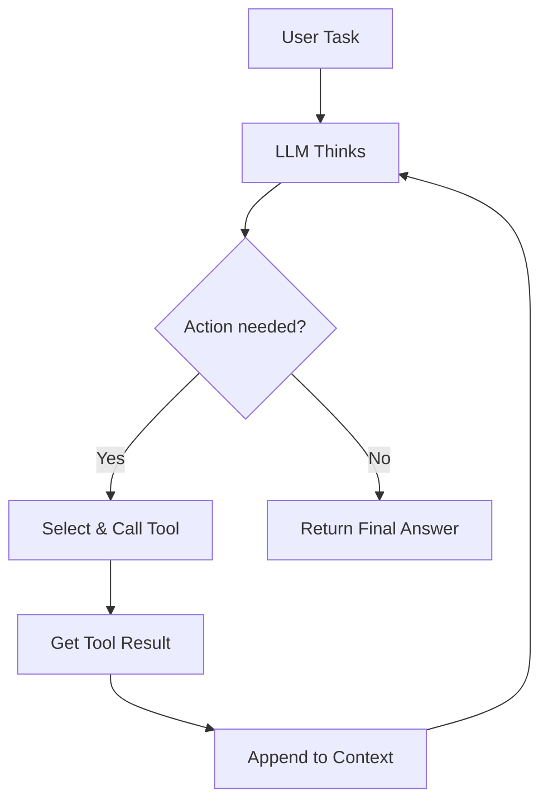
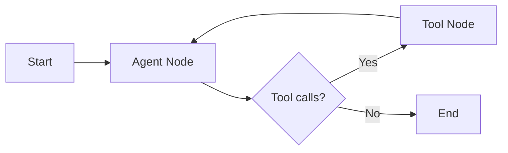

# Topic 15: AI Agents & Tool Use

> **Track**: AI/ML Engineer — Practice-First, Code-Heavy
> **Prerequisites**: Topic 13 (LLM APIs), Topic 16 (Prompt Engineering helpful)
> **You will build**: A ReAct agent from scratch, a LangGraph stateful agent, and a multi-agent research system

---

## Table of Contents

1. [What Is an AI Agent?](#1-what-is-an-ai-agent)
2. [The Agent Loop — Core Architecture](#2-the-agent-loop--core-architecture)
3. [Building a ReAct Agent from Scratch](#3-building-a-react-agent-from-scratch)
4. [Tool Design — Schemas, Execution, Error Handling](#4-tool-design--schemas-execution-error-handling)
5. [Function Calling with OpenAI — The Agent Backbone](#5-function-calling-with-openai--the-agent-backbone)
6. [Building a Full Agent with OpenAI Function Calling](#6-building-a-full-agent-with-openai-function-calling)
7. [Agent Memory — Short-Term, Long-Term, Working](#7-agent-memory--short-term-long-term-working)
8. [LangGraph — Stateful Agent Graphs](#8-langgraph--stateful-agent-graphs)
9. [Multi-Agent Systems](#9-multi-agent-systems)
10. [Multi-Agent Implementation — Supervisor Pattern](#10-multi-agent-implementation--supervisor-pattern)
11. [Agent Reliability — Retries, Guardrails, Limits](#11-agent-reliability--retries-guardrails-limits)
12. [Agent Evaluation](#12-agent-evaluation)
13. [OpenAI Assistants API](#13-openai-assistants-api)
14. [Comparison — When to Use What](#14-comparison--when-to-use-what)
15. [Practice Exercises](#15-practice-exercises)
16. [Mini-Project: Research Agent with Web Search + File I/O](#16-mini-project-research-agent-with-web-search--file-io)
17. [Interview Questions & Answers](#17-interview-questions--answers)

---

## 1. What Is an AI Agent?

An AI agent is an LLM that can **decide what actions to take**, **execute those actions** via tools, **observe the results**, and **loop** until the task is complete. Unlike a single LLM call (prompt → response), an agent runs autonomously over multiple steps.

```
┌──────────────────────────────────────────────────────┐
│                  CHATBOT vs AGENT                     │
├──────────────────────────────────────────────────────┤
│                                                      │
│  Chatbot (single turn):                              │
│    User → LLM → Response                             │
│                                                      │
│  Agent (multi-step, autonomous):                     │
│    User → LLM → Think → Act → Observe ─┐            │
│                  ↑                       │            │
│                  └───────────────────────┘            │
│                  (loops until task complete)          │
│                                                      │
└──────────────────────────────────────────────────────┘
```

**Four pillars of an agent**:

| Pillar | What It Does | Example |
|--------|-------------|---------|
| **LLM** (brain) | Reasons, plans, decides next action | GPT-4o, Claude, Llama |
| **Tools** (hands) | Execute actions in the real world | Search web, run code, call API |
| **Memory** (context) | Retain information across steps | Conversation history, scratchpad |
| **Loop** (autonomy) | Repeat think→act→observe until done | While not done: step() |

---

## 2. The Agent Loop — Core Architecture

Every agent, regardless of framework, follows this loop:



The math behind agent decision-making at each step $t$:

$$
a_t = \text{LLM}(q, h_{1:t-1})
$$

Where:
- $q$ is the original user query
- $h_{1:t-1}$ is the history of all prior (thought, action, observation) triples
- $a_t$ is either a tool call or a final answer

**Maximum steps** are critical — without a cap, agents can loop forever:

$$
\text{terminate if } t > T_{\max} \text{ or } a_t = \texttt{FINAL\_ANSWER}
$$

### The Simplest Possible Agent

```python
"""
Minimal agent loop — no framework, pure Python.
This is the skeleton every agent framework builds on.
"""

from openai import OpenAI

client = OpenAI()

def agent_loop(user_query: str, tools: dict, max_steps: int = 10) -> str:
    """
    The universal agent loop.

    Args:
        user_query: What the user wants done
        tools: Dict mapping tool names -> callable functions
        max_steps: Safety limit to prevent infinite loops

    Returns:
        Final answer string
    """
    messages = [
        {"role": "system", "content": "You are a helpful assistant with access to tools."},
        {"role": "user", "content": user_query},
    ]

    for step in range(max_steps):
        response = client.chat.completions.create(
            model="gpt-4o",
            messages=messages,
            tools=[t["schema"] for t in tools.values()],
        )
        msg = response.choices[0].message

        # No tool call → agent is done
        if not msg.tool_calls:
            return msg.content

        # Execute each tool call
        messages.append(msg)
        for tc in msg.tool_calls:
            fn_name = tc.function.name
            fn_args = json.loads(tc.function.arguments)

            # Run the tool
            result = tools[fn_name]["function"](**fn_args)

            messages.append({
                "role": "tool",
                "tool_call_id": tc.id,
                "content": str(result),
            })

        print(f"[Step {step + 1}] Called: {[tc.function.name for tc in msg.tool_calls]}")

    return "Max steps reached. Could not complete the task."
```

---

## 3. Building a ReAct Agent from Scratch

**ReAct** (Reasoning + Acting) is the most important agent pattern. The LLM alternates between:
1. **Thought** — reason about what to do next
2. **Action** — call a tool
3. **Observation** — receive tool output

```
┌──────────────────────────────────────────────────────────┐
│                    ReAct Trace Example                    │
├──────────────────────────────────────────────────────────┤
│                                                          │
│  User: What is the population of Tokyo divided by 2?     │
│                                                          │
│  Thought 1: I need to look up Tokyo's population.        │
│  Action 1: search("Tokyo population")                    │
│  Observation 1: Tokyo has ~14 million people.            │
│                                                          │
│  Thought 2: Now I divide 14,000,000 by 2.               │
│  Action 2: calculator("14000000 / 2")                    │
│  Observation 2: 7000000                                  │
│                                                          │
│  Thought 3: I have the answer.                           │
│  Final Answer: 7,000,000                                 │
│                                                          │
└──────────────────────────────────────────────────────────┘
```

### Full ReAct Implementation (No Frameworks)

```python
"""
ReAct agent built from scratch using prompt engineering.
No LangChain, no LangGraph — just an LLM and a loop.
"""

import json
import re
import math
import httpx
from openai import OpenAI

client = OpenAI()

# ── Tool definitions ──────────────────────────────────────────

def calculator(expression: str) -> str:
    """Evaluate a math expression safely."""
    try:
        # Only allow safe math operations
        allowed = set("0123456789+-*/.() ")
        if not all(c in allowed for c in expression):
            return f"Error: invalid characters in expression"
        result = eval(expression, {"__builtins__": {}}, {"math": math})
        return str(result)
    except Exception as e:
        return f"Error: {e}"


def search(query: str) -> str:
    """Search the web using DuckDuckGo Instant Answer API."""
    resp = httpx.get(
        "https://api.duckduckgo.com/",
        params={"q": query, "format": "json", "no_html": 1},
        timeout=10,
    )
    data = resp.json()
    # Try abstract first, then related topics
    if data.get("Abstract"):
        return data["Abstract"]
    elif data.get("RelatedTopics"):
        texts = [t.get("Text", "") for t in data["RelatedTopics"][:3] if isinstance(t, dict)]
        return " | ".join(texts) if texts else "No results found."
    return "No results found."


def get_weather(city: str) -> str:
    """Get current weather for a city."""
    resp = httpx.get(f"https://wttr.in/{city}?format=j1", timeout=10)
    data = resp.json()
    current = data["current_condition"][0]
    return (
        f"{city}: {current['temp_C']}°C, "
        f"{current['weatherDesc'][0]['value']}, "
        f"humidity {current['humidity']}%"
    )


TOOLS = {
    "calculator": {
        "function": calculator,
        "description": "Evaluate a math expression. Input: a string like '2 + 3 * 4'",
    },
    "search": {
        "function": search,
        "description": "Search the web for information. Input: a search query string",
    },
    "get_weather": {
        "function": get_weather,
        "description": "Get current weather for a city. Input: city name",
    },
}

# ── ReAct prompt ──────────────────────────────────────────────

REACT_SYSTEM_PROMPT = """You are a helpful assistant that uses tools to answer questions.

You have access to these tools:
{tool_descriptions}

You MUST follow this exact format for EVERY step:

Thought: <your reasoning about what to do next>
Action: <tool_name>(<argument>)

When you have the final answer, respond with:
Thought: <your reasoning>
Final Answer: <your answer>

IMPORTANT:
- Always start with a Thought before taking an Action
- Only call ONE tool per step
- Wait for the Observation before your next Thought
- If a tool returns an error, try a different approach
"""


def build_system_prompt() -> str:
    tool_desc = "\n".join(
        f"- {name}: {info['description']}" for name, info in TOOLS.items()
    )
    return REACT_SYSTEM_PROMPT.format(tool_descriptions=tool_desc)


def parse_action(text: str) -> tuple[str, str] | None:
    """Extract tool name and argument from 'Action: tool_name(arg)'."""
    match = re.search(r"Action:\s*(\w+)\((.+?)\)", text, re.DOTALL)
    if match:
        tool_name = match.group(1).strip()
        argument = match.group(2).strip().strip("\"'")
        return tool_name, argument
    return None


def react_agent(user_query: str, max_steps: int = 8, verbose: bool = True) -> str:
    """
    Run a ReAct agent loop.

    Args:
        user_query: The user's question
        max_steps: Maximum reasoning steps before giving up
        verbose: Print each step for debugging

    Returns:
        The agent's final answer
    """
    messages = [
        {"role": "system", "content": build_system_prompt()},
        {"role": "user", "content": user_query},
    ]

    for step in range(1, max_steps + 1):
        # Get LLM response
        response = client.chat.completions.create(
            model="gpt-4o",
            messages=messages,
            temperature=0,  # deterministic for agents
            max_tokens=500,
        )
        assistant_text = response.choices[0].message.content

        if verbose:
            print(f"\n{'='*60}")
            print(f"Step {step}:")
            print(assistant_text)

        # Check for final answer
        if "Final Answer:" in assistant_text:
            final = assistant_text.split("Final Answer:")[-1].strip()
            return final

        # Parse and execute action
        action = parse_action(assistant_text)
        if action is None:
            # LLM didn't follow format — nudge it
            messages.append({"role": "assistant", "content": assistant_text})
            messages.append({
                "role": "user",
                "content": "Please respond with either an Action or a Final Answer.",
            })
            continue

        tool_name, argument = action
        if tool_name not in TOOLS:
            observation = f"Error: Unknown tool '{tool_name}'. Available: {list(TOOLS.keys())}"
        else:
            try:
                observation = TOOLS[tool_name]["function"](argument)
            except Exception as e:
                observation = f"Error calling {tool_name}: {e}"

        if verbose:
            print(f"Observation: {observation}")

        # Append the full exchange
        messages.append({"role": "assistant", "content": assistant_text})
        messages.append({"role": "user", "content": f"Observation: {observation}"})

    return "Agent reached maximum steps without a final answer."


# ── Run it ────────────────────────────────────────────────────

if __name__ == "__main__":
    answer = react_agent("What is the weather in Paris, and what is 72 divided by that temperature in Celsius?")
    print(f"\n{'='*60}")
    print(f"FINAL ANSWER: {answer}")
```

**Sample output**:
```
============================================================
Step 1:
Thought: I need to find the current temperature in Paris first.
Action: get_weather(Paris)
Observation: Paris: 8°C, Partly cloudy, humidity 76%

============================================================
Step 2:
Thought: The temperature in Paris is 8°C. Now I divide 72 by 8.
Action: calculator(72 / 8)
Observation: 9.0

============================================================
Step 3:
Thought: I have both pieces of information now.
Final Answer: The weather in Paris is 8°C and partly cloudy. 72 ÷ 8 = 9.0

============================================================
FINAL ANSWER: The weather in Paris is 8°C and partly cloudy. 72 ÷ 8 = 9.0
```

---

## 4. Tool Design — Schemas, Execution, Error Handling

Good tools are the difference between a reliable agent and a broken one. Design principles:

```
┌──────────────────────────────────────────────────────┐
│              Tool Design Best Practices               │
├──────────────────────────────────────────────────────┤
│                                                      │
│  1. Clear name: verb_noun (search_web, read_file)    │
│  2. Typed parameters with descriptions               │
│  3. Return strings (LLMs work with text)             │
│  4. Handle errors gracefully — return error message, │
│     NEVER raise exceptions into the agent loop       │
│  5. Timeout everything — agents wait forever          │
│  6. Limit output size — truncate large results       │
│                                                      │
└──────────────────────────────────────────────────────┘
```

### Building Robust Tools with Pydantic

```python
"""
Production-quality tool definitions with validation and error handling.
"""

import json
from typing import Any, Callable
from pydantic import BaseModel, Field
from functools import wraps


class ToolResult(BaseModel):
    """Standardized tool output."""
    success: bool
    data: str
    error: str | None = None


def safe_tool(max_output_chars: int = 2000, timeout_seconds: int = 30):
    """
    Decorator that wraps a tool function with:
    - Error handling (never raises into agent loop)
    - Output truncation (LLMs have limited context)
    - Timeout (prevent hanging)
    """
    def decorator(func: Callable) -> Callable:
        @wraps(func)
        def wrapper(*args, **kwargs) -> str:
            try:
                result = func(*args, **kwargs)
                result_str = str(result)
                if len(result_str) > max_output_chars:
                    result_str = result_str[:max_output_chars] + "\n... [truncated]"
                return ToolResult(success=True, data=result_str).model_dump_json()
            except TimeoutError:
                return ToolResult(
                    success=False, data="", error=f"Tool timed out after {timeout_seconds}s"
                ).model_dump_json()
            except Exception as e:
                return ToolResult(
                    success=False, data="", error=f"{type(e).__name__}: {e}"
                ).model_dump_json()
        return wrapper
    return decorator


# ── Example: File system tools ────────────────────────────────

@safe_tool(max_output_chars=3000)
def read_file(file_path: str) -> str:
    """Read contents of a file."""
    from pathlib import Path
    p = Path(file_path)
    if not p.exists():
        raise FileNotFoundError(f"File not found: {file_path}")
    if not p.is_file():
        raise ValueError(f"Not a file: {file_path}")
    # Safety: don't read huge files
    if p.stat().st_size > 100_000:
        raise ValueError(f"File too large ({p.stat().st_size} bytes). Max 100KB.")
    return p.read_text()


@safe_tool()
def write_file(file_path: str, content: str) -> str:
    """Write content to a file. Creates parent dirs if needed."""
    from pathlib import Path
    p = Path(file_path)
    p.parent.mkdir(parents=True, exist_ok=True)
    p.write_text(content)
    return f"Successfully wrote {len(content)} chars to {file_path}"


@safe_tool()
def list_directory(directory: str) -> str:
    """List files in a directory."""
    from pathlib import Path
    p = Path(directory)
    if not p.is_dir():
        raise NotADirectoryError(f"Not a directory: {directory}")
    files = sorted(p.iterdir())
    return "\n".join(
        f"{'[DIR] ' if f.is_dir() else '      '}{f.name}" for f in files[:50]
    )


# ── OpenAI function schema generator ─────────────────────────

def tool_to_openai_schema(
    name: str,
    description: str,
    parameters: dict[str, tuple[str, str]],  # param_name -> (type, description)
    required: list[str] | None = None,
) -> dict:
    """
    Generate an OpenAI-compatible tool schema.

    Args:
        name: Tool name
        description: What the tool does
        parameters: Dict of param_name -> (json_type, description)
        required: List of required parameter names

    Returns:
        OpenAI tool schema dict
    """
    props = {}
    for param_name, (param_type, param_desc) in parameters.items():
        props[param_name] = {"type": param_type, "description": param_desc}

    return {
        "type": "function",
        "function": {
            "name": name,
            "description": description,
            "parameters": {
                "type": "object",
                "properties": props,
                "required": required or list(parameters.keys()),
            },
        },
    }


# Example: Generate schema for read_file
read_file_schema = tool_to_openai_schema(
    name="read_file",
    description="Read the contents of a file. Returns the file text.",
    parameters={
        "file_path": ("string", "Absolute or relative path to the file"),
    },
)

print(json.dumps(read_file_schema, indent=2))
# {
#   "type": "function",
#   "function": {
#     "name": "read_file",
#     "description": "Read the contents of a file. Returns the file text.",
#     "parameters": {
#       "type": "object",
#       "properties": {
#         "file_path": {
#           "type": "string",
#           "description": "Absolute or relative path to the file"
#         }
#       },
#       "required": ["file_path"]
#     }
#   }
# }
```

---

## 5. Function Calling with OpenAI — The Agent Backbone

OpenAI's function calling is the most reliable way to build agents. The LLM outputs **structured tool calls** instead of free-form text.

```
┌─────────────────────────────────────────────────────────────┐
│           Function Calling Message Flow                      │
├─────────────────────────────────────────────────────────────┤
│                                                             │
│  1. You send:   messages + tools (schemas)                  │
│  2. LLM returns: message with tool_calls array              │
│  3. You execute: each tool call, get results                │
│  4. You send:   tool results back (role: "tool")            │
│  5. LLM returns: either more tool_calls OR final text       │
│                                                             │
│  Key insight: The LLM can call MULTIPLE tools in parallel!  │
│  "What's the weather in Paris and Tokyo?" → 2 tool calls    │
│                                                             │
└─────────────────────────────────────────────────────────────┘
```

### Parallel Tool Calls

```python
"""
Demonstrate parallel tool calling — the LLM can invoke
multiple tools in a single response.
"""

import json
from openai import OpenAI

client = OpenAI()

# Define tools
tools = [
    {
        "type": "function",
        "function": {
            "name": "get_stock_price",
            "description": "Get the current stock price for a ticker symbol",
            "parameters": {
                "type": "object",
                "properties": {
                    "ticker": {"type": "string", "description": "Stock ticker symbol (e.g., AAPL)"},
                },
                "required": ["ticker"],
            },
        },
    },
    {
        "type": "function",
        "function": {
            "name": "get_company_info",
            "description": "Get basic company information",
            "parameters": {
                "type": "object",
                "properties": {
                    "company_name": {"type": "string", "description": "Company name"},
                },
                "required": ["company_name"],
            },
        },
    },
]

# Mock tool implementations
def get_stock_price(ticker: str) -> str:
    prices = {"AAPL": 185.23, "GOOGL": 141.80, "MSFT": 415.50}
    price = prices.get(ticker, "Unknown ticker")
    return json.dumps({"ticker": ticker, "price": price, "currency": "USD"})

def get_company_info(company_name: str) -> str:
    return json.dumps({"name": company_name, "sector": "Technology", "employees": "~150,000"})

tool_functions = {
    "get_stock_price": get_stock_price,
    "get_company_info": get_company_info,
}

# ── Agent with parallel tool calls ────────────────────────────

messages = [
    {"role": "user", "content": "Compare Apple and Google stock prices, and tell me about Apple as a company."},
]

response = client.chat.completions.create(
    model="gpt-4o",
    messages=messages,
    tools=tools,
)

msg = response.choices[0].message

# The LLM may return MULTIPLE tool calls at once!
print(f"Number of tool calls: {len(msg.tool_calls)}")
for tc in msg.tool_calls:
    print(f"  - {tc.function.name}({tc.function.arguments})")

# Output:
# Number of tool calls: 3
#   - get_stock_price({"ticker": "AAPL"})
#   - get_stock_price({"ticker": "GOOGL"})
#   - get_company_info({"company_name": "Apple"})

# Execute all tool calls and send results back
messages.append(msg)
for tc in msg.tool_calls:
    fn = tool_functions[tc.function.name]
    args = json.loads(tc.function.arguments)
    result = fn(**args)
    messages.append({
        "role": "tool",
        "tool_call_id": tc.id,
        "content": result,
    })

# Get final response
final = client.chat.completions.create(model="gpt-4o", messages=messages)
print(final.choices[0].message.content)
```

---

## 6. Building a Full Agent with OpenAI Function Calling

A production-ready agent class that handles multi-step tool use:

```python
"""
Production agent using OpenAI function calling.
Handles: multi-step reasoning, parallel tools, error recovery, step logging.
"""

import json
import time
from dataclasses import dataclass, field
from typing import Callable
from openai import OpenAI


@dataclass
class Tool:
    """A tool the agent can use."""
    name: str
    description: str
    parameters: dict  # JSON Schema for parameters
    function: Callable  # The actual function to call

    def to_openai_schema(self) -> dict:
        return {
            "type": "function",
            "function": {
                "name": self.name,
                "description": self.description,
                "parameters": self.parameters,
            },
        }


@dataclass
class AgentStep:
    """Record of a single agent step."""
    step_number: int
    tool_calls: list[dict]
    tool_results: list[dict]
    duration_ms: float


@dataclass
class AgentResult:
    """Complete agent execution result."""
    answer: str
    steps: list[AgentStep]
    total_tokens: int
    total_duration_ms: float

    @property
    def num_steps(self) -> int:
        return len(self.steps)

    def summary(self) -> str:
        lines = [f"Answer: {self.answer}", f"Steps: {self.num_steps}", f"Tokens: {self.total_tokens}"]
        for s in self.steps:
            tools = ", ".join(tc["name"] for tc in s.tool_calls)
            lines.append(f"  Step {s.step_number}: {tools} ({s.duration_ms:.0f}ms)")
        return "\n".join(lines)


class Agent:
    """
    A multi-step agent powered by OpenAI function calling.

    Usage:
        agent = Agent(model="gpt-4o", tools=[...], system_prompt="...")
        result = agent.run("What is the weather in Paris?")
        print(result.summary())
    """

    def __init__(
        self,
        model: str = "gpt-4o",
        tools: list[Tool] | None = None,
        system_prompt: str = "You are a helpful assistant.",
        max_steps: int = 10,
        verbose: bool = True,
    ):
        self.client = OpenAI()
        self.model = model
        self.tools = {t.name: t for t in (tools or [])}
        self.system_prompt = system_prompt
        self.max_steps = max_steps
        self.verbose = verbose

    def run(self, user_query: str) -> AgentResult:
        """Execute the agent loop until completion or max steps."""
        messages = [
            {"role": "system", "content": self.system_prompt},
            {"role": "user", "content": user_query},
        ]
        tool_schemas = [t.to_openai_schema() for t in self.tools.values()]

        steps = []
        total_tokens = 0
        start_time = time.time()

        for step_num in range(1, self.max_steps + 1):
            step_start = time.time()

            response = self.client.chat.completions.create(
                model=self.model,
                messages=messages,
                tools=tool_schemas if tool_schemas else None,
                temperature=0,
            )
            total_tokens += response.usage.total_tokens
            msg = response.choices[0].message

            # No tool calls → we have the final answer
            if not msg.tool_calls:
                total_duration = (time.time() - start_time) * 1000
                return AgentResult(
                    answer=msg.content or "",
                    steps=steps,
                    total_tokens=total_tokens,
                    total_duration_ms=total_duration,
                )

            # Execute tool calls
            tool_call_records = []
            tool_result_records = []
            messages.append(msg)

            for tc in msg.tool_calls:
                fn_name = tc.function.name
                fn_args = json.loads(tc.function.arguments)
                tool_call_records.append({"name": fn_name, "args": fn_args})

                if fn_name not in self.tools:
                    result = f"Error: Unknown tool '{fn_name}'"
                else:
                    try:
                        result = str(self.tools[fn_name].function(**fn_args))
                    except Exception as e:
                        result = f"Error: {type(e).__name__}: {e}"

                tool_result_records.append({"name": fn_name, "result": result})
                messages.append({
                    "role": "tool",
                    "tool_call_id": tc.id,
                    "content": result,
                })

            step_duration = (time.time() - step_start) * 1000
            step = AgentStep(
                step_number=step_num,
                tool_calls=tool_call_records,
                tool_results=tool_result_records,
                duration_ms=step_duration,
            )
            steps.append(step)

            if self.verbose:
                tools_used = ", ".join(tc["name"] for tc in tool_call_records)
                print(f"[Step {step_num}] {tools_used} ({step_duration:.0f}ms)")

        total_duration = (time.time() - start_time) * 1000
        return AgentResult(
            answer="Max steps reached without completing the task.",
            steps=steps,
            total_tokens=total_tokens,
            total_duration_ms=total_duration,
        )


# ── Usage ─────────────────────────────────────────────────────

import math

tools = [
    Tool(
        name="calculator",
        description="Evaluate a mathematical expression",
        parameters={
            "type": "object",
            "properties": {
                "expression": {"type": "string", "description": "Math expression to evaluate"},
            },
            "required": ["expression"],
        },
        function=lambda expression: eval(expression, {"__builtins__": {}, "math": math}),
    ),
    Tool(
        name="get_weather",
        description="Get current weather for a city",
        parameters={
            "type": "object",
            "properties": {
                "city": {"type": "string", "description": "City name"},
            },
            "required": ["city"],
        },
        function=lambda city: f"{city}: 22°C, Sunny",  # mock
    ),
]

agent = Agent(
    model="gpt-4o",
    tools=tools,
    system_prompt="You are a helpful assistant. Use tools when needed.",
    max_steps=5,
)

result = agent.run("What is the weather in Mumbai, and what is 3 * the temperature?")
print(result.summary())
```

---

## 7. Agent Memory — Short-Term, Long-Term, Working

Agents need memory beyond the current conversation turn. Three types:

```
┌─────────────────────────────────────────────────────────────┐
│                    Agent Memory Types                        │
├──────────────┬──────────────────┬───────────────────────────┤
│  Short-Term  │    Long-Term     │      Working Memory       │
├──────────────┼──────────────────┼───────────────────────────┤
│ Conversation │ Vector DB of     │ Scratchpad for current    │
│ history      │ past sessions    │ task reasoning            │
│              │                  │                           │
│ Last N msgs  │ Semantic search  │ Key-value store of        │
│ or summary   │ over all past    │ intermediate results      │
│              │ interactions     │                           │
│ Cleared each │ Persists across  │ Cleared each task         │
│ session      │ sessions         │                           │
└──────────────┴──────────────────┴───────────────────────────┘
```

### Implementation

```python
"""
Agent memory implementations: sliding window, summary-based, and vector store.
"""

from dataclasses import dataclass, field
from openai import OpenAI

client = OpenAI()


# ── 1. Sliding Window Memory ─────────────────────────────────

class SlidingWindowMemory:
    """Keep last N messages. Simple but loses old context."""

    def __init__(self, max_messages: int = 20):
        self.max_messages = max_messages
        self.messages: list[dict] = []

    def add(self, message: dict):
        self.messages.append(message)
        # Keep system message + last N
        if len(self.messages) > self.max_messages + 1:
            system = self.messages[0] if self.messages[0]["role"] == "system" else None
            self.messages = self.messages[-(self.max_messages):]
            if system:
                self.messages.insert(0, system)

    def get_messages(self) -> list[dict]:
        return self.messages.copy()


# ── 2. Summary-Based Memory ──────────────────────────────────

class SummaryMemory:
    """
    Summarize older messages to save tokens while retaining key info.

    Strategy:
    - Keep last `recent_count` messages verbatim
    - Summarize everything older into a single system message
    """

    def __init__(self, recent_count: int = 6, model: str = "gpt-4o-mini"):
        self.recent_count = recent_count
        self.model = model
        self.messages: list[dict] = []
        self.summary: str = ""

    def add(self, message: dict):
        self.messages.append(message)
        if len(self.messages) > self.recent_count * 2:
            self._compress()

    def _compress(self):
        """Summarize older messages."""
        old_msgs = self.messages[:-self.recent_count]
        recent = self.messages[-self.recent_count:]

        # Build text to summarize
        text = "\n".join(f"{m['role']}: {m['content']}" for m in old_msgs if m.get("content"))

        response = client.chat.completions.create(
            model=self.model,
            messages=[{
                "role": "user",
                "content": f"Summarize this conversation concisely, preserving key facts and decisions:\n\n{text}",
            }],
            max_tokens=300,
        )
        self.summary = response.choices[0].message.content
        self.messages = recent

    def get_messages(self) -> list[dict]:
        msgs = []
        if self.summary:
            msgs.append({
                "role": "system",
                "content": f"Summary of earlier conversation:\n{self.summary}",
            })
        msgs.extend(self.messages)
        return msgs


# ── 3. Vector Store Long-Term Memory ─────────────────────────

class VectorMemory:
    """
    Long-term memory using embeddings + vector similarity.
    Stores facts/interactions and retrieves relevant ones.
    """

    def __init__(self, model: str = "text-embedding-3-small"):
        self.model = model
        self.memories: list[dict] = []  # {"text": ..., "embedding": [...]}

    def store(self, text: str):
        """Store a memory with its embedding."""
        embedding = self._embed(text)
        self.memories.append({"text": text, "embedding": embedding})

    def retrieve(self, query: str, top_k: int = 3) -> list[str]:
        """Retrieve most relevant memories for a query."""
        if not self.memories:
            return []

        query_emb = self._embed(query)
        scored = []
        for mem in self.memories:
            sim = self._cosine_similarity(query_emb, mem["embedding"])
            scored.append((sim, mem["text"]))

        scored.sort(reverse=True, key=lambda x: x[0])
        return [text for _, text in scored[:top_k]]

    def _embed(self, text: str) -> list[float]:
        response = client.embeddings.create(model=self.model, input=text)
        return response.data[0].embedding

    @staticmethod
    def _cosine_similarity(a: list[float], b: list[float]) -> float:
        dot = sum(x * y for x, y in zip(a, b))
        norm_a = sum(x * x for x in a) ** 0.5
        norm_b = sum(x * x for x in b) ** 0.5
        return dot / (norm_a * norm_b + 1e-8)


# ── 4. Working Memory (Scratchpad) ───────────────────────────

class WorkingMemory:
    """
    Key-value scratchpad for storing intermediate results during a task.
    Injected into the system prompt so the LLM can reference it.
    """

    def __init__(self):
        self.store: dict[str, str] = {}

    def set(self, key: str, value: str):
        self.store[key] = value

    def get(self, key: str) -> str | None:
        return self.store.get(key)

    def delete(self, key: str):
        self.store.pop(key, None)

    def to_prompt_section(self) -> str:
        if not self.store:
            return ""
        lines = ["## Working Memory (intermediate results):"]
        for k, v in self.store.items():
            lines.append(f"- {k}: {v}")
        return "\n".join(lines)

    def clear(self):
        self.store.clear()


# ── Usage example ─────────────────────────────────────────────

# Long-term memory across sessions
ltm = VectorMemory()
ltm.store("User prefers Python over JavaScript")
ltm.store("User works at a fintech company")
ltm.store("User is preparing for ML engineer interviews")

# When starting a new session, retrieve relevant context
relevant = ltm.retrieve("What programming language should I use?")
print(relevant)
# ['User prefers Python over JavaScript', ...]

# Working memory during a task
wm = WorkingMemory()
wm.set("current_city", "Mumbai")
wm.set("temperature_celsius", "32")
print(wm.to_prompt_section())
# ## Working Memory (intermediate results):
# - current_city: Mumbai
# - temperature_celsius: 32
```

---

## 8. LangGraph — Stateful Agent Graphs

LangGraph models agents as **graphs** where nodes are processing steps and edges are transitions. This gives you fine-grained control over agent flow.



### Installation and Basic Agent

```bash
pip install langgraph langchain-openai langchain-core
```

```python
"""
LangGraph agent — the modern way to build stateful agents.
Gives you explicit control over the agent's state machine.
"""

import json
from typing import Annotated, TypedDict
from langchain_core.messages import AIMessage, HumanMessage, SystemMessage, ToolMessage
from langchain_openai import ChatOpenAI
from langgraph.graph import StateGraph, START, END
from langgraph.graph.message import add_messages
from langgraph.prebuilt import ToolNode


# ── 1. Define State ──────────────────────────────────────────

class AgentState(TypedDict):
    """
    The state that flows through the graph.
    `add_messages` is a reducer: new messages append to existing ones.
    """
    messages: Annotated[list, add_messages]


# ── 2. Define Tools ──────────────────────────────────────────

from langchain_core.tools import tool

@tool
def search_web(query: str) -> str:
    """Search the web for information."""
    # Mock implementation
    return f"Search results for '{query}': The population of India is approximately 1.4 billion."

@tool
def calculator(expression: str) -> str:
    """Evaluate a math expression."""
    try:
        return str(eval(expression, {"__builtins__": {}}))
    except Exception as e:
        return f"Error: {e}"

@tool
def get_current_date() -> str:
    """Get today's date."""
    from datetime import date
    return str(date.today())

tools = [search_web, calculator, get_current_date]


# ── 3. Build the Graph ───────────────────────────────────────

# LLM with tools bound
llm = ChatOpenAI(model="gpt-4o", temperature=0).bind_tools(tools)


def agent_node(state: AgentState) -> dict:
    """The agent decides what to do based on current state."""
    response = llm.invoke(state["messages"])
    return {"messages": [response]}


def should_continue(state: AgentState) -> str:
    """Route: if last message has tool calls → tools, else → end."""
    last_message = state["messages"][-1]
    if hasattr(last_message, "tool_calls") and last_message.tool_calls:
        return "tools"
    return END


# Build the graph
graph = StateGraph(AgentState)

# Add nodes
graph.add_node("agent", agent_node)
graph.add_node("tools", ToolNode(tools))

# Add edges
graph.add_edge(START, "agent")
graph.add_conditional_edges("agent", should_continue, {"tools": "tools", END: END})
graph.add_edge("tools", "agent")  # After tools, go back to agent

# Compile
app = graph.compile()


# ── 4. Run the Agent ─────────────────────────────────────────

result = app.invoke({
    "messages": [
        SystemMessage(content="You are a helpful research assistant."),
        HumanMessage(content="What is the population of India divided by 7?"),
    ]
})

# Print all messages
for msg in result["messages"]:
    role = msg.__class__.__name__
    if hasattr(msg, "tool_calls") and msg.tool_calls:
        print(f"{role}: [tool_calls: {[tc['name'] for tc in msg.tool_calls]}]")
    elif hasattr(msg, "content"):
        print(f"{role}: {msg.content[:200]}")
```

### LangGraph with Conditional Routing

```python
"""
LangGraph with more complex routing — different paths based on state.
Example: a customer support agent that routes to different specialists.
"""

from typing import Annotated, TypedDict, Literal
from langgraph.graph import StateGraph, START, END
from langgraph.graph.message import add_messages
from langchain_openai import ChatOpenAI
from langchain_core.messages import HumanMessage, SystemMessage


class SupportState(TypedDict):
    messages: Annotated[list, add_messages]
    category: str  # "billing", "technical", "general"


llm = ChatOpenAI(model="gpt-4o", temperature=0)


def classifier_node(state: SupportState) -> dict:
    """Classify the user's request into a category."""
    response = llm.invoke([
        SystemMessage(content=(
            "Classify this customer request into exactly one category: "
            "'billing', 'technical', or 'general'. Respond with just the category word."
        )),
        state["messages"][-1],
    ])
    category = response.content.strip().lower()
    return {"category": category}


def route_by_category(state: SupportState) -> str:
    """Route to the appropriate specialist node."""
    cat = state.get("category", "general")
    if cat == "billing":
        return "billing_agent"
    elif cat == "technical":
        return "technical_agent"
    return "general_agent"


def billing_agent(state: SupportState) -> dict:
    response = llm.invoke([
        SystemMessage(content="You are a billing specialist. Help with invoices, payments, refunds."),
        *state["messages"],
    ])
    return {"messages": [response]}


def technical_agent(state: SupportState) -> dict:
    response = llm.invoke([
        SystemMessage(content="You are a technical support specialist. Help with bugs, errors, setup."),
        *state["messages"],
    ])
    return {"messages": [response]}


def general_agent(state: SupportState) -> dict:
    response = llm.invoke([
        SystemMessage(content="You are a general support agent. Help with general questions."),
        *state["messages"],
    ])
    return {"messages": [response]}


# Build graph
graph = StateGraph(SupportState)

graph.add_node("classifier", classifier_node)
graph.add_node("billing_agent", billing_agent)
graph.add_node("technical_agent", technical_agent)
graph.add_node("general_agent", general_agent)

graph.add_edge(START, "classifier")
graph.add_conditional_edges("classifier", route_by_category, {
    "billing_agent": "billing_agent",
    "technical_agent": "technical_agent",
    "general_agent": "general_agent",
})
graph.add_edge("billing_agent", END)
graph.add_edge("technical_agent", END)
graph.add_edge("general_agent", END)

app = graph.compile()

# Test
result = app.invoke({
    "messages": [HumanMessage(content="I was charged twice for my subscription last month")],
    "category": "",
})
print(result["messages"][-1].content)
```

---

## 9. Multi-Agent Systems

Multiple agents working together, each with a specialized role.

```
┌──────────────────────────────────────────────────────────────┐
│                  Multi-Agent Patterns                         │
├──────────────────────────────────────────────────────────────┤
│                                                              │
│  1. SUPERVISOR: One agent delegates to worker agents         │
│     ┌──────────┐                                             │
│     │Supervisor│──→ Worker A (research)                      │
│     │          │──→ Worker B (writing)                       │
│     │          │──→ Worker C (review)                        │
│     └──────────┘                                             │
│                                                              │
│  2. PIPELINE: Agents run in sequence                         │
│     Researcher ──→ Writer ──→ Editor ──→ Output              │
│                                                              │
│  3. DEBATE: Agents argue, then converge                      │
│     Agent A ←──→ Agent B ──→ Judge ──→ Final Answer          │
│                                                              │
│  4. ROUND-ROBIN: Agents take turns refining output           │
│     A ──→ B ──→ C ──→ A ──→ B ──→ ... ──→ Done              │
│                                                              │
└──────────────────────────────────────────────────────────────┘
```

**When to use multi-agent vs single agent**:

| Scenario | Single Agent | Multi-Agent |
|----------|-------------|-------------|
| Simple Q&A with tools | Yes | Overkill |
| Complex research + writing | Maybe | Better quality |
| Different expertise needed | Hard | Natural fit |
| Need checks and balances | No built-in | Reviewer agent |
| Simple pipeline | Yes | Yes |

---

## 10. Multi-Agent Implementation — Supervisor Pattern

```python
"""
Multi-agent system: Supervisor delegates to specialized workers.
Built from scratch — no multi-agent framework needed.
"""

import json
from dataclasses import dataclass
from openai import OpenAI

client = OpenAI()


@dataclass
class WorkerAgent:
    """A specialized worker agent."""
    name: str
    system_prompt: str
    model: str = "gpt-4o"

    def run(self, task: str) -> str:
        response = client.chat.completions.create(
            model=self.model,
            messages=[
                {"role": "system", "content": self.system_prompt},
                {"role": "user", "content": task},
            ],
            temperature=0.7,
            max_tokens=1000,
        )
        return response.choices[0].message.content


class SupervisorAgent:
    """
    Supervisor that breaks down a task and delegates to workers.

    Flow:
    1. Analyze the task
    2. Create a plan (which worker handles what)
    3. Delegate to workers
    4. Synthesize results
    """

    def __init__(self, workers: list[WorkerAgent], model: str = "gpt-4o"):
        self.workers = {w.name: w for w in workers}
        self.model = model

    def run(self, task: str, verbose: bool = True) -> str:
        # Step 1: Plan — decide which workers to use and in what order
        worker_list = ", ".join(
            f"'{name}'" for name in self.workers
        )
        plan_prompt = f"""You are a supervisor managing these workers: {worker_list}

Worker descriptions:
{chr(10).join(f"- {w.name}: {w.system_prompt[:100]}..." for w in self.workers.values())}

Given the user's task, create a plan. Respond with a JSON array of steps:
[
  {{"worker": "worker_name", "task": "specific task for this worker"}},
  ...
]

Only use workers from the list. Keep it to 2-4 steps.

User task: {task}"""

        plan_response = client.chat.completions.create(
            model=self.model,
            messages=[{"role": "user", "content": plan_prompt}],
            temperature=0,
            response_format={"type": "json_object"},
        )

        # Parse plan
        plan_text = plan_response.choices[0].message.content
        plan_data = json.loads(plan_text)
        steps = plan_data if isinstance(plan_data, list) else plan_data.get("steps", plan_data.get("plan", []))

        if verbose:
            print(f"📋 Plan ({len(steps)} steps):")
            for i, s in enumerate(steps, 1):
                print(f"  {i}. [{s['worker']}] {s['task'][:80]}")

        # Step 2: Execute each step
        results = []
        for i, step in enumerate(steps, 1):
            worker_name = step["worker"]
            worker_task = step["task"]

            if worker_name not in self.workers:
                results.append(f"[{worker_name}] Error: unknown worker")
                continue

            # Include previous results as context
            context = ""
            if results:
                context = "\n\nContext from previous steps:\n" + "\n".join(
                    f"- Step {j}: {r[:200]}" for j, r in enumerate(results, 1)
                )

            worker = self.workers[worker_name]
            result = worker.run(worker_task + context)
            results.append(result)

            if verbose:
                print(f"\n✅ Step {i} [{worker_name}] done ({len(result)} chars)")

        # Step 3: Synthesize
        synthesis_prompt = f"""You are synthesizing results from multiple workers.

Original task: {task}

Worker results:
{chr(10).join(f"--- {steps[i]['worker']} ---{chr(10)}{r}" for i, r in enumerate(results))}

Synthesize these into a single coherent response for the user."""

        final = client.chat.completions.create(
            model=self.model,
            messages=[{"role": "user", "content": synthesis_prompt}],
            max_tokens=1500,
        )
        return final.choices[0].message.content


# ── Create workers and run ────────────────────────────────────

researcher = WorkerAgent(
    name="researcher",
    system_prompt="You are a research specialist. Find facts, data, and evidence. Be thorough and cite specifics.",
)

writer = WorkerAgent(
    name="writer",
    system_prompt="You are a technical writer. Create clear, well-structured content from research notes.",
)

reviewer = WorkerAgent(
    name="reviewer",
    system_prompt=(
        "You are a critical reviewer. Check for factual errors, unclear writing, "
        "and missing information. Provide specific improvement suggestions."
    ),
)

supervisor = SupervisorAgent(workers=[researcher, writer, reviewer])

result = supervisor.run(
    "Write a 300-word explanation of how RAG (Retrieval-Augmented Generation) works, "
    "suitable for a technical blog post."
)
print(result)
```

---

## 11. Agent Reliability — Retries, Guardrails, Limits

Production agents **will** fail. Build for it:

```
┌──────────────────────────────────────────────────────────────┐
│              Agent Failure Modes & Mitigations                │
├────────────────────────┬─────────────────────────────────────┤
│ Failure                │ Mitigation                          │
├────────────────────────┼─────────────────────────────────────┤
│ Infinite loop          │ max_steps limit                     │
│ Tool error             │ Try/except, return error as text    │
│ Wrong tool choice      │ Better descriptions, few-shot       │
│ Hallucinated tool      │ Validate tool name before calling   │
│ JSON parse failure     │ Retry with "fix your JSON" prompt   │
│ LLM refuses            │ Rephrase, use different prompt      │
│ Context overflow       │ Summary memory, truncation          │
│ Cost explosion         │ Token budget, step budget           │
│ Slow execution         │ Timeouts on every tool call         │
│ Harmful output         │ Output guardrails, content filter   │
└────────────────────────┴─────────────────────────────────────┘
```

### Reliability Patterns

```python
"""
Agent reliability patterns: retries, budgets, guardrails.
"""

import time
from dataclasses import dataclass, field


@dataclass
class AgentBudget:
    """Track and enforce resource limits."""
    max_steps: int = 15
    max_tokens: int = 50_000
    max_duration_seconds: float = 120.0
    max_tool_retries: int = 2

    # Tracking
    steps_used: int = 0
    tokens_used: int = 0
    start_time: float = field(default_factory=time.time)
    tool_retries: dict = field(default_factory=dict)

    def check_step(self):
        self.steps_used += 1
        if self.steps_used > self.max_steps:
            raise BudgetExceededError(f"Max steps ({self.max_steps}) exceeded")

    def check_tokens(self, new_tokens: int):
        self.tokens_used += new_tokens
        if self.tokens_used > self.max_tokens:
            raise BudgetExceededError(f"Token budget ({self.max_tokens}) exceeded")

    def check_time(self):
        elapsed = time.time() - self.start_time
        if elapsed > self.max_duration_seconds:
            raise BudgetExceededError(f"Time budget ({self.max_duration_seconds}s) exceeded")

    def check_tool_retry(self, tool_name: str):
        count = self.tool_retries.get(tool_name, 0)
        if count >= self.max_tool_retries:
            raise BudgetExceededError(f"Tool '{tool_name}' failed {count} times")
        self.tool_retries[tool_name] = count + 1


class BudgetExceededError(Exception):
    pass


# ── Output guardrails ────────────────────────────────────────

class OutputGuardrail:
    """Validate agent outputs before returning to user."""

    def __init__(self):
        self.blocked_patterns = [
            "DROP TABLE",
            "rm -rf",
            "sudo",
            "<script>",
        ]

    def check(self, output: str) -> tuple[bool, str]:
        """
        Returns (is_safe, reason).
        """
        # Check blocked patterns
        for pattern in self.blocked_patterns:
            if pattern.lower() in output.lower():
                return False, f"Blocked pattern detected: {pattern}"

        # Check output length
        if len(output) > 10_000:
            return False, "Output too long (>10K chars)"

        return True, "OK"


# ── Retry wrapper for tool execution ─────────────────────────

def execute_tool_with_retry(
    tool_fn,
    args: dict,
    max_retries: int = 2,
    timeout: float = 30.0,
) -> str:
    """
    Execute a tool with retry logic and timeout.

    Returns the result string (or error message).
    """
    import concurrent.futures

    for attempt in range(max_retries + 1):
        try:
            with concurrent.futures.ThreadPoolExecutor() as executor:
                future = executor.submit(tool_fn, **args)
                result = future.result(timeout=timeout)
                return str(result)
        except concurrent.futures.TimeoutError:
            if attempt < max_retries:
                continue
            return f"Error: Tool timed out after {timeout}s ({max_retries + 1} attempts)"
        except Exception as e:
            if attempt < max_retries:
                time.sleep(1)  # brief backoff
                continue
            return f"Error after {max_retries + 1} attempts: {type(e).__name__}: {e}"


# ── Putting it together: Reliable agent run ───────────────────

def reliable_agent_step(budget: AgentBudget, guardrail: OutputGuardrail):
    """Example of a single agent step with all safety checks."""
    budget.check_step()
    budget.check_time()

    # ... LLM call here ...
    new_tokens = 500  # from response.usage
    budget.check_tokens(new_tokens)

    # ... tool execution ...
    result = execute_tool_with_retry(
        tool_fn=lambda query: f"Results for {query}",
        args={"query": "test"},
        max_retries=2,
        timeout=10.0,
    )

    # Check guardrails on final output
    is_safe, reason = guardrail.check(result)
    if not is_safe:
        return f"Output blocked: {reason}"

    return result
```

---

## 12. Agent Evaluation

How do you measure agent quality? Key metrics:

$$
\text{Task Success Rate} = \frac{\text{Tasks completed correctly}}{\text{Total tasks attempted}}
$$

$$
\text{Efficiency} = \frac{\text{Minimum steps needed}}{\text{Actual steps taken}}
$$

$$
\text{Tool Accuracy} = \frac{\text{Correct tool calls}}{\text{Total tool calls}}
$$

### Evaluation Framework

```python
"""
Agent evaluation: test suite with automated checking.
"""

from dataclasses import dataclass


@dataclass
class AgentTestCase:
    """A single test case for agent evaluation."""
    name: str
    query: str
    expected_tools: list[str]  # Tools that should be called
    expected_answer_contains: list[str]  # Substrings in correct answer
    max_steps: int = 5


@dataclass
class AgentTestResult:
    """Result of running a single test case."""
    test_name: str
    passed: bool
    answer: str
    tools_called: list[str]
    steps_taken: int
    errors: list[str]


def evaluate_agent(agent, test_cases: list[AgentTestCase]) -> dict:
    """
    Run all test cases and compute metrics.

    Returns dict with:
    - success_rate: fraction of tests passed
    - avg_steps: average steps per task
    - tool_accuracy: fraction of correct tool selections
    - results: list of individual test results
    """
    results = []

    for tc in test_cases:
        errors = []
        try:
            result = agent.run(tc.query)
            answer = result.answer
            tools_used = [
                tc_name
                for step in result.steps
                for tc_entry in step.tool_calls
                for tc_name in [tc_entry["name"]]
            ]
            steps = result.num_steps

            # Check if expected substrings are in the answer
            for expected in tc.expected_answer_contains:
                if expected.lower() not in answer.lower():
                    errors.append(f"Missing '{expected}' in answer")

            # Check if expected tools were called
            for expected_tool in tc.expected_tools:
                if expected_tool not in tools_used:
                    errors.append(f"Expected tool '{expected_tool}' not called")

            passed = len(errors) == 0
        except Exception as e:
            answer = ""
            tools_used = []
            steps = 0
            passed = False
            errors.append(f"Exception: {e}")

        results.append(AgentTestResult(
            test_name=tc.name,
            passed=passed,
            answer=answer,
            tools_called=tools_used,
            steps_taken=steps,
            errors=errors,
        ))

    # Compute metrics
    total = len(results)
    passed = sum(1 for r in results if r.passed)
    avg_steps = sum(r.steps_taken for r in results) / max(total, 1)

    return {
        "success_rate": passed / max(total, 1),
        "avg_steps": avg_steps,
        "total_tests": total,
        "passed": passed,
        "failed": total - passed,
        "results": results,
    }


# ── Example test cases ───────────────────────────────────────

test_cases = [
    AgentTestCase(
        name="simple_weather",
        query="What is the weather in London?",
        expected_tools=["get_weather"],
        expected_answer_contains=["London"],
    ),
    AgentTestCase(
        name="math_with_lookup",
        query="What is the population of Japan divided by 1000?",
        expected_tools=["search_web", "calculator"],
        expected_answer_contains=["125", "126"],  # ~125-126 million / 1000
    ),
    AgentTestCase(
        name="multi_step",
        query="Get the weather in Paris and Tokyo, then tell me which is warmer.",
        expected_tools=["get_weather"],
        expected_answer_contains=["warmer"],
        max_steps=4,
    ),
]

# Run: metrics = evaluate_agent(agent, test_cases)
```

---

## 13. OpenAI Assistants API

OpenAI's managed agent service — handles tool execution, file search, and code interpreter server-side:

```python
"""
OpenAI Assistants API — managed agent with built-in tools.

Key differences from raw chat completions:
- Threads persist conversation state server-side
- Built-in tools: code_interpreter, file_search
- Runs are asynchronous
"""

from openai import OpenAI
import time

client = OpenAI()

# ── Create an assistant ───────────────────────────────────────

assistant = client.beta.assistants.create(
    name="Data Analyst",
    instructions=(
        "You are a data analyst. Use code interpreter to analyze data "
        "and create visualizations. Always explain your findings."
    ),
    model="gpt-4o",
    tools=[
        {"type": "code_interpreter"},  # Can run Python!
        {"type": "file_search"},       # Can search uploaded files
    ],
)

print(f"Assistant created: {assistant.id}")

# ── Create a thread (conversation) ───────────────────────────

thread = client.beta.threads.create()

# Add a message
client.beta.threads.messages.create(
    thread_id=thread.id,
    role="user",
    content="Generate a list of 100 random numbers and compute their mean, median, and std dev.",
)

# ── Run the assistant ─────────────────────────────────────────

run = client.beta.threads.runs.create(
    thread_id=thread.id,
    assistant_id=assistant.id,
)

# Poll until complete (in production, use streaming or webhooks)
while run.status in ["queued", "in_progress"]:
    time.sleep(1)
    run = client.beta.threads.runs.retrieve(thread_id=thread.id, run_id=run.id)
    print(f"Status: {run.status}")

# ── Get the response ─────────────────────────────────────────

if run.status == "completed":
    messages = client.beta.threads.messages.list(thread_id=thread.id)
    for msg in reversed(messages.data):
        role = msg.role
        for block in msg.content:
            if block.type == "text":
                print(f"{role}: {block.text.value}")
elif run.status == "failed":
    print(f"Run failed: {run.last_error}")


# ── Streaming (preferred for real-time) ──────────────────────

from openai import AssistantEventHandler

class MyHandler(AssistantEventHandler):
    def on_text_created(self, text):
        print(f"\nassistant > ", end="", flush=True)

    def on_text_delta(self, delta, snapshot):
        print(delta.value, end="", flush=True)

    def on_tool_call_created(self, tool_call):
        print(f"\n[Using {tool_call.type}]", end="", flush=True)

# Add a new message and stream
client.beta.threads.messages.create(
    thread_id=thread.id,
    role="user",
    content="Now create a histogram of those numbers.",
)

with client.beta.threads.runs.stream(
    thread_id=thread.id,
    assistant_id=assistant.id,
    event_handler=MyHandler(),
) as stream:
    stream.until_done()


# ── Cleanup ──────────────────────────────────────────────────
# client.beta.assistants.delete(assistant.id)
# client.beta.threads.delete(thread.id)
```

---

## 14. Comparison — When to Use What

```
┌─────────────────────────────────────────────────────────────────────────┐
│                    Agent Architecture Decision Tree                     │
├─────────────────────────────────────────────────────────────────────────┤
│                                                                         │
│  Need an agent at all?                                                  │
│  ├── Single LLM call suffices → DON'T use an agent                     │
│  └── Need multi-step reasoning or tool use → Continue                   │
│                                                                         │
│  How complex is the workflow?                                           │
│  ├── Simple tool loop → ReAct from scratch or OpenAI function calling   │
│  ├── Conditional routing needed → LangGraph                            │
│  ├── Multiple specialist agents → Supervisor pattern                    │
│  └── Fully managed, hosted → OpenAI Assistants API                     │
│                                                                         │
│  Need code execution?                                                   │
│  ├── Yes, sandboxed → OpenAI Assistants (code_interpreter)             │
│  └── Yes, local → Custom tool with subprocess                          │
│                                                                         │
│  Need file search / RAG?                                                │
│  ├── Simple → OpenAI Assistants (file_search)                          │
│  └── Custom control → Build RAG as a tool                              │
│                                                                         │
└─────────────────────────────────────────────────────────────────────────┘
```

| Feature | From Scratch | OpenAI Function Calling | LangGraph | Assistants API |
|---------|-------------|------------------------|-----------|----------------|
| **Control** | Full | High | High | Low |
| **Effort** | High | Medium | Medium | Low |
| **Stateful** | You build it | You build it | Built-in | Built-in |
| **Multi-agent** | You build it | You build it | Supported | No |
| **Streaming** | You build it | Supported | Supported | Supported |
| **Cost control** | Full | Full | Full | Limited |
| **Vendor lock-in** | None | OpenAI | Partial | Full OpenAI |
| **Best for** | Learning, edge cases | Most production agents | Complex flows | Quick prototypes |

---

## 15. Practice Exercises

- [ ] **Exercise 1**: Build a ReAct agent from scratch with 3 tools (calculator, dictionary lookup, date/time). Test it on 5 different queries.

- [ ] **Exercise 2**: Implement the `Agent` class from Section 6 with a `get_stock_price` tool and a `get_news` tool. Test parallel tool calling.

- [ ] **Exercise 3**: Build a `SummaryMemory` chat session that compresses old messages. Verify token count goes down after compression.

- [ ] **Exercise 4**: Create a LangGraph agent that routes customer queries to billing/technical/general specialists (Section 8).

- [ ] **Exercise 5**: Build a multi-agent pipeline: Researcher → Writer → Reviewer. The reviewer should send feedback back to the writer for one revision round.

- [ ] **Exercise 6**: Implement `AgentBudget` (Section 11) and test that it correctly terminates an agent that exceeds step/token/time limits.

- [ ] **Exercise 7**: Write an agent evaluation test suite (Section 12) with at least 10 test cases. Measure success rate and average steps.

- [ ] **Exercise 8**: Build an agent that can read files, search the web, and do calculations. Give it a task: "Read data.csv, compute the average of the 'price' column, then search for what that amount could buy."

---

## 16. Mini-Project: Research Agent with Web Search + File I/O

Build a research assistant agent that can:
1. Search the web for information
2. Read and write local files
3. Do calculations
4. Synthesize findings into a report

### Specification

```
┌─────────────────────────────────────────────────────────────┐
│          Mini-Project: Research Agent                         │
├─────────────────────────────────────────────────────────────┤
│                                                             │
│  Tools:                                                     │
│  1. search_web(query) — web search                          │
│  2. read_file(path) — read local file                       │
│  3. write_file(path, content) — write to file               │
│  4. calculator(expression) — math                           │
│  5. list_directory(path) — list files                       │
│                                                             │
│  Features:                                                  │
│  - ReAct-style reasoning loop                               │
│  - Budget tracking (max 15 steps, 60s, 50K tokens)          │
│  - Output guardrails                                        │
│  - Step-by-step logging                                     │
│  - Saves research report to file                            │
│                                                             │
│  Test queries:                                              │
│  1. "Research the top 3 Python web frameworks and write     │
│      a comparison report to research/frameworks.md"          │
│  2. "Read the file data/sales.csv, compute total revenue,   │
│      and write a summary to reports/sales_summary.md"        │
│  3. "Search for the latest LLM benchmarks and save a        │
│      summary table to research/llm_benchmarks.md"            │
│                                                             │
│  Stretch goals:                                             │
│  - Add streaming output                                     │
│  - Add a Streamlit UI                                       │
│  - Add long-term memory (remember past research sessions)   │
│                                                             │
└─────────────────────────────────────────────────────────────┘
```

### Starter Code

```python
"""
Mini-project starter: Research agent with file I/O.
Complete the TODOs to build the full agent.
"""

import json
import time
import math
import httpx
from dataclasses import dataclass, field
from openai import OpenAI

client = OpenAI()


# ── Tools ─────────────────────────────────────────────────────

def search_web(query: str) -> str:
    """Search the web using DuckDuckGo."""
    resp = httpx.get(
        "https://api.duckduckgo.com/",
        params={"q": query, "format": "json", "no_html": 1},
        timeout=10,
    )
    data = resp.json()
    if data.get("Abstract"):
        return data["Abstract"]
    topics = [t.get("Text", "") for t in data.get("RelatedTopics", [])[:5] if isinstance(t, dict)]
    return " | ".join(topics) if topics else "No results found."


def read_file(file_path: str) -> str:
    """Read a local file."""
    from pathlib import Path
    p = Path(file_path)
    if not p.exists():
        return f"Error: File not found: {file_path}"
    if p.stat().st_size > 50_000:
        return f"Error: File too large ({p.stat().st_size} bytes)"
    return p.read_text()


def write_file(file_path: str, content: str) -> str:
    """Write content to a local file."""
    from pathlib import Path
    p = Path(file_path)
    p.parent.mkdir(parents=True, exist_ok=True)
    p.write_text(content)
    return f"Written {len(content)} chars to {file_path}"


def calculator(expression: str) -> str:
    """Evaluate a math expression."""
    try:
        allowed = set("0123456789+-*/.() ")
        if not all(c in allowed for c in expression):
            return "Error: invalid characters"
        return str(eval(expression, {"__builtins__": {}}, {"math": math}))
    except Exception as e:
        return f"Error: {e}"


def list_directory(directory: str = ".") -> str:
    """List files in a directory."""
    from pathlib import Path
    p = Path(directory)
    if not p.is_dir():
        return f"Error: Not a directory: {directory}"
    items = sorted(p.iterdir())[:30]
    return "\n".join(f"{'[DIR]' if f.is_dir() else '     '} {f.name}" for f in items)


# ── Tool registry with OpenAI schemas ────────────────────────

TOOLS = {
    "search_web": {
        "function": search_web,
        "schema": {
            "type": "function",
            "function": {
                "name": "search_web",
                "description": "Search the web for information on any topic.",
                "parameters": {
                    "type": "object",
                    "properties": {
                        "query": {"type": "string", "description": "Search query"},
                    },
                    "required": ["query"],
                },
            },
        },
    },
    "read_file": {
        "function": read_file,
        "schema": {
            "type": "function",
            "function": {
                "name": "read_file",
                "description": "Read the contents of a local file.",
                "parameters": {
                    "type": "object",
                    "properties": {
                        "file_path": {"type": "string", "description": "Path to the file"},
                    },
                    "required": ["file_path"],
                },
            },
        },
    },
    "write_file": {
        "function": write_file,
        "schema": {
            "type": "function",
            "function": {
                "name": "write_file",
                "description": "Write content to a local file. Creates parent directories if needed.",
                "parameters": {
                    "type": "object",
                    "properties": {
                        "file_path": {"type": "string", "description": "Path to write to"},
                        "content": {"type": "string", "description": "Content to write"},
                    },
                    "required": ["file_path", "content"],
                },
            },
        },
    },
    "calculator": {
        "function": calculator,
        "schema": {
            "type": "function",
            "function": {
                "name": "calculator",
                "description": "Evaluate a mathematical expression (e.g., '2 + 3 * 4').",
                "parameters": {
                    "type": "object",
                    "properties": {
                        "expression": {"type": "string", "description": "Math expression"},
                    },
                    "required": ["expression"],
                },
            },
        },
    },
    "list_directory": {
        "function": list_directory,
        "schema": {
            "type": "function",
            "function": {
                "name": "list_directory",
                "description": "List files and directories in a path.",
                "parameters": {
                    "type": "object",
                    "properties": {
                        "directory": {"type": "string", "description": "Directory path (default: '.')"},
                    },
                    "required": [],
                },
            },
        },
    },
}


# ── Research Agent ────────────────────────────────────────────

SYSTEM_PROMPT = """You are a research assistant agent. You can search the web, read/write files, and do calculations.

When given a research task:
1. Break it into sub-questions
2. Search for information on each
3. Synthesize your findings
4. Write a well-structured report to the requested file

Always be thorough — search for multiple perspectives. When writing reports, use markdown formatting with headers, bullet points, and tables where appropriate."""


def research_agent(task: str, max_steps: int = 15, verbose: bool = True) -> str:
    """Run the research agent on a task."""
    messages = [
        {"role": "system", "content": SYSTEM_PROMPT},
        {"role": "user", "content": task},
    ]
    tool_schemas = [t["schema"] for t in TOOLS.values()]
    total_tokens = 0
    start = time.time()

    for step in range(1, max_steps + 1):
        # Budget check
        elapsed = time.time() - start
        if elapsed > 120:
            return "Agent timed out (120s limit)."

        response = client.chat.completions.create(
            model="gpt-4o",
            messages=messages,
            tools=tool_schemas,
            temperature=0,
        )
        total_tokens += response.usage.total_tokens
        msg = response.choices[0].message

        # Done — no more tool calls
        if not msg.tool_calls:
            if verbose:
                print(f"\n{'='*60}")
                print(f"Done in {step - 1} tool steps | {total_tokens} tokens | {elapsed:.1f}s")
            return msg.content

        # Execute tools
        messages.append(msg)
        for tc in msg.tool_calls:
            fn_name = tc.function.name
            fn_args = json.loads(tc.function.arguments)

            if verbose:
                args_preview = json.dumps(fn_args)[:80]
                print(f"[Step {step}] {fn_name}({args_preview})")

            if fn_name in TOOLS:
                try:
                    result = TOOLS[fn_name]["function"](**fn_args)
                except Exception as e:
                    result = f"Error: {e}"
            else:
                result = f"Error: Unknown tool '{fn_name}'"

            # Truncate large results
            if len(result) > 3000:
                result = result[:3000] + "\n... [truncated]"

            messages.append({
                "role": "tool",
                "tool_call_id": tc.id,
                "content": result,
            })

    return "Agent reached max steps."


# ── Run it ────────────────────────────────────────────────────

if __name__ == "__main__":
    report = research_agent(
        "Research the top 3 Python web frameworks (Django, FastAPI, Flask). "
        "Compare them on speed, ease of use, and community size. "
        "Write a comparison report to research/web_frameworks.md"
    )
    print(report)
```

---

## 17. Interview Questions & Answers

### Q1: What is the ReAct pattern? Implement a basic version.

**Answer**: ReAct (Reasoning + Acting) alternates between thinking and tool use. The LLM generates:
1. **Thought**: reasoning about what to do
2. **Action**: tool call with arguments
3. **Observation**: tool result fed back to LLM

This loop repeats until the LLM produces a Final Answer. The key advantage over pure chain-of-thought is that the agent can **ground its reasoning in real-world data** by calling tools.

```python
# Minimal ReAct loop (pseudocode)
while step < max_steps:
    response = llm(messages)           # Thought + Action
    if "Final Answer" in response:
        return parse_final_answer(response)
    tool, args = parse_action(response)
    observation = execute_tool(tool, args)
    messages.append(observation)        # Feed observation back
```

---

### Q2: How does OpenAI function calling differ from text-based tool use (ReAct)?

**Answer**:

| Aspect | Function Calling | Text-Based ReAct |
|--------|-----------------|------------------|
| Format | Structured JSON in `tool_calls` | Free-form text parsed with regex |
| Reliability | High — LLM outputs validated JSON | Lower — parsing can fail |
| Parallel calls | Native support | Must be engineered |
| Provider | OpenAI-specific format | Any LLM |
| Flexibility | Fixed schema | Arbitrary text actions |

Function calling is more reliable in production. Text-based ReAct is provider-agnostic and useful for models without native function calling support.

---

### Q3: Your agent gets stuck in an infinite loop. What are the causes and fixes?

**Answer**: Common causes and mitigations:

1. **Tool keeps returning errors** → Agent retries indefinitely
   - Fix: Max retries per tool, fallback behavior

2. **Ambiguous task** → Agent can't determine when it's "done"
   - Fix: Clear completion criteria in system prompt

3. **LLM doesn't follow format** → Action parser fails, agent re-prompts
   - Fix: Few-shot examples, structured output (function calling)

4. **Circular reasoning** → Agent keeps re-searching the same thing
   - Fix: Include previous actions in prompt, detect repeated actions

5. **No exit condition** → Agent always finds "one more thing to do"
   - Fix: `max_steps` limit, explicit "if you have enough info, respond" instruction

Production fix: Always enforce `max_steps`, `max_tokens`, and `max_time` budgets.

---

### Q4: Design a multi-agent system for customer support. How do agents hand off tasks?

**Answer**:

```
┌──────────────────────────────────────────────────┐
│              Customer Support System              │
│                                                  │
│  User → Router Agent                             │
│           │                                      │
│           ├→ FAQ Agent (knowledge base lookup)    │
│           ├→ Billing Agent (account + payment)    │
│           ├→ Technical Agent (debugging + logs)   │
│           └→ Escalation Agent (human handoff)     │
│                                                  │
│  Handoff mechanism:                              │
│  1. Router classifies intent                     │
│  2. Selected agent gets full conversation        │
│  3. If agent can't resolve → returns to Router   │
│  4. Router escalates or tries different agent    │
│  5. Escalation agent creates ticket for humans   │
└──────────────────────────────────────────────────┘
```

Handoff implementation: shared state (conversation history + metadata) passed between agents. Each agent appends its actions. LangGraph is ideal here — model each agent as a node, handoffs as edges.

---

### Q5: How does LangGraph differ from LangChain? When do you need stateful agents?

**Answer**: LangChain is a library for chaining LLM calls and tools. LangGraph extends it with **explicit state machines** — your agent is modeled as a graph with:

- **Nodes**: processing steps (LLM call, tool execution, routing)
- **Edges**: transitions between steps (conditional or fixed)
- **State**: typed dict that flows through the graph, accumulated via reducers

You need stateful agents (LangGraph) when:
- Agent flow has **conditional branches** (route to different handlers)
- You need **human-in-the-loop** (pause, get approval, resume)
- State is complex (beyond just message history)
- You need **persistence** (save/resume agent state across sessions)
- **Cycles** are needed (agent loops back to retry or refine)

For simple tool loops, raw function calling is simpler and cheaper.

---

### Q6: Compare building agents from scratch vs using frameworks. When would you choose each?

**Answer**:

| Factor | From Scratch | Framework (LangGraph, CrewAI) |
|--------|-------------|-------------------------------|
| When to use | Simple flows, full control needed, learning | Complex flows, rapid prototyping, team projects |
| Pros | No dependencies, full control, debuggable | Fast development, built-in patterns, persistence |
| Cons | More code to write, reinvent patterns | Abstraction overhead, harder to debug, lock-in |
| Production | Fine for simple agents | Better for complex multi-agent systems |

My recommendation: **Start from scratch to understand the fundamentals**, then adopt LangGraph when your agent needs conditional routing, persistence, or multi-agent orchestration.

---

### Q7: What are the biggest challenges in deploying agents to production?

**Answer**:

1. **Reliability**: Agents are non-deterministic. Same input can produce different tool call sequences. Mitigation: temperature=0, evaluation suites, fallback paths.

2. **Cost control**: Multi-step agents consume many tokens. A 10-step agent can cost 10x a single call. Mitigation: token budgets, cheaper models for simple steps, caching.

3. **Latency**: Each step is a full LLM round-trip (~1-3s). 10 steps = 10-30s. Mitigation: parallel tool calls, streaming, smaller models.

4. **Security**: Tools execute real actions (file I/O, API calls, code). Malicious prompts could trigger dangerous actions. Mitigation: sandboxing, allowlists, human approval for destructive actions.

5. **Observability**: Hard to debug a 10-step agent failure. Mitigation: structured logging of every step, tracing (LangSmith, Phoenix).

---

### Q8: How do you handle memory in a long-running agent that processes 100+ messages?

**Answer**: Layered memory strategy:

1. **Recent messages** (last 10-20): kept verbatim in context window
2. **Older messages**: summarized into a condensed paragraph using a smaller model (gpt-4o-mini)
3. **Key facts**: extracted and stored in a structured working memory (key-value store)
4. **Cross-session**: important facts embedded and stored in a vector database for semantic retrieval

The compression trigger: when total token count approaches 70% of context window, compress the oldest 50% of messages. This gives $O(\log n)$ memory growth instead of $O(n)$.

---

### Q9: Explain tool schema design. What makes a good tool for an LLM agent?

**Answer**: Good tools for LLM agents follow these principles:

1. **Clear, descriptive name**: `search_web` not `sw` — the LLM chooses tools by name
2. **Focused scope**: one tool does one thing. Don't make a "do everything" tool
3. **String inputs and outputs**: LLMs work with text. Accept strings, return strings
4. **Detailed descriptions**: include what the tool does AND when to use it
5. **Parameter descriptions**: every param needs a description, not just a type
6. **Error messages, not exceptions**: return `"Error: file not found"` instead of raising
7. **Bounded output**: truncate results >2-3K chars — don't blow up the context
8. **Idempotent when possible**: same input → same output (helps with retries)

Bad: `def tool(x)` — no types, no description, ambiguous name
Good: `def search_web(query: str) -> str: """Search the web. Use for factual questions."""`

---

### Q10: Build a simple agent evaluation: how would you test that your agent works correctly?

**Answer**: Three-level evaluation:

**Level 1 — Unit tests**: Test each tool independently
```python
assert calculator("2 + 3") == "5"
assert "Error" in calculator("import os")
```

**Level 2 — Integration tests**: Test agent on known queries with expected outcomes
```python
test_cases = [
    {"query": "What is 2+2?", "must_contain": ["4"], "must_call": ["calculator"]},
    {"query": "Weather in Tokyo", "must_call": ["get_weather"]},
]
```

**Level 3 — Behavioral tests**: Test edge cases and failure modes
- What happens with ambiguous queries?
- Does the agent respect max_steps?
- Does it handle tool errors gracefully?
- Does it avoid calling tools unnecessarily?

Key metrics: **success rate** (correct answers), **efficiency** (steps taken vs minimum), **safety** (no harmful actions), **cost** (tokens consumed).

---

*Next: Topic 16 — Prompt Engineering & Advanced Techniques, or any other topic.*
