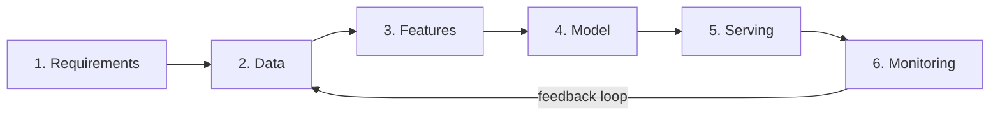
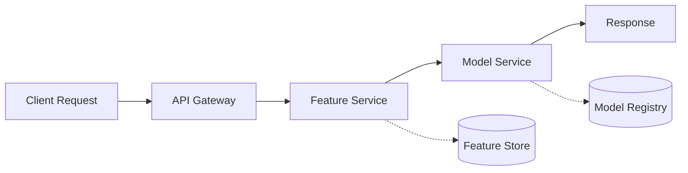
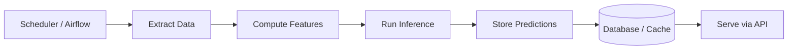

# Topic 17: ML System Design & Architecture

> **Track**: AI/ML Engineer — Practice-First, Code-Heavy
> **Prerequisites**: Topics 3-5 (Classical ML), Topic 13 (LLM APIs), Topic 14 (RAG)
> **You will build**: Complete system design documents, a feature store, an A/B testing framework, and an end-to-end ML pipeline

---

## Table of Contents

1. [Why ML System Design Matters](#1-why-ml-system-design-matters)
2. [The ML System Design Framework — 6 Steps](#2-the-ml-system-design-framework--6-steps)
3. [Step 1: Requirements & Problem Framing](#3-step-1-requirements--problem-framing)
4. [Step 2: Data — Collection, Storage, Pipelines](#4-step-2-data--collection-storage-pipelines)
5. [Step 3: Feature Engineering & Feature Stores](#5-step-3-feature-engineering--feature-stores)
6. [Step 4: Model Selection, Training, Offline Evaluation](#6-step-4-model-selection-training-offline-evaluation)
7. [Step 5: Serving — Online vs Batch Prediction](#7-step-5-serving--online-vs-batch-prediction)
8. [Step 6: Monitoring, Feedback Loops, Retraining](#8-step-6-monitoring-feedback-loops-retraining)
9. [Design Pattern: Online Prediction Service](#9-design-pattern-online-prediction-service)
10. [Design Pattern: Batch Prediction Pipeline](#10-design-pattern-batch-prediction-pipeline)
11. [Design Pattern: Feature Store](#11-design-pattern-feature-store)
12. [Design Pattern: A/B Testing for ML](#12-design-pattern-ab-testing-for-ml)
13. [Full Design #1: Recommendation System](#13-full-design-1-recommendation-system)
14. [Full Design #2: Fraud Detection System](#14-full-design-2-fraud-detection-system)
15. [Full Design #3: RAG-Based Q&A System](#15-full-design-3-rag-based-qa-system)
16. [Full Design #4: Search Ranking System](#16-full-design-4-search-ranking-system)
17. [Full Design #5: Content Moderation System](#17-full-design-5-content-moderation-system)
18. [Data Engineering Basics for ML](#18-data-engineering-basics-for-ml)
19. [Practice Exercises](#19-practice-exercises)
20. [Mini-Project: System Design Document — LLM Chatbot](#20-mini-project-system-design-document--llm-chatbot)
21. [Interview Questions & Answers](#21-interview-questions--answers)

---

## 1. Why ML System Design Matters

ML System Design is a dedicated interview round at most companies (L4+ at Google, E4+ at Meta, SDE-II+ at Amazon). It tests whether you can go **beyond notebooks** — can you build a complete, production-grade ML system?

```
┌──────────────────────────────────────────────────────────────┐
│              What ML System Design Tests                      │
├──────────────────────────────────────────────────────────────┤
│                                                              │
│  ✗ NOT: "Explain gradient descent"                           │
│  ✗ NOT: "What is the difference between L1 and L2?"         │
│                                                              │
│  ✓ YES: "Design a recommendation system for 100M users"     │
│  ✓ YES: "How would you build a fraud detection pipeline?"   │
│  ✓ YES: "Design a search ranking system for an e-commerce"  │
│                                                              │
│  They want to see:                                           │
│  1. Structured thinking (framework, not random ideas)        │
│  2. Trade-off analysis (latency vs accuracy, cost vs perf)   │
│  3. Production awareness (monitoring, failure modes, scale)  │
│  4. End-to-end ownership (data → model → serving → eval)     │
│                                                              │
└──────────────────────────────────────────────────────────────┘
```

---

## 2. The ML System Design Framework — 6 Steps

Every ML system design follows this flow. **Memorize this framework** — it's your interview skeleton.



| Step | Time in Interview | Key Output |
|------|------------------|------------|
| 1. Requirements | 5 min | Problem framing, metrics, constraints |
| 2. Data | 5 min | Data sources, schema, pipeline |
| 3. Features | 8 min | Feature engineering, feature store |
| 4. Model | 10 min | Model choice, training, offline eval |
| 5. Serving | 8 min | Architecture, latency, throughput |
| 6. Monitoring | 5 min | Drift detection, A/B testing, retraining |

**Golden rule**: Spend more time on the **system** (data, features, serving, monitoring) than on the **model**. The model is 20% of the system.

```
┌──────────────────────────────────────────────────────────────┐
│         Where Engineers Actually Spend Their Time             │
├──────────────────────────────────────────────────────────────┤
│                                                              │
│  Data collection & cleaning     ████████████████  35%        │
│  Feature engineering            ██████████        20%        │
│  Model training & tuning        ██████            15%        │
│  Serving infrastructure         ██████            15%        │
│  Monitoring & maintenance       ██████            15%        │
│                                                              │
│  "Everyone wants to do the model work. Nobody wants to       │
│   build the data pipeline. That's why pipelines break."      │
│                                                              │
└──────────────────────────────────────────────────────────────┘
```

---

## 3. Step 1: Requirements & Problem Framing

The most important step. Bad framing → wrong system.

### Checklist — Ask These Before Designing Anything

```python
"""
Requirements template — use this to structure your thinking
in every system design interview.
"""

requirements_template = {
    # ── Business Requirements ─────────────────────────────
    "business_goal": "What is the product trying to achieve?",
    "success_metric": "How does the business measure success? (revenue, engagement, retention)",
    "user_experience": "What does the user see? Latency tolerance?",

    # ── ML Framing ────────────────────────────────────────
    "ml_task": "Classification, regression, ranking, generation, retrieval?",
    "input": "What data does the model receive at prediction time?",
    "output": "What does the model return? (score, label, ranked list, text)",
    "label": "How do we get ground truth? (explicit feedback, implicit signals, human labels)",

    # ── Constraints ───────────────────────────────────────
    "latency": "p50 < ?ms, p99 < ?ms",
    "throughput": "Predictions per second needed?",
    "scale": "Number of users, items, requests/day",
    "freshness": "How fresh must predictions be? (real-time, hourly, daily)",
    "cost_budget": "Monthly infrastructure budget?",

    # ── Offline Metrics ───────────────────────────────────
    "offline_metric": "AUC, NDCG, precision@K, RMSE — what matters most?",

    # ── Online Metrics ────────────────────────────────────
    "online_metric": "CTR, conversion rate, revenue per session, time on page",
}
```

### Example: Framing a Recommendation System

```python
"""
Example: Framing requirements for a YouTube-style video recommendation system.
"""

youtube_recs = {
    "business_goal": "Maximize user watch time and engagement",
    "success_metric": "Total watch time per user per day",

    "ml_task": "Ranking — given a user and candidate videos, rank by predicted engagement",
    "input": "User ID, user history (watched, liked, shared), candidate video features",
    "output": "Ranked list of video IDs with scores",
    "label": "Implicit: watch time, click, like, share, subscribe (weighted combination)",

    "latency": "p50 < 100ms, p99 < 300ms (homepage load)",
    "throughput": "500K requests/sec globally",
    "scale": "2B users, 800M videos, 1B requests/day",
    "freshness": "Features updated every 15 min, model retrained daily",

    "offline_metric": "NDCG@20 for ranking quality",
    "online_metric": "Watch time per session, CTR, user retention (7-day)",
}
```

### Turning a Business Problem into an ML Problem

$$
\text{Business metric (watch time)} \xrightarrow{\text{proxy}} \text{ML metric (predicted engagement score)}
$$

The proxy metric must **correlate** with the business metric. Common proxies:

| Business Goal | ML Task | ML Metric |
|--------------|---------|-----------|
| Increase revenue | Click prediction → ranking | AUC, NDCG |
| Reduce fraud | Binary classification | Precision@k, AUC-PR |
| Improve search | Ranking | NDCG, MRR |
| User retention | Churn prediction | AUC, recall |
| Content safety | Multi-label classification | Precision, recall per class |

---

## 4. Step 2: Data — Collection, Storage, Pipelines

### Data Sources for ML Systems

```
┌──────────────────────────────────────────────────────────────┐
│                    Data Sources                               │
├──────────────────────────────────────────────────────────────┤
│                                                              │
│  User interaction logs                                       │
│  ├── Clicks, views, purchases, time spent                    │
│  ├── Search queries                                          │
│  └── Session data (device, location, time)                   │
│                                                              │
│  Item/content metadata                                       │
│  ├── Product catalog, video metadata, article text           │
│  ├── Categories, tags, descriptions                          │
│  └── Images, embeddings                                      │
│                                                              │
│  User profiles                                               │
│  ├── Demographics (age, location)                            │
│  ├── Preferences, settings                                   │
│  └── Historical aggregates (avg spend, frequency)            │
│                                                              │
│  External data                                               │
│  ├── Geolocation, weather, holidays                          │
│  ├── Market data, exchange rates                             │
│  └── Third-party enrichment                                  │
│                                                              │
└──────────────────────────────────────────────────────────────┘
```

### Data Pipeline with Validation

```python
"""
Data pipeline pattern: Extract → Validate → Transform → Load.
Uses Great Expectations for validation.
"""

from dataclasses import dataclass
from datetime import datetime
import pandas as pd


@dataclass
class DataPipelineConfig:
    """Configuration for a data pipeline."""
    source_table: str
    destination_table: str
    date_column: str
    required_columns: list[str]
    min_rows: int = 100
    max_null_fraction: float = 0.1


class DataValidator:
    """Validate data quality before model training."""

    def __init__(self, config: DataPipelineConfig):
        self.config = config
        self.errors: list[str] = []

    def validate(self, df: pd.DataFrame) -> bool:
        """Run all validation checks. Returns True if data passes."""
        self.errors = []

        # Check required columns exist
        missing = set(self.config.required_columns) - set(df.columns)
        if missing:
            self.errors.append(f"Missing columns: {missing}")

        # Check minimum row count
        if len(df) < self.config.min_rows:
            self.errors.append(
                f"Too few rows: {len(df)} < {self.config.min_rows}"
            )

        # Check null fraction per column
        for col in self.config.required_columns:
            if col in df.columns:
                null_frac = df[col].isnull().mean()
                if null_frac > self.config.max_null_fraction:
                    self.errors.append(
                        f"Column '{col}' has {null_frac:.1%} nulls "
                        f"(max {self.config.max_null_fraction:.1%})"
                    )

        # Check for duplicate rows
        dup_count = df.duplicated().sum()
        if dup_count > 0:
            self.errors.append(f"{dup_count} duplicate rows found")

        # Check date range freshness
        if self.config.date_column in df.columns:
            max_date = pd.to_datetime(df[self.config.date_column]).max()
            staleness = (datetime.now() - max_date).days
            if staleness > 7:
                self.errors.append(f"Data is {staleness} days stale")

        return len(self.errors) == 0

    def report(self) -> str:
        if not self.errors:
            return "✅ All validation checks passed"
        return "❌ Validation failed:\n" + "\n".join(f"  - {e}" for e in self.errors)


# ── Data versioning with DVC (commands) ───────────────────────

DVC_COMMANDS = """
# Initialize DVC in your repo
dvc init

# Track a large dataset
dvc add data/training_data.parquet

# Push data to remote storage (S3, GCS, etc.)
dvc remote add -d myremote s3://my-bucket/dvc-store
dvc push

# Pull data on another machine
dvc pull

# Switch to a previous data version
git checkout v1.0
dvc checkout
"""


# ── Usage ─────────────────────────────────────────────────────

config = DataPipelineConfig(
    source_table="events.user_clicks",
    destination_table="ml.training_data",
    date_column="event_date",
    required_columns=["user_id", "item_id", "clicked", "event_date", "features"],
    min_rows=10_000,
    max_null_fraction=0.05,
)

# Simulate loading data
df = pd.DataFrame({
    "user_id": range(50_000),
    "item_id": range(50_000),
    "clicked": [1, 0] * 25_000,
    "event_date": pd.date_range("2026-01-01", periods=50_000, freq="min"),
    "features": [{"price": 10.0}] * 50_000,
})

validator = DataValidator(config)
is_valid = validator.validate(df)
print(validator.report())
```

---

## 5. Step 3: Feature Engineering & Feature Stores

Feature engineering is the highest-ROI activity in ML. Good features > fancy models.

### Common Feature Categories

$$
\mathbf{x} = [\underbrace{x_{\text{user}}}_{\text{who}}, \underbrace{x_{\text{item}}}_{\text{what}}, \underbrace{x_{\text{context}}}_{\text{when/where}}, \underbrace{x_{\text{interaction}}}_{\text{cross-features}}]
$$

| Category | Examples | Update Frequency |
|----------|---------|-----------------|
| **User features** | Age, country, signup date, total purchases | Daily or slower |
| **Item features** | Price, category, popularity, embedding | Daily |
| **Context features** | Time of day, day of week, device, location | Real-time |
| **Interaction features** | User's click rate on this category, time since last purchase | Real-time or hourly |
| **Aggregate features** | 7-day rolling average spend, lifetime value | Hourly to daily |

### Feature Engineering Code

```python
"""
Feature engineering patterns for ML systems.
"""

import pandas as pd
import numpy as np
from datetime import datetime


class FeatureEngineer:
    """Transform raw data into ML features."""

    def __init__(self, reference_date: datetime | None = None):
        self.reference_date = reference_date or datetime.now()

    def user_features(self, users: pd.DataFrame) -> pd.DataFrame:
        """Engineer user-level features."""
        df = users.copy()

        # Recency: days since signup
        df["days_since_signup"] = (
            self.reference_date - pd.to_datetime(df["signup_date"])
        ).dt.days

        # Frequency: orders per month
        df["orders_per_month"] = df["total_orders"] / (df["days_since_signup"] / 30).clip(lower=1)

        # Monetary: average order value
        df["avg_order_value"] = df["total_revenue"] / df["total_orders"].clip(lower=1)

        # Log transforms for skewed features
        df["log_total_orders"] = np.log1p(df["total_orders"])
        df["log_total_revenue"] = np.log1p(df["total_revenue"])

        return df

    def interaction_features(self, interactions: pd.DataFrame) -> pd.DataFrame:
        """Engineer interaction features from event logs."""
        df = interactions.copy()
        df["event_time"] = pd.to_datetime(df["event_time"])

        # Time-based features
        df["hour_of_day"] = df["event_time"].dt.hour
        df["day_of_week"] = df["event_time"].dt.dayofweek
        df["is_weekend"] = df["day_of_week"].isin([5, 6]).astype(int)

        # Cyclical encoding for hour (so 23 is close to 0)
        df["hour_sin"] = np.sin(2 * np.pi * df["hour_of_day"] / 24)
        df["hour_cos"] = np.cos(2 * np.pi * df["hour_of_day"] / 24)

        return df

    def rolling_features(
        self,
        events: pd.DataFrame,
        user_col: str = "user_id",
        value_col: str = "amount",
        windows: list[int] = [7, 30, 90],
    ) -> pd.DataFrame:
        """Compute rolling window aggregations per user."""
        events = events.sort_values(["user_id", "event_time"])
        result = events.copy()

        for window in windows:
            grouped = (
                events.groupby(user_col)[value_col]
                .rolling(window=window, min_periods=1)
            )
            result[f"{value_col}_rolling_{window}d_mean"] = grouped.mean().reset_index(0, drop=True)
            result[f"{value_col}_rolling_{window}d_sum"] = grouped.sum().reset_index(0, drop=True)
            result[f"{value_col}_rolling_{window}d_std"] = grouped.std().reset_index(0, drop=True)

        return result

    @staticmethod
    def target_encode(
        df: pd.DataFrame,
        column: str,
        target: str,
        smoothing: float = 10.0,
    ) -> pd.Series:
        """
        Target encoding with smoothing to prevent overfitting.

        $$
        \text{encoded}_i = \frac{n_i \cdot \bar{y}_i + m \cdot \bar{y}_{\text{global}}}{n_i + m}
        $$

        Where:
        - $n_i$ = count of category $i$
        - $\\bar{y}_i$ = mean target for category $i$
        - $m$ = smoothing factor
        - $\\bar{y}_{\\text{global}}$ = global mean target
        """
        global_mean = df[target].mean()
        agg = df.groupby(column)[target].agg(["mean", "count"])
        smoothed = (
            (agg["count"] * agg["mean"] + smoothing * global_mean)
            / (agg["count"] + smoothing)
        )
        return df[column].map(smoothed).fillna(global_mean)
```

### Training-Serving Skew — The Silent Killer

```
┌──────────────────────────────────────────────────────────────┐
│             Training-Serving Skew                             │
├──────────────────────────────────────────────────────────────┤
│                                                              │
│  TRAINING TIME:                                              │
│  features = compute_features(historical_data)  # batch SQL   │
│  model.fit(features, labels)                                 │
│                                                              │
│  SERVING TIME:                                               │
│  features = compute_features(live_request)  # different code!│
│  prediction = model.predict(features)                        │
│                                                              │
│  PROBLEM: Training and serving compute features differently  │
│  - Different code paths                                      │
│  - Different data sources                                    │
│  - Different timing (batch vs real-time)                     │
│  - Different libraries (Spark vs Python)                     │
│                                                              │
│  RESULT: Model performs great offline, fails in production   │
│                                                              │
│  SOLUTION: Feature Store (single source of truth)            │
│                                                              │
└──────────────────────────────────────────────────────────────┘
```

---

## 6. Step 4: Model Selection, Training, Offline Evaluation

### Model Selection Decision Tree

```
┌──────────────────────────────────────────────────────────────┐
│                 Model Selection Guide                         │
├──────────────────────────────────────────────────────────────┤
│                                                              │
│  What type of data?                                          │
│  ├── Tabular → XGBoost / LightGBM (start here, always)      │
│  ├── Text → BERT / fine-tuned LLM                           │
│  ├── Images → ResNet / EfficientNet (transfer learning)      │
│  ├── Sequences → LSTM / Transformer                          │
│  └── Multi-modal → Custom architecture                       │
│                                                              │
│  What latency?                                               │
│  ├── < 10ms → Logistic regression, small XGBoost, ONNX      │
│  ├── < 100ms → XGBoost, small neural net, distilled BERT    │
│  ├── < 1s → Full BERT, medium neural net                    │
│  └── > 1s → Large LLM, ensemble, batch is better            │
│                                                              │
│  How much data?                                              │
│  ├── < 1K samples → Logistic regression, random forest       │
│  ├── 1K-100K → XGBoost, small neural net                    │
│  ├── 100K-10M → Deep learning viable                        │
│  └── > 10M → Deep learning shines                           │
│                                                              │
│  ALWAYS START WITH A SIMPLE BASELINE.                        │
│  The baseline defines the bar. Beat it, or don't ship.      │
│                                                              │
└──────────────────────────────────────────────────────────────┘
```

### Model Training Pipeline

```python
"""
Structured model training pipeline with experiment tracking.
This is the pattern you'd describe in a system design interview.
"""

from dataclasses import dataclass
from typing import Any
import numpy as np
from sklearn.model_selection import cross_val_score
from sklearn.metrics import (
    roc_auc_score, precision_recall_curve, average_precision_score,
    ndcg_score, mean_squared_error,
)


@dataclass
class ExperimentConfig:
    """Defines a single training experiment."""
    experiment_name: str
    model_class: Any
    model_params: dict
    features: list[str]
    target: str
    eval_metric: str  # "auc", "ndcg", "rmse", "average_precision"
    cv_folds: int = 5


@dataclass
class ExperimentResult:
    """Result of a training experiment."""
    config: ExperimentConfig
    cv_scores: list[float]
    mean_score: float
    std_score: float
    feature_importances: dict[str, float] | None


class ModelTrainer:
    """Run experiments and track results."""

    def __init__(self):
        self.results: list[ExperimentResult] = []

    def run_experiment(
        self,
        config: ExperimentConfig,
        X: np.ndarray,
        y: np.ndarray,
    ) -> ExperimentResult:
        """Run a single experiment with cross-validation."""
        scoring_map = {
            "auc": "roc_auc",
            "average_precision": "average_precision",
            "rmse": "neg_root_mean_squared_error",
            "accuracy": "accuracy",
        }
        scoring = scoring_map.get(config.eval_metric, config.eval_metric)

        model = config.model_class(**config.model_params)
        scores = cross_val_score(
            model, X, y,
            cv=config.cv_folds,
            scoring=scoring,
        )
        # Negate if sklearn uses negative convention
        if config.eval_metric == "rmse":
            scores = -scores

        # Train on full data for feature importances
        model.fit(X, y)
        importances = None
        if hasattr(model, "feature_importances_"):
            importances = dict(zip(config.features, model.feature_importances_))

        result = ExperimentResult(
            config=config,
            cv_scores=scores.tolist(),
            mean_score=scores.mean(),
            std_score=scores.std(),
            feature_importances=importances,
        )
        self.results.append(result)
        return result

    def best_experiment(self) -> ExperimentResult:
        """Return the experiment with the best mean score."""
        return max(self.results, key=lambda r: r.mean_score)

    def comparison_table(self) -> str:
        """Print a comparison table of all experiments."""
        lines = [f"{'Experiment':<30} {'Metric':<12} {'Mean':>8} {'Std':>8}"]
        lines.append("-" * 60)
        for r in sorted(self.results, key=lambda x: x.mean_score, reverse=True):
            lines.append(
                f"{r.config.experiment_name:<30} "
                f"{r.config.eval_metric:<12} "
                f"{r.mean_score:>8.4f} "
                f"{r.std_score:>8.4f}"
            )
        return "\n".join(lines)


# ── Usage ─────────────────────────────────────────────────────

from sklearn.linear_model import LogisticRegression
from sklearn.ensemble import RandomForestClassifier, GradientBoostingClassifier

# Sample data
np.random.seed(42)
X = np.random.randn(5000, 10)
y = (X[:, 0] + X[:, 1] * 2 + np.random.randn(5000) * 0.5 > 0).astype(int)
feature_names = [f"feat_{i}" for i in range(10)]

trainer = ModelTrainer()

experiments = [
    ExperimentConfig(
        experiment_name="Logistic Regression (baseline)",
        model_class=LogisticRegression,
        model_params={"max_iter": 1000},
        features=feature_names,
        target="label",
        eval_metric="auc",
    ),
    ExperimentConfig(
        experiment_name="Random Forest",
        model_class=RandomForestClassifier,
        model_params={"n_estimators": 100, "max_depth": 10, "random_state": 42},
        features=feature_names,
        target="label",
        eval_metric="auc",
    ),
    ExperimentConfig(
        experiment_name="Gradient Boosting",
        model_class=GradientBoostingClassifier,
        model_params={"n_estimators": 200, "max_depth": 5, "learning_rate": 0.1},
        features=feature_names,
        target="label",
        eval_metric="auc",
    ),
]

for exp in experiments:
    result = trainer.run_experiment(exp, X, y)
    print(f"✅ {exp.experiment_name}: AUC = {result.mean_score:.4f} ± {result.std_score:.4f}")

print("\n" + trainer.comparison_table())
```

### Offline Evaluation — Choosing the Right Metric

$$
\text{AUC-ROC} = P(\hat{y}_{\text{positive}} > \hat{y}_{\text{negative}})
$$

$$
\text{NDCG@K} = \frac{\text{DCG@K}}{\text{IDCG@K}}, \quad \text{DCG@K} = \sum_{i=1}^{K} \frac{2^{r_i} - 1}{\log_2(i+1)}
$$

$$
\text{Precision@K} = \frac{|\text{relevant items in top K}|}{K}
$$

| Task | Primary Metric | Secondary | Why |
|------|---------------|-----------|-----|
| Binary classification | AUC-ROC | Precision-Recall AUC | AUC for overall, PR-AUC for imbalanced |
| Ranking | NDCG@K | MRR, MAP | NDCG penalizes bad ranking at top |
| Regression | RMSE | MAE, R² | RMSE penalizes large errors more |
| Retrieval | Recall@K | Precision@K | Must retrieve relevant items |
| Generation (LLM) | Human eval | BLEU, ROUGE, BERTScore | Automated metrics weakly correlate |

---

## 7. Step 5: Serving — Online vs Batch Prediction

```
┌──────────────────────────────────────────────────────────────┐
│          Online vs Batch Prediction                           │
├──────────────────────────────────────────────────────────────┤
│                                                              │
│  ONLINE (real-time):                                         │
│  User request → Feature lookup → Model inference → Response  │
│  Latency: < 100ms                                            │
│  When: Personalized, context-dependent, real-time            │
│  Examples: Search ranking, fraud detection, recommendations  │
│                                                              │
│  BATCH (precomputed):                                        │
│  Scheduled job → Process all items → Store predictions       │
│  Latency: N/A (precomputed, served from cache)               │
│  When: Less personalized, can be stale, all users/items      │
│  Examples: Email campaigns, daily reports, pre-ranked lists   │
│                                                              │
│  NEAR-REAL-TIME (streaming):                                 │
│  Event stream → Feature update → Re-score → Store            │
│  Latency: seconds to minutes                                 │
│  When: Needs freshness but not per-request inference          │
│  Examples: Trending content, anomaly detection on metrics     │
│                                                              │
└──────────────────────────────────────────────────────────────┘
```

### Decision Matrix

| Factor | Online | Batch | Near-Real-Time |
|--------|--------|-------|----------------|
| Latency | < 100ms | Hours | Seconds-minutes |
| Throughput | Must handle peak | Unconstrained | Medium |
| Freshness | Real-time | Stale (hours) | Minutes old |
| Cost | High (always-on GPUs) | Low (scheduled) | Medium |
| Complexity | High | Low | Medium |
| Use when | User is waiting | Pre-computation OK | Freshness matters |

---

## 8. Step 6: Monitoring, Feedback Loops, Retraining

### What to Monitor

```python
"""
ML monitoring: detect when your model degrades in production.
"""

from dataclasses import dataclass
import numpy as np
from scipy import stats


@dataclass
class MonitoringAlert:
    """An alert triggered by monitoring."""
    metric_name: str
    current_value: float
    threshold: float
    severity: str  # "warning", "critical"
    message: str


class MLMonitor:
    """Monitor ML model health in production."""

    def __init__(self, model_name: str):
        self.model_name = model_name
        self.alerts: list[MonitoringAlert] = []

    def check_prediction_drift(
        self,
        reference_predictions: np.ndarray,
        current_predictions: np.ndarray,
        threshold: float = 0.05,
    ) -> MonitoringAlert | None:
        """
        Detect if prediction distribution has shifted.

        Uses Kolmogorov-Smirnov test:
        - H0: distributions are the same
        - If p < threshold: drift detected
        """
        stat, p_value = stats.ks_2samp(reference_predictions, current_predictions)
        if p_value < threshold:
            alert = MonitoringAlert(
                metric_name="prediction_drift",
                current_value=p_value,
                threshold=threshold,
                severity="warning" if p_value > 0.01 else "critical",
                message=f"Prediction drift detected (KS p-value={p_value:.4f})",
            )
            self.alerts.append(alert)
            return alert
        return None

    def check_feature_drift(
        self,
        reference_features: dict[str, np.ndarray],
        current_features: dict[str, np.ndarray],
        threshold: float = 0.05,
    ) -> list[MonitoringAlert]:
        """Check each feature for distribution shift."""
        alerts = []
        for feature_name in reference_features:
            if feature_name not in current_features:
                continue
            stat, p_value = stats.ks_2samp(
                reference_features[feature_name],
                current_features[feature_name],
            )
            if p_value < threshold:
                alert = MonitoringAlert(
                    metric_name=f"feature_drift_{feature_name}",
                    current_value=p_value,
                    threshold=threshold,
                    severity="warning",
                    message=f"Feature '{feature_name}' drifted (KS p={p_value:.4f})",
                )
                alerts.append(alert)
                self.alerts.append(alert)
        return alerts

    def check_performance_degradation(
        self,
        metric_name: str,
        baseline_value: float,
        current_value: float,
        relative_threshold: float = 0.05,
    ) -> MonitoringAlert | None:
        """
        Alert if metric drops more than threshold relative to baseline.

        $$
        \\text{degradation} = \\frac{\\text{baseline} - \\text{current}}{\\text{baseline}}
        $$
        """
        if baseline_value == 0:
            return None
        degradation = (baseline_value - current_value) / abs(baseline_value)
        if degradation > relative_threshold:
            alert = MonitoringAlert(
                metric_name=f"performance_{metric_name}",
                current_value=current_value,
                threshold=baseline_value * (1 - relative_threshold),
                severity="critical" if degradation > 0.1 else "warning",
                message=(
                    f"{metric_name} dropped {degradation:.1%}: "
                    f"{baseline_value:.4f} → {current_value:.4f}"
                ),
            )
            self.alerts.append(alert)
            return alert
        return None

    def check_latency(
        self,
        latencies_ms: np.ndarray,
        p50_threshold: float = 50.0,
        p99_threshold: float = 200.0,
    ) -> list[MonitoringAlert]:
        """Check prediction latency SLOs."""
        alerts = []
        p50 = np.percentile(latencies_ms, 50)
        p99 = np.percentile(latencies_ms, 99)

        if p50 > p50_threshold:
            alerts.append(MonitoringAlert(
                metric_name="latency_p50",
                current_value=p50,
                threshold=p50_threshold,
                severity="warning",
                message=f"p50 latency {p50:.0f}ms > {p50_threshold:.0f}ms",
            ))

        if p99 > p99_threshold:
            alerts.append(MonitoringAlert(
                metric_name="latency_p99",
                current_value=p99,
                threshold=p99_threshold,
                severity="critical",
                message=f"p99 latency {p99:.0f}ms > {p99_threshold:.0f}ms",
            ))

        self.alerts.extend(alerts)
        return alerts

    def summary(self) -> str:
        if not self.alerts:
            return f"✅ {self.model_name}: All checks passed"
        lines = [f"⚠️ {self.model_name}: {len(self.alerts)} alert(s)"]
        for a in self.alerts:
            icon = "🔴" if a.severity == "critical" else "🟡"
            lines.append(f"  {icon} {a.message}")
        return "\n".join(lines)


# ── Usage ─────────────────────────────────────────────────────

monitor = MLMonitor("fraud_detection_v2")

# Check prediction drift
ref_preds = np.random.beta(2, 5, size=10000)  # reference distribution
cur_preds = np.random.beta(2, 3, size=10000)  # shifted distribution!
monitor.check_prediction_drift(ref_preds, cur_preds)

# Check performance
monitor.check_performance_degradation("auc", baseline_value=0.95, current_value=0.91)

# Check latency
latencies = np.random.exponential(30, size=1000)
monitor.check_latency(latencies, p50_threshold=30, p99_threshold=150)

print(monitor.summary())
```

### Retraining Strategies

| Strategy | Trigger | Pros | Cons |
|----------|---------|------|------|
| **Scheduled** | Daily/weekly cron | Simple, predictable | May retrain unnecessarily |
| **Performance-based** | Metric drops below threshold | Efficient | Needs good monitoring |
| **Data-drift-based** | Feature/prediction drift detected | Proactive | Can be noisy |
| **Continuous** | Every N new samples | Freshest model | Complex infra, expensive |

---

## 9. Design Pattern: Online Prediction Service



```python
"""
Online prediction service with FastAPI.
This is the architecture pattern for real-time ML serving.
"""

from fastapi import FastAPI, HTTPException
from pydantic import BaseModel, Field
import numpy as np
import time
import pickle
from pathlib import Path

app = FastAPI(title="ML Prediction Service")


# ── Schemas ───────────────────────────────────────────────────

class PredictionRequest(BaseModel):
    user_id: str
    item_id: str
    context: dict = Field(default_factory=dict)  # device, location, time, etc.


class PredictionResponse(BaseModel):
    score: float
    model_version: str
    latency_ms: float
    features_used: list[str]


# ── Feature Service (would connect to feature store) ──────────

class FeatureService:
    """
    Fetch features for a prediction request.
    In production, this connects to Redis/Feast/Tecton.
    """

    def get_features(self, user_id: str, item_id: str, context: dict) -> dict:
        # Mock: In production, this queries feature store
        return {
            "user_age_days": 365,
            "user_total_purchases": 42,
            "user_avg_order_value": 55.0,
            "item_price": 29.99,
            "item_category_encoded": 3,
            "item_popularity_7d": 0.85,
            "hour_sin": np.sin(2 * np.pi * 14 / 24),
            "hour_cos": np.cos(2 * np.pi * 14 / 24),
            "is_weekend": 0,
        }


# ── Model Service ─────────────────────────────────────────────

class ModelService:
    """
    Load and serve the ML model.
    Supports model versioning and hot-reloading.
    """

    def __init__(self):
        self.model = None
        self.model_version = "v0.0.0"
        self.feature_order: list[str] = []

    def load_model(self, model_path: str):
        """Load model from disk (pickle, ONNX, etc.)."""
        # Mock: In production, load from model registry
        from sklearn.ensemble import GradientBoostingClassifier
        self.model = GradientBoostingClassifier(n_estimators=100)
        # Pretend it's trained
        X_dummy = np.random.randn(100, 9)
        y_dummy = np.random.randint(0, 2, 100)
        self.model.fit(X_dummy, y_dummy)
        self.model_version = "v2.1.0"
        self.feature_order = [
            "user_age_days", "user_total_purchases", "user_avg_order_value",
            "item_price", "item_category_encoded", "item_popularity_7d",
            "hour_sin", "hour_cos", "is_weekend",
        ]

    def predict(self, features: dict) -> float:
        """Run inference. Returns a score between 0 and 1."""
        feature_vector = np.array(
            [[features.get(f, 0.0) for f in self.feature_order]]
        )
        proba = self.model.predict_proba(feature_vector)[0][1]
        return float(proba)


# ── Initialize services ──────────────────────────────────────

feature_service = FeatureService()
model_service = ModelService()
model_service.load_model("models/latest")


# ── Endpoints ─────────────────────────────────────────────────

@app.post("/predict", response_model=PredictionResponse)
async def predict(request: PredictionRequest):
    start = time.time()

    # 1. Fetch features
    features = feature_service.get_features(
        request.user_id, request.item_id, request.context
    )

    # 2. Run inference
    score = model_service.predict(features)

    latency_ms = (time.time() - start) * 1000

    return PredictionResponse(
        score=score,
        model_version=model_service.model_version,
        latency_ms=round(latency_ms, 2),
        features_used=model_service.feature_order,
    )


@app.get("/health")
async def health():
    return {
        "status": "healthy",
        "model_version": model_service.model_version,
        "model_loaded": model_service.model is not None,
    }
```

---

## 10. Design Pattern: Batch Prediction Pipeline



```python
"""
Batch prediction pipeline.
Runs periodically (e.g., nightly) to pre-compute predictions for all users.
"""

import time
from dataclasses import dataclass
from datetime import datetime
import numpy as np
import pandas as pd


@dataclass
class BatchPipelineConfig:
    model_path: str
    input_query: str  # SQL or table reference
    output_table: str
    batch_size: int = 10_000
    date: str = ""  # pipeline run date

    def __post_init__(self):
        if not self.date:
            self.date = datetime.now().strftime("%Y-%m-%d")


class BatchPredictionPipeline:
    """
    Nightly batch prediction pipeline.

    Steps:
    1. Extract users/items from data warehouse
    2. Compute features (using same logic as training)
    3. Run model inference in batches
    4. Write predictions to serving table (Redis, PostgreSQL, etc.)
    """

    def __init__(self, config: BatchPipelineConfig):
        self.config = config
        self.stats = {"rows_processed": 0, "duration_s": 0, "errors": 0}

    def extract(self) -> pd.DataFrame:
        """Extract data from source. In production: SQL query or Spark job."""
        print(f"[Extract] Loading data for {self.config.date}...")
        # Mock: generate synthetic data
        n_users = 50_000
        return pd.DataFrame({
            "user_id": [f"user_{i}" for i in range(n_users)],
            "feature_1": np.random.randn(n_users),
            "feature_2": np.random.randn(n_users),
            "feature_3": np.random.randn(n_users),
        })

    def compute_features(self, raw_data: pd.DataFrame) -> pd.DataFrame:
        """Transform raw data into model features."""
        print(f"[Features] Computing features for {len(raw_data)} rows...")
        df = raw_data.copy()
        # Example feature engineering
        df["feature_cross"] = df["feature_1"] * df["feature_2"]
        df["feature_ratio"] = df["feature_1"] / (df["feature_2"].abs() + 1e-8)
        return df

    def predict_batch(self, features: pd.DataFrame) -> pd.DataFrame:
        """Run model inference on all rows."""
        print(f"[Predict] Running inference...")
        feature_cols = [c for c in features.columns if c.startswith("feature")]

        # Mock model: In production, load from model registry
        from sklearn.linear_model import LogisticRegression
        model = LogisticRegression()
        X = features[feature_cols].values
        # Fake predictions (in production: model.predict_proba)
        scores = 1 / (1 + np.exp(-X.sum(axis=1)))

        features["prediction_score"] = scores
        features["prediction_date"] = self.config.date
        features["model_version"] = "v2.1.0"

        return features[["user_id", "prediction_score", "prediction_date", "model_version"]]

    def write_predictions(self, predictions: pd.DataFrame):
        """Write to serving store. In production: Redis, PostgreSQL, BigQuery."""
        print(f"[Write] Storing {len(predictions)} predictions to {self.config.output_table}...")
        # Mock: would do predictions.to_sql() or redis.mset()
        pass

    def run(self) -> dict:
        """Execute the full pipeline."""
        start = time.time()
        print(f"{'='*60}")
        print(f"Batch pipeline started: {self.config.date}")
        print(f"{'='*60}")

        try:
            raw = self.extract()
            features = self.compute_features(raw)
            predictions = self.predict_batch(features)
            self.write_predictions(predictions)

            self.stats["rows_processed"] = len(predictions)
            self.stats["duration_s"] = time.time() - start

            print(f"\n✅ Pipeline complete:")
            print(f"   Rows: {self.stats['rows_processed']:,}")
            print(f"   Duration: {self.stats['duration_s']:.1f}s")
            print(f"   Score distribution: mean={predictions['prediction_score'].mean():.3f}, "
                  f"std={predictions['prediction_score'].std():.3f}")

        except Exception as e:
            self.stats["errors"] += 1
            print(f"❌ Pipeline failed: {e}")
            raise

        return self.stats


# ── Run ───────────────────────────────────────────────────────

config = BatchPipelineConfig(
    model_path="models/rec_model_v2",
    input_query="SELECT * FROM users WHERE active = true",
    output_table="predictions.daily_recommendations",
)

pipeline = BatchPredictionPipeline(config)
stats = pipeline.run()
```

---

## 11. Design Pattern: Feature Store

```
┌──────────────────────────────────────────────────────────────┐
│                   Feature Store Architecture                  │
├──────────────────────────────────────────────────────────────┤
│                                                              │
│  ┌─────────────────┐    ┌──────────────────┐                │
│  │  Batch Pipeline  │───→│ Offline Store     │ (training)    │
│  │  (Spark, SQL)    │    │ (BigQuery, S3)   │               │
│  └─────────────────┘    └──────────────────┘                │
│                                   │                          │
│                          materialization                      │
│                                   ↓                          │
│  ┌─────────────────┐    ┌──────────────────┐                │
│  │ Stream Pipeline  │───→│ Online Store      │ (serving)     │
│  │  (Kafka, Flink)  │    │ (Redis, DynamoDB)│               │
│  └─────────────────┘    └──────────────────┘                │
│                                   │                          │
│                            ┌──────┴──────┐                   │
│                            │  Feature     │                   │
│                            │  Service API │                   │
│                            └─────────────┘                   │
│                              ↑         ↑                     │
│                         Training    Serving                   │
│                         Pipeline    API                       │
│                                                              │
│  KEY: Same feature definitions for training AND serving      │
│  → Eliminates training-serving skew                          │
│                                                              │
└──────────────────────────────────────────────────────────────┘
```

### Simple Feature Store Implementation

```python
"""
Minimal feature store: demonstrates the concept.
In production, use Feast, Tecton, or a custom Redis-based store.
"""

import json
import time
from dataclasses import dataclass, field
from typing import Any
import redis


@dataclass
class FeatureDefinition:
    """Defines a single feature."""
    name: str
    entity: str  # "user", "item", etc.
    dtype: str  # "float", "int", "string"
    description: str
    source: str  # where this feature comes from
    ttl_seconds: int = 86400  # how long before stale (default 1 day)


class SimpleFeatureStore:
    """
    A Redis-backed feature store.

    Provides:
    - Unified feature definitions (no training-serving skew)
    - Online feature serving (low-latency lookups)
    - Feature freshness tracking
    """

    def __init__(self, redis_url: str = "redis://localhost:6379"):
        self.redis = redis.from_url(redis_url)
        self.definitions: dict[str, FeatureDefinition] = {}

    def register_feature(self, definition: FeatureDefinition):
        """Register a feature definition."""
        key = f"{definition.entity}:{definition.name}"
        self.definitions[key] = definition

    def set_feature(self, entity: str, entity_id: str, feature_name: str, value: Any):
        """Write a feature value (called by batch/stream pipelines)."""
        key = f"feature:{entity}:{entity_id}:{feature_name}"
        self.redis.set(
            key,
            json.dumps({"value": value, "updated_at": time.time()}),
            ex=self.definitions.get(f"{entity}:{feature_name}", FeatureDefinition(
                name="", entity="", dtype="", description="", source=""
            )).ttl_seconds,
        )

    def get_feature(self, entity: str, entity_id: str, feature_name: str) -> Any | None:
        """Read a single feature value (called by serving API)."""
        key = f"feature:{entity}:{entity_id}:{feature_name}"
        raw = self.redis.get(key)
        if raw is None:
            return None
        data = json.loads(raw)
        return data["value"]

    def get_features_batch(
        self,
        entity: str,
        entity_id: str,
        feature_names: list[str],
    ) -> dict[str, Any]:
        """Read multiple features at once (pipelined for speed)."""
        pipe = self.redis.pipeline()
        keys = [f"feature:{entity}:{entity_id}:{fn}" for fn in feature_names]
        for key in keys:
            pipe.get(key)
        results = pipe.execute()

        features = {}
        for fn, raw in zip(feature_names, results):
            if raw is not None:
                data = json.loads(raw)
                features[fn] = data["value"]
            else:
                features[fn] = None  # missing feature

        return features

    def materialize_batch(
        self,
        entity: str,
        entity_ids: list[str],
        feature_data: dict[str, dict[str, Any]],
    ):
        """
        Bulk-write features from a batch pipeline.

        feature_data: {entity_id: {feature_name: value, ...}, ...}
        """
        pipe = self.redis.pipeline()
        count = 0
        for entity_id in entity_ids:
            if entity_id not in feature_data:
                continue
            for feature_name, value in feature_data[entity_id].items():
                key = f"feature:{entity}:{entity_id}:{feature_name}"
                ttl = self.definitions.get(f"{entity}:{feature_name}")
                ttl_s = ttl.ttl_seconds if ttl else 86400
                pipe.set(
                    key,
                    json.dumps({"value": value, "updated_at": time.time()}),
                    ex=ttl_s,
                )
                count += 1
        pipe.execute()
        print(f"Materialized {count} features for {len(entity_ids)} entities")


# ── Usage ─────────────────────────────────────────────────────

store = SimpleFeatureStore()

# Register features
store.register_feature(FeatureDefinition(
    name="total_purchases", entity="user", dtype="int",
    description="Total purchases by user", source="orders table",
    ttl_seconds=3600,
))
store.register_feature(FeatureDefinition(
    name="avg_order_value", entity="user", dtype="float",
    description="Average order value", source="orders table",
    ttl_seconds=3600,
))

# Batch pipeline writes features
store.materialize_batch("user", ["u1", "u2"], {
    "u1": {"total_purchases": 42, "avg_order_value": 55.0},
    "u2": {"total_purchases": 7, "avg_order_value": 120.0},
})

# Serving API reads features
features = store.get_features_batch("user", "u1", ["total_purchases", "avg_order_value"])
print(features)  # {"total_purchases": 42, "avg_order_value": 55.0}
```

### Feast — Production Feature Store

```python
"""
Feast feature store — the most popular open-source option.
This shows the definition pattern (not runnable without setup).
"""

# feature_store.yaml (project config)
FEAST_CONFIG = """
project: fraud_detection
registry: data/registry.db
provider: local
online_store:
  type: redis
  connection_string: localhost:6379
"""

# feature definitions (feature_repo/features.py)
FEAST_FEATURES = """
from feast import Entity, FeatureView, Field, FileSource
from feast.types import Float32, Int64
from datetime import timedelta

# Entity: the primary key for feature lookup
user = Entity(name="user_id", join_keys=["user_id"])

# Data source
user_stats_source = FileSource(
    path="data/user_stats.parquet",
    timestamp_field="event_timestamp",
)

# Feature view: a group of related features
user_stats_view = FeatureView(
    name="user_stats",
    entities=[user],
    ttl=timedelta(days=1),
    schema=[
        Field(name="total_purchases", dtype=Int64),
        Field(name="avg_order_value", dtype=Float32),
        Field(name="days_since_last_order", dtype=Int64),
    ],
    source=user_stats_source,
)
"""

# Usage in training and serving
FEAST_USAGE = """
from feast import FeatureStore

store = FeatureStore(repo_path="feature_repo")

# TRAINING: get historical features (point-in-time correct)
training_df = store.get_historical_features(
    entity_df=orders_df[["user_id", "event_timestamp"]],
    features=[
        "user_stats:total_purchases",
        "user_stats:avg_order_value",
        "user_stats:days_since_last_order",
    ],
).to_df()

# SERVING: get online features (latest values, low-latency)
features = store.get_online_features(
    entity_rows=[{"user_id": "u123"}],
    features=[
        "user_stats:total_purchases",
        "user_stats:avg_order_value",
    ],
).to_dict()
"""
```

---

## 12. Design Pattern: A/B Testing for ML

A/B testing is how you validate that a new model actually improves the product metric.

$$
H_0: \mu_A = \mu_B \quad \text{(no difference)}
$$
$$
H_1: \mu_A \neq \mu_B \quad \text{(model B is different)}
$$

**Sample size** needed for statistical significance:

$$
n = \frac{(z_{\alpha/2} + z_{\beta})^2 \cdot 2\sigma^2}{\delta^2}
$$

Where $\delta$ is the minimum detectable effect and $\sigma^2$ is the variance of the metric.

```python
"""
A/B testing framework for ML models.
"""

import numpy as np
from scipy import stats
from dataclasses import dataclass


@dataclass
class ABTestConfig:
    """Configuration for an A/B test."""
    test_name: str
    control_model: str  # model A (current)
    treatment_model: str  # model B (challenger)
    metric_name: str
    traffic_split: float = 0.5  # fraction going to treatment
    min_samples: int = 1000
    significance_level: float = 0.05  # alpha
    power: float = 0.8  # 1 - beta


@dataclass
class ABTestResult:
    """Result of an A/B test analysis."""
    test_name: str
    control_mean: float
    treatment_mean: float
    relative_lift: float
    p_value: float
    confidence_interval: tuple[float, float]
    is_significant: bool
    recommendation: str


class ABTestFramework:
    """
    ML-specific A/B testing framework.

    Key considerations for ML A/B tests:
    1. Randomization unit (user, not request — avoid inconsistency)
    2. Novelty effects (users react to change, not quality)
    3. Long-running effects (engagement may shift over weeks)
    4. Network effects (one user's treatment affects another)
    """

    def required_sample_size(
        self,
        baseline_rate: float,
        min_detectable_effect: float,
        alpha: float = 0.05,
        power: float = 0.8,
    ) -> int:
        """
        Calculate required sample size per group.

        For proportions (CTR, conversion rate):
        """
        z_alpha = stats.norm.ppf(1 - alpha / 2)
        z_beta = stats.norm.ppf(power)

        p1 = baseline_rate
        p2 = baseline_rate * (1 + min_detectable_effect)

        # Pooled variance for proportions
        p_avg = (p1 + p2) / 2
        numerator = (z_alpha * np.sqrt(2 * p_avg * (1 - p_avg)) +
                     z_beta * np.sqrt(p1 * (1 - p1) + p2 * (1 - p2))) ** 2
        denominator = (p1 - p2) ** 2

        return int(np.ceil(numerator / denominator))

    def analyze(
        self,
        config: ABTestConfig,
        control_values: np.ndarray,
        treatment_values: np.ndarray,
    ) -> ABTestResult:
        """Analyze A/B test results using Welch's t-test."""
        n_control = len(control_values)
        n_treatment = len(treatment_values)

        control_mean = control_values.mean()
        treatment_mean = treatment_values.mean()

        # Welch's t-test (doesn't assume equal variance)
        t_stat, p_value = stats.ttest_ind(
            treatment_values, control_values, equal_var=False
        )

        # Relative lift
        lift = (treatment_mean - control_mean) / control_mean if control_mean != 0 else 0

        # 95% confidence interval for the difference
        diff = treatment_mean - control_mean
        se = np.sqrt(
            treatment_values.var() / n_treatment +
            control_values.var() / n_control
        )
        z = stats.norm.ppf(1 - config.significance_level / 2)
        ci = (diff - z * se, diff + z * se)

        is_sig = p_value < config.significance_level

        # Recommendation
        if n_control < config.min_samples or n_treatment < config.min_samples:
            recommendation = "WAIT — insufficient sample size"
        elif not is_sig:
            recommendation = "NO CHANGE — not statistically significant"
        elif lift > 0:
            recommendation = f"SHIP MODEL B — {lift:.2%} lift (p={p_value:.4f})"
        else:
            recommendation = f"KEEP MODEL A — model B is {-lift:.2%} worse"

        return ABTestResult(
            test_name=config.test_name,
            control_mean=control_mean,
            treatment_mean=treatment_mean,
            relative_lift=lift,
            p_value=p_value,
            confidence_interval=ci,
            is_significant=is_sig,
            recommendation=recommendation,
        )


# ── Usage ─────────────────────────────────────────────────────

framework = ABTestFramework()

# How many users do we need?
n = framework.required_sample_size(
    baseline_rate=0.05,          # 5% CTR currently
    min_detectable_effect=0.05,  # want to detect 5% relative lift (0.05 → 0.0525)
    alpha=0.05,
    power=0.8,
)
print(f"Required sample size per group: {n:,}")
# ~ 63,000 per group

# Simulate test data
np.random.seed(42)
control = np.random.binomial(1, 0.050, size=80_000).astype(float)   # 5.0% CTR
treatment = np.random.binomial(1, 0.053, size=80_000).astype(float)  # 5.3% CTR

config = ABTestConfig(
    test_name="rec_model_v3_vs_v2",
    control_model="rec_v2",
    treatment_model="rec_v3",
    metric_name="click_through_rate",
)

result = framework.analyze(config, control, treatment)
print(f"\nTest: {result.test_name}")
print(f"Control CTR:   {result.control_mean:.4f}")
print(f"Treatment CTR: {result.treatment_mean:.4f}")
print(f"Lift: {result.relative_lift:.2%}")
print(f"P-value: {result.p_value:.4f}")
print(f"CI: [{result.confidence_interval[0]:.5f}, {result.confidence_interval[1]:.5f}]")
print(f"Significant: {result.is_significant}")
print(f"Recommendation: {result.recommendation}")
```

---

## 13. Full Design #1: Recommendation System

**Prompt**: "Design a recommendation system for an e-commerce platform with 10M users and 1M products."

```
┌──────────────────────────────────────────────────────────────┐
│        RECOMMENDATION SYSTEM — Full Design                    │
├──────────────────────────────────────────────────────────────┤
│                                                              │
│  1. REQUIREMENTS                                             │
│  - Goal: Increase purchase rate and avg order value          │
│  - Input: user_id + context (device, time)                   │
│  - Output: Top 50 ranked products                            │
│  - Latency: p99 < 200ms (homepage load)                      │
│  - Scale: 10M users, 1M products, ~50M events/day            │
│  - Labels: implicit (purchase=1.0, add_to_cart=0.5,          │
│            click=0.1, impression=0.0)                        │
│                                                              │
│  2. DATA                                                     │
│  - Event log: user_id, product_id, event_type, timestamp     │
│  - Product catalog: category, price, brand, description      │
│  - User profile: signup_date, location, preferences          │
│  - Stored in: Kafka → S3 (raw) → Spark → feature store      │
│                                                              │
│  3. TWO-STAGE ARCHITECTURE                                   │
│                                                              │
│  Stage 1: Candidate Generation (narrow 1M → 500)             │
│  ┌─────────────────┐                                         │
│  │ Embedding Model  │ Two-tower: user_emb ⊙ item_emb        │
│  │ (ANN search)     │ Approximate nearest neighbors (FAISS)  │
│  └────────┬────────┘                                         │
│           │ top 500 candidates                               │
│           ↓                                                  │
│  Stage 2: Ranking (rank 500 → top 50)                        │
│  ┌─────────────────┐                                         │
│  │ XGBoost / Deep   │ Rich features: cross-features,         │
│  │ Ranking Model    │ user-item interactions, context         │
│  └────────┬────────┘                                         │
│           │ top 50 ranked                                    │
│           ↓                                                  │
│  Stage 3: Re-ranking (business rules)                        │
│  ┌─────────────────┐                                         │
│  │ Diversity filter  │ Ensure category diversity              │
│  │ Boost/suppress   │ Promotions, new items, suppress OOS    │
│  └─────────────────┘                                         │
│                                                              │
│  4. FEATURES                                                 │
│  - User: purchase history embedding, demographic, recency    │
│  - Item: category, price bucket, popularity, freshness       │
│  - Cross: user's affinity to item's category, price match    │
│  - Context: time of day, device, session depth               │
│                                                              │
│  5. SERVING                                                  │
│  - Candidate gen: precomputed daily, stored in FAISS index   │
│  - Ranking: online inference (XGBoost ~5ms per 500 items)    │
│  - Feature store: Redis for real-time features               │
│  - Total latency: ~50ms retrieval + ~5ms ranking = ~55ms     │
│                                                              │
│  6. MONITORING                                               │
│  - Online: CTR, purchase rate, revenue per session           │
│  - Offline: NDCG@50, recall@500 (candidate gen quality)      │
│  - Drift: feature distributions, prediction score dist       │
│  - A/B test: any model change tested for 2 weeks minimum     │
│  - Retrain: daily for ranking model, weekly for embeddings   │
│                                                              │
│  7. COLD START                                               │
│  - New users: popularity-based fallback + category affinity  │
│  - New items: content-based features (description embedding) │
│  - Explore/exploit: 10% traffic to new items for data        │
│                                                              │
└──────────────────────────────────────────────────────────────┘
```

---

## 14. Full Design #2: Fraud Detection System

**Prompt**: "Design a fraud detection system for an online payments company processing 50M transactions/day."

```
┌──────────────────────────────────────────────────────────────┐
│          FRAUD DETECTION SYSTEM — Full Design                 │
├──────────────────────────────────────────────────────────────┤
│                                                              │
│  1. REQUIREMENTS                                             │
│  - Goal: Block fraudulent transactions while minimizing      │
│    false positives (blocking legit users costs revenue)       │
│  - Latency: p99 < 100ms (in the payment flow)               │
│  - Scale: 50M txns/day, ~600 TPS average, ~3000 TPS peak    │
│  - Fraud rate: ~0.1% (highly imbalanced!)                    │
│  - Metric: Precision@FPR=1% (catch fraud without blocking    │
│    more than 1% of legit transactions)                       │
│                                                              │
│  2. TWO-LAYER ARCHITECTURE                                   │
│                                                              │
│  Layer 1: Rules Engine (deterministic, < 5ms)                │
│  ┌─────────────────────────────────────────┐                 │
│  │ - Transaction > $10K from new device     │                 │
│  │ - 5+ transactions in 1 minute            │                 │
│  │ - Known blacklisted IP/card              │                 │
│  │ - Velocity checks (amount, frequency)    │                 │
│  └─────────────────────────────────────────┘                 │
│       │ pass          │ block                                │
│       ↓               ↓                                      │
│  Layer 2: ML Model (probabilistic, < 50ms)                   │
│  ┌─────────────────────────────────────────┐                 │
│  │ - XGBoost on 200+ features               │                 │
│  │ - Real-time features from Redis           │                 │
│  │ - Score threshold: block if > 0.8,        │                 │
│  │   review if 0.5-0.8, pass if < 0.5       │                 │
│  └─────────────────────────────────────────┘                 │
│                                                              │
│  3. KEY FEATURES                                             │
│  - Transaction: amount, currency, merchant_category, time    │
│  - User: account age, avg transaction, lifetime txn count    │
│  - Device: IP geolocation, device fingerprint, is_new_device │
│  - Velocity: txn count last 1h/24h, amount last 1h/24h      │
│  - Graph: shared devices with known fraudsters               │
│                                                              │
│  4. HANDLING IMBALANCE                                       │
│  - Class weights: fraud_weight = 100 (inverse of frequency)  │
│  - Evaluation: PR-AUC, not ROC-AUC                          │
│  - Threshold tuning: optimize for business cost function     │
│    cost = FN_count × $500 + FP_count × $5                   │
│                                                              │
│  5. FEEDBACK & LABELS                                        │
│  - Chargebacks (delayed 30-90 days) → confirmed fraud        │
│  - Manual review outcomes → quick labels                     │
│  - User reports → potential fraud signals                    │
│  - Challenge: label delay means model trains on old data     │
│                                                              │
│  6. MONITORING                                               │
│  - Real-time: fraud rate, block rate, review queue size      │
│  - Alert: if block rate spikes → possible model bug          │
│  - Alert: if fraud rate spikes → model missing new pattern   │
│  - Retrain: weekly with new chargeback labels                │
│                                                              │
└──────────────────────────────────────────────────────────────┘
```

---

## 15. Full Design #3: RAG-Based Q&A System

**Prompt**: "Design a RAG-based Q&A system for 10K internal documents, serving 5K employees."

```
┌──────────────────────────────────────────────────────────────┐
│            RAG Q&A SYSTEM — Full Design                       │
├──────────────────────────────────────────────────────────────┤
│                                                              │
│  1. REQUIREMENTS                                             │
│  - Goal: Answer employee questions using company docs        │
│  - Input: Natural language question                          │
│  - Output: Answer with source citations                      │
│  - Latency: < 5s (including LLM generation)                  │
│  - Scale: 5K users, ~2K queries/day                          │
│  - Accuracy: Must not hallucinate (grounded in docs)         │
│                                                              │
│  2. ARCHITECTURE                                             │
│                                                              │
│  ┌─────┐   ┌──────────┐   ┌────────────┐   ┌──────────┐    │
│  │Query│──→│ Embedding │──→│ Vector DB   │──→│ Re-ranker│    │
│  └─────┘   │ Model     │   │ (retrieval) │   │          │    │
│            └──────────┘   └────────────┘   └────┬─────┘    │
│                                                  │          │
│                           ┌──────────────────────┘          │
│                           ↓                                  │
│                    ┌─────────────┐                           │
│                    │ LLM (GPT-4o)│ ← query + top 5 chunks   │
│                    │ + citations  │                           │
│                    └──────┬──────┘                           │
│                           ↓                                  │
│                    ┌─────────────┐                           │
│                    │  Guardrails  │ factuality check          │
│                    └──────┬──────┘                           │
│                           ↓                                  │
│                      Answer + Sources                        │
│                                                              │
│  3. INGESTION PIPELINE                                       │
│  - Document loaders: PDF, Confluence, Google Docs, Slack     │
│  - Chunking: recursive, 500 tokens, 100 token overlap        │
│  - Embedding: text-embedding-3-small (1536 dims)            │
│  - Vector DB: Qdrant (self-hosted) or Pinecone (managed)    │
│  - Metadata: source_doc, page, section, last_updated         │
│  - Re-index: nightly for changed documents                   │
│                                                              │
│  4. RETRIEVAL                                                │
│  - Hybrid: dense (embedding) + sparse (BM25)                │
│  - Score fusion: reciprocal rank fusion                      │
│  - Re-ranking: cross-encoder (ms-marco-MiniLM)              │
│  - Top K=5 chunks → context for LLM                         │
│                                                              │
│  5. GENERATION                                               │
│  - System prompt: "Answer using ONLY the provided context"   │
│  - Cite sources: "[Source: doc_name, page X]"                │
│  - "I don't know" when context doesn't contain answer        │
│  - Streaming response for UX                                 │
│                                                              │
│  6. EVALUATION                                               │
│  - Retrieval: recall@5, MRR                                 │
│  - Generation: faithfulness (is answer grounded?),           │
│    relevance (does it answer the question?)                  │
│  - Use RAGAS framework for automated evaluation              │
│  - Human eval: 100 queries/week rated by SMEs                │
│                                                              │
│  7. ACCESS CONTROL                                           │
│  - Per-document permissions synced from SSO                  │
│  - Filter retrieval results by user's access level           │
│  - Never surface docs the user can't access                  │
│                                                              │
└──────────────────────────────────────────────────────────────┘
```

---

## 16. Full Design #4: Search Ranking System

**Prompt**: "Design a search ranking system for an e-commerce platform."

```
┌──────────────────────────────────────────────────────────────┐
│           SEARCH RANKING SYSTEM — Full Design                 │
├──────────────────────────────────────────────────────────────┤
│                                                              │
│  1. REQUIREMENTS                                             │
│  - Goal: Return the most relevant products for a query       │
│  - Input: Search query + user context                        │
│  - Output: Ranked list of products                           │
│  - Latency: p99 < 200ms                                      │
│  - Scale: 100M queries/day, 5M products                      │
│  - Metric: NDCG@10, online: CTR, add-to-cart rate            │
│                                                              │
│  2. ARCHITECTURE (3-stage funnel)                            │
│                                                              │
│  Stage 1: Retrieval (5M → 1000)                              │
│  ┌────────────────────────────────────┐                      │
│  │ BM25 (Elasticsearch) + Embedding   │                      │
│  │ search (ANN) → union → 1000 docs   │                      │
│  └────────────────────────────────────┘                      │
│                                                              │
│  Stage 2: Ranking (1000 → 100)                               │
│  ┌────────────────────────────────────┐                      │
│  │ LambdaMART / neural ranker          │                      │
│  │ Features: BM25 score, embedding sim,│                      │
│  │ CTR history, price, reviews, recency│                      │
│  └────────────────────────────────────┘                      │
│                                                              │
│  Stage 3: Re-ranking (business logic)                        │
│  ┌────────────────────────────────────┐                      │
│  │ Boost: promotions, sponsored, fresh │                      │
│  │ Suppress: out of stock, reported    │                      │
│  │ Diversity: category dedup           │                      │
│  └────────────────────────────────────┘                      │
│                                                              │
│  3. FEATURES                                                 │
│  Query features:                                             │
│  - Query embedding, query length, is_branded_query           │
│  Document features:                                          │
│  - Title/description BM25 score, product embedding           │
│  - Price, rating, review_count, sales_velocity               │
│  Cross features:                                             │
│  - Query-title cosine similarity                             │
│  - Historical CTR for this (query, product) pair             │
│  - Category match score                                      │
│                                                              │
│  4. TRAINING DATA                                            │
│  - Click logs: (query, product, clicked/purchased)           │
│  - Position bias correction: propensity weighting            │
│    P(click|relevant, position) = P(examine|position) × relevance│
│  - Pairwise labels: clicked > not-clicked at same position   │
│                                                              │
│  5. MONITORING                                               │
│  - Null result rate (query returns 0 results)                │
│  - Abandonment rate (no click after search)                  │
│  - CTR@1, CTR@5, purchase rate after search                  │
│  - Query latency p50, p99                                    │
│                                                              │
└──────────────────────────────────────────────────────────────┘
```

---

## 17. Full Design #5: Content Moderation System

**Prompt**: "Design a content moderation system for a social media platform."

```
┌──────────────────────────────────────────────────────────────┐
│        CONTENT MODERATION SYSTEM — Full Design                │
├──────────────────────────────────────────────────────────────┤
│                                                              │
│  1. REQUIREMENTS                                             │
│  - Goal: Detect and remove harmful content (hate speech,     │
│    violence, spam, NSFW) before it reaches users             │
│  - Latency: < 500ms (inline with post creation)              │
│  - Scale: 100M posts/day (text + images)                     │
│  - Priorities: High recall for severe content (violence,     │
│    CSAM), balanced precision-recall for borderline           │
│  - False positive cost: wrongly censoring = user backlash    │
│                                                              │
│  2. MULTI-LAYER ARCHITECTURE                                 │
│                                                              │
│  Layer 1: Hash matching (< 5ms)                              │
│  ┌────────────────────────────────────┐                      │
│  │ Known bad content: MD5/pHash match  │ → instant block     │
│  └────────────────────────────────────┘                      │
│                                                              │
│  Layer 2: Fast ML classifiers (< 100ms)                      │
│  ┌────────────────────────────────────┐                      │
│  │ Text: fine-tuned BERT (multi-label) │                      │
│  │ Image: EfficientNet + CLIP          │                      │
│  │ Score each category independently   │                      │
│  └──────────────┬─────────────────────┘                      │
│                 │                                             │
│    ┌────────────┼──────────────┐                              │
│    │ score>0.95 │ 0.5-0.95    │ score<0.5                    │
│    │ auto-block │ human queue  │ auto-pass                    │
│    ↓            ↓              ↓                              │
│                                                              │
│  Layer 3: LLM review (for borderline, < 3s)                  │
│  ┌────────────────────────────────────┐                      │
│  │ GPT-4o with moderation rubric       │                      │
│  │ Provides reasoning + category       │                      │
│  │ Used for borderline and appeals     │                      │
│  └────────────────────────────────────┘                      │
│                                                              │
│  3. CATEGORIES                                               │
│  - Hate speech (religion, race, gender, etc.)                │
│  - Violence / graphic content                                │
│  - Spam / scam                                               │
│  - NSFW / nudity                                             │
│  - Misinformation (health, elections)                        │
│  - Self-harm                                                 │
│  - Each has independent threshold tuned by policy team       │
│                                                              │
│  4. TRAINING DATA                                            │
│  - Human moderator labels (gold standard)                    │
│  - User reports (noisy but high volume)                      │
│  - Active learning: sample uncertain predictions for review  │
│  - Challenge: label consistency across moderators            │
│    → multiple labels per item, majority vote + adjudication  │
│                                                              │
│  5. FEEDBACK LOOP                                            │
│  - User appeals → re-review → correct labels → retrain      │
│  - New abuse patterns → rules team + model retraining        │
│  - Weekly model refresh with latest labeled data             │
│                                                              │
└──────────────────────────────────────────────────────────────┘
```

---

## 18. Data Engineering Basics for ML

### ETL Pipeline Pattern

```python
"""
ETL pipeline pattern for ML data preparation.
"""

from dataclasses import dataclass
from abc import ABC, abstractmethod
import pandas as pd


class Extractor(ABC):
    @abstractmethod
    def extract(self) -> pd.DataFrame:
        pass


class Transformer(ABC):
    @abstractmethod
    def transform(self, df: pd.DataFrame) -> pd.DataFrame:
        pass


class Loader(ABC):
    @abstractmethod
    def load(self, df: pd.DataFrame) -> None:
        pass


class SQLExtractor(Extractor):
    def __init__(self, query: str, connection_string: str):
        self.query = query
        self.connection_string = connection_string

    def extract(self) -> pd.DataFrame:
        # In production: pd.read_sql(self.query, self.connection_string)
        return pd.DataFrame({"user_id": [1, 2, 3], "amount": [10.0, 20.0, 30.0]})


class FeatureTransformer(Transformer):
    def transform(self, df: pd.DataFrame) -> pd.DataFrame:
        df = df.copy()
        df["log_amount"] = df["amount"].apply(lambda x: __import__("math").log1p(x))
        df["amount_bucket"] = pd.cut(df["amount"], bins=[0, 10, 50, 100, float("inf")],
                                      labels=["low", "medium", "high", "very_high"])
        return df


class ParquetLoader(Loader):
    def __init__(self, output_path: str):
        self.output_path = output_path

    def load(self, df: pd.DataFrame) -> None:
        df.to_parquet(self.output_path, index=False)
        print(f"Saved {len(df)} rows to {self.output_path}")


class ETLPipeline:
    """Generic ETL pipeline: plug in extractor, transformers, loader."""

    def __init__(
        self,
        extractor: Extractor,
        transformers: list[Transformer],
        loader: Loader,
    ):
        self.extractor = extractor
        self.transformers = transformers
        self.loader = loader

    def run(self) -> int:
        df = self.extractor.extract()
        print(f"Extracted {len(df)} rows")

        for t in self.transformers:
            df = t.transform(df)
            print(f"After {t.__class__.__name__}: {len(df)} rows, {len(df.columns)} cols")

        self.loader.load(df)
        return len(df)


# Usage
pipeline = ETLPipeline(
    extractor=SQLExtractor("SELECT * FROM events", "postgresql://..."),
    transformers=[FeatureTransformer()],
    loader=ParquetLoader("output/features.parquet"),
)
pipeline.run()
```

### Airflow DAG (Conceptual)

```python
"""
Airflow DAG for an ML training pipeline (conceptual — shows the pattern).
"""

AIRFLOW_DAG = """
from airflow import DAG
from airflow.operators.python import PythonOperator
from airflow.operators.bash import BashOperator
from datetime import datetime, timedelta

default_args = {
    "owner": "ml-team",
    "retries": 2,
    "retry_delay": timedelta(minutes=5),
    "email_on_failure": True,
}

with DAG(
    "ml_training_pipeline",
    default_args=default_args,
    schedule_interval="0 2 * * *",  # Daily at 2 AM
    start_date=datetime(2026, 1, 1),
    catchup=False,
    tags=["ml", "training"],
) as dag:

    extract_data = PythonOperator(
        task_id="extract_data",
        python_callable=extract_training_data,
    )

    validate_data = PythonOperator(
        task_id="validate_data",
        python_callable=validate_data_quality,
    )

    compute_features = PythonOperator(
        task_id="compute_features",
        python_callable=run_feature_pipeline,
    )

    train_model = PythonOperator(
        task_id="train_model",
        python_callable=train_and_evaluate,
    )

    validate_model = PythonOperator(
        task_id="validate_model",
        python_callable=check_model_quality,  # fail if AUC < threshold
    )

    deploy_model = PythonOperator(
        task_id="deploy_model",
        python_callable=deploy_to_serving,
    )

    # DAG dependency chain
    extract_data >> validate_data >> compute_features >> train_model >> validate_model >> deploy_model
"""
```

---

## 19. Practice Exercises

- [ ] **Exercise 1**: Write a requirements document for a movie recommendation system. Fill out all fields in the requirements template (Section 3).

- [ ] **Exercise 2**: Implement the `DataValidator` class and test it on a real Kaggle dataset. Make it catch at least 3 data quality issues.

- [ ] **Exercise 3**: Implement the `FeatureEngineer` class — apply `user_features()`, `interaction_features()`, and `rolling_features()` on a sample e-commerce dataset.

- [ ] **Exercise 4**: Run the `ModelTrainer` experiment comparison on the Titanic or Adult Income dataset. Compare LogReg vs Random Forest vs XGBoost.

- [ ] **Exercise 5**: Build the online prediction service (Section 9) with FastAPI. Add a `/predict` endpoint and a `/health` check.

- [ ] **Exercise 6**: Implement the `ABTestFramework`. Simulate 3 different A/B tests with varying effect sizes and compute required sample sizes.

- [ ] **Exercise 7**: Implement the `MLMonitor` class and run drift detection on two synthetic datasets (one with drift, one without).

- [ ] **Exercise 8**: Draw a complete system design diagram (on paper or in Mermaid) for one of the five full designs (Sections 13-17). Include all components, data flows, and latency budgets.

---

## 20. Mini-Project: System Design Document — LLM Chatbot

Write a **complete system design document** for deploying an LLM-powered customer support chatbot.

### Requirements

```
┌──────────────────────────────────────────────────────────────┐
│     Mini-Project: LLM Chatbot System Design Document         │
├──────────────────────────────────────────────────────────────┤
│                                                              │
│  Write a 3-5 page markdown document covering:                │
│                                                              │
│  1. Requirements                                             │
│     - Business goal, user experience, latency, scale         │
│     - What it can and cannot do (scope)                      │
│                                                              │
│  2. Architecture Diagram                                     │
│     - Components: API, RAG pipeline, LLM, memory, guardrails│
│     - Data flow: user query → response                       │
│     - Use Mermaid for the diagram                            │
│                                                              │
│  3. Data & Knowledge Base                                    │
│     - Document sources, ingestion pipeline, chunking         │
│     - Update frequency, access control                       │
│                                                              │
│  4. Model Selection                                          │
│     - Which LLM? (cost vs quality trade-off)                 │
│     - Fallback strategy                                      │
│                                                              │
│  5. Serving Architecture                                     │
│     - FastAPI + Redis (cache) + Vector DB + LLM              │
│     - Streaming, WebSocket, load balancing                   │
│     - Estimated costs for 10K queries/day                    │
│                                                              │
│  6. Guardrails & Safety                                      │
│     - Input filtering, output validation                     │
│     - PII detection, topic boundaries                        │
│     - Human handoff trigger                                  │
│                                                              │
│  7. Evaluation Plan                                          │
│     - Offline: retrieval quality, answer quality             │
│     - Online: user satisfaction, escalation rate             │
│     - A/B test plan                                          │
│                                                              │
│  8. Monitoring & Operations                                  │
│     - Metrics dashboard, alerting rules                      │
│     - Failure modes and mitigations                          │
│     - Retraining / re-indexing schedule                      │
│                                                              │
│  Save to: system_designs/llm_chatbot_design.md               │
│                                                              │
└──────────────────────────────────────────────────────────────┘
```

---

## 21. Interview Questions & Answers

### Q1: Design a recommendation system for an e-commerce platform. Walk through every component.

**Answer**: Follow the 6-step framework:

1. **Requirements**: Maximize purchase rate. 10M users, 1M products. p99 < 200ms. Implicit labels (click, add-to-cart, purchase).

2. **Data**: Event logs (user × item × action × timestamp), product catalog, user profiles. Stored in data warehouse, streamed via Kafka.

3. **Features**: User embeddings (from interaction history), item embeddings (from catalog + interactions), cross-features (user-category affinity, price match), context (time, device).

4. **Model**: Two-stage:
   - Candidate generation: two-tower embedding model → FAISS ANN search → 500 candidates
   - Ranking: XGBoost with 200+ features → top 50

5. **Serving**: Embeddings precomputed daily, FAISS index served from memory. Ranking model online (<10ms per batch of 500). Features from Redis. Total: ~60ms.

6. **Monitoring**: CTR, purchase rate, NDCG@50 offline. A/B test all changes. Retrain ranking daily, embeddings weekly. Cold start: popularity fallback + content-based features.

---

### Q2: When do you use online prediction vs batch prediction?

**Answer**:

**Online** when:
- Prediction depends on real-time context (user's current session, location, time)
- Latency matters (user is waiting)
- Personalization required per request
- Examples: search ranking, fraud detection, ad targeting

**Batch** when:
- Predictions can be precomputed for all entities
- Freshness tolerance is hours/days
- Cost optimization (run on spot instances at 3 AM)
- Examples: email recommendations, daily reports, pre-ranked lists

**Hybrid** (most common):
- Batch precompute candidates + online rank with real-time context
- Example: precompute top-1000 candidates per user daily, re-rank in real-time based on session context

---

### Q3: What is a feature store? Why does it prevent training-serving skew?

**Answer**: A feature store is a centralized system that:
1. **Defines** features once (name, type, source, transformation)
2. **Computes** features via batch or stream pipelines
3. **Stores** features in both offline (training) and online (serving) stores
4. **Serves** features with consistent logic to both training and serving

It prevents skew because:
- **Same code** computes features for training and serving (no duplicate logic)
- **Point-in-time correctness**: training queries features AS OF the event time (no data leakage)
- **Same data source**: both read from the same materialized store

Without a feature store, training uses SQL joins in a notebook while serving uses Python code in an API — inevitably they diverge.

---

### Q4: How do you detect data drift in production? What metrics would you track?

**Answer**: Data drift = the distribution of input features changes over time.

**Detection methods**:
1. **Statistical tests**: Kolmogorov-Smirnov test (continuous), chi-squared test (categorical) comparing reference vs current window
2. **Population Stability Index (PSI)**: $\text{PSI} = \sum (p_i - q_i) \ln(p_i / q_i)$ where $p$ = reference, $q$ = current. PSI > 0.2 = significant drift
3. **Prediction drift**: Monitor the distribution of model outputs (scores). If the score distribution shifts, something changed

**What to track**:
- Feature distributions (mean, std, percentiles, null rate) per feature
- Prediction score distribution (mean, skew)
- Feature correlation stability
- Data volume (sudden drops = pipeline failures)
- Label distribution (if labels are available with delay)

Set up alerting: daily comparison against a 30-day rolling reference window.

---

### Q5: Design an A/B testing framework for comparing two ML models in production.

**Answer**:

1. **Randomization**: Hash user_id to assign users to control/treatment (consistent — same user always sees same model within the test)

2. **Traffic split**: Start with 5% treatment, ramp to 50% after stability checks

3. **Metrics**: Primary (revenue per session), secondary (CTR, engagement), guardrail (latency, error rate, complaints)

4. **Duration**: Calculate minimum sample size based on baseline metric variance and minimum detectable effect. Typically 2-4 weeks to account for weekly patterns

5. **Analysis**: Welch's t-test for continuous metrics, proportion z-test for rates. Report confidence intervals, not just p-values. Check for segment-level effects (new users vs returning)

6. **Guardrails**: Auto-stop if treatment's error rate exceeds control by >1%, or latency p99 exceeds SLO

7. **Decision**: Ship if statistically significant positive lift AND no guardrail violations AND consistent across segments

---

### Q6: Your model's accuracy dropped 5% over the last month. What's your investigation plan?

**Answer**: Systematic investigation following the data → features → model → serving chain:

1. **Check data**: Has the input data distribution changed? Run drift detection on features. Check for pipeline failures (null spikes, volume drops, schema changes)

2. **Check labels**: Has the label distribution shifted? (e.g., fraud rate increased, user behavior changed seasonally)

3. **Check features**: Are individual feature distributions stable? Often one upstream table breaks and corrupts a key feature

4. **Check model**: When was the model last retrained? Is the degradation gradual (concept drift) or sudden (data pipeline break)?

5. **Check serving**: Is there training-serving skew? Compare feature values at training time vs serving time for the same entity

6. **Quick fixes**: (a) Retrain on recent data, (b) Fall back to previous model version, (c) Fix the broken feature/pipeline

7. **Long-term**: Set up automated drift detection and performance monitoring with alerts, so you catch this at 1% drop, not 5%.

---

### Q7: Compare designing an ML system for 1K users vs 100M users. What changes?

**Answer**:

| Dimension | 1K Users | 100M Users |
|-----------|----------|------------|
| Serving | Single server, SQLite | Distributed, Kubernetes, load balancers |
| Features | Compute on-the-fly | Feature store (Redis/Feast) |
| Model | Single model file | Model registry, canary deployments |
| Latency | Doesn't matter much | Critical — every ms counts |
| Training | Laptop, minutes | GPU cluster, hours |
| Monitoring | Logs + manual checks | Prometheus, Grafana, automated alerts |
| A/B testing | Not enough traffic | Essential for every change |
| Cost | ~$50/month | ~$50K+/month |
| Team size | 1 person | 5-20 people |

The **architecture stays the same** (data → features → model → serving → monitoring). What changes is **scale, reliability, and operational complexity**.

---

### Q8: What is the difference between online metrics and offline metrics? Why do they sometimes disagree?

**Answer**:

**Offline metrics**: Measured on held-out test data before deployment. Examples: AUC, NDCG, RMSE. Fast feedback, cheap to compute.

**Online metrics**: Measured on live traffic after deployment. Examples: CTR, revenue, user retention. Slow feedback (need weeks), expensive (requires A/B test).

**Why they disagree**:
1. **Proxy gap**: Offline metric (AUC) may not correlate perfectly with business metric (revenue)
2. **Distribution shift**: Test set doesn't match real traffic (biased sampling, temporal shift)
3. **Position bias**: Offline eval ignores presentation effects (items shown higher get more clicks regardless of quality)
4. **Feedback loops**: Model's predictions change user behavior, creating new patterns not in training data
5. **Novelty effects**: Users interact differently with a new model temporarily (positive or negative)

Rule: **Never trust offline metrics alone. Always A/B test before shipping.**

---

### Q9: How would you estimate the cost of an ML-powered feature serving 100K users/day?

**Answer**: Cost breakdown:

1. **Compute (inference)**: 100K requests/day ≈ 1.2 req/sec average
   - GPU inference (if neural net): ~$0.50/hour for T4 = $360/month
   - CPU inference (if XGBoost): ~$0.10/hour for c5.xlarge = $72/month

2. **LLM API** (if applicable): 100K calls × 500 tokens avg × $0.01/1K tokens = $500/month (GPT-4o-mini)

3. **Vector DB** (if RAG): Managed Pinecone ~$70/month for 1M vectors

4. **Feature store**: Redis t3.medium ≈ $50/month

5. **Storage**: S3 for models/data ≈ $20/month

6. **Monitoring**: CloudWatch/Prometheus ≈ $30/month

**Total estimate**: $500-1000/month for a typical ML feature without LLMs, $1000-2000/month with LLM APIs.

Key optimization: Cache frequent predictions (Redis), use batch where possible, choose the cheapest model that meets quality bar, use spot instances for training.

---

### Q10: Walk through designing a system that detects trending topics on a social media platform in real-time.

**Answer**:

1. **Requirements**: Detect trending topics within 15 minutes. Scale: 500M posts/day. Output: top 50 trending topics per country, updated every 5 minutes.

2. **Architecture**:
   - **Stream processing**: Kafka ingests posts → Flink/Spark Streaming processes
   - **Topic extraction**: NLP pipeline per post → extract entities, hashtags, n-grams
   - **Counting**: Sliding window counts (last 1h, 5m) per topic per region
   - **Anomaly detection**: Compare current rate vs baseline rate (last 7 days same hour). Topic is "trending" if:

$$
\text{z-score} = \frac{r_{\text{current}} - \mu_{\text{baseline}}}{\sigma_{\text{baseline}}} > 3.0
$$

3. **Serving**: Pre-computed trending lists stored in Redis, refreshed every 5 minutes. API serves from cache (< 5ms).

4. **Quality**: Filter spam (velocity-based: single user posting same topic 100x), filter sensitive topics (blocklist + ML classifier), require minimum unique users threshold.

5. **Monitoring**: Track topic detection latency, false trending rate (topics that spike then immediately die), coverage (do we detect topics that go viral on other platforms?).

---

*Next: Topic 18 — Model Deployment & Serving, or any other topic.*
