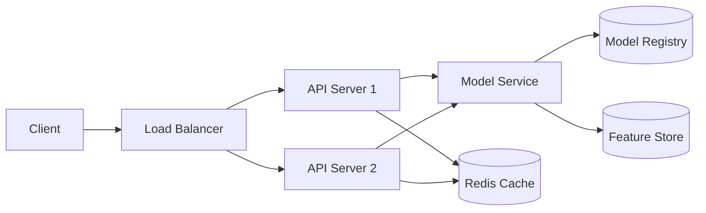

# Topic 18: Model Deployment & Serving

> **Track**: AI/ML Engineer — Practice-First, Code-Heavy
> **Prerequisites**: Topic 7 (PyTorch), Topic 13 (LLM APIs), Topic 17 (ML System Design)
> **You will build**: A FastAPI ML service, Dockerized deployment, vLLM LLM server, and a full RAG app with Docker Compose

---

## Table of Contents

1. [The Deployment Gap — Why Models Fail in Production](#1-the-deployment-gap--why-models-fail-in-production)
2. [FastAPI for ML — The Foundation](#2-fastapi-for-ml--the-foundation)
3. [Serving a Scikit-Learn Model](#3-serving-a-scikit-learn-model)
4. [Serving a PyTorch Model](#4-serving-a-pytorch-model)
5. [Async Endpoints & Streaming for LLMs](#5-async-endpoints--streaming-for-llms)
6. [Request Validation, Error Handling, Middleware](#6-request-validation-error-handling-middleware)
7. [Model Versioning & Hot Reloading](#7-model-versioning--hot-reloading)
8. [Docker for ML — Containerization](#8-docker-for-ml--containerization)
9. [Docker Compose — Multi-Service ML Apps](#9-docker-compose--multi-service-ml-apps)
10. [Model Serialization — Pickle, ONNX, TorchScript](#10-model-serialization--pickle-onnx-torchscript)
11. [ONNX Runtime — Fast Cross-Platform Inference](#11-onnx-runtime--fast-cross-platform-inference)
12. [vLLM — Production LLM Serving](#12-vllm--production-llm-serving)
13. [Triton Inference Server — Multi-Model Serving](#13-triton-inference-server--multi-model-serving)
14. [BentoML — Model Packaging Framework](#14-bentoml--model-packaging-framework)
15. [Cloud Deployment — AWS](#15-cloud-deployment--aws)
16. [Cloud Deployment — GCP](#16-cloud-deployment--gcp)
17. [Serverless ML — Lambda, Modal, Replicate](#17-serverless-ml--lambda-modal-replicate)
18. [Load Testing & Performance Benchmarking](#18-load-testing--performance-benchmarking)
19. [Practice Exercises](#19-practice-exercises)
20. [Mini-Project: RAG App — FastAPI + Streamlit + Docker Compose](#20-mini-project-rag-app--fastapi--streamlit--docker-compose)
21. [Interview Questions & Answers](#21-interview-questions--answers)

---

## 1. The Deployment Gap — Why Models Fail in Production

```
┌──────────────────────────────────────────────────────────────┐
│        Notebook → Production: What Changes                    │
├──────────────────────────────────────────────────────────────┤
│                                                              │
│  NOTEBOOK                      PRODUCTION                    │
│  ─────────                     ──────────                    │
│  Single user                   1000s concurrent users        │
│  model.predict(X)              HTTP API with auth            │
│  Runs once                     Runs 24/7, must not crash     │
│  Any latency                   p99 < 100ms                   │
│  Local files                   S3, model registry            │
│  No error handling             Graceful degradation          │
│  pip install                   Docker, Kubernetes            │
│  "Works on my machine"         Works on ANY machine          │
│  No monitoring                 Metrics, alerts, dashboards   │
│  No versioning                 Model A/B testing             │
│                                                              │
│  The model is 5% of the work.                                │
│  The other 95% is what this topic covers.                    │
│                                                              │
└──────────────────────────────────────────────────────────────┘
```

### Deployment Architecture Overview



---

## 2. FastAPI for ML — The Foundation

FastAPI is the standard framework for serving ML models. Why:
- **Async**: handles concurrent requests without blocking
- **Pydantic**: automatic request/response validation
- **OpenAPI docs**: auto-generated `/docs` page
- **Performance**: one of the fastest Python web frameworks

```python
"""
FastAPI basics for ML engineers — the building blocks.
"""

from fastapi import FastAPI, HTTPException, Query
from pydantic import BaseModel, Field
import uvicorn

app = FastAPI(
    title="ML Model API",
    description="Production ML model serving",
    version="1.0.0",
)


# ── Pydantic schemas (your API contract) ──────────────────────

class PredictionRequest(BaseModel):
    """Input schema — validated automatically."""
    features: list[float] = Field(
        ...,
        min_length=1,
        max_length=100,
        description="Feature vector for prediction",
    )
    model_version: str = Field(
        default="latest",
        description="Which model version to use",
    )

    model_config = {
        "json_schema_extra": {
            "examples": [
                {
                    "features": [1.0, 2.5, 3.7, 0.8],
                    "model_version": "v2.1",
                }
            ]
        }
    }


class PredictionResponse(BaseModel):
    """Output schema."""
    prediction: float
    confidence: float = Field(ge=0.0, le=1.0)
    model_version: str
    latency_ms: float


class HealthResponse(BaseModel):
    status: str
    model_loaded: bool
    uptime_seconds: float


# ── Endpoints ─────────────────────────────────────────────────

import time

START_TIME = time.time()


@app.get("/health", response_model=HealthResponse)
async def health():
    """Health check — load balancers poll this."""
    return HealthResponse(
        status="healthy",
        model_loaded=True,
        uptime_seconds=time.time() - START_TIME,
    )


@app.post("/predict", response_model=PredictionResponse)
async def predict(request: PredictionRequest):
    """Run model inference."""
    start = time.time()

    # Mock prediction (replace with real model)
    score = sum(request.features) / len(request.features)

    return PredictionResponse(
        prediction=score,
        confidence=0.92,
        model_version=request.model_version,
        latency_ms=(time.time() - start) * 1000,
    )


@app.get("/models")
async def list_models():
    """List available model versions."""
    return {"models": ["v1.0", "v2.0", "v2.1"], "default": "v2.1"}


# Run: uvicorn main:app --host 0.0.0.0 --port 8000 --workers 4
```

---

## 3. Serving a Scikit-Learn Model

The most common pattern — train offline, serve online.

```python
"""
Complete sklearn model serving: train → save → load → serve.
"""

import pickle
import time
from pathlib import Path
from contextlib import asynccontextmanager

import numpy as np
from fastapi import FastAPI, HTTPException
from pydantic import BaseModel, Field
from sklearn.datasets import load_iris
from sklearn.ensemble import GradientBoostingClassifier
from sklearn.model_selection import train_test_split
from sklearn.metrics import accuracy_score
from sklearn.pipeline import Pipeline
from sklearn.preprocessing import StandardScaler


# ── Step 1: Train and save (run once offline) ────────────────

def train_and_save(model_path: str = "models/iris_model.pkl"):
    """Train a model and save it with its metadata."""
    X, y = load_iris(return_X_y=True)
    X_train, X_test, y_train, y_test = train_test_split(
        X, y, test_size=0.2, random_state=42
    )

    # Pipeline: preprocessing + model (ensures no skew)
    pipeline = Pipeline([
        ("scaler", StandardScaler()),
        ("model", GradientBoostingClassifier(n_estimators=100, random_state=42)),
    ])
    pipeline.fit(X_train, y_train)

    accuracy = accuracy_score(y_test, pipeline.predict(X_test))
    print(f"Test accuracy: {accuracy:.4f}")

    # Save model + metadata
    artifact = {
        "pipeline": pipeline,
        "feature_names": load_iris().feature_names.tolist(),
        "target_names": load_iris().target_names.tolist(),
        "version": "v1.0.0",
        "accuracy": accuracy,
        "trained_at": time.strftime("%Y-%m-%d %H:%M:%S"),
    }

    Path(model_path).parent.mkdir(parents=True, exist_ok=True)
    with open(model_path, "wb") as f:
        pickle.dump(artifact, f)
    print(f"Model saved to {model_path}")


# ── Step 2: Serve with FastAPI ────────────────────────────────

# Global model holder
model_artifact = {}


@asynccontextmanager
async def lifespan(app: FastAPI):
    """Load model at startup, clean up at shutdown."""
    global model_artifact
    model_path = "models/iris_model.pkl"
    with open(model_path, "rb") as f:
        model_artifact = pickle.load(f)
    print(f"Loaded model {model_artifact['version']} "
          f"(accuracy: {model_artifact['accuracy']:.4f})")
    yield
    print("Shutting down, releasing model resources")


app = FastAPI(title="Iris Classifier API", lifespan=lifespan)


class IrisPredictRequest(BaseModel):
    sepal_length: float = Field(..., ge=0, le=10, description="Sepal length in cm")
    sepal_width: float = Field(..., ge=0, le=10, description="Sepal width in cm")
    petal_length: float = Field(..., ge=0, le=10, description="Petal length in cm")
    petal_width: float = Field(..., ge=0, le=10, description="Petal width in cm")


class IrisPredictResponse(BaseModel):
    predicted_class: str
    class_probabilities: dict[str, float]
    model_version: str
    latency_ms: float


class BatchPredictRequest(BaseModel):
    samples: list[IrisPredictRequest] = Field(..., min_length=1, max_length=1000)


class BatchPredictResponse(BaseModel):
    predictions: list[IrisPredictResponse]
    total_samples: int
    total_latency_ms: float


@app.post("/predict", response_model=IrisPredictResponse)
async def predict(request: IrisPredictRequest):
    start = time.time()

    features = np.array([[
        request.sepal_length, request.sepal_width,
        request.petal_length, request.petal_width,
    ]])

    pipeline = model_artifact["pipeline"]
    target_names = model_artifact["target_names"]

    pred_class = pipeline.predict(features)[0]
    pred_proba = pipeline.predict_proba(features)[0]

    return IrisPredictResponse(
        predicted_class=target_names[pred_class],
        class_probabilities={
            name: round(float(prob), 4)
            for name, prob in zip(target_names, pred_proba)
        },
        model_version=model_artifact["version"],
        latency_ms=round((time.time() - start) * 1000, 2),
    )


@app.post("/predict/batch", response_model=BatchPredictResponse)
async def predict_batch(request: BatchPredictRequest):
    """Batch prediction — process multiple samples in one call."""
    start = time.time()

    features = np.array([
        [s.sepal_length, s.sepal_width, s.petal_length, s.petal_width]
        for s in request.samples
    ])

    pipeline = model_artifact["pipeline"]
    target_names = model_artifact["target_names"]

    pred_classes = pipeline.predict(features)
    pred_probas = pipeline.predict_proba(features)

    predictions = []
    for i in range(len(features)):
        predictions.append(IrisPredictResponse(
            predicted_class=target_names[pred_classes[i]],
            class_probabilities={
                name: round(float(prob), 4)
                for name, prob in zip(target_names, pred_probas[i])
            },
            model_version=model_artifact["version"],
            latency_ms=0,  # individual latency not meaningful in batch
        ))

    return BatchPredictResponse(
        predictions=predictions,
        total_samples=len(predictions),
        total_latency_ms=round((time.time() - start) * 1000, 2),
    )


@app.get("/model/info")
async def model_info():
    return {
        "version": model_artifact["version"],
        "accuracy": model_artifact["accuracy"],
        "trained_at": model_artifact["trained_at"],
        "features": model_artifact["feature_names"],
        "classes": model_artifact["target_names"],
    }
```

---

## 4. Serving a PyTorch Model

```python
"""
Serve a PyTorch model via FastAPI.
Key differences from sklearn: GPU management, torch.no_grad(), model.eval().
"""

import time
import torch
import torch.nn as nn
from contextlib import asynccontextmanager
from fastapi import FastAPI
from pydantic import BaseModel, Field
import numpy as np


# ── Define model architecture ─────────────────────────────────

class TextClassifier(nn.Module):
    """Simple text classifier (for illustration)."""

    def __init__(self, vocab_size: int, embed_dim: int, num_classes: int):
        super().__init__()
        self.embedding = nn.EmbeddingBag(vocab_size, embed_dim, sparse=False)
        self.fc1 = nn.Linear(embed_dim, 128)
        self.fc2 = nn.Linear(128, num_classes)
        self.relu = nn.ReLU()
        self.dropout = nn.Dropout(0.3)

    def forward(self, token_ids: torch.Tensor, offsets: torch.Tensor) -> torch.Tensor:
        embedded = self.embedding(token_ids, offsets)
        x = self.dropout(self.relu(self.fc1(embedded)))
        return self.fc2(x)


# ── Model manager ────────────────────────────────────────────

class PyTorchModelManager:
    """
    Manages PyTorch model lifecycle:
    - Load/unload models
    - Handle GPU/CPU device placement
    - Ensure eval mode and no_grad for inference
    """

    def __init__(self):
        self.model: nn.Module | None = None
        self.device: torch.device = torch.device("cpu")
        self.model_version: str = ""
        self.label_map: dict[int, str] = {}

    def load(self, checkpoint_path: str, device: str = "auto"):
        """Load model from checkpoint."""
        # Determine device
        if device == "auto":
            self.device = torch.device("cuda" if torch.cuda.is_available() else "cpu")
        else:
            self.device = torch.device(device)

        # Load checkpoint
        checkpoint = torch.load(checkpoint_path, map_location=self.device, weights_only=False)

        # Reconstruct model
        self.model = TextClassifier(
            vocab_size=checkpoint["config"]["vocab_size"],
            embed_dim=checkpoint["config"]["embed_dim"],
            num_classes=checkpoint["config"]["num_classes"],
        )
        self.model.load_state_dict(checkpoint["model_state_dict"])
        self.model.to(self.device)
        self.model.eval()  # CRITICAL: set to eval mode (disables dropout, batchnorm)

        self.model_version = checkpoint.get("version", "unknown")
        self.label_map = checkpoint.get("label_map", {})

        print(f"Model loaded on {self.device} (version: {self.model_version})")

    @torch.no_grad()  # CRITICAL: disables gradient computation for inference
    def predict(self, token_ids: list[int]) -> dict:
        """Run inference on a single input."""
        if self.model is None:
            raise RuntimeError("Model not loaded")

        # Prepare tensors
        ids_tensor = torch.tensor(token_ids, dtype=torch.long, device=self.device)
        offsets = torch.tensor([0], dtype=torch.long, device=self.device)

        # Forward pass
        logits = self.model(ids_tensor, offsets)
        probs = torch.softmax(logits, dim=1)[0]

        # Get prediction
        pred_idx = probs.argmax().item()
        confidence = probs[pred_idx].item()

        return {
            "label": self.label_map.get(pred_idx, str(pred_idx)),
            "confidence": confidence,
            "all_probabilities": {
                self.label_map.get(i, str(i)): round(p.item(), 4)
                for i, p in enumerate(probs)
            },
        }

    @torch.no_grad()
    def predict_batch(self, batch_token_ids: list[list[int]]) -> list[dict]:
        """Batch inference — much faster than looping predict()."""
        if self.model is None:
            raise RuntimeError("Model not loaded")

        # Build packed tensor with offsets
        all_ids = []
        offsets = [0]
        for ids in batch_token_ids:
            all_ids.extend(ids)
            offsets.append(offsets[-1] + len(ids))
        offsets = offsets[:-1]  # remove last

        ids_tensor = torch.tensor(all_ids, dtype=torch.long, device=self.device)
        offsets_tensor = torch.tensor(offsets, dtype=torch.long, device=self.device)

        logits = self.model(ids_tensor, offsets_tensor)
        probs = torch.softmax(logits, dim=1)

        results = []
        for i in range(len(batch_token_ids)):
            pred_idx = probs[i].argmax().item()
            results.append({
                "label": self.label_map.get(pred_idx, str(pred_idx)),
                "confidence": round(probs[i][pred_idx].item(), 4),
            })
        return results


# ── FastAPI app ───────────────────────────────────────────────

manager = PyTorchModelManager()


@asynccontextmanager
async def lifespan(app: FastAPI):
    # In production: manager.load("models/text_classifier_v2.pt")
    print("Model manager initialized (load checkpoint in production)")
    yield
    print("Shutting down")


app = FastAPI(title="PyTorch Model API", lifespan=lifespan)


class TextPredictRequest(BaseModel):
    token_ids: list[int] = Field(..., min_length=1, max_length=512)


class TextPredictResponse(BaseModel):
    label: str
    confidence: float
    model_version: str
    latency_ms: float


@app.post("/predict", response_model=TextPredictResponse)
async def predict(request: TextPredictRequest):
    start = time.time()
    result = manager.predict(request.token_ids)
    return TextPredictResponse(
        label=result["label"],
        confidence=result["confidence"],
        model_version=manager.model_version,
        latency_ms=round((time.time() - start) * 1000, 2),
    )
```

---

## 5. Async Endpoints & Streaming for LLMs

LLM responses take seconds. Streaming via Server-Sent Events (SSE) is essential for good UX.

```python
"""
Streaming LLM responses with FastAPI using Server-Sent Events.
"""

import asyncio
import time
from fastapi import FastAPI
from fastapi.responses import StreamingResponse
from pydantic import BaseModel, Field
from openai import AsyncOpenAI

app = FastAPI(title="LLM Streaming API")
client = AsyncOpenAI()


class ChatRequest(BaseModel):
    message: str = Field(..., max_length=4000)
    system_prompt: str = Field(default="You are a helpful assistant.")
    model: str = Field(default="gpt-4o-mini")
    temperature: float = Field(default=0.7, ge=0, le=2)
    stream: bool = Field(default=True)


class ChatResponse(BaseModel):
    content: str
    model: str
    tokens_used: int
    latency_ms: float


# ── Non-streaming endpoint ────────────────────────────────────

@app.post("/chat", response_model=ChatResponse)
async def chat(request: ChatRequest):
    """Standard (non-streaming) chat endpoint."""
    start = time.time()

    response = await client.chat.completions.create(
        model=request.model,
        messages=[
            {"role": "system", "content": request.system_prompt},
            {"role": "user", "content": request.message},
        ],
        temperature=request.temperature,
    )

    return ChatResponse(
        content=response.choices[0].message.content,
        model=response.model,
        tokens_used=response.usage.total_tokens,
        latency_ms=round((time.time() - start) * 1000, 2),
    )


# ── Streaming endpoint (SSE) ─────────────────────────────────

@app.post("/chat/stream")
async def chat_stream(request: ChatRequest):
    """
    Stream LLM response as Server-Sent Events.

    Client receives tokens as they're generated:
    data: {"token": "Hello"}
    data: {"token": " world"}
    data: [DONE]
    """

    async def generate():
        stream = await client.chat.completions.create(
            model=request.model,
            messages=[
                {"role": "system", "content": request.system_prompt},
                {"role": "user", "content": request.message},
            ],
            temperature=request.temperature,
            stream=True,
        )

        async for chunk in stream:
            delta = chunk.choices[0].delta
            if delta.content:
                # SSE format: data: <json>\n\n
                yield f"data: {{'token': '{delta.content}'}}\n\n"

        yield "data: [DONE]\n\n"

    return StreamingResponse(
        generate(),
        media_type="text/event-stream",
        headers={
            "Cache-Control": "no-cache",
            "Connection": "keep-alive",
        },
    )


# ── WebSocket endpoint (bidirectional) ────────────────────────

from fastapi import WebSocket, WebSocketDisconnect

@app.websocket("/ws/chat")
async def websocket_chat(websocket: WebSocket):
    """
    WebSocket for real-time bidirectional chat.
    Better for multi-turn conversations than SSE.
    """
    await websocket.accept()
    conversation = [{"role": "system", "content": "You are a helpful assistant."}]

    try:
        while True:
            # Receive user message
            user_msg = await websocket.receive_text()
            conversation.append({"role": "user", "content": user_msg})

            # Stream response
            stream = await client.chat.completions.create(
                model="gpt-4o-mini",
                messages=conversation,
                stream=True,
            )

            full_response = ""
            async for chunk in stream:
                delta = chunk.choices[0].delta
                if delta.content:
                    full_response += delta.content
                    await websocket.send_text(delta.content)

            # Signal end of response
            await websocket.send_text("[DONE]")

            # Add assistant response to conversation
            conversation.append({"role": "assistant", "content": full_response})

    except WebSocketDisconnect:
        print("Client disconnected")
```

---

## 6. Request Validation, Error Handling, Middleware

```python
"""
Production patterns: validation, error handling, logging, rate limiting.
"""

import time
import logging
import uuid
from collections import defaultdict
from fastapi import FastAPI, Request, HTTPException
from fastapi.middleware.cors import CORSMiddleware
from fastapi.responses import JSONResponse
from pydantic import BaseModel

# ── Logging setup ─────────────────────────────────────────────

logging.basicConfig(
    level=logging.INFO,
    format="%(asctime)s | %(levelname)s | %(message)s",
)
logger = logging.getLogger("ml_api")

app = FastAPI(title="Production ML API")

# ── CORS (allow frontend to call API) ────────────────────────

app.add_middleware(
    CORSMiddleware,
    allow_origins=["http://localhost:3000", "https://myapp.com"],
    allow_methods=["GET", "POST"],
    allow_headers=["*"],
)


# ── Request ID + Logging middleware ───────────────────────────

@app.middleware("http")
async def logging_middleware(request: Request, call_next):
    """Log every request with timing and unique ID."""
    request_id = str(uuid.uuid4())[:8]
    start = time.time()

    # Attach request_id to state for downstream use
    request.state.request_id = request_id

    logger.info(f"[{request_id}] {request.method} {request.url.path}")

    try:
        response = await call_next(request)
        duration_ms = (time.time() - start) * 1000
        logger.info(
            f"[{request_id}] {response.status_code} ({duration_ms:.0f}ms)"
        )
        response.headers["X-Request-ID"] = request_id
        response.headers["X-Response-Time-Ms"] = f"{duration_ms:.0f}"
        return response
    except Exception as e:
        duration_ms = (time.time() - start) * 1000
        logger.error(f"[{request_id}] ERROR: {e} ({duration_ms:.0f}ms)")
        raise


# ── Rate limiting (simple in-memory) ─────────────────────────

class RateLimiter:
    """Simple in-memory rate limiter. Use Redis in production."""

    def __init__(self, max_requests: int = 100, window_seconds: int = 60):
        self.max_requests = max_requests
        self.window = window_seconds
        self.requests: dict[str, list[float]] = defaultdict(list)

    def is_allowed(self, client_id: str) -> bool:
        now = time.time()
        # Clean old requests
        self.requests[client_id] = [
            t for t in self.requests[client_id]
            if now - t < self.window
        ]
        if len(self.requests[client_id]) >= self.max_requests:
            return False
        self.requests[client_id].append(now)
        return True


rate_limiter = RateLimiter(max_requests=60, window_seconds=60)


@app.middleware("http")
async def rate_limit_middleware(request: Request, call_next):
    client_ip = request.client.host
    if not rate_limiter.is_allowed(client_ip):
        return JSONResponse(
            status_code=429,
            content={"error": "Rate limit exceeded. Try again later."},
        )
    return await call_next(request)


# ── Global exception handler ─────────────────────────────────

@app.exception_handler(Exception)
async def global_exception_handler(request: Request, exc: Exception):
    """Catch-all: never expose internal errors to clients."""
    request_id = getattr(request.state, "request_id", "unknown")
    logger.error(f"[{request_id}] Unhandled error: {exc}", exc_info=True)
    return JSONResponse(
        status_code=500,
        content={
            "error": "Internal server error",
            "request_id": request_id,
        },
    )


@app.exception_handler(HTTPException)
async def http_exception_handler(request: Request, exc: HTTPException):
    return JSONResponse(
        status_code=exc.status_code,
        content={"error": exc.detail},
    )


# ── Model-specific error handling ─────────────────────────────

class ModelNotLoadedError(Exception):
    pass


class InvalidInputError(Exception):
    pass


@app.exception_handler(ModelNotLoadedError)
async def model_error_handler(request: Request, exc: ModelNotLoadedError):
    return JSONResponse(
        status_code=503,
        content={"error": "Model is not loaded. Service unavailable."},
    )


@app.exception_handler(InvalidInputError)
async def input_error_handler(request: Request, exc: InvalidInputError):
    return JSONResponse(
        status_code=422,
        content={"error": f"Invalid input: {exc}"},
    )
```

---

## 7. Model Versioning & Hot Reloading

```python
"""
Model versioning: serve multiple model versions, switch without downtime.
"""

import os
import pickle
import time
import threading
from pathlib import Path
from dataclasses import dataclass
from fastapi import FastAPI, Query

app = FastAPI(title="Multi-Version Model API")


@dataclass
class ModelInfo:
    version: str
    model: object
    loaded_at: float
    accuracy: float


class ModelRegistry:
    """
    In-memory model registry that supports:
    - Multiple model versions loaded simultaneously
    - Default version routing
    - Hot reload (load new version without restart)
    - Background model watching (auto-detect new versions)
    """

    def __init__(self, models_dir: str = "models"):
        self.models_dir = Path(models_dir)
        self.models: dict[str, ModelInfo] = {}
        self.default_version: str = ""
        self._lock = threading.Lock()

    def load_version(self, version: str) -> bool:
        """Load a specific model version."""
        model_path = self.models_dir / f"model_{version}.pkl"
        if not model_path.exists():
            return False

        with open(model_path, "rb") as f:
            artifact = pickle.load(f)

        with self._lock:
            self.models[version] = ModelInfo(
                version=version,
                model=artifact["pipeline"],
                loaded_at=time.time(),
                accuracy=artifact.get("accuracy", 0.0),
            )
            if not self.default_version:
                self.default_version = version

        return True

    def set_default(self, version: str):
        """Change the default model version (instant, no reload)."""
        if version not in self.models:
            raise ValueError(f"Version {version} not loaded")
        with self._lock:
            self.default_version = version

    def predict(self, features, version: str = "") -> dict:
        """Predict using a specific version (or default)."""
        v = version or self.default_version
        with self._lock:
            if v not in self.models:
                raise ValueError(f"Model version {v} not found")
            model_info = self.models[v]

        prediction = model_info.model.predict([features])[0]
        proba = model_info.model.predict_proba([features])[0]

        return {
            "prediction": int(prediction),
            "confidence": float(max(proba)),
            "version": v,
        }

    def list_versions(self) -> list[dict]:
        return [
            {
                "version": v,
                "accuracy": info.accuracy,
                "loaded_at": info.loaded_at,
                "is_default": v == self.default_version,
            }
            for v, info in self.models.items()
        ]

    def start_watcher(self, poll_interval: int = 30):
        """Background thread that auto-loads new model files."""
        def watch():
            known = set(self.models.keys())
            while True:
                time.sleep(poll_interval)
                for f in self.models_dir.glob("model_*.pkl"):
                    version = f.stem.replace("model_", "")
                    if version not in known:
                        print(f"New model detected: {version}")
                        self.load_version(version)
                        known.add(version)

        thread = threading.Thread(target=watch, daemon=True)
        thread.start()


registry = ModelRegistry()


@app.post("/predict")
async def predict(
    features: list[float],
    version: str = Query(default="", description="Model version (empty = default)"),
):
    result = registry.predict(features, version)
    return result


@app.get("/models")
async def list_models():
    return {"models": registry.list_versions()}


@app.post("/models/{version}/set-default")
async def set_default(version: str):
    registry.set_default(version)
    return {"message": f"Default model set to {version}"}
```

---

## 8. Docker for ML — Containerization

### Standard ML Dockerfile

```dockerfile
# ── Dockerfile for a Python ML API ───────────────────────────

# Use slim Python image (smaller than full)
FROM python:3.11-slim AS base

# Prevent Python from writing .pyc files and enable unbuffered output
ENV PYTHONDONTWRITEBYTECODE=1
ENV PYTHONUNBUFFERED=1

# Set working directory
WORKDIR /app

# Install system dependencies (for numpy, scipy, etc.)
RUN apt-get update && apt-get install -y --no-install-recommends \
    build-essential \
    && rm -rf /var/lib/apt/lists/*

# Install Python dependencies (cached layer if requirements don't change)
COPY requirements.txt .
RUN pip install --no-cache-dir -r requirements.txt

# Copy application code
COPY . .

# Create non-root user (security best practice)
RUN useradd --create-home appuser
USER appuser

# Expose port
EXPOSE 8000

# Health check
HEALTHCHECK --interval=30s --timeout=10s --retries=3 \
    CMD python -c "import urllib.request; urllib.request.urlopen('http://localhost:8000/health')"

# Run the application
CMD ["uvicorn", "main:app", "--host", "0.0.0.0", "--port", "8000", "--workers", "4"]
```

### GPU Dockerfile

```dockerfile
# ── Dockerfile for GPU-based ML serving ──────────────────────

FROM nvidia/cuda:12.1.1-runtime-ubuntu22.04

ENV PYTHONDONTWRITEBYTECODE=1
ENV PYTHONUNBUFFERED=1
ENV DEBIAN_FRONTEND=noninteractive

# Install Python
RUN apt-get update && apt-get install -y --no-install-recommends \
    python3.11 python3.11-venv python3-pip \
    && rm -rf /var/lib/apt/lists/*

WORKDIR /app

COPY requirements.txt .
RUN pip install --no-cache-dir -r requirements.txt

COPY . .

EXPOSE 8000

CMD ["uvicorn", "main:app", "--host", "0.0.0.0", "--port", "8000", "--workers", "1"]
```

### Multi-Stage Build (Smaller Image)

```dockerfile
# ── Multi-stage: build dependencies in one image, run in another ──

# Stage 1: Build
FROM python:3.11-slim AS builder
WORKDIR /app
COPY requirements.txt .
RUN pip install --no-cache-dir --prefix=/install -r requirements.txt

# Stage 2: Runtime (smaller)
FROM python:3.11-slim AS runtime
WORKDIR /app

# Copy only installed packages from builder
COPY --from=builder /install /usr/local

COPY . .

RUN useradd --create-home appuser
USER appuser

EXPOSE 8000
CMD ["uvicorn", "main:app", "--host", "0.0.0.0", "--port", "8000", "--workers", "4"]
```

### Docker Commands Cheat Sheet

```bash
# Build the image
docker build -t ml-api:v1 .

# Run the container
docker run -d -p 8000:8000 --name ml-api ml-api:v1

# Run with GPU (requires nvidia-docker)
docker run -d --gpus all -p 8000:8000 ml-api:v1

# Run with environment variables
docker run -d -p 8000:8000 \
    -e OPENAI_API_KEY=sk-xxx \
    -e MODEL_PATH=/models/latest \
    -v $(pwd)/models:/models \
    ml-api:v1

# View logs
docker logs -f ml-api

# Stop and remove
docker stop ml-api && docker rm ml-api

# Check image size
docker images ml-api

# Push to registry
docker tag ml-api:v1 myregistry.com/ml-api:v1
docker push myregistry.com/ml-api:v1
```

---

## 9. Docker Compose — Multi-Service ML Apps

```yaml
# docker-compose.yml — Complete ML application stack

version: "3.8"

services:
  # ── ML API ────────────────────────────────────
  api:
    build:
      context: .
      dockerfile: Dockerfile
    ports:
      - "8000:8000"
    environment:
      - REDIS_URL=redis://redis:6379
      - MODEL_PATH=/models/latest.pkl
      - OPENAI_API_KEY=${OPENAI_API_KEY}
    volumes:
      - ./models:/models
    depends_on:
      redis:
        condition: service_healthy
    healthcheck:
      test: ["CMD", "python", "-c", "import urllib.request; urllib.request.urlopen('http://localhost:8000/health')"]
      interval: 30s
      timeout: 10s
      retries: 3
    deploy:
      replicas: 2
      resources:
        limits:
          memory: 2G

  # ── Redis (caching + feature store) ───────────
  redis:
    image: redis:7-alpine
    ports:
      - "6379:6379"
    volumes:
      - redis_data:/data
    healthcheck:
      test: ["CMD", "redis-cli", "ping"]
      interval: 10s
      timeout: 5s
      retries: 3

  # ── Vector DB (for RAG) ───────────────────────
  qdrant:
    image: qdrant/qdrant:latest
    ports:
      - "6333:6333"
    volumes:
      - qdrant_data:/qdrant/storage

  # ── Frontend ──────────────────────────────────
  frontend:
    build:
      context: ./frontend
      dockerfile: Dockerfile
    ports:
      - "8501:8501"
    environment:
      - API_URL=http://api:8000
    depends_on:
      - api

  # ── Prometheus (monitoring) ───────────────────
  prometheus:
    image: prom/prometheus:latest
    ports:
      - "9090:9090"
    volumes:
      - ./prometheus.yml:/etc/prometheus/prometheus.yml

  # ── Grafana (dashboards) ──────────────────────
  grafana:
    image: grafana/grafana:latest
    ports:
      - "3000:3000"
    depends_on:
      - prometheus

volumes:
  redis_data:
  qdrant_data:
```

```bash
# Start everything
docker compose up -d

# View logs for a specific service
docker compose logs -f api

# Scale the API to 4 replicas
docker compose up -d --scale api=4

# Stop everything
docker compose down

# Stop and remove volumes (clean slate)
docker compose down -v
```

---

## 10. Model Serialization — Pickle, ONNX, TorchScript

```
┌──────────────────────────────────────────────────────────────┐
│            Model Serialization Formats                        │
├──────────────┬───────────┬──────────┬────────────────────────┤
│ Format       │ Speed     │ Portable │ Use Case               │
├──────────────┼───────────┼──────────┼────────────────────────┤
│ Pickle       │ Baseline  │ Python   │ sklearn, quick save    │
│ Joblib       │ Faster*   │ Python   │ sklearn (large arrays) │
│ ONNX         │ 2-5x      │ Yes      │ Cross-platform deploy  │
│ TorchScript  │ 1.5-2x    │ C++/Py   │ PyTorch production     │
│ TensorRT     │ 5-10x     │ NVIDIA   │ GPU-optimized serving  │
│ GGUF         │ Variable  │ Yes      │ LLM CPU inference      │
│ SafeTensors  │ Fast      │ Yes      │ HuggingFace models     │
└──────────────┴───────────┴──────────┴────────────────────────┘
  * Joblib is faster for models with large numpy arrays
```

```python
"""
Model serialization: save and load models in different formats.
"""

import numpy as np
from sklearn.ensemble import RandomForestClassifier
from sklearn.datasets import make_classification

# Create a sample model
X, y = make_classification(n_samples=1000, n_features=10, random_state=42)
model = RandomForestClassifier(n_estimators=100, random_state=42)
model.fit(X, y)


# ── 1. Pickle ─────────────────────────────────────────────────
import pickle

with open("model.pkl", "wb") as f:
    pickle.dump(model, f)

with open("model.pkl", "rb") as f:
    model_loaded = pickle.load(f)

# ⚠️ Security risk: pickle can execute arbitrary code on load.
# Never load pickles from untrusted sources.


# ── 2. Joblib (better for sklearn) ────────────────────────────
import joblib

joblib.dump(model, "model.joblib")
model_loaded = joblib.load("model.joblib")


# ── 3. ONNX (cross-platform) ─────────────────────────────────
from skl2onnx import convert_sklearn
from skl2onnx.common.data_types import FloatTensorType

initial_type = [("float_input", FloatTensorType([None, 10]))]
onnx_model = convert_sklearn(model, initial_types=initial_type)

with open("model.onnx", "wb") as f:
    f.write(onnx_model.SerializeToString())


# ── 4. TorchScript (PyTorch) ─────────────────────────────────
import torch
import torch.nn as nn

class SimpleModel(nn.Module):
    def __init__(self):
        super().__init__()
        self.fc1 = nn.Linear(10, 64)
        self.fc2 = nn.Linear(64, 2)
        self.relu = nn.ReLU()

    def forward(self, x):
        return self.fc2(self.relu(self.fc1(x)))

torch_model = SimpleModel()
torch_model.eval()

# Method 1: Tracing (captures a single execution path)
example_input = torch.randn(1, 10)
traced = torch.jit.trace(torch_model, example_input)
traced.save("model_traced.pt")

# Method 2: Scripting (handles control flow — if/for/while)
scripted = torch.jit.script(torch_model)
scripted.save("model_scripted.pt")

# Load (no Python dependency needed for C++ runtime!)
loaded = torch.jit.load("model_traced.pt")
output = loaded(torch.randn(1, 10))


# ── 5. PyTorch → ONNX ────────────────────────────────────────
torch.onnx.export(
    torch_model,
    example_input,
    "torch_model.onnx",
    input_names=["input"],
    output_names=["output"],
    dynamic_axes={"input": {0: "batch_size"}, "output": {0: "batch_size"}},
    opset_version=17,
)
```

---

## 11. ONNX Runtime — Fast Cross-Platform Inference

$$
\text{Speedup} = \frac{t_{\text{PyTorch}}}{t_{\text{ONNX Runtime}}} \approx 2\text{-}5\times \text{ on CPU}
$$

```python
"""
ONNX Runtime inference — faster than PyTorch for production serving.
"""

import onnxruntime as ort
import numpy as np
import time


# ── Load and configure ────────────────────────────────────────

# CPU session with optimizations
session_options = ort.SessionOptions()
session_options.graph_optimization_level = ort.GraphOptimizationLevel.ORT_ENABLE_ALL
session_options.intra_op_num_threads = 4  # parallel within ops
session_options.inter_op_num_threads = 2  # parallel between ops

session = ort.InferenceSession(
    "torch_model.onnx",
    sess_options=session_options,
    providers=["CPUExecutionProvider"],  # or "CUDAExecutionProvider" for GPU
)

# Inspect model inputs/outputs
for inp in session.get_inputs():
    print(f"Input: {inp.name}, shape: {inp.shape}, type: {inp.type}")
for out in session.get_outputs():
    print(f"Output: {out.name}, shape: {out.shape}, type: {out.type}")


# ── Run inference ─────────────────────────────────────────────

input_data = np.random.randn(1, 10).astype(np.float32)

result = session.run(
    output_names=["output"],
    input_feed={"input": input_data},
)
print(f"Prediction: {result[0]}")


# ── Benchmark: ONNX vs PyTorch ────────────────────────────────

import torch

torch_model = torch.jit.load("model_traced.pt")
torch_model.eval()

N = 1000
inputs_np = np.random.randn(N, 10).astype(np.float32)
inputs_torch = torch.from_numpy(inputs_np)

# PyTorch benchmark
start = time.time()
with torch.no_grad():
    for i in range(N):
        _ = torch_model(inputs_torch[i:i+1])
pytorch_time = time.time() - start

# ONNX Runtime benchmark
start = time.time()
for i in range(N):
    _ = session.run(None, {"input": inputs_np[i:i+1]})
onnx_time = time.time() - start

print(f"PyTorch:      {pytorch_time:.3f}s ({N/pytorch_time:.0f} inferences/sec)")
print(f"ONNX Runtime: {onnx_time:.3f}s ({N/onnx_time:.0f} inferences/sec)")
print(f"Speedup:      {pytorch_time/onnx_time:.2f}x")
```

---

## 12. vLLM — Production LLM Serving

vLLM is the go-to framework for serving LLMs at scale. Key advantage: **PagedAttention** for efficient KV cache management.

```bash
# Install vLLM
pip install vllm

# Start vLLM server (OpenAI-compatible API)
python -m vllm.entrypoints.openai.api_server \
    --model meta-llama/Llama-3.1-8B-Instruct \
    --dtype auto \
    --max-model-len 4096 \
    --gpu-memory-utilization 0.9 \
    --port 8000
```

```python
"""
Using vLLM's OpenAI-compatible API — drop-in replacement.
"""

from openai import OpenAI

# Point to local vLLM server
client = OpenAI(
    base_url="http://localhost:8000/v1",
    api_key="not-needed",  # vLLM doesn't require a key
)

# ── Standard chat completion ──────────────────────────────────

response = client.chat.completions.create(
    model="meta-llama/Llama-3.1-8B-Instruct",
    messages=[
        {"role": "system", "content": "You are a helpful assistant."},
        {"role": "user", "content": "Explain gradient descent in 3 sentences."},
    ],
    temperature=0.7,
    max_tokens=200,
)
print(response.choices[0].message.content)


# ── Streaming ────────────────────────────────────────────────

stream = client.chat.completions.create(
    model="meta-llama/Llama-3.1-8B-Instruct",
    messages=[{"role": "user", "content": "Write a haiku about machine learning"}],
    stream=True,
)

for chunk in stream:
    if chunk.choices[0].delta.content:
        print(chunk.choices[0].delta.content, end="", flush=True)


# ── Benchmarking vLLM throughput ──────────────────────────────

import time
import asyncio
from openai import AsyncOpenAI

async def benchmark_vllm(n_requests: int = 50):
    """Measure throughput of vLLM server."""
    client = AsyncOpenAI(base_url="http://localhost:8000/v1", api_key="x")

    async def single_request(i: int):
        start = time.time()
        response = await client.chat.completions.create(
            model="meta-llama/Llama-3.1-8B-Instruct",
            messages=[{"role": "user", "content": f"Count from 1 to 10. Request {i}."}],
            max_tokens=50,
        )
        return time.time() - start, response.usage.total_tokens

    start_total = time.time()
    results = await asyncio.gather(*[single_request(i) for i in range(n_requests)])
    total_time = time.time() - start_total

    latencies = [r[0] for r in results]
    total_tokens = sum(r[1] for r in results)

    print(f"Requests:     {n_requests}")
    print(f"Total time:   {total_time:.1f}s")
    print(f"Throughput:   {n_requests / total_time:.1f} req/s")
    print(f"Token/s:      {total_tokens / total_time:.0f}")
    print(f"Avg latency:  {sum(latencies) / len(latencies) * 1000:.0f}ms")
    print(f"p99 latency:  {sorted(latencies)[int(0.99 * len(latencies))] * 1000:.0f}ms")

# asyncio.run(benchmark_vllm())
```

### vLLM Configuration Guide

```
┌──────────────────────────────────────────────────────────────┐
│                    vLLM Tuning Guide                          │
├───────────────────────┬──────────────────────────────────────┤
│ Parameter             │ What it does                         │
├───────────────────────┼──────────────────────────────────────┤
│ --gpu-memory-util 0.9 │ Use 90% GPU memory for KV cache     │
│ --max-model-len 4096  │ Max context length per request       │
│ --dtype float16       │ FP16 for speed (auto detects)        │
│ --quantization awq    │ Load AWQ-quantized model             │
│ --tensor-parallel 2   │ Split model across 2 GPUs            │
│ --max-num-seqs 256    │ Max concurrent sequences             │
│ --enable-prefix-cache │ Cache common prefixes (system prompt)│
│ --enforce-eager       │ Disable CUDA graphs (debug mode)     │
└───────────────────────┴──────────────────────────────────────┘

GPU sizing:
  7B  model (FP16) → 1× A10G (24GB) or 1× L4 (24GB)
  13B model (FP16) → 1× A100 (40GB)
  70B model (FP16) → 2× A100 (80GB) with tensor parallel
  70B model (INT4) → 1× A100 (40GB) with AWQ quantization
```

---

## 13. Triton Inference Server — Multi-Model Serving

```
┌──────────────────────────────────────────────────────────────┐
│              Triton Inference Server                           │
├──────────────────────────────────────────────────────────────┤
│                                                              │
│  When to use Triton vs FastAPI vs vLLM:                      │
│                                                              │
│  FastAPI:  Simple, 1-2 models, Python-native                 │
│  vLLM:    LLMs specifically (optimized KV cache, batching)   │
│  Triton:  Multiple models, multi-framework, high throughput  │
│           Supports: PyTorch, TensorFlow, ONNX, TensorRT     │
│           Features: dynamic batching, model ensemble,        │
│                     GPU scheduling, model versioning          │
│                                                              │
└──────────────────────────────────────────────────────────────┘
```

```
# Triton model repository structure
model_repository/
├── text_classifier/
│   ├── config.pbtxt
│   ├── 1/                  # version 1
│   │   └── model.onnx
│   └── 2/                  # version 2
│       └── model.onnx
├── image_classifier/
│   ├── config.pbtxt
│   └── 1/
│       └── model.pt
```

```protobuf
# config.pbtxt — Triton model configuration
name: "text_classifier"
platform: "onnxruntime_onnx"
max_batch_size: 64

input [
  {
    name: "input"
    data_type: TYPE_FP32
    dims: [10]
  }
]

output [
  {
    name: "output"
    data_type: TYPE_FP32
    dims: [2]
  }
]

# Dynamic batching: accumulate requests to fill a batch
dynamic_batching {
  preferred_batch_size: [16, 32]
  max_queue_delay_microseconds: 100000  # 100ms max wait
}

# Model versioning: serve latest 2 versions
version_policy: { latest { num_versions: 2 } }
```

```bash
# Run Triton with Docker
docker run --gpus all --rm \
    -p 8000:8000 -p 8001:8001 -p 8002:8002 \
    -v $(pwd)/model_repository:/models \
    nvcr.io/nvidia/tritonserver:24.01-py3 \
    tritonserver --model-repository=/models
```

```python
"""
Triton client: send inference requests.
"""

import tritonclient.http as httpclient
import numpy as np

client = httpclient.InferenceServerClient(url="localhost:8000")

# Check server health
print(f"Server live: {client.is_server_live()}")
print(f"Model ready: {client.is_model_ready('text_classifier')}")

# Prepare input
input_data = np.random.randn(1, 10).astype(np.float32)
inputs = [httpclient.InferInput("input", input_data.shape, "FP32")]
inputs[0].set_data_from_numpy(input_data)

# Run inference
result = client.infer("text_classifier", inputs)
output = result.as_numpy("output")
print(f"Prediction: {output}")
```

---

## 14. BentoML — Model Packaging Framework

```python
"""
BentoML: package models as production-ready services.
Handles serialization, API, Docker, and deployment.
"""

# ── Step 1: Save model to BentoML model store ────────────────

import bentoml
from sklearn.ensemble import RandomForestClassifier
from sklearn.datasets import load_iris

X, y = load_iris(return_X_y=True)
model = RandomForestClassifier(n_estimators=100).fit(X, y)

# Save to BentoML's model store
saved_model = bentoml.sklearn.save_model(
    "iris_classifier",
    model,
    signatures={"predict": {"batchable": True, "batch_dim": 0}},
    metadata={"accuracy": 0.97, "dataset": "iris"},
)
print(f"Saved: {saved_model.tag}")  # iris_classifier:xxxxx


# ── Step 2: Define the service (service.py) ───────────────────

SERVICE_CODE = '''
import bentoml
import numpy as np
from pydantic import Field

# Load the model
model_runner = bentoml.sklearn.get("iris_classifier:latest").to_runner()

svc = bentoml.Service("iris_service", runners=[model_runner])


@svc.api(
    input=bentoml.io.NumpyNdarray(dtype="float64", shape=(-1, 4)),
    output=bentoml.io.NumpyNdarray(dtype="int64"),
)
async def predict(input_array: np.ndarray) -> np.ndarray:
    """Classify iris species."""
    return await model_runner.predict.async_run(input_array)
'''


# ── Step 3: Build and containerize ────────────────────────────

# bentofile.yaml
BENTOFILE = """
service: "service:svc"
include:
  - "*.py"
python:
  packages:
    - scikit-learn
    - pandas
docker:
  python_version: "3.11"
"""

# Build commands:
# bentoml build
# bentoml containerize iris_service:latest
# docker run -p 3000:3000 iris_service:latest
```

---

## 15. Cloud Deployment — AWS

```
┌──────────────────────────────────────────────────────────────┐
│                 AWS Deployment Options                         │
├────────────────┬─────────────────────────────────────────────┤
│ Option         │ When to Use                                 │
├────────────────┼─────────────────────────────────────────────┤
│ EC2 + Docker   │ Full control, custom setups, GPU instances  │
│ SageMaker      │ Managed training + deployment, auto-scaling │
│ Lambda         │ Serverless, <15min, <10GB, sporadic traffic │
│ ECS / Fargate  │ Containerized, auto-scaling, no GPU needed  │
│ EKS            │ Kubernetes, complex multi-service, GPU      │
│ Bedrock        │ Managed LLM APIs (Claude, Llama, etc.)      │
└────────────────┴─────────────────────────────────────────────┘
```

### EC2 Deployment Script

```bash
#!/bin/bash
# deploy_ec2.sh — Deploy ML API to an EC2 instance

# ── Variables ─────────────────────────────────────────────────
EC2_HOST="ec2-user@your-instance.amazonaws.com"
KEY_FILE="~/.ssh/my-key.pem"
APP_DIR="/home/ec2-user/ml-api"

# ── Step 1: Copy files to EC2 ────────────────────────────────
rsync -avz -e "ssh -i $KEY_FILE" \
    --exclude '__pycache__' --exclude '.git' --exclude 'venv' \
    . $EC2_HOST:$APP_DIR

# ── Step 2: SSH in and set up ────────────────────────────────
ssh -i $KEY_FILE $EC2_HOST << 'EOF'
    cd /home/ec2-user/ml-api

    # Install Docker if not present
    if ! command -v docker &> /dev/null; then
        sudo yum update -y
        sudo yum install -y docker
        sudo systemctl start docker
        sudo usermod -aG docker ec2-user
    fi

    # Build and run
    docker build -t ml-api:latest .
    docker stop ml-api 2>/dev/null || true
    docker rm ml-api 2>/dev/null || true
    docker run -d \
        --name ml-api \
        -p 80:8000 \
        --restart unless-stopped \
        -e OPENAI_API_KEY=$OPENAI_API_KEY \
        ml-api:latest

    echo "Deployed! Check: curl http://localhost/health"
EOF
```

### SageMaker Deployment

```python
"""
Deploy a model to AWS SageMaker (managed inference).
"""

import sagemaker
from sagemaker.sklearn.model import SKLearnModel

SAGEMAKER_DEPLOY = '''
import boto3
import sagemaker
from sagemaker.sklearn.model import SKLearnModel

role = "arn:aws:iam::123456789:role/SageMakerRole"
session = sagemaker.Session()

# Upload model artifact to S3
model_data = session.upload_data(
    path="model.tar.gz",  # tar.gz containing model.pkl
    bucket="my-ml-models",
    key_prefix="iris-classifier",
)

# Create model
sklearn_model = SKLearnModel(
    model_data=model_data,
    role=role,
    entry_point="inference.py",  # custom inference script
    framework_version="1.2-1",
)

# Deploy to endpoint
predictor = sklearn_model.deploy(
    initial_instance_count=1,
    instance_type="ml.m5.xlarge",
    endpoint_name="iris-classifier-endpoint",
)

# Predict
result = predictor.predict([[5.1, 3.5, 1.4, 0.2]])
print(result)

# Clean up (important — endpoints cost money when idle!)
predictor.delete_endpoint()
'''

# inference.py — Custom inference script for SageMaker
INFERENCE_SCRIPT = '''
import pickle
import numpy as np

def model_fn(model_dir):
    """Load model from the model directory."""
    with open(f"{model_dir}/model.pkl", "rb") as f:
        return pickle.load(f)

def predict_fn(input_data, model):
    """Run prediction."""
    return model.predict(np.array(input_data))
'''
```

---

## 16. Cloud Deployment — GCP

```
┌──────────────────────────────────────────────────────────────┐
│                 GCP Deployment Options                         │
├────────────────┬─────────────────────────────────────────────┤
│ Option         │ When to Use                                 │
├────────────────┼─────────────────────────────────────────────┤
│ Cloud Run      │ Containerized, auto-scaling to 0, no GPU    │
│ Vertex AI      │ Managed training + deployment, full MLOps   │
│ GKE            │ Kubernetes, GPU, complex multi-service      │
│ Compute Engine │ Full control, GPU VMs                       │
│ Cloud Funcs    │ Serverless, lightweight, event-driven       │
└────────────────┴─────────────────────────────────────────────┘
```

### Cloud Run (Simplest Container Deployment)

```bash
#!/bin/bash
# deploy_cloud_run.sh — Deploy to Google Cloud Run

PROJECT_ID="my-project"
SERVICE_NAME="ml-api"
REGION="us-central1"

# Build and push to Artifact Registry
gcloud builds submit --tag gcr.io/$PROJECT_ID/$SERVICE_NAME

# Deploy to Cloud Run
gcloud run deploy $SERVICE_NAME \
    --image gcr.io/$PROJECT_ID/$SERVICE_NAME \
    --platform managed \
    --region $REGION \
    --port 8000 \
    --memory 2Gi \
    --cpu 2 \
    --min-instances 0 \
    --max-instances 10 \
    --concurrency 80 \
    --timeout 60 \
    --set-env-vars "MODEL_PATH=/models/latest" \
    --allow-unauthenticated

# Get the URL
gcloud run services describe $SERVICE_NAME --region $REGION --format 'value(status.url)'
```

---

## 17. Serverless ML — Lambda, Modal, Replicate

### Modal (Modern Serverless GPU)

```python
"""
Modal — serverless GPU compute for ML inference.
Pay per second of GPU time. Scales to 0.
"""

MODAL_CODE = '''
import modal

app = modal.App("ml-inference")

# Define the container image
image = modal.Image.debian_slim(python_version="3.11").pip_install(
    "torch", "transformers", "accelerate"
)

@app.cls(
    image=image,
    gpu="A10G",        # GPU type
    timeout=120,       # max 2 min per request
    container_idle_timeout=300,  # keep warm for 5 min
    allow_concurrent_inputs=10,  # handle 10 concurrent requests
)
class TextGenerator:
    @modal.enter()
    def load_model(self):
        """Load model when container starts (cached across requests)."""
        from transformers import pipeline
        self.pipe = pipeline(
            "text-generation",
            model="meta-llama/Llama-3.2-1B-Instruct",
            device="cuda",
        )

    @modal.method()
    def generate(self, prompt: str, max_tokens: int = 200) -> str:
        result = self.pipe(prompt, max_new_tokens=max_tokens)
        return result[0]["generated_text"]


@app.local_entrypoint()
def main():
    generator = TextGenerator()
    result = generator.generate.remote("Explain machine learning in one sentence:")
    print(result)

# Deploy: modal deploy modal_app.py
# Run:    modal run modal_app.py
'''
```

### Replicate (One-Line Model Hosting)

```python
"""
Replicate — host any model with a simple API.
"""

REPLICATE_CODE = '''
import replicate

# Run a model (Replicate handles GPU, scaling, everything)
output = replicate.run(
    "meta/llama-2-70b-chat",
    input={
        "prompt": "Explain gradient descent simply.",
        "max_new_tokens": 200,
        "temperature": 0.7,
    }
)

# Stream output
for token in output:
    print(token, end="", flush=True)
'''
```

---

## 18. Load Testing & Performance Benchmarking

```python
"""
Load testing ML APIs with Locust.
"""

# locustfile.py
LOCUST_CODE = '''
from locust import HttpUser, task, between
import random


class MLApiUser(HttpUser):
    """Simulate users hitting the ML API."""
    wait_time = between(0.5, 2.0)  # wait 0.5-2s between requests

    @task(3)  # 3x more likely than other tasks
    def predict_single(self):
        """Single prediction request."""
        self.client.post("/predict", json={
            "sepal_length": random.uniform(4, 8),
            "sepal_width": random.uniform(2, 5),
            "petal_length": random.uniform(1, 7),
            "petal_width": random.uniform(0.1, 3),
        })

    @task(1)
    def predict_batch(self):
        """Batch prediction request."""
        samples = [
            {
                "sepal_length": random.uniform(4, 8),
                "sepal_width": random.uniform(2, 5),
                "petal_length": random.uniform(1, 7),
                "petal_width": random.uniform(0.1, 3),
            }
            for _ in range(50)
        ]
        self.client.post("/predict/batch", json={"samples": samples})

    @task(1)
    def health_check(self):
        """Health check."""
        self.client.get("/health")
'''

# Run Locust:
# locust -f locustfile.py --host http://localhost:8000
# Open http://localhost:8089 for the web UI
# Set: 100 users, 10 users/sec spawn rate
```

### Benchmarking Script (Without Locust)

```python
"""
Simple async benchmarking for ML APIs.
"""

import asyncio
import time
import statistics
import httpx


async def benchmark(
    url: str,
    payload: dict,
    n_requests: int = 200,
    concurrency: int = 20,
) -> dict:
    """
    Benchmark an HTTP endpoint.

    Returns latency percentiles, throughput, and error rate.
    """
    semaphore = asyncio.Semaphore(concurrency)
    latencies: list[float] = []
    errors = 0

    async def single_request(client: httpx.AsyncClient):
        nonlocal errors
        async with semaphore:
            start = time.time()
            try:
                response = await client.post(url, json=payload, timeout=30)
                if response.status_code != 200:
                    errors += 1
                latencies.append(time.time() - start)
            except Exception:
                errors += 1

    async with httpx.AsyncClient() as client:
        start_total = time.time()
        tasks = [single_request(client) for _ in range(n_requests)]
        await asyncio.gather(*tasks)
        total_time = time.time() - start_total

    latencies.sort()
    return {
        "total_requests": n_requests,
        "concurrency": concurrency,
        "errors": errors,
        "error_rate": f"{errors/n_requests:.1%}",
        "total_time_s": round(total_time, 2),
        "throughput_rps": round(n_requests / total_time, 1),
        "latency_p50_ms": round(latencies[len(latencies)//2] * 1000, 1) if latencies else 0,
        "latency_p95_ms": round(latencies[int(len(latencies)*0.95)] * 1000, 1) if latencies else 0,
        "latency_p99_ms": round(latencies[int(len(latencies)*0.99)] * 1000, 1) if latencies else 0,
        "latency_mean_ms": round(statistics.mean(latencies) * 1000, 1) if latencies else 0,
    }


async def main():
    result = await benchmark(
        url="http://localhost:8000/predict",
        payload={
            "sepal_length": 5.1,
            "sepal_width": 3.5,
            "petal_length": 1.4,
            "petal_width": 0.2,
        },
        n_requests=500,
        concurrency=50,
    )

    print("Benchmark Results:")
    for k, v in result.items():
        print(f"  {k}: {v}")

# asyncio.run(main())
```

---

## 19. Practice Exercises

- [ ] **Exercise 1**: Build a FastAPI endpoint serving a trained sklearn model (use the Iris dataset). Include `/predict`, `/predict/batch`, `/health`, and `/model/info` endpoints.

- [ ] **Exercise 2**: Write a Dockerfile for your FastAPI ML app. Build it, run it, and verify it works with `curl`.

- [ ] **Exercise 3**: Add request logging middleware that logs request ID, method, path, status code, and latency for every request.

- [ ] **Exercise 4**: Export a PyTorch model to ONNX. Run inference with ONNX Runtime. Benchmark PyTorch vs ONNX Runtime speed (at least 1000 inferences).

- [ ] **Exercise 5**: Create a `docker-compose.yml` with: ML API + Redis + Streamlit frontend. The frontend should call the API and display results.

- [ ] **Exercise 6**: Implement the `ModelRegistry` (Section 7) that serves 2 model versions simultaneously. Add an endpoint to switch the default version.

- [ ] **Exercise 7**: Set up vLLM locally with a small model (e.g., Qwen2.5-0.5B). Build a FastAPI proxy in front of it that adds rate limiting and request logging.

- [ ] **Exercise 8**: Write a Locust load test for your ML API. Run it with 50 concurrent users and produce a latency report.

---

## 20. Mini-Project: RAG App — FastAPI + Streamlit + Docker Compose

Build a complete, deployed RAG application:

```
┌──────────────────────────────────────────────────────────────┐
│       Mini-Project: RAG Application (Fully Deployed)         │
├──────────────────────────────────────────────────────────────┤
│                                                              │
│  Architecture:                                               │
│  ┌────────────┐    ┌───────────┐    ┌──────────┐           │
│  │  Streamlit  │───→│  FastAPI   │───→│  Qdrant   │          │
│  │  Frontend   │    │  Backend   │    │  VectorDB │          │
│  └────────────┘    └─────┬─────┘    └──────────┘           │
│                          │                                   │
│                    ┌─────┴─────┐                             │
│                    │  OpenAI   │                              │
│                    │  (LLM)    │                              │
│                    └───────────┘                              │
│                                                              │
│  Features:                                                   │
│  1. Upload PDF → chunk → embed → store in Qdrant            │
│  2. Ask questions → retrieve → generate answer + citations  │
│  3. Streaming responses                                      │
│  4. Chat history (multi-turn)                                │
│                                                              │
│  Deliverables:                                               │
│  ├── backend/                                                │
│  │   ├── main.py (FastAPI app)                               │
│  │   ├── rag.py (RAG pipeline)                               │
│  │   ├── Dockerfile                                          │
│  │   └── requirements.txt                                    │
│  ├── frontend/                                               │
│  │   ├── app.py (Streamlit)                                  │
│  │   ├── Dockerfile                                          │
│  │   └── requirements.txt                                    │
│  ├── docker-compose.yml                                      │
│  └── README.md                                               │
│                                                              │
│  How to run:                                                 │
│  docker compose up -d                                        │
│  → Frontend: http://localhost:8501                            │
│  → API docs: http://localhost:8000/docs                      │
│                                                              │
│  Stretch goals:                                              │
│  - Add Redis caching for repeated queries                    │
│  - Add Prometheus metrics + Grafana dashboard                │
│  - Deploy to AWS EC2 or GCP Cloud Run                        │
│  - Add authentication (API key or OAuth)                     │
│                                                              │
└──────────────────────────────────────────────────────────────┘
```

---

## 21. Interview Questions & Answers

### Q1: Write a FastAPI endpoint that serves a PyTorch model with proper error handling.

**Answer**:
```python
from fastapi import FastAPI, HTTPException
from pydantic import BaseModel, Field
import torch
import torch.nn as nn
import time

app = FastAPI()
model = None  # loaded at startup

class PredictRequest(BaseModel):
    features: list[float] = Field(..., min_length=1, max_length=512)

class PredictResponse(BaseModel):
    prediction: list[float]
    latency_ms: float

@app.on_event("startup")
def load_model():
    global model
    try:
        model = torch.jit.load("model.pt")
        model.eval()
    except Exception as e:
        raise RuntimeError(f"Failed to load model: {e}")

@app.post("/predict", response_model=PredictResponse)
async def predict(request: PredictRequest):
    if model is None:
        raise HTTPException(503, "Model not loaded")
    start = time.time()
    try:
        with torch.no_grad():
            tensor = torch.tensor([request.features], dtype=torch.float32)
            output = model(tensor)
            prediction = output[0].tolist()
    except Exception as e:
        raise HTTPException(500, f"Inference failed: {e}")
    return PredictResponse(
        prediction=prediction,
        latency_ms=round((time.time() - start) * 1000, 2),
    )
```

Key points: `model.eval()`, `torch.no_grad()`, error handling for load and inference, Pydantic validation, latency tracking.

---

### Q2: Write a Dockerfile for a Python ML application with GPU support.

**Answer**:
```dockerfile
FROM nvidia/cuda:12.1.1-runtime-ubuntu22.04
ENV PYTHONDONTWRITEBYTECODE=1 PYTHONUNBUFFERED=1
RUN apt-get update && apt-get install -y python3.11 python3-pip && rm -rf /var/lib/apt/lists/*
WORKDIR /app
COPY requirements.txt .
RUN pip install --no-cache-dir -r requirements.txt
COPY . .
RUN useradd --create-home appuser && chown -R appuser /app
USER appuser
EXPOSE 8000
HEALTHCHECK --interval=30s CMD python3 -c "import urllib.request; urllib.request.urlopen('http://localhost:8000/health')"
CMD ["uvicorn", "main:app", "--host", "0.0.0.0", "--port", "8000"]
```

Key points: NVIDIA base image for GPU, non-root user (security), health check, dependencies cached as separate layer, no build tools in final image.

---

### Q3: Compare SageMaker vs self-hosted EC2 for model serving. Trade-offs?

**Answer**:

| Factor | SageMaker | EC2 + Docker |
|--------|-----------|-------------|
| Setup time | Minutes (managed) | Hours (DIY) |
| Cost | ~2x EC2 price (markup) | Cheaper compute |
| Auto-scaling | Built-in | Must configure (ASG or K8s) |
| Monitoring | Built-in CloudWatch | Set up Prometheus/Grafana |
| GPU support | Yes (ml.g5, ml.p4d) | Yes (any GPU instance) |
| Customization | Limited (their containers) | Full control |
| Multi-model | Supported | You build it |
| A/B testing | Built-in variant routing | You build it |

**Choose SageMaker** when: small team, need fast deployment, budget is flexible, standard sklearn/PyTorch models.

**Choose EC2** when: need full control, cost-sensitive, custom serving logic (vLLM, Triton), complex multi-model setup.

---

### Q4: Your deployed model's latency doubled overnight. Walk through your investigation.

**Answer**: Systematic investigation from infrastructure up:

1. **Infrastructure**: Check CPU/memory/GPU utilization. Is the instance overloaded? Did another process start? Check disk I/O (model loading from disk?).

2. **Traffic**: Did request volume spike? Check if auto-scaling kicked in. More concurrent requests = more queuing.

3. **Input data**: Are requests suddenly larger? (longer text, bigger images). Check input size distribution.

4. **Model**: Did a new model version get deployed? Larger models = slower inference. Check model registry for recent deployments.

5. **Dependencies**: Did an external service slow down? (feature store, database, LLM API). Check latency of each dependency independently.

6. **Code**: Recent code deployment? New middleware, logging, or preprocessing step?

7. **Quick fixes**: (a) Roll back to previous deployment, (b) Scale up instances, (c) Enable caching for repeated inputs, (d) Switch to a faster model (ONNX, quantized).

---

### Q5: How do you handle model updates in production without downtime?

**Answer**: Three strategies:

**1. Blue-Green Deployment**: Run two identical environments. Deploy new model to "green". Switch traffic from "blue" to "green" via load balancer. If problems, switch back instantly.

**2. Canary Deployment**: Route 5% of traffic to new model, 95% to old. Monitor metrics. Gradually increase to 100% if healthy. Roll back if metrics degrade.

**3. Shadow Deployment**: New model runs in parallel (receives same requests) but responses are NOT sent to users. Compare predictions between old and new. Deploy when confident.

For ML specifically: Load new model into memory alongside old model → switch the pointer → garbage collect old model. Zero downtime, no request drops.

---

### Q6: Compare Docker vs Kubernetes for ML deployment. When do you need Kubernetes?

**Answer**:

**Docker alone** is sufficient when:
- Single service or small Docker Compose stack
- Fixed scale (1-3 instances)
- No GPU scheduling needed
- Small team (<5 engineers)

**Kubernetes** is needed when:
- Multiple ML services that scale independently
- GPU scheduling across a cluster (not all pods need GPUs)
- Auto-scaling based on custom metrics (queue depth, GPU util)
- Rolling updates, canary deployments
- Service mesh (mTLS between services)
- Multiple environments (dev, staging, prod)

Rule of thumb: **Start with Docker Compose. Move to Kubernetes when you have 5+ services or need auto-scaling.**

---

### Q7: How do you optimize a model for faster inference in production?

**Answer**: Optimization hierarchy (easiest to hardest):

1. **Caching**: Redis cache for repeated inputs. Cheapest optimization — often 10x speedup for cache hits

2. **Batching**: Process multiple requests together. GPU utilization goes from 10% to 90%

3. **Model export**: PyTorch → ONNX Runtime = 2-5x speedup on CPU for free

4. **Quantization**: FP32 → FP16 → INT8. ~2x speedup, minimal quality loss. For LLMs: AWQ/GPTQ to INT4

5. **Distillation**: Train a smaller model to mimic the large one. 10x speedup possible

6. **Hardware**: Move from CPU to GPU. Or from consumer GPU to A100. Or use TensorRT for maximum GPU throughput

7. **Architecture**: Use a simpler model if quality allows. XGBoost instead of BERT for simple classification

$$
\text{Latency} = \underbrace{t_{\text{network}}}_{\text{minimize}} + \underbrace{t_{\text{preprocess}}}_{\text{vectorize}} + \underbrace{t_{\text{inference}}}_{\text{optimize model}} + \underbrace{t_{\text{postprocess}}}_{\text{simplify}}
$$

---

### Q8: Design a deployment strategy for serving a 70B parameter LLM.

**Answer**:

1. **Quantization**: AWQ or GPTQ to INT4. Reduces memory from ~140GB (FP16) to ~35GB. Fits on 1× A100 80GB.

2. **Serving framework**: vLLM with PagedAttention. Enables continuous batching (10x throughput vs naive serving).

3. **Hardware**: 1× A100 80GB for INT4, or 2× A100 80GB with tensor parallelism for FP16 quality.

4. **Configuration**:
   - `--max-model-len 4096` (limit context for memory)
   - `--gpu-memory-utilization 0.9` (maximize KV cache)
   - `--enable-prefix-caching` (cache system prompts)
   - `--max-num-seqs 128` (concurrent requests)

5. **Scaling**: Start with 1 instance. Add instances behind a load balancer when throughput is saturated. Use GPU metrics (utilization >80%) as scaling trigger.

6. **Cost optimization**: Use spot/preemptible GPU instances for non-critical traffic. Reserved instances for baseline. Estimated cost: $3-5/hour for A100 80GB.

---

### Q9: What is the difference between model.eval() and torch.no_grad() in PyTorch?

**Answer**: They do different things and you need BOTH for inference:

**`model.eval()`**: Changes model behavior. Disables dropout (uses full network instead of randomly dropping neurons). Switches batch normalization to use running stats instead of batch stats. Does NOT affect gradient computation.

**`torch.no_grad()`**: Disables gradient tracking. Reduces memory usage (no computation graph stored). Speeds up computation. Does NOT change model behavior.

```python
# CORRECT — use both for inference:
model.eval()                    # change behavior (dropout, batchnorm)
with torch.no_grad():           # disable gradients (speed + memory)
    output = model(input_tensor)

# WRONG — missing eval():
with torch.no_grad():
    output = model(input_tensor)  # dropout still active! random outputs!

# WRONG — missing no_grad():
model.eval()
output = model(input_tensor)  # works but wastes memory on gradient graph
```

---

### Q10: You need to deploy an ML model that serves 10,000 requests per second. Design the architecture.

**Answer**: At 10K RPS, you need horizontal scaling:

```
                    ┌──────────────┐
                    │ Load Balancer │ (ALB/NLB)
                    └───────┬──────┘
              ┌─────────────┼─────────────┐
              ↓             ↓             ↓
        ┌──────────┐  ┌──────────┐  ┌──────────┐
        │ API Pod 1│  │ API Pod 2│  │ API Pod N│
        │ (4 workers)│ │          │  │          │
        └─────┬────┘  └─────┬────┘  └─────┬────┘
              │             │             │
              └─────────────┼─────────────┘
                            ↓
                    ┌──────────────┐
                    │ Redis Cache   │ (cache frequent predictions)
                    └──────────────┘
```

1. **Caching**: Redis cache for repeat inputs. At 10K RPS, even 30% cache hit rate saves massive compute.

2. **Model optimization**: ONNX Runtime (CPU) or TensorRT (GPU). Must be <5ms per inference.

3. **Scaling**: Kubernetes with HPA (Horizontal Pod Autoscaler). ~20 pods with 4 uvicorn workers each = 80 workers.

4. **Batching**: If GPU-based, dynamic batching (Triton) to maximize throughput per GPU.

5. **Load balancer**: AWS ALB or NGINX with least-connections routing.

6. **Monitoring**: p50, p95, p99 latency per pod. Error rate. Cache hit rate. Auto-alert if p99 > SLO.

Estimated infra: ~10 c5.2xlarge instances ($0.34/hr each) = $2,500/month for CPU inference, or 3 g5.xlarge ($1.00/hr) = $2,200/month for GPU inference with batching.

---

*Next: Topic 19 — MLOps (Experiment Tracking, CI/CD, Monitoring), or any other topic.*
