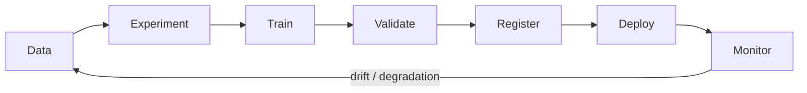
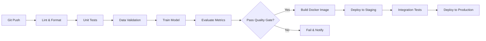

# Topic 19: MLOps — Experiment Tracking, CI/CD, Monitoring

> **Track**: AI/ML Engineer — Practice-First, Code-Heavy
> **Prerequisites**: Topic 17 (ML System Design), Topic 18 (Model Deployment)
> **You will build**: MLflow experiment tracker, W&B training dashboard, GitHub Actions CI/CD, Prometheus monitoring pipeline, and a full MLOps training-to-deployment pipeline

---

## Table of Contents

1. [What Is MLOps and Why It Matters](#1-what-is-mlops-and-why-it-matters)
2. [The MLOps Maturity Model](#2-the-mlops-maturity-model)
3. [Experiment Tracking — Concepts](#3-experiment-tracking--concepts)
4. [MLflow — Complete Walkthrough](#4-mlflow--complete-walkthrough)
5. [MLflow Model Registry](#5-mlflow-model-registry)
6. [Weights & Biases (W&B) — Complete Walkthrough](#6-weights--biases-wb--complete-walkthrough)
7. [W&B Hyperparameter Sweeps](#7-wb-hyperparameter-sweeps)
8. [Comparing MLflow vs W&B](#8-comparing-mlflow-vs-wb)
9. [CI/CD for ML — Concepts](#9-cicd-for-ml--concepts)
10. [GitHub Actions for ML Pipelines](#10-github-actions-for-ml-pipelines)
11. [Automated Testing for ML](#11-automated-testing-for-ml)
12. [Model Validation Gates](#12-model-validation-gates)
13. [Monitoring in Production — Concepts](#13-monitoring-in-production--concepts)
14. [Prometheus + Grafana for ML](#14-prometheus--grafana-for-ml)
15. [Data Drift Detection](#15-data-drift-detection)
16. [LLM-Specific Monitoring](#16-llm-specific-monitoring)
17. [Feature Stores — Feast](#17-feature-stores--feast)
18. [Pipeline Orchestration — Airflow, Prefect, Dagster](#18-pipeline-orchestration--airflow-prefect-dagster)
19. [Practice Exercises](#19-practice-exercises)
20. [Mini-Project: End-to-End MLOps Pipeline](#20-mini-project-end-to-end-mlops-pipeline)
21. [Interview Questions & Answers](#21-interview-questions--answers)

---

## 1. What Is MLOps and Why It Matters

MLOps = **ML + DevOps + Data Engineering**. It's the set of practices that takes a model from a Jupyter notebook to a reliable, monitored, continuously-improving production system.

```
┌──────────────────────────────────────────────────────────────┐
│                Without MLOps vs With MLOps                    │
├──────────────────────────────────────────────────────────────┤
│                                                              │
│  WITHOUT MLOPS:                                              │
│  - "Which notebook had the best model?"                      │
│  - "What hyperparameters did we use 3 months ago?"           │
│  - "The model works on my laptop but not in production"      │
│  - "Accuracy dropped... when? Why? Who changed what?"        │
│  - "Let me manually copy this .pkl file to the server"       │
│                                                              │
│  WITH MLOPS:                                                 │
│  - Every experiment logged with params, metrics, artifacts   │
│  - Model registry with versioning and stage transitions      │
│  - Automated CI/CD: test → validate → deploy                 │
│  - Real-time monitoring: drift, latency, accuracy alerts     │
│  - One-click rollback to any previous model version          │
│                                                              │
└──────────────────────────────────────────────────────────────┘
```

### The MLOps Lifecycle



---

## 2. The MLOps Maturity Model

| Level | Description | Characteristics |
|-------|------------|----------------|
| **0 — Manual** | Everything in notebooks | No tracking, manual deployment, no monitoring |
| **1 — Tracked** | Experiment tracking | MLflow/W&B, reproducible runs, manual deploy |
| **2 — Automated** | CI/CD for ML | Automated testing, validation gates, auto-deploy |
| **3 — Full MLOps** | Automated retraining | Drift detection triggers retraining, A/B tests, full observability |

Most teams are at Level 0-1. Getting to Level 2 is the biggest impact you can have as an ML engineer. Level 3 is where top teams operate.

---

## 3. Experiment Tracking — Concepts

Every ML experiment should log:

$$
\text{Experiment} = (\text{code version}, \text{data version}, \text{hyperparameters}, \text{metrics}, \text{artifacts})
$$

```
┌──────────────────────────────────────────────────────────────┐
│              What to Track in Every Experiment                 │
├──────────────────────────────────────────────────────────────┤
│                                                              │
│  Parameters (inputs):                                        │
│  - Learning rate, batch size, epochs, model type             │
│  - Feature list, preprocessing steps                         │
│  - Data split ratio, random seed                             │
│                                                              │
│  Metrics (outputs):                                          │
│  - Training loss per epoch                                   │
│  - Validation AUC, accuracy, F1                              │
│  - Training time, inference latency                          │
│                                                              │
│  Artifacts (files):                                          │
│  - Model checkpoint (.pt, .pkl, .onnx)                       │
│  - Confusion matrix plot, ROC curve                          │
│  - Feature importance chart                                  │
│  - Requirements.txt, config.yaml                             │
│                                                              │
│  Context:                                                    │
│  - Git commit hash                                           │
│  - Dataset version / hash                                    │
│  - Hardware (GPU type, memory)                               │
│  - Timestamp                                                 │
│                                                              │
└──────────────────────────────────────────────────────────────┘
```

---

## 4. MLflow — Complete Walkthrough

MLflow is the most popular open-source experiment tracking tool. Four components: **Tracking**, **Projects**, **Models**, **Registry**.

```bash
# Install
pip install mlflow

# Start the tracking server (UI at http://localhost:5000)
mlflow server --host 0.0.0.0 --port 5000 --backend-store-uri sqlite:///mlflow.db --default-artifact-root ./mlartifacts
```

### Basic Experiment Tracking

```python
"""
MLflow experiment tracking — log everything from a training run.
"""

import mlflow
import mlflow.sklearn
import numpy as np
import matplotlib.pyplot as plt
from sklearn.datasets import load_breast_cancer
from sklearn.model_selection import train_test_split, cross_val_score
from sklearn.ensemble import GradientBoostingClassifier, RandomForestClassifier
from sklearn.linear_model import LogisticRegression
from sklearn.metrics import (
    accuracy_score, roc_auc_score, f1_score,
    confusion_matrix, ConfusionMatrixDisplay, RocCurveDisplay,
)

# ── Setup ─────────────────────────────────────────────────────

mlflow.set_tracking_uri("http://localhost:5000")  # or "sqlite:///mlflow.db" for local
mlflow.set_experiment("breast-cancer-classification")

# ── Data ──────────────────────────────────────────────────────

X, y = load_breast_cancer(return_X_y=True)
feature_names = load_breast_cancer().feature_names.tolist()
X_train, X_test, y_train, y_test = train_test_split(
    X, y, test_size=0.2, random_state=42, stratify=y
)


# ── Training function with MLflow tracking ────────────────────

def train_and_log(model_class, model_params: dict, run_name: str):
    """Train a model and log everything to MLflow."""

    with mlflow.start_run(run_name=run_name):
        # Log parameters
        mlflow.log_param("model_class", model_class.__name__)
        for key, value in model_params.items():
            mlflow.log_param(key, value)
        mlflow.log_param("n_train_samples", len(X_train))
        mlflow.log_param("n_test_samples", len(X_test))
        mlflow.log_param("n_features", X_train.shape[1])

        # Log dataset info
        mlflow.set_tag("dataset", "breast_cancer")
        mlflow.set_tag("task", "binary_classification")

        # Train
        model = model_class(**model_params)
        model.fit(X_train, y_train)

        # Predict
        y_pred = model.predict(X_test)
        y_proba = model.predict_proba(X_test)[:, 1]

        # Compute metrics
        accuracy = accuracy_score(y_test, y_pred)
        auc = roc_auc_score(y_test, y_proba)
        f1 = f1_score(y_test, y_pred)

        # Cross-validation score
        cv_scores = cross_val_score(model, X_train, y_train, cv=5, scoring="roc_auc")

        # Log metrics
        mlflow.log_metric("accuracy", accuracy)
        mlflow.log_metric("auc", auc)
        mlflow.log_metric("f1", f1)
        mlflow.log_metric("cv_auc_mean", cv_scores.mean())
        mlflow.log_metric("cv_auc_std", cv_scores.std())

        # Log confusion matrix as artifact
        fig, ax = plt.subplots(figsize=(6, 5))
        ConfusionMatrixDisplay.from_predictions(y_test, y_pred, ax=ax)
        ax.set_title(f"{run_name} — Confusion Matrix")
        fig.savefig("confusion_matrix.png", dpi=100, bbox_inches="tight")
        mlflow.log_artifact("confusion_matrix.png")
        plt.close()

        # Log ROC curve
        fig, ax = plt.subplots(figsize=(6, 5))
        RocCurveDisplay.from_predictions(y_test, y_proba, ax=ax)
        ax.set_title(f"{run_name} — ROC Curve (AUC={auc:.4f})")
        fig.savefig("roc_curve.png", dpi=100, bbox_inches="tight")
        mlflow.log_artifact("roc_curve.png")
        plt.close()

        # Log feature importances if available
        if hasattr(model, "feature_importances_"):
            importances = dict(zip(feature_names, model.feature_importances_))
            top_10 = sorted(importances.items(), key=lambda x: x[1], reverse=True)[:10]
            for feat, imp in top_10:
                mlflow.log_metric(f"fi_{feat}", imp)

        # Log the model itself
        mlflow.sklearn.log_model(
            model,
            artifact_path="model",
            registered_model_name=None,  # register separately
        )

        print(f"✅ {run_name}: AUC={auc:.4f}, Accuracy={accuracy:.4f}, F1={f1:.4f}")

        return {"auc": auc, "accuracy": accuracy, "f1": f1}


# ── Run experiments ───────────────────────────────────────────

experiments = [
    (LogisticRegression, {"max_iter": 5000, "random_state": 42}, "LogReg_baseline"),
    (RandomForestClassifier, {"n_estimators": 100, "max_depth": 10, "random_state": 42}, "RF_100trees"),
    (RandomForestClassifier, {"n_estimators": 300, "max_depth": 15, "random_state": 42}, "RF_300trees"),
    (GradientBoostingClassifier, {"n_estimators": 200, "learning_rate": 0.1, "max_depth": 5, "random_state": 42}, "GBM_200trees"),
    (GradientBoostingClassifier, {"n_estimators": 500, "learning_rate": 0.05, "max_depth": 3, "random_state": 42}, "GBM_500trees_slow_lr"),
]

results = []
for model_class, params, name in experiments:
    r = train_and_log(model_class, params, name)
    results.append((name, r))

# Print comparison
print("\n" + "=" * 60)
print(f"{'Experiment':<30} {'AUC':>8} {'Accuracy':>10} {'F1':>8}")
print("-" * 60)
for name, r in sorted(results, key=lambda x: x[1]["auc"], reverse=True):
    print(f"{name:<30} {r['auc']:>8.4f} {r['accuracy']:>10.4f} {r['f1']:>8.4f}")
```

### Logging PyTorch Training Curves

```python
"""
MLflow with PyTorch — log training curves step by step.
"""

import mlflow
import torch
import torch.nn as nn
from torch.utils.data import DataLoader, TensorDataset


def train_pytorch_with_mlflow(
    model: nn.Module,
    train_loader: DataLoader,
    val_loader: DataLoader,
    epochs: int = 20,
    lr: float = 0.001,
):
    """Train a PyTorch model with MLflow step-by-step logging."""

    with mlflow.start_run(run_name="pytorch_training"):
        # Log hyperparameters
        mlflow.log_param("epochs", epochs)
        mlflow.log_param("learning_rate", lr)
        mlflow.log_param("optimizer", "Adam")
        mlflow.log_param("model_params", sum(p.numel() for p in model.parameters()))

        optimizer = torch.optim.Adam(model.parameters(), lr=lr)
        criterion = nn.CrossEntropyLoss()
        best_val_acc = 0.0

        for epoch in range(epochs):
            # Training
            model.train()
            train_loss = 0.0
            train_correct = 0
            train_total = 0

            for X_batch, y_batch in train_loader:
                optimizer.zero_grad()
                outputs = model(X_batch)
                loss = criterion(outputs, y_batch)
                loss.backward()
                optimizer.step()

                train_loss += loss.item() * len(y_batch)
                train_correct += (outputs.argmax(1) == y_batch).sum().item()
                train_total += len(y_batch)

            train_loss /= train_total
            train_acc = train_correct / train_total

            # Validation
            model.eval()
            val_loss = 0.0
            val_correct = 0
            val_total = 0

            with torch.no_grad():
                for X_batch, y_batch in val_loader:
                    outputs = model(X_batch)
                    loss = criterion(outputs, y_batch)
                    val_loss += loss.item() * len(y_batch)
                    val_correct += (outputs.argmax(1) == y_batch).sum().item()
                    val_total += len(y_batch)

            val_loss /= val_total
            val_acc = val_correct / val_total

            # Log metrics per epoch (creates training curves in MLflow UI)
            mlflow.log_metrics({
                "train_loss": train_loss,
                "train_accuracy": train_acc,
                "val_loss": val_loss,
                "val_accuracy": val_acc,
            }, step=epoch)

            print(f"Epoch {epoch+1}/{epochs} — "
                  f"train_loss: {train_loss:.4f}, train_acc: {train_acc:.4f}, "
                  f"val_loss: {val_loss:.4f}, val_acc: {val_acc:.4f}")

            # Save best model
            if val_acc > best_val_acc:
                best_val_acc = val_acc
                torch.save(model.state_dict(), "best_model.pt")
                mlflow.log_artifact("best_model.pt")

        mlflow.log_metric("best_val_accuracy", best_val_acc)
```

---

## 5. MLflow Model Registry

The model registry manages model lifecycle: **staging → production → archived**.

```python
"""
MLflow Model Registry — manage model versions and promote to production.
"""

import mlflow
from mlflow.tracking import MlflowClient

client = MlflowClient()


# ── Register a model from an experiment run ───────────────────

def register_best_model(experiment_name: str, model_name: str):
    """Find the best run in an experiment and register it."""
    experiment = client.get_experiment_by_name(experiment_name)
    runs = client.search_runs(
        experiment_ids=[experiment.experiment_id],
        order_by=["metrics.auc DESC"],
        max_results=1,
    )

    if not runs:
        print("No runs found")
        return

    best_run = runs[0]
    run_id = best_run.info.run_id
    auc = best_run.data.metrics["auc"]
    print(f"Best run: {run_id} (AUC={auc:.4f})")

    # Register the model
    model_uri = f"runs:/{run_id}/model"
    result = mlflow.register_model(model_uri, model_name)
    print(f"Registered: {result.name} version {result.version}")

    return result


# ── Promote model through stages ──────────────────────────────

def promote_model(model_name: str, version: int, stage: str):
    """
    Promote a model version to a stage.
    Stages: 'Staging', 'Production', 'Archived'
    """
    client.transition_model_version_stage(
        name=model_name,
        version=version,
        stage=stage,
        archive_existing_versions=(stage == "Production"),  # archive old prod model
    )
    print(f"Model {model_name} v{version} → {stage}")


# ── Load model from registry for serving ──────────────────────

def load_production_model(model_name: str):
    """Load the current production model."""
    model = mlflow.sklearn.load_model(f"models:/{model_name}/Production")
    return model


# ── List all versions ─────────────────────────────────────────

def list_model_versions(model_name: str):
    """List all versions of a registered model."""
    versions = client.search_model_versions(f"name='{model_name}'")
    print(f"\nModel: {model_name}")
    print(f"{'Version':<10} {'Stage':<15} {'AUC':<10} {'Created'}")
    print("-" * 60)
    for v in versions:
        # Get the run to retrieve metrics
        run = client.get_run(v.run_id)
        auc = run.data.metrics.get("auc", "N/A")
        print(f"{v.version:<10} {v.current_stage:<15} {auc:<10} {v.creation_timestamp}")


# ── Usage ─────────────────────────────────────────────────────

# register_best_model("breast-cancer-classification", "cancer_classifier")
# promote_model("cancer_classifier", version=3, stage="Staging")
# promote_model("cancer_classifier", version=3, stage="Production")
# model = load_production_model("cancer_classifier")
# list_model_versions("cancer_classifier")
```

---

## 6. Weights & Biases (W&B) — Complete Walkthrough

W&B is the most popular cloud-hosted experiment tracking platform. Better visualizations than MLflow, built-in collaboration.

```bash
pip install wandb
wandb login  # paste your API key from wandb.ai
```

```python
"""
Weights & Biases — experiment tracking with rich visualizations.
"""

import wandb
import numpy as np
from sklearn.datasets import load_breast_cancer
from sklearn.model_selection import train_test_split
from sklearn.ensemble import GradientBoostingClassifier
from sklearn.metrics import accuracy_score, roc_auc_score, classification_report


# ── Initialize a run ──────────────────────────────────────────

X, y = load_breast_cancer(return_X_y=True)
X_train, X_test, y_train, y_test = train_test_split(X, y, test_size=0.2, random_state=42)

run = wandb.init(
    project="breast-cancer",
    name="gbm_experiment_1",
    config={
        "model": "GradientBoosting",
        "n_estimators": 200,
        "learning_rate": 0.1,
        "max_depth": 5,
        "dataset": "breast_cancer",
        "n_train": len(X_train),
        "n_test": len(X_test),
    },
    tags=["baseline", "gbm"],
)

config = wandb.config

# ── Train with step-by-step logging ───────────────────────────

model = GradientBoostingClassifier(
    n_estimators=config.n_estimators,
    learning_rate=config.learning_rate,
    max_depth=config.max_depth,
    random_state=42,
)

# Log training progress (GBM supports staged_predict)
model.fit(X_train, y_train)

# Log metrics at each boosting stage
for i, (train_pred, test_pred) in enumerate(
    zip(model.staged_predict_proba(X_train), model.staged_predict_proba(X_test))
):
    train_auc = roc_auc_score(y_train, train_pred[:, 1])
    test_auc = roc_auc_score(y_test, test_pred[:, 1])
    wandb.log({
        "train_auc": train_auc,
        "test_auc": test_auc,
        "stage": i + 1,
    })

# ── Log final metrics ────────────────────────────────────────

y_pred = model.predict(X_test)
y_proba = model.predict_proba(X_test)[:, 1]

final_metrics = {
    "final_accuracy": accuracy_score(y_test, y_pred),
    "final_auc": roc_auc_score(y_test, y_proba),
}
wandb.log(final_metrics)
wandb.summary.update(final_metrics)


# ── Log rich visualizations (W&B built-in) ────────────────────

# Confusion matrix
wandb.log({
    "confusion_matrix": wandb.plot.confusion_matrix(
        y_true=y_test,
        preds=y_pred,
        class_names=["Malignant", "Benign"],
    )
})

# ROC curve
wandb.log({
    "roc_curve": wandb.plot.roc_curve(
        y_true=y_test,
        y_probas=model.predict_proba(X_test),
        labels=["Malignant", "Benign"],
    )
})

# Feature importances as bar chart
feature_names = load_breast_cancer().feature_names
top_features = sorted(
    zip(feature_names, model.feature_importances_),
    key=lambda x: x[1], reverse=True,
)[:15]

table = wandb.Table(
    data=[[name, imp] for name, imp in top_features],
    columns=["feature", "importance"],
)
wandb.log({
    "feature_importances": wandb.plot.bar(
        table, "feature", "importance", title="Top 15 Feature Importances"
    )
})

# ── Log model artifact ────────────────────────────────────────

import pickle
with open("model.pkl", "wb") as f:
    pickle.dump(model, f)

artifact = wandb.Artifact("cancer_model", type="model", metadata=final_metrics)
artifact.add_file("model.pkl")
run.log_artifact(artifact)

wandb.finish()
print("Run logged to W&B!")
```

### W&B with PyTorch

```python
"""
W&B with PyTorch training loop — automatic gradient and system logging.
"""

import wandb
import torch
import torch.nn as nn
from torch.utils.data import DataLoader


def train_pytorch_wandb(
    model: nn.Module,
    train_loader: DataLoader,
    val_loader: DataLoader,
    config: dict,
):
    run = wandb.init(project="pytorch-training", config=config)

    # Watch model: logs gradients and parameter histograms automatically
    wandb.watch(model, log="all", log_freq=100)

    optimizer = torch.optim.Adam(model.parameters(), lr=config["lr"])
    criterion = nn.CrossEntropyLoss()

    for epoch in range(config["epochs"]):
        model.train()
        epoch_loss = 0.0

        for batch_idx, (X, y) in enumerate(train_loader):
            optimizer.zero_grad()
            out = model(X)
            loss = criterion(out, y)
            loss.backward()
            optimizer.step()

            epoch_loss += loss.item()

            # Log every N batches
            if batch_idx % 50 == 0:
                wandb.log({
                    "batch_loss": loss.item(),
                    "epoch": epoch,
                    "batch": batch_idx,
                })

        # Validation
        model.eval()
        val_correct, val_total = 0, 0
        with torch.no_grad():
            for X, y in val_loader:
                out = model(X)
                val_correct += (out.argmax(1) == y).sum().item()
                val_total += len(y)

        wandb.log({
            "epoch": epoch,
            "train_loss": epoch_loss / len(train_loader),
            "val_accuracy": val_correct / val_total,
        })

    # Save model as W&B artifact
    torch.save(model.state_dict(), "model.pt")
    artifact = wandb.Artifact("trained_model", type="model")
    artifact.add_file("model.pt")
    run.log_artifact(artifact)

    wandb.finish()
```

---

## 7. W&B Hyperparameter Sweeps

```python
"""
W&B Sweeps — automated hyperparameter search with visualization.
"""

import wandb
from sklearn.datasets import load_breast_cancer
from sklearn.model_selection import cross_val_score
from sklearn.ensemble import GradientBoostingClassifier

X, y = load_breast_cancer(return_X_y=True)


# ── Define sweep configuration ────────────────────────────────

sweep_config = {
    "method": "bayes",  # bayes, random, grid
    "metric": {
        "name": "cv_auc",
        "goal": "maximize",
    },
    "parameters": {
        "n_estimators": {"values": [50, 100, 200, 300, 500]},
        "learning_rate": {"min": 0.01, "max": 0.3},
        "max_depth": {"values": [3, 5, 7, 10]},
        "min_samples_split": {"values": [2, 5, 10, 20]},
        "subsample": {"min": 0.6, "max": 1.0},
    },
    "early_terminate": {
        "type": "hyperband",
        "min_iter": 5,
        "eta": 3,
    },
}


# ── Define training function ──────────────────────────────────

def sweep_train():
    run = wandb.init()
    config = wandb.config

    model = GradientBoostingClassifier(
        n_estimators=config.n_estimators,
        learning_rate=config.learning_rate,
        max_depth=config.max_depth,
        min_samples_split=config.min_samples_split,
        subsample=config.subsample,
        random_state=42,
    )

    scores = cross_val_score(model, X, y, cv=5, scoring="roc_auc")
    wandb.log({
        "cv_auc": scores.mean(),
        "cv_auc_std": scores.std(),
    })

    wandb.finish()


# ── Launch sweep ──────────────────────────────────────────────

# sweep_id = wandb.sweep(sweep_config, project="cancer-sweep")
# wandb.agent(sweep_id, sweep_train, count=50)  # run 50 trials
```

---

## 8. Comparing MLflow vs W&B

```
┌──────────────────────────────────────────────────────────────┐
│                  MLflow vs Weights & Biases                   │
├────────────────────┬──────────────────┬──────────────────────┤
│ Feature            │ MLflow           │ W&B                  │
├────────────────────┼──────────────────┼──────────────────────┤
│ Hosting            │ Self-hosted      │ Cloud (free tier)    │
│ Cost               │ Free (open src)  │ Free personal, $$team│
│ Setup              │ You manage server│ pip install + login   │
│ UI quality         │ Functional       │ Excellent            │
│ Model registry     │ Built-in         │ Via artifacts        │
│ Hyperparameter     │ Manual / Optuna  │ Built-in sweeps      │
│ Team collaboration │ Basic            │ Excellent            │
│ System metrics     │ No               │ GPU, CPU, memory auto│
│ Gradient logging   │ Manual           │ wandb.watch()        │
│ Vendor lock-in     │ None             │ Moderate             │
│ LLM tracking       │ MLflow 2.x       │ Weave (W&B)          │
├────────────────────┼──────────────────┼──────────────────────┤
│ Best for           │ Self-hosted,     │ Teams, collaboration,│
│                    │ on-prem, privacy │ rich visualization   │
└────────────────────┴──────────────────┴──────────────────────┘

Rule of thumb:
- Solo/privacy-sensitive → MLflow
- Team/collaboration → W&B
- Many companies use BOTH: MLflow for registry, W&B for tracking
```

---

## 9. CI/CD for ML — Concepts

```
┌──────────────────────────────────────────────────────────────┐
│                CI/CD for ML vs Traditional Software           │
├──────────────────────────────────────────────────────────────┤
│                                                              │
│  TRADITIONAL CI/CD:                                          │
│  Code change → Lint → Test → Build → Deploy                  │
│                                                              │
│  ML CI/CD (all of the above, PLUS):                          │
│  Code change → Lint → Unit test → Data validation            │
│               → Train model → Evaluate metrics               │
│               → Compare vs baseline → Validate quality gate  │
│               → Build container → Deploy to staging           │
│               → Integration test → Deploy to production      │
│                                                              │
│  EXTRA COMPLEXITY:                                           │
│  - Data changes can break the model (not just code)          │
│  - Training takes minutes-hours (not seconds)                │
│  - Model quality is probabilistic (not pass/fail)            │
│  - Need to compare against current production model          │
│                                                              │
└──────────────────────────────────────────────────────────────┘
```



---

## 10. GitHub Actions for ML Pipelines

### Complete CI/CD Workflow

```yaml
# .github/workflows/ml_pipeline.yml

name: ML Pipeline CI/CD

on:
  push:
    branches: [main]
    paths:
      - 'src/**'
      - 'models/**'
      - 'tests/**'
      - 'requirements.txt'
  pull_request:
    branches: [main]

env:
  PYTHON_VERSION: "3.11"
  MODEL_NAME: "fraud_classifier"

jobs:
  # ── Job 1: Lint and Format ──────────────────────
  lint:
    runs-on: ubuntu-latest
    steps:
      - uses: actions/checkout@v4
      - uses: actions/setup-python@v5
        with:
          python-version: ${{ env.PYTHON_VERSION }}
      - name: Install linters
        run: pip install ruff mypy
      - name: Ruff (lint + format check)
        run: ruff check src/ && ruff format --check src/
      - name: Type check
        run: mypy src/ --ignore-missing-imports

  # ── Job 2: Unit Tests ───────────────────────────
  test:
    runs-on: ubuntu-latest
    needs: lint
    steps:
      - uses: actions/checkout@v4
      - uses: actions/setup-python@v5
        with:
          python-version: ${{ env.PYTHON_VERSION }}
      - name: Install dependencies
        run: pip install -r requirements.txt -r requirements-test.txt
      - name: Run tests
        run: pytest tests/ -v --tb=short --cov=src --cov-report=xml
      - name: Upload coverage
        uses: codecov/codecov-action@v3
        with:
          file: coverage.xml

  # ── Job 3: Data Validation ──────────────────────
  data-validation:
    runs-on: ubuntu-latest
    needs: lint
    steps:
      - uses: actions/checkout@v4
      - uses: actions/setup-python@v5
        with:
          python-version: ${{ env.PYTHON_VERSION }}
      - name: Install dependencies
        run: pip install -r requirements.txt
      - name: Validate training data
        run: python scripts/validate_data.py
      - name: Check data schema
        run: python scripts/check_schema.py

  # ── Job 4: Train and Evaluate ───────────────────
  train:
    runs-on: ubuntu-latest
    needs: [test, data-validation]
    steps:
      - uses: actions/checkout@v4
      - uses: actions/setup-python@v5
        with:
          python-version: ${{ env.PYTHON_VERSION }}
      - name: Install dependencies
        run: pip install -r requirements.txt
      - name: Train model
        run: python scripts/train.py --output models/candidate.pkl
      - name: Evaluate model
        run: python scripts/evaluate.py --model models/candidate.pkl --output metrics.json
      - name: Quality gate check
        run: python scripts/quality_gate.py --metrics metrics.json --min-auc 0.90
      - name: Upload model artifact
        uses: actions/upload-artifact@v4
        with:
          name: trained-model
          path: |
            models/candidate.pkl
            metrics.json

  # ── Job 5: Build and Push Docker Image ──────────
  build:
    runs-on: ubuntu-latest
    needs: train
    if: github.ref == 'refs/heads/main'
    steps:
      - uses: actions/checkout@v4
      - name: Download model artifact
        uses: actions/download-artifact@v4
        with:
          name: trained-model
          path: models/
      - name: Build Docker image
        run: docker build -t ${{ env.MODEL_NAME }}:${{ github.sha }} .
      - name: Push to registry
        run: |
          echo ${{ secrets.DOCKER_PASSWORD }} | docker login -u ${{ secrets.DOCKER_USERNAME }} --password-stdin
          docker tag ${{ env.MODEL_NAME }}:${{ github.sha }} myregistry/${{ env.MODEL_NAME }}:${{ github.sha }}
          docker tag ${{ env.MODEL_NAME }}:${{ github.sha }} myregistry/${{ env.MODEL_NAME }}:latest
          docker push myregistry/${{ env.MODEL_NAME }}:${{ github.sha }}
          docker push myregistry/${{ env.MODEL_NAME }}:latest

  # ── Job 6: Deploy ───────────────────────────────
  deploy:
    runs-on: ubuntu-latest
    needs: build
    if: github.ref == 'refs/heads/main'
    environment: production
    steps:
      - name: Deploy to production
        run: |
          echo "Deploying ${{ env.MODEL_NAME }}:${{ github.sha }} to production"
          # kubectl set image deployment/ml-api ml-api=myregistry/${{ env.MODEL_NAME }}:${{ github.sha }}
          # or: aws ecs update-service ...
```

---

## 11. Automated Testing for ML

```python
"""
ML-specific test patterns: unit tests, data tests, model tests.
"""

import pytest
import numpy as np
import pandas as pd
from pathlib import Path


# ── 1. Unit Tests: Test preprocessing functions ───────────────

class TestFeatureEngineering:
    """Test feature engineering functions in isolation."""

    def test_cyclical_encoding_hour(self):
        """Hour encoding should be cyclical: hour 0 ≈ hour 24."""
        from src.features import cyclical_hour

        enc_0 = cyclical_hour(0)
        enc_23 = cyclical_hour(23)
        enc_12 = cyclical_hour(12)

        # Hour 0 and 23 should be close
        assert abs(enc_0["sin"] - enc_23["sin"]) < 0.3
        # Hour 0 and 12 should be far apart
        assert abs(enc_0["sin"] - enc_12["sin"]) > 1.0

    def test_target_encoding_no_leakage(self):
        """Target encoding must be computed on train set only."""
        from src.features import target_encode

        train = pd.DataFrame({"cat": ["A", "A", "B", "B"], "target": [1, 0, 0, 0]})
        test = pd.DataFrame({"cat": ["A", "B", "C"]})

        encoder = target_encode(train, "cat", "target")
        test_encoded = encoder.transform(test["cat"])

        # Unknown category "C" should get global mean, not NaN
        assert not np.isnan(test_encoded.iloc[2])

    def test_feature_pipeline_output_shape(self):
        """Feature pipeline should output expected number of columns."""
        from src.features import FeaturePipeline

        raw = pd.DataFrame({
            "user_id": [1, 2, 3],
            "amount": [10.0, 20.0, 30.0],
            "category": ["A", "B", "A"],
        })

        pipeline = FeaturePipeline()
        features = pipeline.transform(raw)

        assert features.shape[0] == 3  # same number of rows
        assert features.shape[1] > raw.shape[1]  # more columns after engineering
        assert not features.isnull().any().any()  # no NaNs


# ── 2. Data Tests: Validate training data ─────────────────────

class TestTrainingData:
    """Validate the training dataset before model training."""

    @pytest.fixture
    def training_data(self):
        return pd.read_parquet("data/training_data.parquet")

    def test_no_empty_dataframe(self, training_data):
        assert len(training_data) > 1000, f"Only {len(training_data)} rows"

    def test_required_columns_exist(self, training_data):
        required = ["user_id", "amount", "label", "timestamp"]
        missing = set(required) - set(training_data.columns)
        assert not missing, f"Missing columns: {missing}"

    def test_label_distribution(self, training_data):
        """Labels should not be too imbalanced (>1% minority)."""
        label_dist = training_data["label"].value_counts(normalize=True)
        min_class_pct = label_dist.min()
        assert min_class_pct > 0.01, f"Minority class is {min_class_pct:.2%}"

    def test_no_future_leakage(self, training_data):
        """Ensure no features from the future leak into training data."""
        ts = pd.to_datetime(training_data["timestamp"])
        assert ts.max() <= pd.Timestamp.now(), "Data contains future timestamps"

    def test_feature_ranges(self, training_data):
        """Features should be within reasonable ranges."""
        assert training_data["amount"].min() >= 0, "Negative amounts found"
        assert training_data["amount"].max() < 1_000_000, "Unreasonably large amount"


# ── 3. Model Tests: Validate model quality ────────────────────

class TestModelQuality:
    """Test the trained model meets quality bars."""

    @pytest.fixture
    def model_and_data(self):
        import pickle
        with open("models/candidate.pkl", "rb") as f:
            model = pickle.load(f)
        X_test = np.load("data/X_test.npy")
        y_test = np.load("data/y_test.npy")
        return model, X_test, y_test

    def test_auc_above_threshold(self, model_and_data):
        from sklearn.metrics import roc_auc_score
        model, X_test, y_test = model_and_data
        y_proba = model.predict_proba(X_test)[:, 1]
        auc = roc_auc_score(y_test, y_proba)
        assert auc > 0.90, f"AUC {auc:.4f} below threshold 0.90"

    def test_no_class_completely_wrong(self, model_and_data):
        from sklearn.metrics import recall_score
        model, X_test, y_test = model_and_data
        y_pred = model.predict(X_test)
        # Each class should have >50% recall
        for cls in np.unique(y_test):
            mask = y_test == cls
            recall = (y_pred[mask] == cls).mean()
            assert recall > 0.5, f"Class {cls} recall is {recall:.2f}"

    def test_prediction_speed(self, model_and_data):
        """Single prediction should be fast enough for production."""
        import time
        model, X_test, _ = model_and_data
        single_input = X_test[:1]

        start = time.time()
        for _ in range(100):
            model.predict(single_input)
        avg_ms = (time.time() - start) / 100 * 1000

        assert avg_ms < 10, f"Prediction takes {avg_ms:.1f}ms, must be <10ms"

    def test_model_deterministic(self, model_and_data):
        """Same input should always produce same output."""
        model, X_test, _ = model_and_data
        pred1 = model.predict(X_test[:10])
        pred2 = model.predict(X_test[:10])
        np.testing.assert_array_equal(pred1, pred2)
```

---

## 12. Model Validation Gates

```python
"""
Quality gates: automated checks that prevent bad models from deploying.
"""

import json
import sys
from dataclasses import dataclass


@dataclass
class QualityGate:
    """A single quality check."""
    name: str
    metric: str
    operator: str  # ">=", "<=", "<", ">"
    threshold: float


@dataclass
class GateResult:
    gate: QualityGate
    actual_value: float
    passed: bool


def evaluate_quality_gates(
    metrics: dict[str, float],
    gates: list[QualityGate],
) -> tuple[bool, list[GateResult]]:
    """
    Evaluate all quality gates.
    Returns (all_passed, individual_results).
    """
    results = []
    for gate in gates:
        value = metrics.get(gate.metric)
        if value is None:
            results.append(GateResult(gate=gate, actual_value=0, passed=False))
            continue

        ops = {
            ">=": lambda a, b: a >= b,
            "<=": lambda a, b: a <= b,
            ">": lambda a, b: a > b,
            "<": lambda a, b: a < b,
        }
        passed = ops[gate.operator](value, gate.threshold)
        results.append(GateResult(gate=gate, actual_value=value, passed=passed))

    all_passed = all(r.passed for r in results)
    return all_passed, results


# ── Define gates ──────────────────────────────────────────────

PRODUCTION_GATES = [
    QualityGate("AUC threshold", "auc", ">=", 0.90),
    QualityGate("F1 threshold", "f1", ">=", 0.85),
    QualityGate("Latency p99", "latency_p99_ms", "<=", 100),
    QualityGate("Not worse than prod", "auc_vs_production", ">=", -0.01),
    QualityGate("Test coverage", "test_coverage", ">=", 0.80),
]


# ── CLI script for CI/CD ─────────────────────────────────────

def main():
    """quality_gate.py — run as part of CI/CD pipeline."""
    import argparse
    parser = argparse.ArgumentParser()
    parser.add_argument("--metrics", required=True, help="Path to metrics.json")
    parser.add_argument("--min-auc", type=float, default=0.90)
    args = parser.parse_args()

    with open(args.metrics) as f:
        metrics = json.load(f)

    gates = [
        QualityGate("AUC", "auc", ">=", args.min_auc),
        QualityGate("F1", "f1", ">=", 0.85),
    ]

    all_passed, results = evaluate_quality_gates(metrics, gates)

    for r in results:
        icon = "✅" if r.passed else "❌"
        print(f"{icon} {r.gate.name}: {r.actual_value:.4f} {r.gate.operator} {r.gate.threshold}")

    if not all_passed:
        print("\n❌ Quality gate FAILED. Model will NOT be deployed.")
        sys.exit(1)
    else:
        print("\n✅ All quality gates passed. Model approved for deployment.")
        sys.exit(0)


if __name__ == "__main__":
    main()
```

---

## 13. Monitoring in Production — Concepts

```
┌──────────────────────────────────────────────────────────────┐
│              ML Monitoring: What to Watch                      │
├──────────────────────────────────────────────────────────────┤
│                                                              │
│  LAYER 1: Infrastructure (same as any service)               │
│  - CPU / GPU utilization                                     │
│  - Memory usage                                              │
│  - Request latency (p50, p95, p99)                           │
│  - Error rate (4xx, 5xx)                                     │
│  - Throughput (requests/sec)                                 │
│                                                              │
│  LAYER 2: Model-specific (unique to ML)                      │
│  - Prediction distribution (has it shifted?)                 │
│  - Feature distribution (input drift?)                       │
│  - Model performance (if delayed labels available)           │
│  - Prediction confidence distribution                        │
│  - Null/missing feature rate                                 │
│                                                              │
│  LAYER 3: Business (what stakeholders care about)            │
│  - Conversion rate, CTR, revenue per user                    │
│  - False positive / false negative rates                     │
│  - Customer complaints related to ML                         │
│                                                              │
└──────────────────────────────────────────────────────────────┘
```

---

## 14. Prometheus + Grafana for ML

```python
"""
Instrument a FastAPI ML service with Prometheus metrics.
"""

from fastapi import FastAPI, Request
from prometheus_client import (
    Counter, Histogram, Gauge, Summary,
    generate_latest, CONTENT_TYPE_LATEST,
)
from starlette.responses import Response
import time
import numpy as np

app = FastAPI(title="Monitored ML API")

# ── Define Prometheus metrics ─────────────────────────────────

# Request counter
PREDICTIONS_TOTAL = Counter(
    "ml_predictions_total",
    "Total number of predictions made",
    ["model_version", "status"],
)

# Latency histogram
PREDICTION_LATENCY = Histogram(
    "ml_prediction_latency_seconds",
    "Prediction latency in seconds",
    ["model_version"],
    buckets=[0.005, 0.01, 0.025, 0.05, 0.1, 0.25, 0.5, 1.0],
)

# Prediction score distribution
PREDICTION_SCORE = Histogram(
    "ml_prediction_score",
    "Distribution of prediction scores",
    ["model_version"],
    buckets=[0.1, 0.2, 0.3, 0.4, 0.5, 0.6, 0.7, 0.8, 0.9, 1.0],
)

# Feature values (track for drift detection)
FEATURE_VALUE = Summary(
    "ml_feature_value",
    "Distribution of input feature values",
    ["feature_name"],
)

# Current model info
MODEL_INFO = Gauge(
    "ml_model_info",
    "Current model metadata",
    ["version", "loaded_at"],
)

# Batch size distribution
BATCH_SIZE = Histogram(
    "ml_batch_size",
    "Size of prediction batches",
    buckets=[1, 5, 10, 25, 50, 100, 250, 500],
)


# ── Metrics endpoint ─────────────────────────────────────────

@app.get("/metrics")
async def metrics():
    """Prometheus scrapes this endpoint."""
    return Response(
        content=generate_latest(),
        media_type=CONTENT_TYPE_LATEST,
    )


# ── Instrumented prediction endpoint ─────────────────────────

MODEL_VERSION = "v2.1.0"

@app.post("/predict")
async def predict(request: Request):
    body = await request.json()
    features = body.get("features", [])
    start = time.time()

    try:
        # Mock prediction
        score = float(np.mean(features))

        # Record metrics
        latency = time.time() - start
        PREDICTION_LATENCY.labels(model_version=MODEL_VERSION).observe(latency)
        PREDICTION_SCORE.labels(model_version=MODEL_VERSION).observe(score)
        PREDICTIONS_TOTAL.labels(model_version=MODEL_VERSION, status="success").inc()

        # Track individual feature values for drift detection
        feature_names = [f"feature_{i}" for i in range(len(features))]
        for name, value in zip(feature_names, features):
            FEATURE_VALUE.labels(feature_name=name).observe(value)

        return {"score": score, "model_version": MODEL_VERSION}

    except Exception as e:
        PREDICTIONS_TOTAL.labels(model_version=MODEL_VERSION, status="error").inc()
        raise


# ── Prometheus configuration ──────────────────────────────────

PROMETHEUS_CONFIG = """
# prometheus.yml
global:
  scrape_interval: 15s
  evaluation_interval: 15s

scrape_configs:
  - job_name: 'ml-api'
    static_configs:
      - targets: ['api:8000']
    metrics_path: /metrics
    scrape_interval: 10s

  - job_name: 'node-exporter'
    static_configs:
      - targets: ['node-exporter:9100']

# Alert rules
rule_files:
  - 'alert_rules.yml'
"""

ALERT_RULES = """
# alert_rules.yml
groups:
  - name: ml_alerts
    rules:
      - alert: HighLatency
        expr: histogram_quantile(0.99, rate(ml_prediction_latency_seconds_bucket[5m])) > 0.2
        for: 5m
        labels:
          severity: warning
        annotations:
          summary: "ML API p99 latency > 200ms"

      - alert: HighErrorRate
        expr: rate(ml_predictions_total{status="error"}[5m]) / rate(ml_predictions_total[5m]) > 0.05
        for: 2m
        labels:
          severity: critical
        annotations:
          summary: "ML API error rate > 5%"

      - alert: PredictionDrift
        expr: |
          abs(
            avg_over_time(ml_prediction_score_sum[1h]) / avg_over_time(ml_prediction_score_count[1h])
            - avg_over_time(ml_prediction_score_sum[24h]) / avg_over_time(ml_prediction_score_count[24h])
          ) > 0.1
        for: 30m
        labels:
          severity: warning
        annotations:
          summary: "Prediction score distribution shifted"
"""
```

### Grafana Dashboard (JSON Model)

```python
"""
Key Grafana panels for an ML monitoring dashboard.
"""

GRAFANA_PANELS = {
    "row_1_infrastructure": [
        {
            "title": "Request Rate (req/s)",
            "query": "rate(ml_predictions_total[5m])",
            "type": "timeseries",
        },
        {
            "title": "Latency (p50, p95, p99)",
            "query": [
                "histogram_quantile(0.50, rate(ml_prediction_latency_seconds_bucket[5m]))",
                "histogram_quantile(0.95, rate(ml_prediction_latency_seconds_bucket[5m]))",
                "histogram_quantile(0.99, rate(ml_prediction_latency_seconds_bucket[5m]))",
            ],
            "type": "timeseries",
        },
        {
            "title": "Error Rate",
            "query": 'rate(ml_predictions_total{status="error"}[5m]) / rate(ml_predictions_total[5m])',
            "type": "gauge",
            "thresholds": {"green": 0, "yellow": 0.01, "red": 0.05},
        },
    ],
    "row_2_model": [
        {
            "title": "Prediction Score Distribution",
            "query": "histogram_quantile(0.5, ml_prediction_score_bucket)",
            "type": "histogram",
        },
        {
            "title": "Prediction Score Mean (1h window)",
            "query": "rate(ml_prediction_score_sum[1h]) / rate(ml_prediction_score_count[1h])",
            "type": "timeseries",
        },
    ],
}
```

---

## 15. Data Drift Detection

```python
"""
Production data drift detection with statistical tests.
"""

import numpy as np
from scipy import stats
from dataclasses import dataclass
from enum import Enum


class DriftSeverity(Enum):
    NONE = "none"
    WARNING = "warning"
    CRITICAL = "critical"


@dataclass
class DriftReport:
    feature_name: str
    test_name: str
    statistic: float
    p_value: float
    severity: DriftSeverity
    message: str


class DriftDetector:
    """
    Detect distribution shifts in input features.

    Methods:
    1. KS test: good for continuous features
    2. Chi-squared: good for categorical features
    3. PSI (Population Stability Index): industry standard
    """

    def __init__(self, warning_threshold: float = 0.05, critical_threshold: float = 0.001):
        self.warning_threshold = warning_threshold
        self.critical_threshold = critical_threshold

    def ks_test(self, reference: np.ndarray, current: np.ndarray, feature_name: str) -> DriftReport:
        """Kolmogorov-Smirnov test for continuous features."""
        stat, p_value = stats.ks_2samp(reference, current)
        severity = self._classify(p_value)
        return DriftReport(
            feature_name=feature_name,
            test_name="Kolmogorov-Smirnov",
            statistic=stat,
            p_value=p_value,
            severity=severity,
            message=f"KS stat={stat:.4f}, p={p_value:.6f}",
        )

    def chi_squared_test(
        self,
        reference: np.ndarray,
        current: np.ndarray,
        feature_name: str,
    ) -> DriftReport:
        """Chi-squared test for categorical features."""
        categories = np.union1d(np.unique(reference), np.unique(current))
        ref_counts = np.array([np.sum(reference == c) for c in categories], dtype=float)
        cur_counts = np.array([np.sum(current == c) for c in categories], dtype=float)

        # Normalize to proportions
        ref_counts = ref_counts / ref_counts.sum() * cur_counts.sum()

        stat, p_value = stats.chisquare(cur_counts, f_exp=ref_counts)
        severity = self._classify(p_value)
        return DriftReport(
            feature_name=feature_name,
            test_name="Chi-Squared",
            statistic=stat,
            p_value=p_value,
            severity=severity,
            message=f"Chi2 stat={stat:.4f}, p={p_value:.6f}",
        )

    def psi(
        self,
        reference: np.ndarray,
        current: np.ndarray,
        feature_name: str,
        n_bins: int = 10,
    ) -> DriftReport:
        """
        Population Stability Index.

        $$
        \\text{PSI} = \\sum_{i=1}^{B} (p_i - q_i) \\ln\\left(\\frac{p_i}{q_i}\\right)
        $$

        PSI < 0.1: no significant shift
        PSI 0.1-0.25: moderate shift (investigate)
        PSI > 0.25: significant shift (action required)
        """
        # Create bins from reference distribution
        _, bin_edges = np.histogram(reference, bins=n_bins)

        ref_hist, _ = np.histogram(reference, bins=bin_edges)
        cur_hist, _ = np.histogram(current, bins=bin_edges)

        # Normalize to proportions (avoid zeros)
        epsilon = 1e-6
        ref_pct = ref_hist / ref_hist.sum() + epsilon
        cur_pct = cur_hist / cur_hist.sum() + epsilon

        psi_value = np.sum((cur_pct - ref_pct) * np.log(cur_pct / ref_pct))

        if psi_value > 0.25:
            severity = DriftSeverity.CRITICAL
        elif psi_value > 0.1:
            severity = DriftSeverity.WARNING
        else:
            severity = DriftSeverity.NONE

        return DriftReport(
            feature_name=feature_name,
            test_name="PSI",
            statistic=psi_value,
            p_value=0,  # PSI doesn't produce p-values
            severity=severity,
            message=f"PSI={psi_value:.4f}",
        )

    def _classify(self, p_value: float) -> DriftSeverity:
        if p_value < self.critical_threshold:
            return DriftSeverity.CRITICAL
        elif p_value < self.warning_threshold:
            return DriftSeverity.WARNING
        return DriftSeverity.NONE

    def detect_all(
        self,
        reference_features: dict[str, np.ndarray],
        current_features: dict[str, np.ndarray],
    ) -> list[DriftReport]:
        """Run drift detection on all features."""
        reports = []
        for name in reference_features:
            if name not in current_features:
                continue
            ref = reference_features[name]
            cur = current_features[name]

            # Use KS for continuous, chi-squared for categorical
            if np.issubdtype(ref.dtype, np.floating):
                reports.append(self.ks_test(ref, cur, name))
                reports.append(self.psi(ref, cur, name))
            else:
                reports.append(self.chi_squared_test(ref, cur, name))

        return reports


# ── Usage ─────────────────────────────────────────────────────

detector = DriftDetector()

np.random.seed(42)
# Reference: data from last month (training distribution)
ref = {
    "amount": np.random.lognormal(3, 1, size=10000),
    "age": np.random.normal(35, 10, size=10000),
    "country": np.random.choice(["US", "UK", "IN", "DE"], size=10000, p=[0.4, 0.2, 0.3, 0.1]),
}

# Current: today's data (potentially drifted)
cur = {
    "amount": np.random.lognormal(3.5, 1.2, size=5000),  # shifted!
    "age": np.random.normal(35, 10, size=5000),            # stable
    "country": np.random.choice(["US", "UK", "IN", "DE"], size=5000, p=[0.2, 0.1, 0.5, 0.2]),  # shifted!
}

reports = detector.detect_all(ref, cur)
print("\nDrift Detection Report:")
print("=" * 70)
for r in reports:
    icon = {"none": "✅", "warning": "🟡", "critical": "🔴"}[r.severity.value]
    print(f"{icon} {r.feature_name:>15} | {r.test_name:<20} | {r.message}")
```

---

## 16. LLM-Specific Monitoring

```python
"""
Monitoring metrics specific to LLM-powered applications.
"""

from dataclasses import dataclass, field
from datetime import datetime
import numpy as np


@dataclass
class LLMRequestLog:
    """Single LLM API call log entry."""
    timestamp: datetime
    model: str
    prompt_tokens: int
    completion_tokens: int
    total_tokens: int
    latency_ms: float
    cost_usd: float
    status: str  # "success", "error", "timeout", "rate_limited"
    temperature: float
    finish_reason: str  # "stop", "length", "content_filter"


class LLMMonitor:
    """
    Monitor LLM application health and costs.

    Key metrics:
    1. Cost tracking (biggest concern for teams)
    2. Latency (user experience)
    3. Token usage (efficiency)
    4. Error rates (reliability)
    5. Quality signals (harder to automate)
    """

    def __init__(self):
        self.logs: list[LLMRequestLog] = []

    def log_request(self, entry: LLMRequestLog):
        self.logs.append(entry)

    def cost_report(self, last_n_hours: int = 24) -> dict:
        """Cost breakdown for the last N hours."""
        cutoff = datetime.now().timestamp() - (last_n_hours * 3600)
        recent = [l for l in self.logs if l.timestamp.timestamp() > cutoff]

        if not recent:
            return {"total_cost": 0, "total_requests": 0}

        total_cost = sum(l.cost_usd for l in recent)
        by_model = {}
        for l in recent:
            if l.model not in by_model:
                by_model[l.model] = {"cost": 0, "requests": 0, "tokens": 0}
            by_model[l.model]["cost"] += l.cost_usd
            by_model[l.model]["requests"] += 1
            by_model[l.model]["tokens"] += l.total_tokens

        return {
            "period_hours": last_n_hours,
            "total_cost_usd": round(total_cost, 4),
            "total_requests": len(recent),
            "avg_cost_per_request": round(total_cost / len(recent), 6),
            "projected_monthly_cost": round(total_cost / last_n_hours * 24 * 30, 2),
            "by_model": by_model,
        }

    def latency_report(self) -> dict:
        """Latency percentiles."""
        latencies = [l.latency_ms for l in self.logs if l.status == "success"]
        if not latencies:
            return {}

        latencies.sort()
        return {
            "p50_ms": round(latencies[len(latencies)//2], 1),
            "p95_ms": round(latencies[int(len(latencies)*0.95)], 1),
            "p99_ms": round(latencies[int(len(latencies)*0.99)], 1),
            "mean_ms": round(np.mean(latencies), 1),
        }

    def error_report(self) -> dict:
        """Error breakdown."""
        total = len(self.logs)
        if total == 0:
            return {}

        errors = [l for l in self.logs if l.status != "success"]
        by_type = {}
        for e in errors:
            by_type[e.status] = by_type.get(e.status, 0) + 1

        return {
            "total_requests": total,
            "error_count": len(errors),
            "error_rate": round(len(errors) / total, 4),
            "by_type": by_type,
        }

    def token_efficiency_report(self) -> dict:
        """Track token usage patterns for cost optimization."""
        successful = [l for l in self.logs if l.status == "success"]
        if not successful:
            return {}

        prompt_tokens = [l.prompt_tokens for l in successful]
        completion_tokens = [l.completion_tokens for l in successful]

        return {
            "avg_prompt_tokens": round(np.mean(prompt_tokens)),
            "avg_completion_tokens": round(np.mean(completion_tokens)),
            "max_prompt_tokens": max(prompt_tokens),
            "max_completion_tokens": max(completion_tokens),
            "prompt_to_completion_ratio": round(np.mean(prompt_tokens) / max(np.mean(completion_tokens), 1), 2),
            "requests_hitting_max_tokens": sum(1 for l in successful if l.finish_reason == "length"),
        }

    def alerts(self) -> list[str]:
        """Generate alerts based on current metrics."""
        alerts = []

        # Cost alert
        cost = self.cost_report(last_n_hours=1)
        if cost.get("projected_monthly_cost", 0) > 1000:
            alerts.append(f"🔴 Projected monthly cost: ${cost['projected_monthly_cost']}")

        # Error rate alert
        errors = self.error_report()
        if errors.get("error_rate", 0) > 0.05:
            alerts.append(f"🔴 Error rate: {errors['error_rate']:.1%}")

        # Latency alert
        latency = self.latency_report()
        if latency.get("p99_ms", 0) > 5000:
            alerts.append(f"🟡 p99 latency: {latency['p99_ms']}ms")

        return alerts


# ── Usage ─────────────────────────────────────────────────────

monitor = LLMMonitor()

# Simulate some requests
for i in range(100):
    monitor.log_request(LLMRequestLog(
        timestamp=datetime.now(),
        model="gpt-4o-mini",
        prompt_tokens=np.random.randint(100, 1000),
        completion_tokens=np.random.randint(50, 500),
        total_tokens=np.random.randint(150, 1500),
        latency_ms=np.random.exponential(800),
        cost_usd=np.random.uniform(0.001, 0.01),
        status=np.random.choice(["success"] * 95 + ["error"] * 3 + ["timeout"] * 2),
        temperature=0.7,
        finish_reason=np.random.choice(["stop"] * 90 + ["length"] * 10),
    ))

print("Cost Report:", monitor.cost_report())
print("Latency:", monitor.latency_report())
print("Errors:", monitor.error_report())
print("Token Efficiency:", monitor.token_efficiency_report())
print("Alerts:", monitor.alerts())
```

---

## 17. Feature Stores — Feast

```python
"""
Feast feature store setup and usage pattern.
"""

# ── Project structure ─────────────────────────────────────────
FEAST_PROJECT = """
feature_repo/
├── feature_store.yaml       # project config
├── data/
│   └── user_features.parquet
├── features.py              # feature definitions
└── README.md
"""

# feature_store.yaml
FEAST_CONFIG = """
project: fraud_detection
registry: data/registry.db
provider: local
online_store:
  type: redis
  connection_string: "localhost:6379"
offline_store:
  type: file
entity_key_serialization_version: 2
"""

# features.py
FEAST_FEATURES = """
from datetime import timedelta
from feast import Entity, FeatureView, Field, FileSource
from feast.types import Float32, Int64, String

# Entities (primary keys)
user = Entity(name="user_id", join_keys=["user_id"], description="Customer ID")

# Data sources
user_features_source = FileSource(
    path="data/user_features.parquet",
    timestamp_field="event_timestamp",
    created_timestamp_column="created_timestamp",
)

# Feature views
user_features = FeatureView(
    name="user_features",
    entities=[user],
    ttl=timedelta(days=1),
    schema=[
        Field(name="total_transactions", dtype=Int64),
        Field(name="avg_transaction_amount", dtype=Float32),
        Field(name="days_since_last_transaction", dtype=Int64),
        Field(name="account_age_days", dtype=Int64),
        Field(name="num_devices", dtype=Int64),
    ],
    online=True,
    source=user_features_source,
    tags={"team": "fraud", "version": "v1"},
)
"""

# Usage in training pipeline
FEAST_TRAINING = """
from feast import FeatureStore
import pandas as pd

store = FeatureStore(repo_path="feature_repo")

# Get historical features (point-in-time join — no data leakage!)
entity_df = pd.DataFrame({
    "user_id": ["u1", "u2", "u3", "u4"],
    "event_timestamp": pd.to_datetime([
        "2026-01-15", "2026-01-16", "2026-01-17", "2026-01-18"
    ]),
})

training_df = store.get_historical_features(
    entity_df=entity_df,
    features=[
        "user_features:total_transactions",
        "user_features:avg_transaction_amount",
        "user_features:days_since_last_transaction",
    ],
).to_df()

print(training_df)
"""

# Usage in serving API
FEAST_SERVING = """
from feast import FeatureStore

store = FeatureStore(repo_path="feature_repo")

# Materialize latest features to online store (run periodically)
from datetime import datetime, timedelta
store.materialize(
    start_date=datetime.now() - timedelta(days=1),
    end_date=datetime.now(),
)

# Get online features (low latency — from Redis)
features = store.get_online_features(
    entity_rows=[
        {"user_id": "u123"},
        {"user_id": "u456"},
    ],
    features=[
        "user_features:total_transactions",
        "user_features:avg_transaction_amount",
    ],
).to_dict()

print(features)
# {"user_id": ["u123", "u456"], "total_transactions": [42, 7], ...}
"""
```

---

## 18. Pipeline Orchestration — Airflow, Prefect, Dagster

```
┌──────────────────────────────────────────────────────────────┐
│           Pipeline Orchestrators Compared                     │
├────────────────┬──────────────┬──────────────┬───────────────┤
│ Feature        │ Airflow      │ Prefect      │ Dagster       │
├────────────────┼──────────────┼──────────────┼───────────────┤
│ Maturity       │ Very mature  │ Mature       │ Growing fast  │
│ Setup          │ Complex      │ Easy         │ Moderate      │
│ DAG definition │ Python       │ Python       │ Python        │
│ UI             │ Good         │ Excellent    │ Excellent     │
│ Data awareness │ No           │ No           │ Yes (assets!) │
│ Testing        │ Hard         │ Easy         │ Easy          │
│ Cloud managed  │ MWAA, Astro  │ Prefect Cloud│ Dagster Cloud │
│ Best for       │ Battle-tested│ Modern, easy │ Data-centric  │
│                │ production   │ to start     │ ML pipelines  │
└────────────────┴──────────────┴──────────────┴───────────────┘
```

### Prefect (Modern, Easy to Start)

```python
"""
Prefect — modern pipeline orchestration for ML.
Easier than Airflow, better testing, native Python.
"""

PREFECT_PIPELINE = '''
from prefect import flow, task
from prefect.tasks import task_input_hash
from datetime import timedelta
import pandas as pd
from sklearn.ensemble import GradientBoostingClassifier
from sklearn.model_selection import cross_val_score
import pickle


@task(retries=2, retry_delay_seconds=60, cache_key_fn=task_input_hash, cache_expiration=timedelta(hours=1))
def extract_data(source: str) -> pd.DataFrame:
    """Extract training data from source."""
    print(f"Extracting data from {source}")
    # In production: pd.read_sql(query, connection)
    from sklearn.datasets import load_breast_cancer
    X, y = load_breast_cancer(return_X_y=True, as_frame=True)
    X["target"] = y
    return X


@task
def validate_data(df: pd.DataFrame) -> pd.DataFrame:
    """Validate data quality."""
    assert len(df) > 100, f"Too few rows: {len(df)}"
    assert df.isnull().sum().sum() == 0, "Null values found"
    print(f"Data validated: {len(df)} rows, {len(df.columns)} columns")
    return df


@task
def train_model(df: pd.DataFrame) -> dict:
    """Train and evaluate model."""
    X = df.drop("target", axis=1)
    y = df["target"]

    model = GradientBoostingClassifier(n_estimators=200, random_state=42)
    scores = cross_val_score(model, X, y, cv=5, scoring="roc_auc")

    model.fit(X, y)

    result = {
        "model": model,
        "cv_auc_mean": scores.mean(),
        "cv_auc_std": scores.std(),
    }
    print(f"Model trained: AUC = {scores.mean():.4f} ± {scores.std():.4f}")
    return result


@task
def validate_model(result: dict, min_auc: float = 0.90) -> bool:
    """Quality gate: check if model meets minimum AUC."""
    auc = result["cv_auc_mean"]
    passed = auc >= min_auc
    if not passed:
        raise ValueError(f"Model AUC {auc:.4f} below threshold {min_auc}")
    print(f"Quality gate passed: AUC {auc:.4f} >= {min_auc}")
    return True


@task
def save_model(result: dict, path: str = "models/model.pkl"):
    """Save model to disk."""
    with open(path, "wb") as f:
        pickle.dump(result["model"], f)
    print(f"Model saved to {path}")


@flow(name="ML Training Pipeline", log_prints=True)
def training_pipeline(data_source: str = "production_db"):
    """End-to-end ML training pipeline."""
    raw_data = extract_data(data_source)
    clean_data = validate_data(raw_data)
    result = train_model(clean_data)
    validate_model(result)
    save_model(result)
    return result


# Run locally
if __name__ == "__main__":
    training_pipeline()

# Schedule with Prefect:
# training_pipeline.serve(name="daily-training", cron="0 2 * * *")
'''
```

---

## 19. Practice Exercises

- [ ] **Exercise 1**: Set up MLflow locally. Train 5 different models on the Iris dataset, logging all parameters, metrics, and confusion matrix artifacts. Compare runs in the MLflow UI.

- [ ] **Exercise 2**: Set up W&B (free account). Train a PyTorch model with `wandb.watch()`. Log training curves, confusion matrix, and ROC curve. Share the run link.

- [ ] **Exercise 3**: Run a W&B hyperparameter sweep with Bayesian optimization on a classification task. Find the best hyperparameters from 30 trials.

- [ ] **Exercise 4**: Write a GitHub Actions workflow that: lints code, runs unit tests, trains a model, and checks a quality gate (AUC > 0.90). Make it fail when the gate fails.

- [ ] **Exercise 5**: Write ML-specific tests: 3 unit tests for feature engineering, 3 data validation tests, 3 model quality tests. Run with pytest.

- [ ] **Exercise 6**: Add Prometheus metrics to a FastAPI ML endpoint. Create at least 4 custom metrics (latency, prediction count, score distribution, error rate). Verify metrics at `/metrics`.

- [ ] **Exercise 7**: Implement the `DriftDetector` class. Run KS test and PSI on synthetic data (one with drift, one without). Verify it correctly detects the drifted features.

- [ ] **Exercise 8**: Build the `LLMMonitor` class and simulate 1000 LLM requests. Generate cost, latency, and error reports.

---

## 20. Mini-Project: End-to-End MLOps Pipeline

Build a complete MLOps pipeline that goes from data to deployed, monitored model:

```
┌──────────────────────────────────────────────────────────────┐
│          Mini-Project: Full MLOps Pipeline                    │
├──────────────────────────────────────────────────────────────┤
│                                                              │
│  Components:                                                 │
│                                                              │
│  1. DATA PIPELINE                                            │
│     - Load dataset (Kaggle or synthetic)                     │
│     - Validate with data quality checks                      │
│     - Version with DVC                                       │
│                                                              │
│  2. EXPERIMENT TRACKING                                      │
│     - MLflow for logging runs                                │
│     - Compare 3+ models                                      │
│     - Register best model in MLflow Model Registry           │
│                                                              │
│  3. CI/CD                                                    │
│     - GitHub Actions workflow                                │
│     - Lint → Test → Train → Validate → Build → Deploy        │
│     - Quality gate: AUC > threshold                          │
│                                                              │
│  4. SERVING                                                  │
│     - FastAPI endpoint                                       │
│     - Docker container                                       │
│     - Load model from MLflow registry                        │
│                                                              │
│  5. MONITORING                                               │
│     - Prometheus metrics on FastAPI                           │
│     - Grafana dashboard (3+ panels)                          │
│     - Drift detection (run daily)                            │
│                                                              │
│  Deliverables:                                               │
│  ├── src/                                                    │
│  │   ├── train.py                                            │
│  │   ├── evaluate.py                                         │
│  │   ├── serve.py (FastAPI)                                  │
│  │   ├── features.py                                         │
│  │   └── monitor.py                                          │
│  ├── tests/                                                  │
│  │   ├── test_features.py                                    │
│  │   ├── test_data.py                                        │
│  │   └── test_model.py                                       │
│  ├── .github/workflows/ml_pipeline.yml                       │
│  ├── Dockerfile                                              │
│  ├── docker-compose.yml (API + MLflow + Prometheus + Grafana)│
│  └── README.md                                               │
│                                                              │
│  Run:  docker compose up -d                                  │
│  APIs: http://localhost:8000/docs (ML API)                   │
│        http://localhost:5000 (MLflow)                         │
│        http://localhost:9090 (Prometheus)                     │
│        http://localhost:3000 (Grafana)                        │
│                                                              │
└──────────────────────────────────────────────────────────────┘
```

---

## 21. Interview Questions & Answers

### Q1: How do you detect data drift in production? What metrics would you track?

**Answer**: Three approaches:

1. **Statistical tests**: KS test (continuous features), chi-squared (categorical). Run daily comparing current window vs reference window. Alert when p-value < 0.05.

2. **PSI (Population Stability Index)**: Industry standard. $\text{PSI} = \sum (p_i - q_i) \ln(p_i/q_i)$. PSI > 0.1 = investigate, PSI > 0.25 = action required.

3. **Prediction drift**: Monitor the distribution of model output scores. If the score distribution shifts, something in the inputs changed — even if you can't pinpoint which feature.

**What to track per feature**: mean, std, min, max, percentiles (p5, p50, p95), null rate, cardinality (for categoricals). Compare against a 30-day rolling reference window. Alert on any feature with significant drift.

---

### Q2: Walk through setting up a CI/CD pipeline for an ML model deployment.

**Answer**:

**Trigger**: Git push to main branch (or PR merge).

**Steps**:
1. **Lint + type check**: `ruff check` + `mypy` (fast, catch obvious errors)
2. **Unit tests**: `pytest tests/` — test feature engineering, data validation, model utilities
3. **Data validation**: Check training data exists, has expected schema, no quality issues
4. **Train model**: Run training script, log to MLflow
5. **Quality gate**: Compare metrics against thresholds AND against current production model. Fail if new model is worse
6. **Build Docker image**: Package model + API into container
7. **Deploy to staging**: Run integration tests against staging
8. **Deploy to production**: Canary deployment (5% → 25% → 100%)

**Key difference from software CI/CD**: Training takes minutes-hours (use caching, only retrain when data/code changes), quality is probabilistic (use confidence intervals, not just thresholds).

---

### Q3: Compare MLflow vs W&B. When would you choose each?

**Answer**:

**Choose MLflow when**:
- On-premises requirement (data can't leave your network)
- Want a model registry with staging/production lifecycle
- Budget-sensitive (MLflow is free, W&B charges for teams)
- Already using Databricks (MLflow is built in)

**Choose W&B when**:
- Team collaboration is important (W&B's sharing/commenting is superior)
- Need rich experiment visualization (W&B UI is best-in-class)
- Want built-in hyperparameter sweeps
- Working on deep learning (automatic gradient logging with `wandb.watch()`)

**Many teams use both**: W&B for experiment tracking + visualization, MLflow for model registry + deployment lifecycle.

---

### Q4: Your model's accuracy dropped 5% over the last month. What's your investigation plan?

**Answer**: Follow the pipeline in reverse (serving → model → features → data):

1. **Check for code changes**: Any recent deployments? Check git log for model serving code changes
2. **Check model version**: Was a new model deployed? Compare current vs previous model on held-out data
3. **Check prediction drift**: Has the distribution of predictions shifted? (Prometheus metrics)
4. **Check feature drift**: Run KS test / PSI on each feature against the reference distribution. Identify which features drifted
5. **Check data pipeline**: Any upstream table changes? Schema changes? Null spikes? Volume drops?
6. **Check label distribution**: Has the real-world phenomenon changed? (e.g., fraud rate increased, user behavior shifted seasonally)
7. **Temporal analysis**: Is the degradation sudden (pipeline break) or gradual (concept drift)?

**Remediation**: (a) Fix broken pipeline, (b) Retrain on recent data, (c) Add drifted features to monitoring, (d) Set up automated retraining trigger.

---

### Q5: How would you design a monitoring dashboard for an ML system?

**Answer**: Three-row dashboard:

**Row 1 — Infrastructure** (same as any service):
- Request rate (req/s)
- Latency (p50, p95, p99) — timeseries
- Error rate — gauge with thresholds (green <1%, yellow <5%, red >5%)
- CPU/memory/GPU utilization

**Row 2 — Model Health** (ML-specific):
- Prediction score distribution — histogram, compare to reference
- Feature drift indicators — heatmap of PSI values per feature
- Model version info — which version is serving

**Row 3 — Business** (stakeholder view):
- Business metric (CTR, revenue, conversion) — timeseries
- A/B test status (if running)
- Alerts summary

**Alerting rules**: p99 latency > 200ms → warning. Error rate > 5% → critical. PSI > 0.25 for any feature → warning. Business metric drops > 5% → critical.

---

### Q6: What is the difference between data drift, concept drift, and prediction drift?

**Answer**:

**Data drift** (covariate shift): Input feature distributions change. The model receives different data than it was trained on.
- Example: Average transaction amount shifts from $50 to $150 (inflation, new customer segment).
- Detection: KS test, PSI on input features.
- Fix: Retrain on recent data.

**Concept drift**: The relationship between features and labels changes. Same inputs should now produce different outputs.
- Example: What counts as "spam" evolves — new spam patterns the model hasn't seen.
- Detection: Monitor model performance on labeled data (delayed).
- Fix: Retrain with new labels, potentially new features.

**Prediction drift**: The distribution of model outputs changes (regardless of why).
- Example: Model suddenly predicts 80% positive instead of usual 30%.
- Detection: Monitor prediction score distribution.
- This is a *symptom* — the root cause is either data drift or concept drift.

$$
\text{Data drift}: P(\mathbf{X}) \text{ changes}
$$
$$
\text{Concept drift}: P(Y|\mathbf{X}) \text{ changes}
$$
$$
\text{Prediction drift}: P(\hat{Y}) \text{ changes (consequence of either)}
$$

---

### Q7: How do you test ML code? What types of tests do you write?

**Answer**: Three levels:

**1. Unit tests** (~60% of tests):
- Feature engineering functions (input → expected output)
- Data preprocessing (handles nulls, edge cases)
- Utility functions (tokenizer, encoder, parser)
- Run in CI on every push. Fast (<30s total).

**2. Integration tests** (~30% of tests):
- Full training pipeline on small data (does it crash?)
- API endpoint returns valid response for valid/invalid inputs
- Model loads correctly from artifact store
- Run in CI on every push. Medium speed (<5min).

**3. Model quality tests** (~10% of tests):
- AUC/F1 on held-out data exceeds threshold
- No class has recall below 50%
- Prediction latency under SLO
- Model is deterministic (same input → same output)
- Run after training. Slow (minutes-hours).

Key principle: **Test the code, not the model**. You can't unit test whether AUC is "correct" — but you can test that your feature pipeline doesn't introduce NaNs.

---

### Q8: Explain MLflow Model Registry stages and how you'd use them.

**Answer**: MLflow Model Registry has three stages:

- **None/Staging**: Model is trained and registered but not validated. Automatic on registration.
- **Staging**: Model has passed quality gates and is being tested. Used for staging environment, shadow deployment, or A/B testing.
- **Production**: Model is live and serving production traffic. Only one version in Production at a time (archiving the previous one).
- **Archived**: Previous production models kept for rollback.

**Workflow**:
1. CI trains model → registers to registry (None stage)
2. Quality gate passes → promote to Staging
3. A/B test in staging environment → if positive, promote to Production
4. Previous production model → automatically Archived
5. If production issues → load Archived version for instant rollback

```python
# Programmatic promotion
client.transition_model_version_stage(
    name="fraud_detector", version=5, stage="Production",
    archive_existing_versions=True,
)
```

---

### Q9: How would you set up automated retraining? What triggers should you use?

**Answer**: Three trigger strategies:

**1. Scheduled** (simplest):
- Retrain daily/weekly via cron job (Airflow, Prefect)
- Pros: predictable, easy to implement
- Cons: may retrain unnecessarily, may not retrain fast enough

**2. Performance-based**:
- Monitor model metrics (AUC, precision) on delayed labels
- Retrain when metric drops below threshold
- Pros: efficient — only retrain when needed
- Cons: requires labeled data with acceptable delay

**3. Drift-based**:
- Monitor feature distributions (PSI, KS test)
- Retrain when significant drift detected
- Pros: proactive — catches problems before metrics degrade
- Cons: drift doesn't always mean performance drop (false alarms)

**Best practice**: Combine scheduled (weekly baseline) + drift-triggered (retrain sooner if drift detected). Always run quality gate before promoting the new model. Always maintain rollback capability.

---

### Q10: Design the experiment tracking and model management system for a team of 10 ML engineers.

**Answer**:

**Architecture**:
- **MLflow server** on shared infrastructure (EC2 or Kubernetes), PostgreSQL backend, S3 artifact store
- **W&B** team workspace for experiment visualization and collaboration
- **Git** for code versioning (mandatory: every run links to a commit hash)
- **DVC** for data versioning (stored in S3, tracked in git)

**Conventions**:
- Every experiment has: run name, git hash, data version, config file
- Naming: `{project}/{model_type}/{date}_{description}`
- Tags: `baseline`, `candidate`, `production`, `experiment`

**Model lifecycle**:
1. Engineer trains locally → logs to W&B for quick iteration
2. Best candidate → CI pipeline retrains reproducibly → logs to MLflow
3. Quality gate in CI → auto-register in MLflow Model Registry
4. Team reviews → promotes to Staging → A/B test → Production

**Access control**: Read access for all engineers. Write to Production stage requires senior engineer approval (code review on the promotion PR).

**Cost**: MLflow self-hosted ~$50/month (EC2 + RDS). W&B team plan ~$50/user/month. S3 storage ~$20/month. Total: ~$600/month for a 10-person team.

---

*Next: Topic 20 — Databases & Data Infrastructure for ML, or any other topic.*
