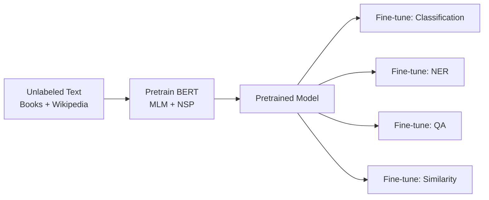

# Topic 11: Encoder Models (BERT Family)

> **Series**: Gen AI Scientist Interview Preparation
> **Topic**: 11 of 28
> **Scope**: BERT (MLM, NSP, fine-tuning), RoBERTa, ALBERT, DeBERTa, ELECTRA, sentence embeddings (Sentence-BERT), encoder models in the LLM era
> **Why this matters**: Encoder models defined a paradigm — pretrain on unlabeled data, fine-tune on your task. BERT is still the backbone for classification, NER, and embedding-based retrieval in production. DeBERTa's disentangled attention influenced later architectures. Understanding this family shows interviewers you can trace the evolution of ideas, not just memorize the latest model.
> **Previous**: [Topic 10: Positional Encodings](10_Positional_Encodings.md)
> **Next**: [Topic 12: Decoder Models (GPT & Open-Source LLMs)](12_GPT_Open_Source_LLMs.md)

---

## Table of Contents

1. [The Pretrain-Then-Fine-Tune Paradigm](#1-the-pretrain-then-fine-tune-paradigm)
2. [BERT — The Model That Changed NLP](#2-bert--the-model-that-changed-nlp)
3. [BERT's Input Representation](#3-berts-input-representation)
4. [Masked Language Modeling (MLM)](#4-masked-language-modeling-mlm)
5. [Next Sentence Prediction (NSP)](#5-next-sentence-prediction-nsp)
6. [Fine-Tuning BERT for Downstream Tasks](#6-fine-tuning-bert-for-downstream-tasks)
7. [RoBERTa — BERT Done Right](#7-roberta--bert-done-right)
8. [ALBERT — A Lite BERT](#8-albert--a-lite-bert)
9. [DeBERTa — Disentangled Attention](#9-deberta--disentangled-attention)
10. [ELECTRA — Replaced Token Detection](#10-electra--replaced-token-detection)
11. [Sentence-BERT and Embedding Models](#11-sentence-bert-and-embedding-models)
12. [Encoder Models in the LLM Era (2024-2026)](#12-encoder-models-in-the-llm-era-2024-2026)
13. [Full Comparison of BERT-Family Models](#13-full-comparison-of-bert-family-models)
14. [Interview Questions & Answers](#14-interview-questions--answers)

---

## 1. The Pretrain-Then-Fine-Tune Paradigm

### 1.1 Before BERT: The Feature Extraction Era

Before BERT (pre-2018), NLP systems were built in two disconnected stages:

1. **Pretrained embeddings** (Word2Vec, GloVe): Static word vectors, context-independent
2. **Task-specific architecture**: Designed from scratch for each task (LSTM for NER, CNN for classification, attention for QA)

The pretrained embeddings were frozen — they provided a starting point, but the real learning happened in the task-specific architecture. Each new task required designing a new model from scratch.

### 1.2 The BERT Revolution

BERT introduced a fundamentally different approach:

1. **Pretrain** a deep bidirectional transformer on massive unlabeled text → learn general language understanding
2. **Fine-tune** the entire pretrained model on a specific task with a small labeled dataset → adapt to the task



**Why this was revolutionary**:

- **Transfer learning for NLP**: One pretrained model works across dozens of tasks
- **Bidirectional context**: The first model to successfully use deep bidirectional representations
- **Democratization**: Teams with small labeled datasets (100-10K examples) could now build state-of-the-art NLP systems
- **State-of-the-art everywhere**: BERT immediately set records on 11 NLP benchmarks simultaneously

### 1.3 Why Encoder-Only?

BERT uses only the **encoder** portion of the transformer (see [Topic 9](09_Transformer_Architecture.md)). Why?

- **Bidirectional attention**: The encoder allows each token to attend to every other token, including tokens to its right. This creates rich representations that understand context from both directions.
- **Understanding > generation**: For tasks like classification, NER, and QA, you need to *understand* the full input — not generate new text. Bidirectional context is strictly more powerful for understanding.
- **No autoregressive constraint**: Since we're not generating text, we don't need the causal mask. Every token can freely attend to every other token.

---

## 2. BERT — The Model That Changed NLP

### 2.1 Architecture

BERT is a stack of transformer encoder blocks. Two sizes were released:

| | BERT-Base | BERT-Large |
|--|-----------|------------|
| Layers ($L$) | 12 | 24 |
| Hidden size ($d$) | 768 | 1024 |
| Attention heads ($h$) | 12 | 16 |
| FFN dimension | 3072 | 4096 |
| Parameters | 110M | 340M |
| Max sequence length | 512 | 512 |
| Vocabulary | 30,522 (WordPiece) | 30,522 |

Each encoder block:

$$
\mathbf{h}^{(l)} = \text{LayerNorm}\left(\mathbf{z}^{(l)} + \text{FFN}(\mathbf{z}^{(l)})\right)
$$

$$
\mathbf{z}^{(l)} = \text{LayerNorm}\left(\mathbf{h}^{(l-1)} + \text{MultiHeadSelfAttn}(\mathbf{h}^{(l-1)})\right)
$$

(Post-LN formulation — BERT uses the original transformer's normalization placement.)

### 2.2 Pretraining Data

- **BooksCorpus**: 800M words (11,038 unpublished books)
- **English Wikipedia**: 2,500M words (text only, no tables/lists/headers)
- **Total**: ~3.3B words, ~16GB of text

By modern standards, this is tiny. GPT-3 used 300B tokens; Llama 3 used 15T tokens. But in 2018, this was substantial.

### 2.3 Pretraining Objectives

BERT uses two pretraining objectives simultaneously:

1. **Masked Language Modeling (MLM)**: Predict randomly masked tokens (Section 4)
2. **Next Sentence Prediction (NSP)**: Predict whether two sentences are consecutive (Section 5)

$$
\mathcal{L}_{\text{BERT}} = \mathcal{L}_{\text{MLM}} + \mathcal{L}_{\text{NSP}}
$$

### 2.4 Training Details

| Parameter | Value |
|-----------|-------|
| Optimizer | Adam ($\beta_1 = 0.9, \beta_2 = 0.999$) |
| Learning rate | $1 \times 10^{-4}$ with warmup and linear decay |
| Warmup steps | 10,000 |
| Batch size | 256 sequences |
| Training steps | 1,000,000 |
| Dropout | 0.1 on all layers |
| Activation | GELU |
| Positional encoding | Learned absolute (max 512) |

---

## 3. BERT's Input Representation

BERT's input is constructed from three types of embeddings:

### 3.1 Token Embeddings

Standard embedding lookup. BERT uses **WordPiece** tokenization with a 30,522 token vocabulary.

Example: `"unaffable"` → `["un", "##aff", "##able"]` (the `##` prefix indicates a continuation subword)

### 3.2 Segment Embeddings

BERT often processes **sentence pairs** (for tasks like NLI, QA, NSP). Segment embeddings indicate which sentence each token belongs to:

- Sentence A tokens: $\mathbf{s}_A \in \mathbb{R}^d$ (same vector for all tokens in A)
- Sentence B tokens: $\mathbf{s}_B \in \mathbb{R}^d$ (same vector for all tokens in B)

Only two segment embeddings are learned: $\mathbf{s}_A$ and $\mathbf{s}_B$.

### 3.3 Position Embeddings

Learned absolute positional embeddings for positions 0 through 511.

### 3.4 Special Tokens

| Token | Purpose | Position |
|-------|---------|----------|
| `[CLS]` | Classification token — its final hidden state is used as the sequence representation | Always first (position 0) |
| `[SEP]` | Separator — marks boundaries between sentences | After each sentence |
| `[PAD]` | Padding — fills sequences to uniform length | End of sequence |
| `[MASK]` | Mask token — replaces tokens during MLM pretraining | Random positions |

### 3.5 Putting It Together

```
Input:      [CLS]  The  cat  sat  [SEP]  It  was  tired  [SEP]
             ↓      ↓    ↓    ↓    ↓      ↓   ↓    ↓      ↓
Token Emb:  E_CLS  E_The E_cat E_sat E_SEP E_It E_was E_tired E_SEP
             +      +    +    +    +      +   +    +      +
Segment:     S_A   S_A  S_A  S_A  S_A    S_B S_B  S_B    S_B
             +      +    +    +    +      +   +    +      +
Position:    P_0   P_1  P_2  P_3  P_4    P_5 P_6  P_7    P_8
             =      =    =    =    =      =   =    =      =
Input repr: [h_0,  h_1, h_2, h_3, h_4,  h_5, h_6, h_7,  h_8]
```

$$
\mathbf{h}_i^{(0)} = \text{TokenEmbed}(x_i) + \text{SegmentEmbed}(s_i) + \text{PositionEmbed}(i)
$$

### 3.6 The [CLS] Token

The `[CLS]` token deserves special attention. It:

- Has no inherent meaning — it's a learnable "summary" token
- Attends to all tokens in the sequence via self-attention
- Its final hidden state $\mathbf{h}_{\text{[CLS]}}^{(L)}$ serves as the **aggregate sequence representation**
- Used for classification tasks: $P(y) = \text{softmax}(\mathbf{W} \cdot \mathbf{h}_{\text{[CLS]}}^{(L)})$
- During pretraining, it's used for the NSP task
- During fine-tuning, it's used for the task-specific classification head

**Why [CLS] works**: Through self-attention across all layers, the [CLS] token accumulates information from the entire sequence. By the final layer, it has learned to encode whatever global information is needed for the task.

---

## 4. Masked Language Modeling (MLM)

### 4.1 The Core Idea

Randomly mask some input tokens and train the model to predict them from context:

$$
\mathcal{L}_{\text{MLM}} = -\mathbb{E}\left[\sum_{i \in \mathcal{M}} \log P(x_i \mid \mathbf{x}_{\setminus \mathcal{M}})\right]
$$

where $\mathcal{M}$ is the set of masked positions and $\mathbf{x}_{\setminus \mathcal{M}}$ is the input with those positions masked.

**Why this enables bidirectional context**: In autoregressive (GPT-style) training, predicting token $t$ can only use tokens $1, \ldots, t-1$ (left context). MLM allows predicting a masked token using **both** left and right context — the model sees the full sentence (minus the masks) and predicts the missing tokens.

### 4.2 The Masking Strategy (80/10/10)

BERT masks 15% of input tokens. But not all masked positions get the `[MASK]` token:

| Probability | Replacement | Reason |
|------------|------------|--------|
| 80% | Replace with `[MASK]` | Standard masking — forces prediction from context |
| 10% | Replace with a random token | Teaches the model that any position might need correction |
| 10% | Keep the original token | Biases the model toward the actual token, reduces pretrain-finetune discrepancy |

**Why 15%?** A trade-off:
- Too few (e.g., 5%): Model gets very little training signal per sequence — wasteful
- Too many (e.g., 40%): Too much context is removed — the task becomes too hard and the model can't learn meaningful representations
- 15% was empirically found to be optimal

**Why the 80/10/10 split?** The `[MASK]` token never appears during fine-tuning or inference. If MLM always used `[MASK]`, the model would only learn to make predictions when it sees `[MASK]` — creating a **pretrain-finetune discrepancy**. The 10% random and 10% unchanged tokens force the model to maintain good representations even when no `[MASK]` is present.

### 4.3 MLM vs Causal LM — The Fundamental Trade-off

|  | MLM (BERT) | Causal LM (GPT) |
|--|-----------|-----------------|
| **Context** | Bidirectional (sees left + right) | Unidirectional (sees only left) |
| **Training signal** | Only masked tokens (15% of input) | Every token (100% of input) |
| **Efficiency** | Lower — 85% of tokens provide no gradient | Higher — every token contributes to the loss |
| **Strength** | Superior understanding/representation | Superior generation |
| **Information per token** | More (sees full context) | Less (sees only left context) |

This efficiency gap is important: BERT sees training signal from only 15% of tokens per sequence, while GPT sees signal from 100%. To match the total training signal, BERT needs ~6.7× more data/compute.

### 4.4 MLM Prediction Head

For each masked position, BERT predicts the original token:

$$
P(x_i \mid \mathbf{x}_{\setminus \mathcal{M}}) = \text{softmax}(\mathbf{W}_{\text{vocab}} \cdot \text{GELU}(\mathbf{W}_{\text{proj}} \cdot \mathbf{h}_i^{(L)} + \mathbf{b}_{\text{proj}}) + \mathbf{b}_{\text{vocab}})
$$

The prediction head consists of:
1. Linear projection ($d \to d$)
2. GELU activation
3. Layer normalization
4. Linear projection to vocabulary ($d \to V$), weight-tied with the embedding matrix

---

## 5. Next Sentence Prediction (NSP)

### 5.1 The Task

Given two sentences A and B, predict whether B actually follows A in the original document:

$$
P(\text{IsNext} \mid A, B) = \text{softmax}(\mathbf{W}_{\text{NSP}} \cdot \mathbf{h}_{\text{[CLS]}}^{(L)})
$$

Training data construction:
- **50% positive**: B is the actual next sentence after A
- **50% negative**: B is a random sentence from the corpus

### 5.2 Why NSP Was Included

The original motivation: some tasks require understanding the **relationship** between two sentences (e.g., Natural Language Inference, Question Answering). NSP was meant to pretrain this capability.

### 5.3 Why NSP Was a Mistake

Subsequent research (especially RoBERTa) showed NSP **hurts** performance:

**Problem 1: Topic prediction, not coherence**
When the negative sample is from a different document, the model doesn't learn sentence coherence — it learns **topic matching**. If A is about basketball and B is about cooking, the model can trivially predict "NotNext" from topic mismatch alone, without learning anything about discourse structure.

**Problem 2: Confounds with MLM**
The NSP task uses the [CLS] token representation, which is also shaped by MLM. The two objectives may conflict — MLM pushes for token-level representations while NSP pushes for sentence-level discrimination.

**Problem 3: Insufficient data for the easy task**
With random negatives, the task is too easy. The model learns to solve it quickly and then the NSP loss contributes no useful gradient — wasting capacity.

**The verdict**: RoBERTa showed that removing NSP and using single long sentences (instead of sentence pairs) consistently improves performance across tasks.

---

## 6. Fine-Tuning BERT for Downstream Tasks

### 6.1 The Fine-Tuning Framework

Fine-tuning adds a task-specific **head** on top of BERT's pretrained representations and trains end-to-end:

$$
\text{Task Output} = \text{TaskHead}(\text{BERT}(\text{input}))
$$

The pretrained BERT weights are used as initialization and updated with a **small learning rate** (typically $2 \times 10^{-5}$ to $5 \times 10^{-5}$).

### 6.2 Task-Specific Architectures

#### Sentence Classification (Sentiment, Spam, Topic)

Use the [CLS] token representation:

$$
P(y \mid \mathbf{x}) = \text{softmax}(\mathbf{W} \cdot \mathbf{h}_{\text{[CLS]}}^{(L)} + \mathbf{b})
$$

```
[CLS] This movie was great [SEP]
  ↓
BERT Encoder (12 layers)
  ↓
[CLS] hidden state → Linear → softmax → {positive, negative}
```

#### Sentence-Pair Classification (NLI, Paraphrase Detection)

Use [CLS] representation with sentence pair input:

$$
\text{Input}: [\text{CLS}] \text{ Premise } [\text{SEP}] \text{ Hypothesis } [\text{SEP}]
$$

$$
P(y \mid \text{premise, hypothesis}) = \text{softmax}(\mathbf{W} \cdot \mathbf{h}_{\text{[CLS]}}^{(L)})
$$

#### Named Entity Recognition (NER)

Use **each token's** representation for per-token classification:

$$
P(y_i \mid \mathbf{x}) = \text{softmax}(\mathbf{W} \cdot \mathbf{h}_i^{(L)} + \mathbf{b})
$$

```
[CLS]  John   lives  in   New    York  [SEP]
  ↓      ↓      ↓     ↓     ↓      ↓     ↓
BERT Encoder
  ↓      ↓      ↓     ↓     ↓      ↓     ↓
  O    B-PER    O     O   B-LOC  I-LOC    O
```

#### Extractive Question Answering

Learn **start** and **end** positions of the answer span in the context:

$$
\text{Input}: [\text{CLS}] \text{ Question } [\text{SEP}] \text{ Context } [\text{SEP}]
$$

$$
P(\text{start} = i) = \frac{\exp(\mathbf{w}_s^T \mathbf{h}_i^{(L)})}{\sum_j \exp(\mathbf{w}_s^T \mathbf{h}_j^{(L)})}
$$

$$
P(\text{end} = i) = \frac{\exp(\mathbf{w}_e^T \mathbf{h}_i^{(L)})}{\sum_j \exp(\mathbf{w}_e^T \mathbf{h}_j^{(L)})}
$$

The answer is the span from argmax(start) to argmax(end).

```
[CLS] Where does John live? [SEP] John lives in New York City. [SEP]
                                                  ↑ start      ↑ end
```

### 6.3 Fine-Tuning Hyperparameters

| Parameter | Typical Range |
|-----------|--------------|
| Learning rate | $2 \times 10^{-5}$ to $5 \times 10^{-5}$ |
| Batch size | 16 or 32 |
| Epochs | 2-4 |
| Warmup | 10% of total steps |
| Max sequence length | 128-512 (task-dependent) |
| Weight decay | 0.01 |
| Dropout | 0.1 (keep pretrained dropout) |

**Why such a small learning rate?** The pretrained weights already encode rich language knowledge. A large learning rate would destroy this knowledge — a phenomenon called **catastrophic forgetting**. The small learning rate makes gentle adjustments to adapt the representations for the specific task.

### 6.4 How Much Data Do You Need?

BERT fine-tuning works with surprisingly little data:

| Dataset Size | Expected Quality |
|-------------|-----------------|
| 100 examples | Reasonable — already much better than training from scratch |
| 1K examples | Good — competitive with task-specific architectures trained on 10× more data |
| 10K examples | Excellent — approaches the ceiling for most tasks |
| 100K+ examples | Diminishing returns on BERT-level models |

This is the power of pretraining: the model already "knows" language. Fine-tuning just steers that knowledge toward the task.

---

## 7. RoBERTa — BERT Done Right

### 7.1 The Key Insight

RoBERTa (Liu et al., 2019) asked: "What if BERT's architecture is fine, but the training recipe is suboptimal?" They didn't change the architecture at all — they optimized the **training procedure**.

### 7.2 Changes from BERT

| Design Choice | BERT | RoBERTa |
|--------------|------|---------|
| **NSP task** | Yes | **Removed** |
| **Input format** | Sentence pairs (for NSP) | **Full-length single sentences** (packed to 512 tokens) |
| **Masking** | Static (same mask every epoch) | **Dynamic** (different random mask each epoch) |
| **Training data** | 16GB (Books + Wikipedia) | **160GB** (+ CC-News, OpenWebText, Stories) |
| **Batch size** | 256 | **8,000** |
| **Training steps** | 1M | 500K (but with 8K batch → more total tokens) |
| **Byte-Pair Encoding** | WordPiece (30K vocab) | **BPE (50K vocab)** |

### 7.3 Why Each Change Matters

**Removing NSP**: As discussed in Section 5.3, NSP was shown to be harmful or neutral for all downstream tasks. Removing it and using single long sentences lets every token contribute to MLM.

**Dynamic masking**: BERT applies masking once during data preprocessing — the model sees the same masks in every epoch. RoBERTa generates a new random mask each time a sequence is fed to the model. This provides more diverse training signal, especially when training for many epochs.

**More data**: Increasing training data from 16GB to 160GB (10×) significantly improves representations. This was a key finding — BERT was undertrained.

**Larger batches**: Larger batch sizes improve the stability of gradient estimates and allow higher learning rates. BERT's batch size of 256 was suboptimal; 8K showed consistent improvements.

### 7.4 Results

RoBERTa set new state-of-the-art on GLUE, SQuAD, and RACE benchmarks, surpassing BERT-Large despite having the same architecture. This demonstrated that **training procedure matters as much as model architecture**.

### 7.5 Lesson for AI Scientists

RoBERTa's lesson is critical for interviews: **before redesigning the architecture, optimize the training recipe**. Many "architectural improvements" in NLP papers actually came from better training — more data, larger batches, longer training, better hyperparameters. Always ablate properly.

---

## 8. ALBERT — A Lite BERT

### 8.1 Motivation

BERT-Large has 340M parameters. ALBERT (Lan et al., 2020) asked: can we get similar or better performance with far fewer parameters?

### 8.2 Two Key Innovations

#### Innovation 1: Factorized Embedding Parameters

In BERT, the embedding dimension equals the hidden dimension: $E = d_{\text{model}}$. This means the embedding matrix is $V \times d_{\text{model}}$ — large and parameter-heavy.

ALBERT factorizes this into two smaller matrices:

$$
V \times d_{\text{model}} \longrightarrow (V \times E) \times (E \times d_{\text{model}})
$$

where $E \ll d_{\text{model}}$ (e.g., $E = 128$ instead of $d = 768$).

**Why this makes sense**: Token embeddings are **context-independent** — they need only enough capacity to distinguish tokens. The hidden dimension is **context-dependent** — it needs capacity for complex contextual representations. These are fundamentally different requirements, so tying them ($E = d$) is suboptimal.

**Parameter savings**: For $V = 30000, d = 768$:
- BERT: $30000 \times 768 = 23M$ embedding parameters
- ALBERT ($E = 128$): $30000 \times 128 + 128 \times 768 = 3.84M + 0.098M \approx 3.9M$
- **Savings: ~6×** reduction in embedding parameters

#### Innovation 2: Cross-Layer Parameter Sharing

ALBERT shares parameters **across all transformer layers**:

$$
\text{Block}_1 = \text{Block}_2 = \cdots = \text{Block}_L
$$

The same set of weights is used for every layer. This dramatically reduces parameters:

| Model | Layers | Unique Layer Params | Total |
|-------|--------|-------------------|-------|
| BERT-Large | 24 | 24 sets | 340M |
| ALBERT-xxlarge | 12 | **1 set** | **235M** (but $d = 4096$) |

ALBERT can use a **much wider** hidden dimension ($d = 4096$ vs BERT-Large's $d = 1024$) because sharing eliminates the parameter multiplication by $L$.

**What sharing means**: Layer 1 and Layer 12 apply the exact same linear transformations. But the **inputs** to each layer are different (the output of the previous layer), so the representations still evolve across depth. Think of it as applying the same function repeatedly — like an iterative refinement process.

### 8.3 SOP Replaces NSP

ALBERT replaces NSP with **Sentence Order Prediction (SOP)**:

- **Positive**: Two consecutive sentences in order (A, B)
- **Negative**: Two consecutive sentences **swapped** (B, A)

SOP is harder than NSP because both sentences are from the same document (same topic). The model must learn **discourse coherence**, not just topic matching.

### 8.4 Trade-offs

| Aspect | ALBERT's Advantage | ALBERT's Disadvantage |
|--------|-------------------|----------------------|
| Parameter count | Much smaller | — |
| Inference speed | — | **Slower** — same compute per layer, just fewer unique params |
| Performance | Competitive or better | — |
| Memory (training) | Less (gradient memory proportional to unique params) | — |

**Critical point**: ALBERT reduces **parameters** but not **computation**. Each layer still requires the same matrix multiplications — sharing just means the weight matrices happen to be identical. Inference speed is the same as a model with the same number of layers.

---

## 9. DeBERTa — Disentangled Attention

### 9.1 The Key Idea

DeBERTa (He et al., 2021) argues that BERT conflates two types of information in its attention scores:

1. **Content-to-content**: What does this word mean, and what does that word mean?
2. **Content-to-position**: What does this word mean, and where is that word?
3. **Position-to-content**: Where is this word, and what does that word mean?
4. **Position-to-position**: Where is this word, and where is that word?

BERT computes a single attention score that mixes all four. DeBERTa **disentangles** content and position into separate representations.

### 9.2 Mathematical Formulation

Each token has two representations:
- $\mathbf{H}_i$ — the **content** vector (what the token means in context)
- $\mathbf{P}_{i|j}$ — the **relative position** vector (encoding position $i$ relative to position $j$)

The attention score between positions $i$ and $j$ decomposes into three terms:

$$
A_{ij} = \underbrace{\mathbf{H}_i \mathbf{W}_Q^c {\mathbf{W}_K^c}^T \mathbf{H}_j^T}_{(1) \text{ content-to-content}} + \underbrace{\mathbf{H}_i \mathbf{W}_Q^c {\mathbf{W}_K^p}^T \mathbf{P}_{j|i}^T}_{(2) \text{ content-to-position}} + \underbrace{\mathbf{P}_{i|j} \mathbf{W}_Q^p {\mathbf{W}_K^c}^T \mathbf{H}_j^T}_{(3) \text{ position-to-content}}
$$

Note: the position-to-position term (4) is dropped as it carries minimal information.

**Why three separate projection matrices?** Each interaction type may require different learned transformations:
- $\mathbf{W}_Q^c, \mathbf{W}_K^c$: content query and key projections
- $\mathbf{W}_K^p$: position key projection (how is position used as a key?)
- $\mathbf{W}_Q^p$: position query projection (how is position used as a query?)

### 9.3 Relative Position Encoding

DeBERTa uses **relative position embeddings** (not absolute). The position encoding $\mathbf{P}_{i|j}$ depends only on the offset $\delta = i - j$, with clipping:

$$
\mathbf{P}_{i|j} = \mathbf{P}_{\text{clip}(i-j, -k, k)}
$$

where $k$ is the maximum relative distance (default: $k = 512$). This is similar to Shaw et al.'s approach (see [Topic 10](10_Positional_Encodings.md)) but used within the disentangled framework.

### 9.4 Enhanced Mask Decoder (EMD)

For the MLM prediction head, DeBERTa adds **absolute position information** at the very end (just before the softmax). The intuition: relative position is sufficient for encoding contextual relationships, but for predicting the masked token, knowing the absolute position can help (e.g., certain tokens are more likely at the start of sentences).

This is done by incorporating absolute position embeddings only in the decoding layer:

$$
\mathbf{h}_i^{\text{decode}} = \mathbf{h}_i^{(L)} + \mathbf{p}_i^{\text{abs}}
$$

### 9.5 DeBERTa v3

DeBERTa v3 (2023) further improves with:
- **ELECTRA-style pretraining** (replaced token detection — see Section 10)
- **Gradient-disentangled embedding sharing**: The generator and discriminator share embeddings, but gradients from the discriminator don't flow back through the shared embeddings to the generator
- State-of-the-art on SuperGLUE and many NLU benchmarks

### 9.6 Why DeBERTa Matters

DeBERTa shows that **how you handle position matters enormously**. By separating content and position:

1. The model can learn distinct attention patterns for "attend to what's semantically relevant" vs "attend to what's nearby"
2. Relative position avoids the hard sequence length limit of learned absolute embeddings
3. Performance improves significantly, especially on tasks requiring precise positional reasoning (NER, span extraction)

DeBERTa v3 is currently the **strongest encoder-only model** and the default recommendation for classification and NLU tasks.

---

## 10. ELECTRA — Replaced Token Detection

### 10.1 The Efficiency Problem with MLM

BERT's MLM masks 15% of tokens and only computes loss on those tokens. This means 85% of the input provides no training signal. ELECTRA (Clark et al., 2020) addresses this inefficiency.

### 10.2 The Architecture: Generator-Discriminator

ELECTRA uses a two-model setup inspired by GANs (but trained differently):

**Generator** (small BERT): A small MLM model that predicts masked tokens

$$
x_i^{\text{gen}} \sim P_G(x_i \mid \mathbf{x}_{\text{masked}})
$$

**Discriminator** (full-size BERT): Classifies **every** token as "original" or "replaced"

$$
D(x_i) = \text{sigmoid}(\mathbf{w}^T \mathbf{h}_i)
$$

```
Original:     The  chef  cooked  the  meal
Masked:       The  [M]   cooked  the  [M]
Generator:    The  artist cooked  the  meal    (artist is wrong, meal is correct)
                    ↓                   ↓
Labels:       orig  REPLACED  orig  orig  orig
                    ↓                   ↓
Discriminator predicts: original or replaced? (for ALL tokens)
```

### 10.3 Training

The two models are trained jointly:

$$
\mathcal{L} = \mathcal{L}_{\text{MLM}}^{\text{generator}} + \lambda \cdot \mathcal{L}_{\text{RTD}}^{\text{discriminator}}
$$

**Generator loss**: Standard MLM loss on masked positions

**Discriminator loss**: Binary cross-entropy on ALL positions

$$
\mathcal{L}_{\text{RTD}} = -\sum_{i=1}^{n} \left[\mathbb{1}(x_i^{\text{gen}} = x_i) \log D(x_i) + \mathbb{1}(x_i^{\text{gen}} \neq x_i) \log(1 - D(x_i))\right]
$$

**Key differences from GANs**:
- The generator is trained with **MLE** (maximum likelihood), not adversarial loss
- No minimax game — both models improve independently
- The generator is deliberately kept **small** (~1/4 to 1/3 of discriminator size)

### 10.4 Why ELECTRA Is More Efficient

| | BERT (MLM) | ELECTRA (RTD) |
|--|-----------|--------------|
| Tokens with training signal | 15% (masked only) | **100%** (all tokens) |
| Training signal per token | Predict from $V$ tokens (hard, but rare) | Binary (easy, but dense) |
| Training efficiency | ~6.7× less signal per sequence | Full signal utilization |

The result: ELECTRA matches BERT's performance with **1/4 of the compute** and exceeds it with equal compute.

### 10.5 After Pretraining

Only the **discriminator** is kept for fine-tuning (the generator is discarded). The discriminator is fine-tuned exactly like BERT — add a task-specific head and train end-to-end.

### 10.6 Why the Generator Must Be Small

If the generator is as good as the discriminator, the replaced tokens would be almost indistinguishable from originals — the discrimination task becomes too easy, and the discriminator doesn't learn useful representations.

A small generator makes "mistakes" that are plausible but detectable (e.g., replacing "chef" with "artist" — grammatically correct but contextually wrong). This forces the discriminator to develop deep language understanding.

---

## 11. Sentence-BERT and Embedding Models

### 11.1 BERT's Problem with Sentence Similarity

Using BERT for sentence similarity naively requires encoding **every pair** through the full model:

$$
\text{similarity}(A, B) = \text{BERT}([\text{CLS}] A [\text{SEP}] B [\text{SEP}])
$$

For $n$ sentences, this requires $\binom{n}{2} = O(n^2)$ forward passes. Finding the most similar pair among 10,000 sentences requires **~50 million** BERT inferences — completely infeasible.

### 11.2 Sentence-BERT (SBERT)

Reimers & Gurevych (2019) proposed Sentence-BERT: use a **siamese network** structure to produce fixed-size sentence embeddings independently.

**Architecture**: Two BERT encoders with **shared weights** (siamese). Each sentence is encoded independently:

$$
\mathbf{u} = \text{pool}(\text{BERT}(A)), \qquad \mathbf{v} = \text{pool}(\text{BERT}(B))
$$

The pooling strategy is typically **mean pooling** over all token representations (better than [CLS] pooling for embeddings):

$$
\text{pool}(\mathbf{H}) = \frac{1}{n}\sum_{i=1}^{n} \mathbf{h}_i^{(L)}
$$

**Similarity** is computed via cosine similarity:

$$
\text{sim}(A, B) = \frac{\mathbf{u} \cdot \mathbf{v}}{\|\mathbf{u}\| \cdot \|\mathbf{v}\|}
$$

### 11.3 Training SBERT

SBERT is fine-tuned on sentence pairs with different objectives:

**For NLI data** (entailment, contradiction, neutral):

$$
\text{Input}: (\mathbf{u}, \mathbf{v}, |\mathbf{u} - \mathbf{v}|) \to \text{softmax} \to \{entailment, contradiction, neutral\}
$$

**For similarity data** (STS benchmarks):

$$
\mathcal{L} = \text{MSE}(\cos(\mathbf{u}, \mathbf{v}), \text{gold\_score})
$$

**Contrastive learning** (modern approach):

$$
\mathcal{L} = -\log \frac{\exp(\text{sim}(\mathbf{u}_i, \mathbf{v}_i) / \tau)}{\sum_{j} \exp(\text{sim}(\mathbf{u}_i, \mathbf{v}_j) / \tau)}
$$

where $(\mathbf{u}_i, \mathbf{v}_i)$ is a positive pair and all other pairs in the batch are negatives. $\tau$ is a temperature parameter.

### 11.4 The Key Advantage: Decoupled Encoding

With SBERT, each sentence is encoded **once** into a fixed-size vector. These vectors can be:

- **Precomputed** and stored
- **Compared** via cosine similarity (a simple dot product after normalization)
- **Indexed** in a vector database for fast approximate nearest neighbor search

Finding the most similar pair among 10,000 sentences: encode all 10,000 (10,000 forward passes), then compare all pairs with cosine similarity (instant, using FAISS or similar). Total time: seconds instead of hours.

### 11.5 Modern Embedding Models

The SBERT paradigm evolved into a family of modern embedding models:

| Model | Base | Dimensions | Training | Notable Feature |
|-------|------|-----------|----------|-----------------|
| **SBERT** (2019) | BERT | 768 | NLI + STS | Pioneered sentence embeddings |
| **E5** (2022) | Various | 768-1024 | Contrastive on text pairs | "Embed Everything Everywhere" |
| **BGE** (2023) | BERT/RetroMAE | 768-1024 | Contrastive + instruction | State-of-the-art open-source |
| **GTE** (2023) | BERT | 768 | Multi-stage contrastive | Strong on retrieval |
| **Nomic Embed** (2024) | BERT variant | 768 | Contrastive + Matryoshka | Flexible dimensionality |
| **OpenAI text-embedding-3** | Proprietary | 256-3072 | Unknown | Matryoshka, strong commercial |
| **Cohere Embed v3** | Proprietary | 1024 | Unknown | Multilingual, compression |

### 11.6 Key Training Techniques for Modern Embedding Models

**Hard negative mining**: Instead of random negatives (easy to distinguish), use negatives that are semantically similar but not matches. This forces the model to learn fine-grained distinctions.

**In-batch negatives**: Other positive pairs in the same batch serve as negatives. With batch size $B$, each positive pair gets $B-1$ negatives for free.

**Matryoshka Representation Learning**: Train embeddings so that the first $k$ dimensions (for any $k$) form a useful lower-dimensional embedding. This allows truncating embeddings for efficiency without retraining.

**Instruction-based embeddings** (E5, BGE): Prepend a task instruction to the input:
- "Represent this document for retrieval: ..."
- "Represent this query for searching relevant passages: ..."

This allows a single model to produce different embeddings depending on the downstream task.

---

## 12. Encoder Models in the LLM Era (2024-2026)

### 12.1 Are Encoder Models Dead?

No. Despite the dominance of decoder-only LLMs, encoder models remain the best choice for several critical use cases:

| Use Case | Why Encoder Wins |
|----------|-----------------|
| **Text classification** | Faster, cheaper, more accurate per parameter than prompting an LLM |
| **Named entity recognition** | Per-token classification is natural; LLMs often struggle with exact span boundaries |
| **Sentence embeddings / retrieval** | Bidirectional encoding produces superior embeddings; decoders can't naturally produce fixed-size vectors |
| **Semantic search** | Embed-then-search is orders of magnitude faster than LLM-based comparison |
| **Reranking** | Cross-encoder reranking (feeding query+document through BERT) is the gold standard |
| **Real-time applications** | BERT inference: ~5ms. GPT-4 generation: ~500ms-2s |

### 12.2 When to Use Encoder vs Decoder

```
                       ┌──────────────────────┐
                       │   What's the task?    │
                       └──────────┬───────────┘
                                  │
                    ┌─────────────┴─────────────┐
                    │                           │
              Understanding?              Generation?
                    │                           │
              ┌─────┴─────┐              Decoder-only
              │           │              (GPT, Llama)
         Classification  Embeddings
         NER, Spans      Retrieval
              │           │
        Encoder model   Encoder model
        (DeBERTa v3)    (BGE, E5, GTE)
```

### 12.3 The Cost Argument

For production classification systems:

| Approach | Model | Latency | Cost per 1M requests |
|----------|-------|---------|---------------------|
| Fine-tuned DeBERTa v3 | 304M params | ~5ms | ~$2 (self-hosted) |
| GPT-4 zero-shot | ~1.8T params | ~1-2s | ~$3,000 (API) |
| GPT-4 fine-tuned | ~1.8T params | ~500ms | ~$6,000 (API) |

For high-volume production workloads, encoder models are **1000× cheaper** with comparable or better accuracy.

### 12.4 Encoder Models as Components in LLM Systems

Encoder models play critical roles within modern LLM systems:

1. **RAG retrieval**: Embedding models (BGE, E5) encode documents and queries for vector search
2. **Reranking**: Cross-encoder models rerank retrieved results before feeding to the LLM
3. **Classification guardrails**: Fast encoder classifiers detect toxic input/output
4. **Intent detection**: Route user queries to appropriate agents/tools

---

## 13. Full Comparison of BERT-Family Models

### 13.1 Architecture Comparison

| Model | Year | Innovation | Params (base) | Key Result |
|-------|------|-----------|---------------|------------|
| **BERT** | 2018 | MLM + NSP, bidirectional pretrain-finetune | 110M | SOTA on 11 benchmarks |
| **RoBERTa** | 2019 | Better training recipe (no NSP, more data, dynamic mask) | 125M | Showed training > architecture |
| **ALBERT** | 2020 | Factorized embedding + cross-layer sharing | 12M-235M | Fewer params, same/better performance |
| **DeBERTa** | 2021 | Disentangled attention (content ⊥ position) | 134M-304M | Best encoder architecture |
| **ELECTRA** | 2020 | Replaced token detection (100% token signal) | 14M-335M | 4× more efficient than MLM |
| **DeBERTa v3** | 2023 | DeBERTa + ELECTRA-style training | 86M-304M | **Current best encoder model** |

### 13.2 Performance Evolution (Approximate GLUE/SuperGLUE scores)

```
BERT-base (2018)    ████████████████████░░░░░░  ~80
RoBERTa-base (2019) ██████████████████████░░░░  ~85
ELECTRA-base (2020) ██████████████████████░░░░  ~85
ALBERT-xxl (2020)   ███████████████████████░░░  ~88
DeBERTa-v3 (2023)   █████████████████████████░  ~91
                     0                          100
```

### 13.3 Decision Matrix: Which Encoder to Use?

| Scenario | Recommendation |
|----------|---------------|
| Best quality, no constraints | **DeBERTa v3 large** |
| Production with latency constraints | **DeBERTa v3 base** or **ELECTRA base** |
| Memory-constrained deployment | **ALBERT base** or **ELECTRA small** |
| Sentence embeddings | **Fine-tuned BGE/E5** (built on encoder backbones) |
| Multilingual | **XLM-RoBERTa** or **mDeBERTa** |
| Low-resource fine-tuning (< 100 examples) | **DeBERTa v3** (best few-shot among encoders) |

---

## 14. Interview Questions & Answers

### Q1: How does MLM work? Why mask 15%? What is the 80/10/10 masking strategy?

**A**: **Masked Language Modeling** randomly selects 15% of input tokens and trains the model to predict their original identity from the surrounding context:

$$
\mathcal{L}_{\text{MLM}} = -\sum_{i \in \mathcal{M}} \log P(x_i \mid \mathbf{x}_{\setminus \mathcal{M}})
$$

**Why 15%?** It's a trade-off between training signal and context quality:
- Too few masks (5%): Wastes sequences — each sequence provides little gradient signal, requiring more data/steps
- Too many masks (40%): Removes too much context — the prediction task becomes too hard and representations degrade
- 15% was empirically validated as optimal. Later work (SpanBERT) showed masking contiguous spans of ~15% total works even better.

**The 80/10/10 strategy** for the selected 15%:
- **80% → [MASK]**: Standard masking, forces prediction from context
- **10% → random token**: Teaches the model that any token might be "wrong" and need correction, even without [MASK] present
- **10% → original token**: Biases the model toward the correct token and reduces the pretrain-finetune gap (since [MASK] never appears at inference time)

Without 10/10, the model would learn to predict *only* when it sees [MASK] — failing to transfer to downstream tasks where no [MASK] exists. The mixed strategy ensures the model maintains good representations for *all* tokens.

---

### Q2: Why did RoBERTa remove NSP? What evidence showed it was harmful?

**A**: RoBERTa systematically ablated BERT's design choices and found NSP hurts performance on most benchmarks. Their experiments compared four input formats:

1. **Segment-Pair + NSP** (BERT's approach): Two segments from the same or different documents, with NSP loss
2. **Sentence-Pair + NSP**: Two natural sentences (not segments), with NSP loss
3. **Full Sentences (no NSP)**: Pack consecutive sentences from one document until 512 tokens, no NSP
4. **Doc Sentences (no NSP)**: Same as (3) but don't cross document boundaries

**Results**: Format (4) performed best, and (3) was close. Both NSP formats (1, 2) performed worse.

**Why NSP is harmful**:

1. **Topic shortcut**: Random negative sentences come from different documents. The model learns topic matching (trivial) instead of discourse coherence (useful). The task is too easy and teaches nothing valuable.

2. **Shorter sequences**: To create sentence pairs, BERT uses shorter segments. This reduces the amount of useful MLM training signal per sequence.

3. **Conflicting objectives**: The [CLS] token must serve both NSP and downstream tasks. Optimizing for NSP may push [CLS] representations in directions that are suboptimal for other tasks.

The key lesson: **ablate everything**. What seems like a reasonable inductive bias (learning sentence relationships) can actually be counterproductive when the implementation creates shortcuts.

---

### Q3: How does DeBERTa's disentangled attention improve over BERT?

**A**: BERT computes a single attention score that mixes content and position information:

$$
A_{ij}^{\text{BERT}} = (\mathbf{x}_i + \mathbf{p}_i)\mathbf{W}^Q {\mathbf{W}^K}^T (\mathbf{x}_j + \mathbf{p}_j)^T
$$

This creates four entangled terms (content×content, content×position, position×content, position×position) that share the same projection matrices.

DeBERTa **disentangles** these into three explicit terms with **separate projections**:

$$
A_{ij}^{\text{DeBERTa}} = \underbrace{\mathbf{H}_i \mathbf{W}_Q^c {\mathbf{W}_K^c}^T \mathbf{H}_j^T}_{\text{content-content}} + \underbrace{\mathbf{H}_i \mathbf{W}_Q^c {\mathbf{W}_K^p}^T \mathbf{P}_{j|i}^T}_{\text{content-position}} + \underbrace{\mathbf{P}_{i|j} \mathbf{W}_Q^p {\mathbf{W}_K^c}^T \mathbf{H}_j^T}_{\text{position-content}}
$$

**Why this helps**:

1. **Dedicated projections**: Content-to-position attention uses a different key projection ($\mathbf{W}_K^p$) than content-to-content ($\mathbf{W}_K^c$). Each interaction type can learn its optimal transformation independently.

2. **Relative position**: DeBERTa uses relative position embeddings $\mathbf{P}_{i|j}$ that depend on the offset $i - j$. This is more linguistically natural than BERT's absolute positions — the relationship between adjacent words shouldn't depend on whether they're at the start or end of a sentence.

3. **Enhanced Mask Decoder**: Absolute position is added back only at the MLM prediction layer, giving the model the benefit of relative position for contextual encoding and absolute position for token prediction.

The result: DeBERTa consistently outperforms BERT and RoBERTa across all benchmarks, with the biggest gains on tasks requiring positional reasoning (NER, span extraction, question answering).

---

### Q4: For a text classification task with 10K labeled examples, would you use BERT or GPT-4? Why?

**A**: **Fine-tuned DeBERTa v3** (BERT-family), not GPT-4. Here's the reasoning:

**Accuracy**: With 10K examples, a fine-tuned encoder typically matches or exceeds GPT-4's zero-shot/few-shot classification accuracy. The encoder model specializes entirely on your task, while GPT-4 is a general-purpose model.

**Cost**: The math is decisive:
- Fine-tuned DeBERTa v3 (304M params): Self-host on a single GPU, ~$0.002 per 1K classifications
- GPT-4 API: ~$3-10 per 1K classifications (depending on prompt length)
- **1500-5000× cost difference** at scale

**Latency**:
- DeBERTa: ~5-10ms per classification (single forward pass, no generation)
- GPT-4: ~500ms-2s (autoregressive generation of the label)
- **50-200× faster**

**Reliability**:
- DeBERTa: Deterministic output, always produces a valid class label
- GPT-4: May produce unexpected formats, require parsing, or hallucinate labels not in the taxonomy

**Privacy**: Fine-tuned DeBERTa runs on your infrastructure. GPT-4 sends data to an external API.

**When you'd choose GPT-4 instead**:
- You have < 50 labeled examples (insufficient for fine-tuning)
- The task requires reasoning or world knowledge, not just pattern matching
- You need it *today* and can't wait to fine-tune
- The classification taxonomy changes frequently (re-prompting is easier than retraining)

---

### Q5: Explain ELECTRA's replaced token detection. Why is it more efficient than MLM?

**A**: ELECTRA replaces BERT's MLM with **Replaced Token Detection (RTD)**. The setup:

1. **Generator** (small MLM model): Predicts masked tokens, producing plausible but sometimes incorrect replacements
2. **Discriminator** (full-size model): Classifies every token as "original" or "replaced"

$$
\mathcal{L}_{\text{RTD}} = -\sum_{i=1}^{n} \left[y_i \log D(x_i) + (1 - y_i)\log(1 - D(x_i))\right]
$$

where $y_i = 1$ if token $i$ is original, $y_i = 0$ if replaced.

**Why more efficient**:

The fundamental difference: **MLM computes loss on 15% of tokens; RTD computes loss on 100%**.

In BERT, 85% of tokens in every sequence contribute zero gradient — they're not masked, so there's no prediction to make. In ELECTRA, every single token must be classified, providing ~6.7× more training signal per sequence.

The binary classification (original vs replaced) is easier per token than predicting from a vocabulary of 30K+ tokens. But the **density** of signal (every token) more than compensates. ELECTRA matches BERT's performance with 1/4 the compute.

**After pretraining**: Only the discriminator is kept. The generator is discarded. Fine-tuning proceeds exactly as with BERT.

---

### Q6: Compare the training objectives: MLM, CLM, RTD, and span corruption. When is each best?

**A**:

| Objective | Used By | How It Works | Signal Density | Best For |
|-----------|---------|-------------|---------------|----------|
| **MLM** | BERT, RoBERTa | Predict masked tokens (15%) | Low (15%) | Bidirectional understanding |
| **CLM** | GPT, Llama | Predict next token (100%) | High (100%) | Generation, general-purpose |
| **RTD** | ELECTRA | Detect replaced tokens (100%) | High (100%) | Efficient bidirectional encoding |
| **Span Corruption** | T5, UL2 | Predict masked spans | Medium (~15%) | Conditional generation |

**MLM** creates strong bidirectional representations but is compute-inefficient. Use when you need an encoder model and have enough compute.

**CLM** is the most scalable — it naturally produces generative models, scaling laws are well understood, and emergent abilities (ICL, reasoning) appear reliably. Use for any general-purpose or generation task.

**RTD** is the most compute-efficient way to train an encoder. Use when you need strong encoder representations on a limited compute budget. DeBERTa v3 combines DeBERTa's disentangled attention with ELECTRA-style RTD — the best of both worlds.

**Span Corruption** (T5) masks contiguous spans and has the model generate the missing text. This bridges understanding and generation. Use for encoder-decoder models targeting structured output tasks (translation, summarization).

---

### Q7: What is the pretrain-finetune discrepancy? How do different models address it?

**A**: The **pretrain-finetune discrepancy** is the mismatch between the model's pretraining and fine-tuning/inference environments.

**BERT's discrepancy**: The `[MASK]` token appears during pretraining (15% of the time) but **never** during fine-tuning or inference. The model learns to make predictions when it sees `[MASK]`, but this signal isn't available at inference.

BERT mitigates this with the **80/10/10 strategy**: 10% of selected tokens are replaced with random tokens, and 10% are kept unchanged. This teaches the model to predict/analyze tokens even without `[MASK]`, partially bridging the gap.

**ELECTRA's solution**: RTD has **no discrepancy at all**. The discriminator never sees `[MASK]` — it always processes real (or generator-replaced) text. At fine-tuning, it processes real text. The pretraining and fine-tuning inputs are identically distributed.

**GPT/CLM models**: Minimal discrepancy. The model always processes normal text and predicts the next token. At fine-tuning, the input format may change (adding instruction templates), but the fundamental task (process text, predict next token) remains the same.

This is another reason ELECTRA and CLM models often work well in practice — they don't suffer from the artificial `[MASK]` token mismatch.

---

### Q8: Why does mean pooling work better than [CLS] pooling for sentence embeddings?

**A**: For generating sentence embeddings (used in retrieval, similarity), **mean pooling** (averaging all token representations) consistently outperforms using the `[CLS]` token. Here's why:

**[CLS] pooling problems**:

1. **Not trained for sentence representation**: During BERT pretraining, [CLS] is optimized for NSP (or not specifically optimized in RoBERTa). It's not trained to capture the full semantic content of a sentence.

2. **Anisotropy**: BERT's representations occupy a narrow cone in the embedding space (not uniformly distributed). The [CLS] vector is particularly concentrated, making cosine similarity uninformative — all sentences appear similar.

3. **Single vector bottleneck**: [CLS] must compress the entire sequence's meaning through a single position's attention across 12+ layers. Information about specific tokens may be lost.

**Mean pooling advantages**:

1. **Distributes information**: Averaging all $n$ token representations captures information from every position. If important information is concentrated at certain positions, it's still included.

2. **More robust**: Less sensitive to any single position's quirks. The average smooths out per-token noise.

3. **Better geometry**: Mean-pooled embeddings tend to have better isotropy (more uniformly distributed in the space), making cosine similarity more discriminative.

**In practice**: SBERT and modern embedding models use mean pooling as the default, often combined with a learned projection layer and contrastive training to further improve the embedding quality.

---

### Q9: Explain ALBERT's cross-layer parameter sharing. Does it reduce computation?

**A**: ALBERT shares all parameters across transformer layers:

$$
\theta_{\text{layer}_1} = \theta_{\text{layer}_2} = \cdots = \theta_{\text{layer}_L}
$$

All attention weights ($\mathbf{W}^Q, \mathbf{W}^K, \mathbf{W}^V, \mathbf{W}^O$) and FFN weights ($\mathbf{W}_1, \mathbf{W}_2$) are identical across layers.

**What it reduces**:
- **Parameter count**: Dramatically — instead of $L$ sets of layer parameters, just 1 set. ALBERT-xxlarge has 235M params vs BERT-Large's 340M, despite having $d = 4096$ (4× wider).
- **Memory for parameters**: Proportional reduction (important for model distribution and storage).

**What it does NOT reduce**:
- **Computation**: Each layer still performs the same matrix multiplications. 12 layers with shared weights require the same FLOPs as 12 layers with unique weights.
- **Inference latency**: Identical to a model with the same number of layers and dimensions.
- **Activation memory**: Each layer still produces unique activations (because inputs differ), so activation memory is the same.

**How it still works**: Even with shared weights, representations evolve across layers because the *inputs* to each layer are different. Layer 1 operates on the raw embeddings; layer 2 operates on the output of layer 1 (which has been transformed). The same function applied iteratively produces different outputs — like a recurrent network unrolled over depth.

**The insight**: Transformers have significant parameter redundancy. Many layers learn similar transformations, so sharing doesn't hurt much. But this also means the "depth" of unique computation may be less than the number of layers suggests.

---

### Q10: Trace the evolution from BERT to DeBERTa v3. What was learned at each step?

**A**: Each model in the lineage addressed a specific weakness of its predecessor:

**BERT (2018)**: Proved pretrain-finetune works for NLP. Established MLM + bidirectional encoding as the paradigm.
- **Weakness**: Suboptimal training recipe; NSP was harmful; static masking; limited data.

**RoBERTa (2019)**: Fixed the training recipe without changing architecture.
- Removed NSP, added dynamic masking, 10× more data, larger batches
- **Lesson**: Training procedure matters as much as architecture. Always ablate.
- **Weakness**: Still uses absolute positional embeddings; still MLM (15% signal).

**ALBERT (2020)**: Addressed parameter efficiency.
- Factorized embeddings, cross-layer parameter sharing, SOP replaces NSP
- **Lesson**: Transformers have massive parameter redundancy. Width matters more than unique depth.
- **Weakness**: Same compute as BERT despite fewer params. Sharing limits representational diversity.

**ELECTRA (2020)**: Addressed training efficiency.
- Replaced token detection → 100% token-level signal
- **Lesson**: The density of training signal matters. Binary classification on all tokens beats prediction on 15%.
- **Weakness**: Generator-discriminator training adds complexity; standard attention.

**DeBERTa (2021)**: Addressed how position is encoded.
- Disentangled content and position; relative position encoding; Enhanced Mask Decoder
- **Lesson**: Separating content and position representations yields better attention patterns. Relative position > absolute.
- **Weakness**: Still MLM (15% signal).

**DeBERTa v3 (2023)**: Combined the best of all previous work.
- DeBERTa's disentangled attention + ELECTRA's RTD + gradient-disentangled embedding sharing
- **Current state-of-the-art** for encoder-only models
- **Lesson**: The best model comes from combining the best ideas, not inventing everything from scratch.

```
BERT ─── training ──► RoBERTa
  │
  ├── efficiency ──► ALBERT (param sharing)
  │
  ├── efficiency ──► ELECTRA (RTD training)
  │
  └── attention ───► DeBERTa (disentangled)
                        │
                        └── + ELECTRA ──► DeBERTa v3 (SOTA)
```

---

*This topic completes the encoder model family. Next: [Topic 12: Decoder Models (GPT & Open-Source LLMs)](12_GPT_Open_Source_LLMs.md) — the architecture that won, from GPT-1 to Llama 3.*
