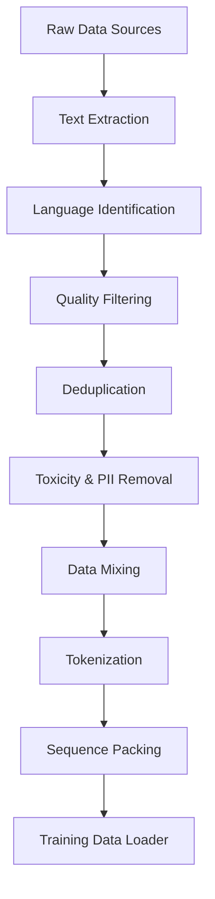
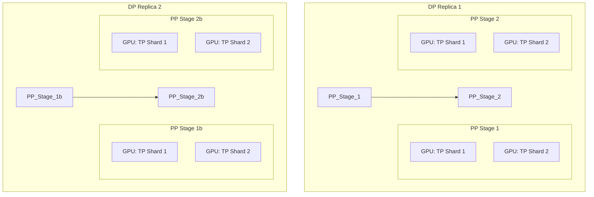
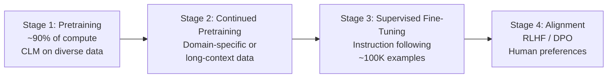

# Topic 14: Pretraining Large Language Models

> **Scope**: The science of training LLMs from scratch — objectives, data, distributed systems, compute scaling, and stability. Theory-first, researcher-level depth.

---

## Table of Contents

1. [Training Objectives — The Landscape](#1-training-objectives)
2. [Causal Language Modeling (CLM)](#2-causal-language-modeling)
3. [Masked Language Modeling (MLM)](#3-masked-language-modeling)
4. [Span Corruption & Prefix LM](#4-span-corruption--prefix-lm)
5. [Comparing Objectives — When to Use What](#5-comparing-objectives)
6. [Data Pipeline — Sources & Scale](#6-data-pipeline)
7. [Data Filtering & Quality](#7-data-filtering--quality)
8. [Deduplication — MinHash & Beyond](#8-deduplication)
9. [Data Mixing Ratios](#9-data-mixing-ratios)
10. [Tokenizer Training](#10-tokenizer-training)
11. [Distributed Training — Parallelism Strategies](#11-distributed-training)
12. [ZeRO — Zero Redundancy Optimizer](#12-zero)
13. [FSDP — Fully Sharded Data Parallel](#13-fsdp)
14. [Mixed Precision Training](#14-mixed-precision)
15. [Training Stability & Hyperparameters](#15-training-stability)
16. [Compute Requirements & Scaling Laws](#16-compute-scaling)
17. [Training Infrastructure](#17-training-infrastructure)
18. [Training Recipes — Putting It All Together](#18-training-recipes)
19. [Interview Questions & Answers](#19-interview-qa)

---

## 1. Training Objectives — The Landscape

A pretraining objective defines what the model learns from raw text. Every design choice flows from this.

```
┌──────────────────────────────────────────────────────────────────┐
│              Pretraining Objective Taxonomy                       │
├──────────────────────────────────────────────────────────────────┤
│                                                                  │
│  Autoregressive (Causal LM)          Autoencoding (Masked LM)   │
│  ─────────────────────────          ──────────────────────────   │
│  Predict next token                  Predict masked tokens       │
│  Left-to-right only                  Bidirectional context       │
│  GPT, Llama, Mistral, Falcon        BERT, RoBERTa, DeBERTa     │
│                                                                  │
│  Seq-to-Seq (Span Corruption)        Prefix LM                  │
│  ────────────────────────────        ──────────                  │
│  Corrupt spans, reconstruct          Bidirectional prefix +      │
│  T5, UL2                             autoregressive rest         │
│                                      PaLM (partially), UniLM    │
└──────────────────────────────────────────────────────────────────┘
```

---

## 2. Causal Language Modeling (CLM)

The dominant paradigm for modern LLMs. The model learns to predict the next token given all preceding tokens.

### 2.1 Objective Function

Given a sequence $x = (x_1, x_2, \ldots, x_T)$, the CLM objective maximizes the log-likelihood:

$$\mathcal{L}_{\text{CLM}} = \sum_{t=1}^{T} \log P_\theta(x_t \mid x_1, x_2, \ldots, x_{t-1})$$

Equivalently, we minimize the negative log-likelihood (cross-entropy loss):

$$\mathcal{L} = -\frac{1}{T} \sum_{t=1}^{T} \log P_\theta(x_t \mid x_{<t})$$

The probability is computed via a softmax over the vocabulary:

$$P_\theta(x_t \mid x_{<t}) = \text{softmax}(W_{\text{head}} \cdot h_t)_{x_t}$$

where $h_t \in \mathbb{R}^d$ is the hidden state at position $t$ and $W_{\text{head}} \in \mathbb{R}^{|V| \times d}$ is the language model head (often tied with the input embedding matrix).

### 2.2 Causal Mask

The key architectural constraint: position $t$ can only attend to positions $\leq t$. This is enforced via a triangular attention mask:

$$\text{Attention}(Q, K, V) = \text{softmax}\left(\frac{QK^\top}{\sqrt{d_k}} + M\right) V$$

where the mask $M$ is:

$$M_{ij} = \begin{cases} 0 & \text{if } i \geq j \\ -\infty & \text{if } i < j \end{cases}$$

```
Causal Mask (T=5):

     k₁  k₂  k₃  k₄  k₅
q₁ [  0  -∞  -∞  -∞  -∞ ]
q₂ [  0   0  -∞  -∞  -∞ ]
q₃ [  0   0   0  -∞  -∞ ]
q₄ [  0   0   0   0  -∞ ]
q₅ [  0   0   0   0   0 ]
```

### 2.3 Why CLM Dominates

1. **Natural generation**: Autoregressive models directly generate text left-to-right
2. **Scaling**: CLM scales better than MLM — every token is a training signal (MLM only trains on ~15% masked tokens)
3. **Emergent abilities**: In-context learning, chain-of-thought, and instruction-following all emerge from CLM at scale
4. **Efficiency**: Each forward pass produces $T$ predictions (teacher forcing), so one sequence gives $T$ gradient signals

### 2.4 Perplexity

The standard evaluation metric for language models:

$$\text{PPL} = \exp\left(-\frac{1}{T} \sum_{t=1}^{T} \log P_\theta(x_t \mid x_{<t})\right) = \exp(\mathcal{L})$$

Interpretation: the model's average "surprise" per token. Lower is better.

- PPL = $|V|$: random guessing
- GPT-3 (175B): PPL $\approx$ 20 on Pile
- Llama 3 (70B): PPL $\approx$ 6-8 on held-out web text

---

## 3. Masked Language Modeling (MLM)

BERT's pretraining objective. Randomly mask tokens and predict them using bidirectional context.

### 3.1 Objective

Given a sequence $x = (x_1, \ldots, x_T)$, randomly select a subset of positions $\mathcal{M} \subset \{1, \ldots, T\}$ (typically 15%) to mask. The objective:

$$\mathcal{L}_{\text{MLM}} = -\sum_{t \in \mathcal{M}} \log P_\theta(x_t \mid x_{\backslash \mathcal{M}})$$

where $x_{\backslash \mathcal{M}}$ denotes the sequence with masked positions replaced.

### 3.2 Masking Strategy (BERT)

For each selected position $t \in \mathcal{M}$:
- **80%** of the time: replace with `[MASK]` token
- **10%** of the time: replace with a random token from $V$
- **10%** of the time: keep the original token

This prevents the model from learning that `[MASK]` always means "predict here" — since `[MASK]` never appears at inference time (train-test mismatch).

### 3.3 MLM vs CLM — Fundamental Trade-off

$$\underbrace{\text{MLM: } P(x_t \mid x_{\backslash t})}_{\text{bidirectional, 15% signal}} \quad \text{vs} \quad \underbrace{\text{CLM: } P(x_t \mid x_{<t})}_{\text{unidirectional, 100% signal}}$$

| Property | MLM (BERT) | CLM (GPT) |
|----------|-----------|-----------|
| Context | Bidirectional | Left-to-right only |
| Training signal | ~15% of tokens | 100% of tokens |
| Natural generation | No (needs iterative decoding) | Yes |
| Understanding tasks | Excellent (NLU) | Good (but needs more scale) |
| Token efficiency | Lower (only masked tokens contribute) | Higher |

---

## 4. Span Corruption & Prefix LM

### 4.1 Span Corruption (T5)

Instead of masking individual tokens, corrupt contiguous spans and train the model to reconstruct them.

**Process**:
1. Randomly select spans of mean length $\mu = 3$ tokens
2. Replace each span with a single sentinel token (`<extra_id_0>`, `<extra_id_1>`, ...)
3. Target: the concatenation of all original spans, each preceded by its sentinel

**Example**:
```
Input:   "The <X> brown fox <Y> over the lazy dog"
Target:  "<X> quick <Y> jumps <Z>"

(where <X>, <Y>, <Z> are sentinel tokens)
```

**Objective**:

$$\mathcal{L}_{\text{span}} = -\sum_{s \in \text{spans}} \sum_{t \in s} \log P_\theta(x_t \mid \text{corrupted input}, \text{previous targets})$$

**Advantages**:
- Denoising forces the model to understand context deeply
- Sentinel tokens compress the target — shorter sequences, faster training
- The corruption rate (typically 15%) controls the difficulty

### 4.2 Prefix LM

A hybrid: the prefix portion uses bidirectional attention, the remainder uses causal attention.

$$\text{Attention mask:} \quad M_{ij} = \begin{cases} 0 & \text{if } j \leq L_{\text{prefix}} \text{ (prefix is bidirectional)} \\ 0 & \text{if } i \geq j \text{ and } j > L_{\text{prefix}} \text{ (rest is causal)} \\ -\infty & \text{otherwise} \end{cases}$$

```
Prefix LM Mask (prefix = 3, total = 6):

     k₁  k₂  k₃  k₄  k₅  k₆
q₁ [  0   0   0  -∞  -∞  -∞ ]    ← prefix: sees all prefix
q₂ [  0   0   0  -∞  -∞  -∞ ]    ← prefix: sees all prefix
q₃ [  0   0   0  -∞  -∞  -∞ ]    ← prefix: sees all prefix
q₄ [  0   0   0   0  -∞  -∞ ]    ← causal: prefix + self
q₅ [  0   0   0   0   0  -∞ ]    ← causal: prefix + up to self
q₆ [  0   0   0   0   0   0 ]    ← causal: sees everything
```

This combines bidirectional encoding (good for understanding the input) with autoregressive generation (good for producing the output).

### 4.3 UL2 — Mixture of Denoisers

UL2 (Tay et al., 2022) unifies all three paradigms by mixing multiple denoising objectives during pretraining:

- **R-denoiser** (Regular): Short spans, low corruption rate (like T5)
- **S-denoiser** (Sequential): Extreme corruption — prefix given, generate the rest (like CLM)
- **X-denoiser** (Extreme): Long spans, high corruption rate

A mode token (`[R]`, `[S]`, `[X]`) prepended to the input tells the model which objective is active. This trains a single model to be good at both understanding and generation.

---

## 5. Comparing Objectives — When to Use What

```
┌────────────────────────────────────────────────────────────────┐
│               Pretraining Objectives Summary                    │
├──────────────┬──────────────┬──────────────┬───────────────────┤
│  Objective   │ Models       │ Strength     │ Weakness          │
├──────────────┼──────────────┼──────────────┼───────────────────┤
│ CLM          │ GPT, Llama,  │ Generation,  │ No bidirectional  │
│              │ Mistral      │ scaling,     │ context           │
│              │              │ emergent     │                   │
│              │              │ abilities    │                   │
├──────────────┼──────────────┼──────────────┼───────────────────┤
│ MLM          │ BERT,        │ Bidirectional│ Can't generate    │
│              │ RoBERTa,     │ understanding│ naturally, 15%    │
│              │ DeBERTa      │              │ token efficiency  │
├──────────────┼──────────────┼──────────────┼───────────────────┤
│ Span         │ T5, mT5,     │ Seq-to-seq   │ More complex      │
│ Corruption   │ FLAN-T5      │ tasks, good  │ infrastructure    │
│              │              │ for NLU+NLG  │                   │
├──────────────┼──────────────┼──────────────┼───────────────────┤
│ Prefix LM    │ PaLM (opt.), │ Best of both │ Harder to tune    │
│              │ UniLM        │ worlds       │ prefix length     │
├──────────────┼──────────────┼──────────────┼───────────────────┤
│ MoD (UL2)    │ UL2, Flan-UL2│ Versatile    │ Complex training  │
│              │              │ single model │ setup             │
└──────────────┴──────────────┴──────────────┴───────────────────┘
```

The field has converged on **CLM** for large-scale models because:
1. Scaling laws favor CLM (more efficient per FLOP)
2. All tokens contribute to the loss (vs 15% for MLM)
3. Instruction tuning + RLHF can add bidirectional-like understanding post-hoc

---

## 6. Data Pipeline — Sources & Scale

### 6.1 Common Data Sources

```
┌──────────────────────────────────────────────────────────────┐
│                     LLM Data Ecosystem                        │
├───────────────────┬──────────────┬────────────────────────────┤
│ Source            │ Scale        │ Role in Training           │
├───────────────────┼──────────────┼────────────────────────────┤
│ Common Crawl      │ ~3T tokens   │ Breadth, general knowledge │
│ Wikipedia          │ ~6B tokens   │ Factual accuracy           │
│ Books (BooksCorpus,│ ~30B tokens  │ Long-range coherence       │
│  Gutenberg, etc.) │              │                            │
│ GitHub/Code       │ ~500B tokens │ Reasoning, code abilities  │
│ ArXiv/Papers      │ ~50B tokens  │ Scientific knowledge       │
│ StackExchange     │ ~15B tokens  │ Q&A format, reasoning      │
│ Curated Web       │ varies       │ Quality web content        │
│ Conversations     │ varies       │ Dialogue capability        │
└───────────────────┴──────────────┴────────────────────────────┘
```

### 6.2 Data Pipeline Architecture



### 6.3 Scale Reference

| Model | Parameters | Training Tokens | Ratio (tokens/params) |
|-------|-----------|----------------|-----------------------|
| GPT-3 | 175B | 300B | 1.7× |
| Chinchilla | 70B | 1.4T | 20× |
| Llama 2 | 70B | 2T | 29× |
| Llama 3 | 70B | 15T | 214× |
| Mistral | 7B | ~2T (est.) | ~286× |

**Chinchilla scaling** (Hoffmann et al., 2022) showed that models were undertrained — the optimal ratio is approximately $20 \times$ more tokens than parameters. Post-Chinchilla models train on far more tokens, accepting slight compute inefficiency during training for better inference-time efficiency (smaller models trained longer).

---

## 7. Data Filtering & Quality

Raw web data is noisy. Filtering is as important as model architecture.

### 7.1 Heuristic Filters

These are rule-based filters applied before any ML-based quality scoring:

| Filter | What It Catches | Typical Threshold |
|--------|----------------|-------------------|
| Word count | Too short/long documents | 50–100,000 words |
| Symbol ratio | Boilerplate, code dumps | $< 10\%$ non-alphanumeric |
| Repetition ratio | Repeated phrases/spam | $< 30\%$ duplicate n-grams |
| Language score | Non-target language | fastText confidence $> 0.65$ |
| Perplexity | Low-quality/gibberish text | KenLM perplexity $< \tau$ |
| Blocklist | URLs, domains to exclude | Adult sites, spam farms |

### 7.2 Classifier-Based Filtering

Train a quality classifier on curated "high-quality" data (Wikipedia, books) vs random web data:

$$P(\text{high quality} \mid \text{document}) = \sigma(f_\theta(\text{document}))$$

**Approaches**:
- **GPT-3 approach**: Trained a binary classifier on curated vs random data. Upsampled documents with high quality score.
- **Llama approach**: Used a fastText classifier trained on Wikipedia references. Documents referenced by Wikipedia are higher quality.
- **FineWeb**: Multi-stage filtering with both heuristic and learned filters, achieving better data quality at scale.

### 7.3 The Quality-Diversity Trade-off

$$\text{Model quality} \propto f(\text{data quality}, \text{data diversity}, \text{data quantity})$$

Aggressive filtering improves quality but reduces diversity. Models trained on only high-quality data (e.g., Wikipedia + books) are fluent but narrow. The optimal approach:

1. Filter aggressively for quality on the **web** portion
2. Keep diverse sources (code, scientific papers, books) at lower filtering thresholds
3. Use data mixing ratios (Section 9) to balance quality and coverage

---

## 8. Deduplication — MinHash & Beyond

Duplicate data in training causes:
- Memorization of specific passages (privacy risk)
- Overweighting of repeated content (biased model)
- Wasted compute (training on the same data twice)

### 8.1 Exact Deduplication

Remove documents with identical content (after normalization):
1. Normalize whitespace, lowercasing, remove punctuation
2. Hash the normalized string (SHA-256 or similar)
3. Remove documents with duplicate hashes

**Limitation**: Misses near-duplicates (same content with minor edits).

### 8.2 MinHash — Fuzzy Deduplication

MinHash estimates Jaccard similarity between document shingle sets without comparing all pairs.

**Jaccard similarity** between documents $A$ and $B$ (as sets of n-gram shingles):

$$J(A, B) = \frac{|A \cap B|}{|A \cup B|}$$

**MinHash algorithm**:
1. Convert each document to a set of character n-grams (shingles), typically $n = 5$
2. Apply $k$ random hash functions $h_1, \ldots, h_k$ to each shingle set
3. For each hash function $h_i$, the MinHash signature is $\min_{s \in \text{shingles}} h_i(s)$
4. The MinHash signature is a vector of $k$ values: $\text{sig}(A) = [\min h_1(A), \ldots, \min h_k(A)]$

**Key property**: The probability that two documents share a MinHash value equals their Jaccard similarity:

$$P(\min h(A) = \min h(B)) = J(A, B)$$

**Locality-Sensitive Hashing (LSH)** for scalability:
1. Divide the $k$ MinHash values into $b$ bands of $r$ rows each ($k = b \times r$)
2. Two documents are candidate duplicates if they hash to the same bucket in **any** band
3. Tune $b$ and $r$ to control the threshold: approximate threshold $\approx (1/b)^{1/r}$

For example, with $k = 128$, $b = 16$, $r = 8$: the threshold is approximately $(1/16)^{1/8} \approx 0.6$, meaning documents with Jaccard similarity $> 0.6$ will likely be detected.

### 8.3 Deduplication at Scale

| Method | Comparison Scope | Catches | Cost |
|--------|-----------------|---------|------|
| Exact (hash) | Full document | Exact copies | $O(n)$ |
| MinHash + LSH | Full document | Near-duplicates | $O(n)$ with LSH |
| Suffix array | Substring level | Repeated passages | $O(n \log n)$ |
| SemDedup | Semantic level | Paraphrases | $O(n \cdot d)$ |

**Llama 3's approach**: Aggressive deduplication at multiple levels — URL-level exact dedup, then MinHash for near-dedup, followed by line-level dedup for very common boilerplate.

---

## 9. Data Mixing Ratios

The proportion of each data source significantly affects model capabilities.

### 9.1 Known Mixing Ratios

| Model | Web | Code | Books | Wiki | Papers | Other |
|-------|-----|------|-------|------|--------|-------|
| Llama 2 | 67% | — | — | 4.5% | 2.5% | 26% |
| Llama 3 | 50% | 17% | 8% | 4% | 6% | 15% |
| Chinchilla | ~70% | — | ~10% | ~5% | — | ~15% |

### 9.2 Why Mixing Ratios Matter

Each source contributes different capabilities:

- **Code** ($\uparrow$): Improves reasoning and structured generation (Llama 3 increased code ratio from Llama 2)
- **Wikipedia** ($\uparrow$): Improves factual accuracy but can reduce diversity
- **Books** ($\uparrow$): Improves long-range coherence and narrative understanding
- **Scientific papers** ($\uparrow$): Improves technical reasoning
- **Web** ($\uparrow$): Breadth of knowledge, conversational ability

### 9.3 Curriculum Learning — Data Ordering

Some models use non-uniform data ordering during training:

$$\text{Phase 1: } \text{diverse web data} \xrightarrow{\text{transition}} \text{Phase 2: } \text{higher-quality data}$$

**Llama 3** uses an "annealing" phase at the end of training where the data mix shifts toward higher-quality sources. This is analogous to learning rate annealing — the model "polishes" on better data in the final phase.

The **DoReMi** algorithm (Xie et al., 2023) learns optimal mixing ratios by training a small proxy model to identify which domains the larger model needs more data from:

$$w_i^* = \arg\min_w \max_i \left[ \mathcal{L}_i(\theta_w) - \mathcal{L}_i(\theta_{\text{ref}}) \right]$$

where $w_i$ is the weight for domain $i$, and the objective minimizes the worst-case excess loss over a reference model.

---

## 10. Tokenizer Training

The tokenizer is trained **before** the model and remains fixed throughout pretraining.

### 10.1 When to Train a Custom Tokenizer

| Scenario | Recommendation |
|----------|---------------|
| Training in English on web data | Use existing (Llama, GPT-4 tokenizer) |
| Multilingual model | Train new — need balanced vocab across languages |
| Domain-specific (medical, legal) | Train new — domain terms should be single tokens |
| Code-heavy model | Train new or extend — ensure code-specific tokens |

### 10.2 Tokenizer Design Decisions

**Vocabulary size** $|V|$:
- Larger vocab: fewer tokens per text (faster inference), but larger embedding matrix ($|V| \times d$)
- Smaller vocab: more tokens per text (slower), but smaller model
- Sweet spot: 32K–128K tokens

$$\text{Embedding parameters} = |V| \times d_{\text{model}}$$

For $|V| = 128K$, $d = 4096$: that's $\sim 0.5B$ parameters just for embeddings.

**Byte-level BPE** (used by GPT-2, Llama, Mistral): Operates on bytes, not characters. Handles any Unicode without unknown tokens.

**SentencePiece** (used by T5, Llama): Language-agnostic — treats text as raw bytes/characters. No need for pre-tokenization rules.

### 10.3 Fertility and Efficiency

**Fertility** = average number of tokens per word. Lower is better.

$$\text{Fertility} = \frac{\text{number of tokens}}{\text{number of words}}$$

| Tokenizer | English Fertility | Chinese Fertility | Code Fertility |
|-----------|------------------|-------------------|----------------|
| GPT-2 (50K) | ~1.3 | ~3.5 | ~2.0 |
| Llama 2 (32K) | ~1.3 | ~3.8 | ~2.2 |
| Llama 3 (128K) | ~1.2 | ~1.8 | ~1.5 |

Llama 3's larger vocabulary dramatically reduces fertility for non-English languages and code, making the model more efficient (fewer tokens = fewer forward passes = faster inference).

---

## 11. Distributed Training — Parallelism Strategies

Modern LLMs don't fit on a single GPU. Distributed training splits the model, data, or both across many devices.

### 11.1 Data Parallelism (DP)

The simplest strategy: replicate the full model on each GPU, split the data batch.

$$g = \frac{1}{N} \sum_{i=1}^{N} g_i \quad \text{(all-reduce gradient aggregation)}$$

```
┌────────────────────────────────────────────────────┐
│ Data Parallelism                                    │
│                                                    │
│  GPU 0: Full Model + Data Shard 0 → grad₀          │
│  GPU 1: Full Model + Data Shard 1 → grad₁          │
│  GPU 2: Full Model + Data Shard 2 → grad₂          │
│  GPU 3: Full Model + Data Shard 3 → grad₃          │
│                                                    │
│  All-Reduce: avg(grad₀, grad₁, grad₂, grad₃)     │
│  All GPUs update with the same averaged gradient    │
└────────────────────────────────────────────────────┘
```

**Limitation**: Each GPU must hold the **full model** in memory. For a 70B model with FP16:
$$\text{Memory} \approx 70B \times 2 \text{ bytes} = 140 \text{ GB (weights alone)}$$

Plus optimizer states (Adam: $2 \times$ model size), gradients ($1 \times$), activations: total $\sim 4\text{-}6 \times$ model size = 560–840 GB. No single GPU can hold this.

### 11.2 Tensor Parallelism (TP)

Split individual layers across GPUs. Each GPU holds a **shard** of every layer.

For a linear layer $Y = XW$ where $W \in \mathbb{R}^{d \times d}$:

**Column parallelism** (split $W$ by columns across $N$ GPUs):

$$W = [W_1 | W_2 | \ldots | W_N], \quad Y_i = X W_i$$

Each GPU computes a partial output. Concatenate to get $Y$.

**Row parallelism** (split $W$ by rows):

$$W = \begin{bmatrix} W_1 \\ W_2 \\ \vdots \\ W_N \end{bmatrix}, \quad Y = \sum_{i=1}^{N} X_i W_i$$

Each GPU computes a partial sum. All-reduce to get $Y$.

```
Tensor Parallelism for Attention (2 GPUs):

  GPU 0                        GPU 1
  ┌──────────────┐             ┌──────────────┐
  │ Head 0, 1    │             │ Head 2, 3    │
  │ Q₀K₀ᵀ → V₀  │             │ Q₁K₁ᵀ → V₁  │
  └──────┬───────┘             └──────┬───────┘
         │         All-Reduce         │
         └──────────┬─────────────────┘
                    ▼
              Merged Output
```

**Trade-off**: Requires communication at every layer (all-reduce). Best within a single node (fast NVLink interconnect). Typical: TP = 4 or 8 (within one node).

### 11.3 Pipeline Parallelism (PP)

Split the model by **layers**. Each GPU holds a subset of consecutive layers.

$$\text{GPU } 0: \text{Layers } 1\text{-}8, \quad \text{GPU } 1: \text{Layers } 9\text{-}16, \quad \text{GPU } 2: \text{Layers } 17\text{-}24, \quad \ldots$$

```
Pipeline Parallelism (4 stages):

     Micro-batch 1    Micro-batch 2    Micro-batch 3
GPU0 ████             ████             ████
GPU1      ████             ████             ████
GPU2           ████             ████             ████
GPU3                ████             ████             ████
         ↑
         Bubble (GPU idle time)
```

**The bubble problem**: GPUs are idle while waiting for the previous stage. Solution: split the batch into **micro-batches** and pipeline them.

**Bubble fraction** for $p$ pipeline stages and $m$ micro-batches:

$$\text{Bubble fraction} = \frac{p - 1}{m + p - 1}$$

For $p = 4, m = 16$: bubble $= 3/19 \approx 16\%$. Increasing micro-batches reduces the bubble.

### 11.4 3D Parallelism

Production LLM training combines all three:

$$\text{Total GPUs} = \text{DP} \times \text{TP} \times \text{PP}$$

**Example**: Training Llama 70B on 512 GPUs:
- TP = 8 (within each node of 8 GPUs)
- PP = 4 (4 pipeline stages across nodes)
- DP = 16 (16 data-parallel replicas)
- Total: $8 \times 4 \times 16 = 512$ GPUs



---

## 12. ZeRO — Zero Redundancy Optimizer

DeepSpeed's ZeRO (Rajbhandari et al., 2020) reduces memory redundancy in data parallelism by sharding optimizer states, gradients, and parameters across GPUs.

### 12.1 Memory Breakdown for a Model with $\Psi$ Parameters

With mixed precision training (FP16 forward/backward, FP32 optimizer):

| Component | Memory (bytes per parameter) |
|-----------|------------------------------|
| FP16 parameters | $2\Psi$ |
| FP16 gradients | $2\Psi$ |
| FP32 optimizer states (Adam) | $12\Psi$ (FP32 params + momentum + variance) |
| **Total** | **$16\Psi$** |

For a 7B model: $16 \times 7B = 112$ GB — already beyond a single 80GB A100.

### 12.2 ZeRO Stages

$$\text{ZeRO-1: Shard optimizer states} \quad \rightarrow \quad \text{Memory: } 4\Psi + \frac{12\Psi}{N_d}$$

$$\text{ZeRO-2: + Shard gradients} \quad \rightarrow \quad \text{Memory: } 2\Psi + \frac{14\Psi}{N_d}$$

$$\text{ZeRO-3: + Shard parameters} \quad \rightarrow \quad \text{Memory: } \frac{16\Psi}{N_d}$$

where $N_d$ is the number of data-parallel GPUs.

```
Memory comparison for 7B model, 8 GPUs:

Standard DP:   112 GB per GPU  (won't fit on 80GB A100)
ZeRO Stage 1:   39 GB per GPU  ✓
ZeRO Stage 2:   26 GB per GPU  ✓
ZeRO Stage 3:   14 GB per GPU  ✓ (plenty of room for activations)
```

### 12.3 Communication Cost

| Stage | Communication Volume (per step) | When |
|-------|-------------------------------|------|
| Standard DP | $2\Psi$ (all-reduce gradients) | After backward |
| ZeRO-1 | $2\Psi$ (all-reduce gradients) | Same as DP |
| ZeRO-2 | $2\Psi$ (reduce-scatter gradients) | After backward |
| ZeRO-3 | $3\Psi$ (all-gather params in fwd+bwd + reduce-scatter grads) | During forward + backward |

ZeRO-3 has 1.5× the communication of standard DP but enables training models $N_d \times$ larger. The trade-off is memory for communication.

---

## 13. FSDP — Fully Sharded Data Parallel

PyTorch's native implementation of ZeRO Stage 3. Each GPU holds only a shard of parameters, gradients, and optimizer states.

### 13.1 FSDP vs ZeRO-3

| Feature | DeepSpeed ZeRO-3 | PyTorch FSDP |
|---------|------------------|--------------|
| Framework | DeepSpeed library | PyTorch native |
| Composability | Standalone | Composes with TP, PP |
| Sharding unit | Parameter group | `FlatParameter` (wrapping unit) |
| Communication | Customizable | All-gather + reduce-scatter |
| Activation checkpointing | Built-in | Built-in |
| Ease of use | Config-driven | API-driven |

### 13.2 How FSDP Works

1. **Initialization**: Each GPU stores only $1/N_d$ of all parameters
2. **Forward pass**: Before each layer's forward, all-gather its full parameters from all GPUs. Compute. Then discard non-local shards.
3. **Backward pass**: Same all-gather before backward. Compute gradients. Reduce-scatter gradients (each GPU keeps its shard). Discard non-local shards.
4. **Optimizer step**: Each GPU updates only its parameter shard using its gradient shard.

$$\text{Peak memory per GPU} \approx \frac{\Psi}{N_d} \cdot 16 + \Psi_{\text{largest unit}} \cdot 2 + \text{activations}$$

The $\Psi_{\text{largest unit}} \cdot 2$ term is because during forward/backward, the full parameters of one unit must be materialized temporarily.

---

## 14. Mixed Precision Training

Train with lower-precision numbers to save memory and increase throughput.

### 14.1 Numerical Formats

| Format | Bits | Exponent | Mantissa | Range | Precision |
|--------|------|----------|----------|-------|-----------|
| FP32 | 32 | 8 | 23 | $\pm 3.4 \times 10^{38}$ | High |
| FP16 | 16 | 5 | 10 | $\pm 65504$ | Medium |
| BF16 | 16 | 8 | 7 | $\pm 3.4 \times 10^{38}$ | Lower |
| FP8 (E4M3) | 8 | 4 | 3 | $\pm 448$ | Low |

### 14.2 Why BF16 > FP16 for LLM Training

FP16 has a narrow dynamic range (max 65504). During training, activations and gradients can overflow:

$$\text{FP16 overflow:} \quad \text{value} > 65504 \rightarrow \text{Inf} \rightarrow \text{NaN} \rightarrow \text{training crash}$$

BF16 has the **same exponent range as FP32** (8 exponent bits) but reduced precision (7 mantissa bits vs 23):

$$\text{BF16:} \quad \text{same range as FP32, but } 2^{-7} \approx 0.8\% \text{ precision per value}$$

This means BF16 almost never overflows, eliminating the need for loss scaling. The precision loss is acceptable because:
- Gradients are noisy anyway (stochastic)
- Master weights are kept in FP32 for the optimizer step
- The gradient noise typically exceeds the quantization error

### 14.3 Mixed Precision Recipe

$$\text{Forward/backward: BF16} \quad \xrightarrow{\text{gradients}} \quad \text{Optimizer step: FP32} \quad \xrightarrow{\text{cast down}} \quad \text{BF16 weights}$$

1. Store master weights in FP32
2. Cast weights to BF16 for forward pass
3. Compute loss and gradients in BF16
4. Cast gradients to FP32
5. Update FP32 master weights with optimizer
6. Cast updated weights back to BF16

**Memory savings**: Parameters in BF16 = $2\Psi$ (vs $4\Psi$ for FP32). But optimizer states remain in FP32 ($12\Psi$), so total is $2\Psi + 2\Psi + 12\Psi = 16\Psi$ (same total, but activations are halved, and forward pass is $2\times$ faster).

### 14.4 Loss Scaling (FP16 only)

If using FP16 instead of BF16, small gradients underflow to zero. Fix: scale the loss before backward, then unscale gradients before the optimizer step:

$$\tilde{g} = \frac{\partial (S \cdot \mathcal{L})}{\partial \theta} = S \cdot g \quad \rightarrow \quad g = \frac{\tilde{g}}{S}$$

Dynamic loss scaling: start with $S = 2^{16}$, halve on NaN/Inf, double every $K$ steps.

---

## 15. Training Stability & Hyperparameters

### 15.1 Critical Hyperparameters

| Hyperparameter | Typical Value | Effect |
|---------------|--------------|--------|
| Learning rate (peak) | $1 \times 10^{-4}$ to $3 \times 10^{-4}$ | Too high: instability. Too low: slow convergence. |
| Warmup steps | 1,000–2,000 | Prevents early training divergence |
| Weight decay ($\lambda$) | 0.1 | Regularization, prevents overfitting to common patterns |
| Batch size | 2M–4M tokens | Larger = more stable gradients |
| Gradient clipping | 1.0 | Prevents gradient explosions |
| Adam $\beta_1, \beta_2$ | 0.9, 0.95 | Momentum and variance tracking |
| Adam $\epsilon$ | $10^{-8}$ | Numerical stability |

### 15.2 Learning Rate Schedule

The standard schedule for LLM pretraining is **warmup + cosine decay**:

$$\eta(t) = \begin{cases} \eta_{\max} \cdot \frac{t}{T_{\text{warmup}}} & \text{if } t < T_{\text{warmup}} \quad \text{(linear warmup)} \\ \eta_{\min} + \frac{1}{2}(\eta_{\max} - \eta_{\min})\left(1 + \cos\left(\frac{t - T_{\text{warmup}}}{T_{\text{total}} - T_{\text{warmup}}} \cdot \pi\right)\right) & \text{otherwise} \quad \text{(cosine decay)} \end{cases}$$

Typically $\eta_{\min} = 0.1 \cdot \eta_{\max}$ (decay to 10% of peak).

```
Learning Rate Schedule:

η_max ─────╮
           │ ╲
           │   ╲
           │     ╲          cosine decay
           │       ╲
           │         ╲
    warmup │           ╲
     ╱     │             ╲
    ╱      │               ╲───── η_min
   ╱       │
──╱────────┴─────────────────────── steps
  0    T_warmup                T_total
```

### 15.3 Gradient Clipping

Clip the global gradient norm to prevent exploding gradients:

$$\hat{g} = \begin{cases} g & \text{if } \|g\| \leq c \\ c \cdot \frac{g}{\|g\|} & \text{if } \|g\| > c \end{cases}$$

where $c = 1.0$ is standard. This preserves gradient direction but limits magnitude.

### 15.4 Common Training Failures

```
┌────────────────────────────────────────────────────────────────┐
│              Training Failure Diagnosis                          │
├─────────────────────┬──────────────────────────────────────────┤
│ Symptom             │ Likely Cause & Fix                        │
├─────────────────────┼──────────────────────────────────────────┤
│ Loss = NaN          │ LR too high, no grad clipping, FP16      │
│                     │ overflow → reduce LR, add clipping, BF16  │
├─────────────────────┼──────────────────────────────────────────┤
│ Loss spikes         │ Bad data batch, LR too high               │
│                     │ → data quality check, reduce LR           │
├─────────────────────┼──────────────────────────────────────────┤
│ Loss plateaus       │ LR too low, batch too small, bad data mix │
│ (stops decreasing)  │ → increase LR or batch, check data        │
├─────────────────────┼──────────────────────────────────────────┤
│ Divergence after    │ LR schedule wrong, weight decay too low   │
│ long stable run     │ → checkpoint recovery + adjusted schedule  │
├─────────────────────┼──────────────────────────────────────────┤
│ High loss on eval   │ Data contamination, overfitting            │
│ but low on train    │ → dedup eval/train, add regularization     │
└─────────────────────┴──────────────────────────────────────────┘
```

### 15.5 Loss Spikes and Recovery

Most large training runs encounter loss spikes — sudden increases in loss followed by recovery. The standard mitigation:

1. **Detection**: Monitor loss per step. Flag if $\mathcal{L}_t > 1.5 \times \text{rolling mean}$
2. **Automated recovery**: Roll back to a checkpoint from before the spike, skip the offending data, resume
3. **Prevention**: Lower learning rate, more warmup, better data filtering

Llama 2's training report documents multiple loss spikes during the 2T token run, each requiring checkpoint recovery.

---

## 16. Compute Requirements & Scaling Laws

### 16.1 FLOPs Estimation

For a transformer with $N$ parameters trained on $D$ tokens:

$$C \approx 6ND \quad \text{(FLOPs for forward + backward pass)}$$

The factor of 6 comes from:
- Forward pass: $\approx 2ND$ FLOPs (each parameter multiplies one activation per token)
- Backward pass: $\approx 4ND$ FLOPs (approximately $2\times$ forward — gradient w.r.t. both activations and parameters)

**Example**: Llama 2 70B trained on 2T tokens:

$$C = 6 \times 70 \times 10^9 \times 2 \times 10^{12} = 8.4 \times 10^{23} \text{ FLOPs}$$

### 16.2 GPU-Hours and Cost

An NVIDIA A100 achieves approximately $312$ TFLOP/s in BF16. Assuming 50% Model FLOPs Utilization (MFU):

$$\text{GPU-hours} = \frac{C}{\text{TFLOP/s} \times \text{MFU} \times 3600} = \frac{8.4 \times 10^{23}}{312 \times 10^{12} \times 0.5 \times 3600} \approx 1.5 \times 10^6 \text{ A100-hours}$$

At $\sim \$2$/A100-hour (cloud pricing), that's approximately $\$3M$ in compute.

### 16.3 Chinchilla Scaling Laws

Hoffmann et al. (2022) fit the relationship between loss, model size, and data:

$$L(N, D) = \frac{A}{N^\alpha} + \frac{B}{D^\beta} + E$$

where $\alpha \approx 0.34$, $\beta \approx 0.28$, $A, B, E$ are fitted constants, $N$ = parameters, $D$ = tokens.

**Key insight**: For a fixed compute budget $C$, the optimal allocation is:

$$N_{\text{opt}} \propto C^{0.50}, \quad D_{\text{opt}} \propto C^{0.50}$$

This means parameters and tokens should scale **equally** with compute. The Chinchilla-optimal ratio is approximately:

$$D_{\text{opt}} \approx 20 \times N$$

**Implications**:
- GPT-3 (175B params, 300B tokens) was significantly undertrained ($D/N = 1.7$)
- Chinchilla (70B params, 1.4T tokens) matched GPT-3's performance with 4× fewer parameters ($D/N = 20$)

### 16.4 Post-Chinchilla: Inference-Optimal Scaling

Chinchilla optimizes for training compute. But in production, **inference cost dominates**. A smaller model trained longer is cheaper to serve:

$$\text{Total cost} = C_{\text{train}} + C_{\text{inference}} \times N_{\text{queries}}$$

For high-traffic applications, it's worth spending more on training (more tokens) to get a smaller model that's cheaper per query. This explains why Llama 3 (70B, 15T tokens) trains at $D/N \approx 200$, far beyond Chinchilla-optimal.

---

## 17. Training Infrastructure

### 17.1 Hardware Landscape

| Accelerator | Memory | BF16 TFLOP/s | Interconnect | Typical Use |
|------------|--------|-------------|--------------|-------------|
| NVIDIA A100 | 80 GB | 312 | NVLink 600 GB/s | Standard LLM training |
| NVIDIA H100 | 80 GB | 989 | NVLink 900 GB/s | Current generation |
| NVIDIA B200 | 192 GB | 2,250 | NVLink 1,800 GB/s | Next generation |
| Google TPU v4 | 32 GB HBM | ~275 | ICI 4,800 GB/s | Google-internal |
| Google TPU v5e | 16 GB HBM | ~197 | ICI | Cost-optimized |

### 17.2 Communication Topology

```
Intra-Node (NVLink — very fast):
┌──────────────────────────────────────┐
│ Node: 8× H100 GPUs                   │
│ GPU0 ↔ GPU1 ↔ GPU2 ↔ GPU3           │
│  ↕       ↕       ↕       ↕          │
│ GPU4 ↔ GPU5 ↔ GPU6 ↔ GPU7           │
│                                      │
│ NVLink: 900 GB/s bidirectional       │
└──────────────────────────────────────┘

Inter-Node (InfiniBand — slower):
┌──────────┐  InfiniBand   ┌──────────┐
│  Node 0  │←──400 Gb/s──→│  Node 1  │
└──────────┘               └──────────┘
      ↑                          ↑
      └────── 400 Gb/s ─────────┘
                                 ↓
                          ┌──────────┐
                          │  Node 2  │
                          └──────────┘
```

**Design principle**: Put communication-heavy parallelism (TP) within nodes (fast NVLink), and communication-light parallelism (DP, PP) across nodes (slower InfiniBand).

### 17.3 Model FLOPs Utilization (MFU)

MFU measures what fraction of theoretical hardware performance is achieved:

$$\text{MFU} = \frac{\text{Observed throughput (tokens/sec)} \times 6N}{\text{Peak TFLOP/s per GPU} \times \text{num GPUs} \times 10^{12}}$$

| System | MFU | Notes |
|--------|-----|-------|
| Naive implementation | 20-30% | Communication bottleneck |
| Well-optimized (Megatron) | 40-55% | 3D parallelism, overlap |
| State-of-the-art | 55-65% | Communication/compute overlap, custom kernels |

Getting from 30% to 55% MFU means training is $\sim 2\times$ faster (or half the cost).

---

## 18. Training Recipes — Putting It All Together

### 18.1 Llama 3 Training Recipe

A concrete example combining all concepts:

```
Model: 70B parameters, 80 layers, 64 heads, d=8192
Tokenizer: 128K vocabulary, byte-level BPE
Data: 15T tokens, curated web + code + books + papers
Hardware: 16K H100 GPUs

Parallelism:
  - TP = 8 (within node)
  - PP = 4 (across nodes)
  - DP = 512 (across node groups)
  - Total: 8 × 4 × 512 = 16,384 GPUs

Precision: BF16 (forward/backward), FP32 (optimizer)
Optimizer: AdamW, β₁=0.9, β₂=0.95, ε=1e-8
Weight decay: 0.1
Learning rate: 1.5e-4 peak, cosine decay to 1.5e-5
Warmup: 2,000 steps
Batch size: 4M tokens (ramped from 512K)
Sequence length: 8,192 (extended to 128K in later phase)
Gradient clipping: 1.0
Training time: ~54 days
```

### 18.2 General Recipe Template

```
┌──────────────────────────────────────────────────────────┐
│          LLM Pretraining Recipe Checklist                 │
├──────────────────────────────────────────────────────────┤
│                                                          │
│  □ 1. Data Pipeline                                      │
│    ├── Sources selected and weighted                     │
│    ├── Quality filters applied                           │
│    ├── Deduplication (exact + MinHash)                   │
│    ├── Toxicity/PII removal                              │
│    └── Tokenizer trained and validated                   │
│                                                          │
│  □ 2. Architecture                                       │
│    ├── Model size chosen (scaling law analysis)          │
│    ├── Architectural modifications (RoPE, GQA, SwiGLU)  │
│    └── Vocabulary size set                               │
│                                                          │
│  □ 3. Distributed Strategy                               │
│    ├── TP degree (fits in node)                          │
│    ├── PP degree (fills pipeline efficiently)            │
│    ├── DP degree (remaining GPUs)                        │
│    └── FSDP/ZeRO stage selected                         │
│                                                          │
│  □ 4. Training Config                                    │
│    ├── Precision: BF16 (preferred) or FP16+loss scaling  │
│    ├── Optimizer: AdamW                                  │
│    ├── LR schedule: warmup + cosine decay                │
│    ├── Batch size ramp                                   │
│    ├── Gradient clipping: 1.0                            │
│    └── Checkpointing frequency                           │
│                                                          │
│  □ 5. Monitoring                                         │
│    ├── Loss curve (per-step and smoothed)                │
│    ├── Gradient norm tracking                            │
│    ├── Evaluation benchmarks (periodic)                  │
│    ├── MFU tracking                                      │
│    └── Spike detection + auto-recovery                   │
│                                                          │
│  □ 6. Post-Training                                      │
│    ├── Instruction tuning (SFT)                          │
│    ├── Alignment (RLHF / DPO)                           │
│    └── Evaluation on benchmarks                          │
└──────────────────────────────────────────────────────────┘
```

### 18.3 Training Stages

Modern LLMs use a multi-stage approach:



Stages 1-2 teach the model **knowledge**. Stages 3-4 teach it **behavior** (how to use that knowledge helpfully and safely).

---

## 19. Interview Questions & Answers

### Q1: How do you estimate the FLOPs needed to train a 70B parameter model on 2T tokens?

**A**: Use the approximation $C \approx 6ND$:

$$C = 6 \times 70 \times 10^9 \times 2 \times 10^{12} = 8.4 \times 10^{23} \text{ FLOPs}$$

The factor of 6 accounts for forward pass ($2ND$) and backward pass ($4ND$). Forward is $2ND$ because each of the $N$ parameters participates in one multiply-accumulate per token. Backward is approximately $2\times$ forward because we compute gradients with respect to both activations (for backpropagation) and parameters (for the update).

On H100 GPUs (989 TFLOP/s BF16, ~50% MFU), this requires:

$$\frac{8.4 \times 10^{23}}{989 \times 10^{12} \times 0.5 \times 3600} \approx 4.7 \times 10^5 \text{ H100-hours} \approx 54 \text{ days on 16K GPUs}$$

---

### Q2: What is the difference between data parallelism, tensor parallelism, and pipeline parallelism?

**A**:

- **Data Parallelism (DP)**: Each GPU holds the full model. Data is split across GPUs. Gradients are averaged via all-reduce after each step. Simple, but each GPU must fit the entire model.

- **Tensor Parallelism (TP)**: Individual layers are split across GPUs. For a weight matrix $W$, each GPU holds columns (or rows) of $W$ and computes partial results. Requires all-reduce at every layer — high communication, so best within a node (fast NVLink). Typically TP = 4 or 8.

- **Pipeline Parallelism (PP)**: The model is split by layers. GPU 0 holds layers 1-8, GPU 1 holds layers 9-16, etc. Data flows through the pipeline as micro-batches. Creates "bubbles" (idle time), but communication is only at stage boundaries. Best across nodes.

In practice, all three are combined: TP within nodes, PP across nearby nodes, DP across everything. Total GPUs = TP × PP × DP.

---

### Q3: Why is BF16 preferred over FP16 for LLM training?

**A**: Both are 16-bit, but they allocate bits differently:

- **FP16**: 5 exponent bits, 10 mantissa bits. Max value 65,504. Higher precision per value, but narrow range.
- **BF16**: 8 exponent bits, 7 mantissa bits. Max value $3.4 \times 10^{38}$ (same as FP32). Lower precision, but same range as FP32.

BF16 is preferred because:
1. **No overflow**: Activations and gradients in LLM training can exceed 65,504 (FP16 max), causing NaN. BF16 shares FP32's range, so overflow essentially never happens.
2. **No loss scaling needed**: FP16 requires dynamic loss scaling to handle small gradients (underflow). BF16 doesn't.
3. **Simpler training loop**: Eliminates an entire class of numerical instability.

The reduced precision (7 vs 10 mantissa bits, ~0.8% vs ~0.1% per value) is acceptable because gradient noise from stochastic optimization typically exceeds the quantization error.

---

### Q4: How does data quality and deduplication affect model performance?

**A**: Dramatically. The key findings:

**Deduplication**: Lee et al. (2022) showed that deduplicating C4 reduced training tokens by 19% but **improved** perplexity. Duplicate data wastes compute and causes memorization:
- Exact dedup: Removes identical documents (hash-based, $O(n)$)
- Near-dedup: MinHash + LSH finds documents with Jaccard similarity $> \tau$ ($\sim 0.8$). Catches rephrased duplicates and boilerplate.

**Quality filtering**: GPT-3 used a classifier trained on curated data to upweight high-quality documents. Llama used Wikipedia-referenced pages as a quality signal. The FineWeb dataset showed that aggressive heuristic filtering + classifier filtering produces consistently better models than using raw Common Crawl.

The quality-diversity trade-off is critical: filtering too aggressively creates a narrow model (fluent but lacks breadth). The best approach combines aggressive web filtering with diverse high-quality sources (code, books, papers) at controlled mixing ratios.

---

### Q5: Explain ZeRO stages 1, 2, and 3. What does each shard?

**A**: ZeRO eliminates redundancy in data parallelism by distributing memory across $N$ GPUs:

**Standard DP**: Every GPU stores everything: parameters ($2\Psi$), gradients ($2\Psi$), optimizer states ($12\Psi$) = $16\Psi$ per GPU.

| Stage | What's Sharded | Memory per GPU |
|-------|---------------|----------------|
| ZeRO-1 | Optimizer states | $4\Psi + 12\Psi/N$ |
| ZeRO-2 | + Gradients | $2\Psi + 14\Psi/N$ |
| ZeRO-3 | + Parameters | $16\Psi/N$ |

ZeRO-3 achieves linear memory scaling — each GPU needs only $1/N$ of total memory. The cost is increased communication: ZeRO-3 requires all-gather operations during forward and backward passes to reconstruct full parameters, resulting in $\sim 1.5\times$ the communication of standard DP.

FSDP (PyTorch's native implementation) follows the ZeRO-3 approach and is the standard for large-scale training in the PyTorch ecosystem.

---

### Q6: What are Chinchilla scaling laws and why did they change how we train LLMs?

**A**: Hoffmann et al. (2022) derived the optimal balance between model size and training data for a fixed compute budget:

$$L(N, D) = \frac{A}{N^\alpha} + \frac{B}{D^\beta} + E$$

The key finding: parameters and tokens should scale equally with compute. The optimal ratio is approximately $D \approx 20N$ (20 tokens per parameter).

**Impact**: GPT-3 (175B params, 300B tokens, $D/N = 1.7$) was massively undertrained. Chinchilla (70B params, 1.4T tokens, $D/N = 20$) achieved the same performance with 4× fewer parameters.

**Post-Chinchilla shift**: The field moved to smaller models trained on more data (Llama, Mistral). However, for production deployment, the calculus changes — inference cost scales with model size, so it's worth "over-training" a smaller model ($D/N \gg 20$) to minimize serving costs. Llama 3 trains at $D/N \approx 200$, far beyond Chinchilla-optimal but optimizing for total cost (training + inference).

---

### Q7: Describe the data pipeline for pretraining an LLM. What are the critical steps?

**A**: The pipeline from raw data to training-ready tokens:

1. **Collection**: Gather data from diverse sources (Common Crawl, Wikipedia, books, GitHub, papers). Each contributes different capabilities.
2. **Extraction**: Parse HTML, PDF, etc. to clean text. Remove boilerplate (headers, footers, navigation).
3. **Language filtering**: Use fastText classifiers to identify and filter by language.
4. **Quality filtering**: Heuristic rules (length, symbol ratio, repetition) + learned quality classifiers (trained on curated vs random data).
5. **Deduplication**: Exact (hash-based) + near-duplicate (MinHash + LSH) + optional substring-level (suffix arrays).
6. **Safety filtering**: Toxicity classifiers, PII removal (regex + NER-based).
7. **Data mixing**: Set proportions for each source (e.g., 50% web, 17% code, 8% books, ...).
8. **Tokenization**: Apply the pretrained tokenizer.
9. **Sequence packing**: Pack multiple documents into fixed-length sequences with separator tokens to maximize GPU utilization.

Quality filtering and deduplication are the two steps with the largest impact on model quality.

---

### Q8: What is the pipeline bubble problem in pipeline parallelism? How is it mitigated?

**A**: In pipeline parallelism with $p$ stages, each GPU must wait for the previous stage to finish before it can start. This creates idle time ("bubbles") at the start and end of each batch:

$$\text{Bubble fraction} = \frac{p - 1}{m + p - 1}$$

where $m$ is the number of micro-batches. For $p = 8$ stages with $m = 1$ micro-batch, bubble fraction is $7/8 = 87.5\%$ — nearly all time is wasted.

**Mitigations**:
1. **Micro-batching**: Split each batch into $m$ micro-batches. For $m = 32, p = 8$: bubble $= 7/39 \approx 18\%$.
2. **Interleaved scheduling** (Narayanan et al.): Assign non-consecutive layers to each GPU, enabling earlier stages to start the next micro-batch sooner.
3. **1F1B scheduling**: Each GPU alternates between forward and backward passes of different micro-batches, reducing peak memory.
4. **Reducing PP degree**: Use fewer pipeline stages (more TP or DP instead). Pipeline bubbles are an inherent inefficiency, so minimize PP where possible.

---

### Q9: How does sequence packing work and why is it important?

**A**: Documents have variable lengths, but training requires fixed-length sequences. Without packing, short documents are padded to the sequence length, wasting compute on padding tokens.

**Sequence packing**: Concatenate multiple documents into a single training sequence, separated by special tokens (e.g., `<|endoftext|>`):

```
[Doc A tokens][EOS][Doc B tokens][EOS][Doc C tokens][PAD PAD PAD]
|<-------------- sequence length (e.g., 8192) ------------->|
```

An attention mask prevents cross-document attention (tokens in Doc A shouldn't attend to tokens in Doc B).

**Why it matters**: Without packing, if the average document is 1,000 tokens and the sequence length is 8,192, then $\sim 88\%$ of tokens would be padding. Packing recovers this, making training $\sim 2\text{-}5\times$ more efficient depending on the document length distribution.

---

### Q10: Compare the training recipes of GPT-3, Llama 2, and Llama 3. What evolved?

**A**:

| Aspect | GPT-3 (2020) | Llama 2 (2023) | Llama 3 (2024) |
|--------|-------------|----------------|----------------|
| Params | 175B | 70B | 70B |
| Tokens | 300B | 2T | 15T |
| D/N ratio | 1.7 | 29 | 214 |
| Vocab size | 50,257 | 32,000 | 128,256 |
| Attention | MHA | GQA | GQA |
| Position | Learned | RoPE | RoPE |
| Precision | FP16 | BF16 | BF16 |
| Parallelism | DP + TP | DP + TP + PP | DP + TP + PP |
| Code in data | ~No | Limited | 17% |

**Key evolutions**:
1. **Data scale**: From $D/N = 1.7$ (GPT-3) to $D/N = 214$ (Llama 3). Models are being trained far beyond Chinchilla-optimal to reduce serving costs.
2. **Architecture**: GQA replaced MHA (2× inference speedup). RoPE replaced learned position embeddings (better length generalization). SwiGLU FFN.
3. **Data quality**: Each generation has more sophisticated filtering and deduplication.
4. **Code data**: Recognized as critical for reasoning capabilities. Llama 3 dedicates 17% to code.
5. **Vocabulary**: Larger vocab (128K vs 50K) reduces fertility for non-English languages and code, improving efficiency.
6. **Precision**: Industry moved from FP16 to BF16 to avoid loss scaling issues.
