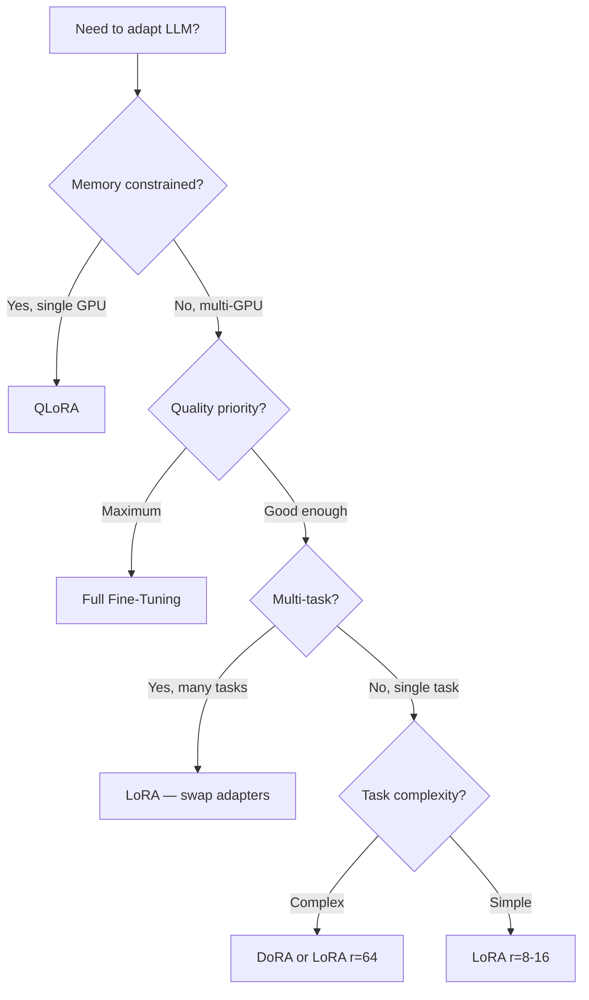
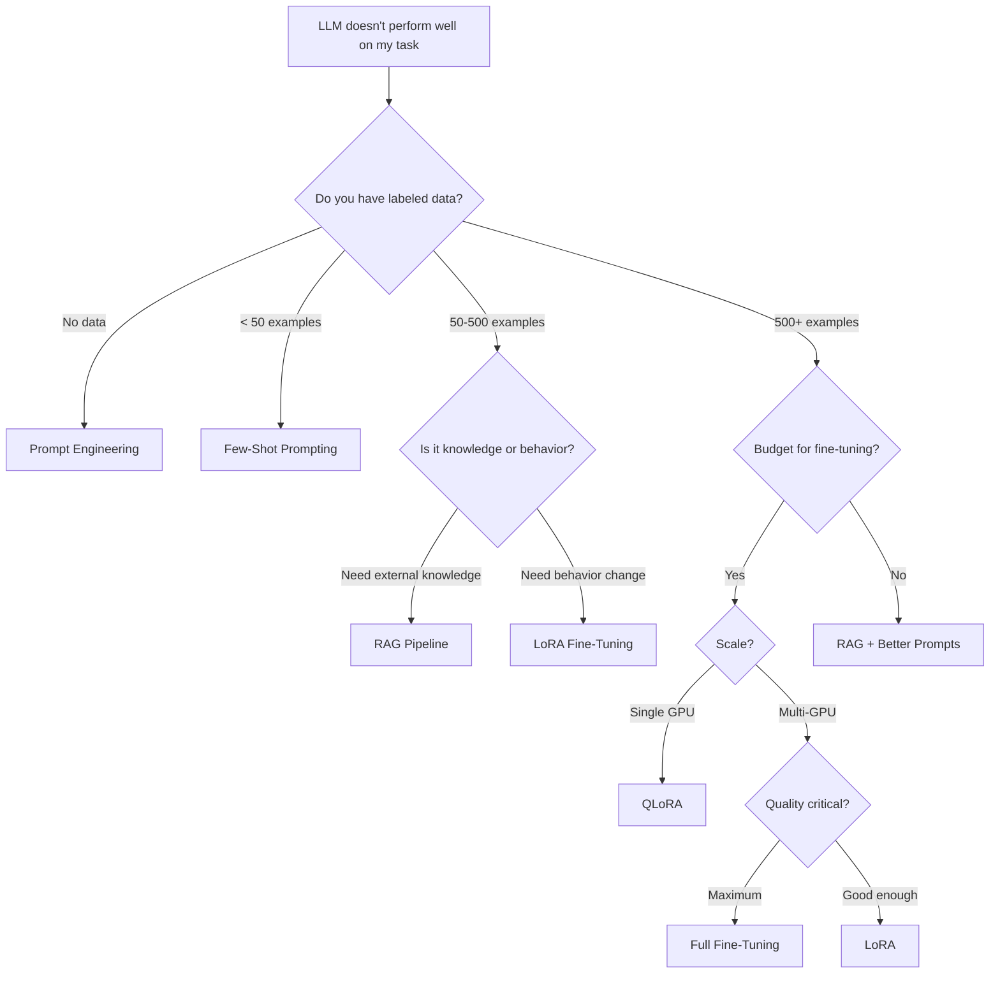

# Topic 15: Fine-Tuning & Parameter-Efficient Methods

> **Scope**: The mathematics and theory of adapting pretrained LLMs — from full fine-tuning to LoRA, QLoRA, adapters, prefix tuning, prompt tuning, DoRA, and instruction tuning. Researcher-level depth.

---

## Table of Contents

1. [Why Fine-Tune? The Transfer Learning Paradigm](#1-why-fine-tune)
2. [Full Fine-Tuning](#2-full-fine-tuning)
3. [Catastrophic Forgetting](#3-catastrophic-forgetting)
4. [The PEFT Landscape — Overview](#4-peft-landscape)
5. [LoRA — Low-Rank Adaptation](#5-lora)
6. [LoRA — Mathematical Deep Dive](#6-lora-math)
7. [LoRA — Practical Considerations](#7-lora-practical)
8. [QLoRA — Quantized LoRA](#8-qlora)
9. [NF4 — The NormalFloat Data Type](#9-nf4)
10. [Other PEFT Methods (Brief Reference)](#10-other-peft)
11. [DoRA — Weight-Decomposed Low-Rank Adaptation](#11-dora)
12. [Comparing PEFT Methods](#12-comparing-peft)
13. [Instruction Tuning](#13-instruction-tuning)
14. [When to Fine-Tune vs Prompt vs RAG](#14-decision-framework)
15. [Interview Questions & Answers](#15-interview-qa)

---

## 1. Why Fine-Tune? The Transfer Learning Paradigm

Pretraining learns general knowledge from massive corpora. Fine-tuning adapts that knowledge to a specific task or domain.

```
┌──────────────────────────────────────────────────────────────┐
│           The Modern LLM Training Pipeline                    │
│                                                              │
│  Pretrain (broad)  →  Fine-Tune (narrow)  →  Align (safe)   │
│  ────────────────     ─────────────────      ──────────────  │
│  1T+ tokens           10K-1M examples        Preferences     │
│  General knowledge    Task-specific skill    Helpful/safe     │
│  CLM objective        Supervised (SFT)       RLHF / DPO      │
│  $1M+ compute         $10-$10K compute       $1K-$100K       │
└──────────────────────────────────────────────────────────────┘
```

**The insight**: A pretrained LLM has learned a rich representation space. Fine-tuning doesn't need to learn a new space — it only needs to adjust the model's behavior within the existing one. This adjustment often lies in a **low-dimensional subspace**, which is why parameter-efficient methods work.

---

## 2. Full Fine-Tuning

Update all parameters of the pretrained model on task-specific data.

### 2.1 Objective

Given a pretrained model $\theta_0$ and a dataset $\mathcal{D} = \{(x_i, y_i)\}_{i=1}^{N}$:

$$\theta^* = \arg\min_{\theta} \sum_{i=1}^{N} \mathcal{L}(f_\theta(x_i), y_i) + \lambda \|\theta - \theta_0\|^2$$

The regularization term $\lambda \|\theta - \theta_0\|^2$ (sometimes used) penalizes large deviations from the pretrained weights, mitigating catastrophic forgetting.

For language models with autoregressive fine-tuning (instruction tuning style):

$$\mathcal{L}_{\text{SFT}} = -\sum_{t \in \text{response}} \log P_\theta(y_t \mid x, y_{<t})$$

Note: the loss is computed **only over the response tokens**, not the instruction/prompt tokens. The prompt tokens contribute to conditioning but don't directly receive gradient signal.

### 2.2 When Full Fine-Tuning Is Justified

| Scenario | Justification |
|----------|--------------|
| New language (not in pretrain data) | Model needs new token distributions |
| Radically different domain (e.g., medical) | Large representational shift needed |
| Small model (< 1B params) | Memory is not a bottleneck |
| Sufficient data (> 100K examples) | Enough signal to update all parameters |
| Maximum quality required | PEFT methods sacrifice ~1-3% quality |

### 2.3 Memory Requirements

For a model with $\Psi$ parameters using AdamW:

| Component | Memory |
|-----------|--------|
| Model weights (BF16) | $2\Psi$ |
| Gradients (BF16) | $2\Psi$ |
| Optimizer states (FP32): params + momentum + variance | $12\Psi$ |
| Activations | $\propto$ batch size × seq length × layers |
| **Total (weights + optimizer)** | **$16\Psi$** |

For a 7B model: $16 \times 7 \times 10^9 \approx 112$ GB — requires 2× A100 80GB.

---

## 3. Catastrophic Forgetting

When fine-tuned on a narrow task, the model "forgets" general capabilities it learned during pretraining.

### 3.1 The Problem

Fine-tuning pushes $\theta$ toward the task-specific optimum $\theta^*_{\text{task}}$, but this may be far from the pretrain optimum $\theta^*_{\text{pretrain}}$ in weight space:

$$\underbrace{\theta^*_{\text{pretrain}}}_{\text{general knowledge}} \xrightarrow{\text{fine-tune}} \underbrace{\theta^*_{\text{task}}}_{\text{task-specific, forgot general}}$$

### 3.2 Mitigation Strategies

**1. Regularization toward pretrained weights**:

$$\mathcal{L}_{\text{total}} = \mathcal{L}_{\text{task}} + \lambda \sum_i (\theta_i - \theta_{0,i})^2$$

This is essentially L2 regularization centered at the pretrained weights (sometimes called "weight decay toward init").

**2. Low learning rate**: Use $\eta \sim 10^{-5}$ to $10^{-6}$ for fine-tuning (vs $10^{-4}$ for pretraining). Smaller steps = smaller drift from pretrained weights.

**3. Elastic Weight Consolidation (EWC)**:

Weight the regularization by the Fisher information matrix, which measures how important each parameter is for the original task:

$$\mathcal{L}_{\text{EWC}} = \mathcal{L}_{\text{task}} + \frac{\lambda}{2} \sum_i F_i (\theta_i - \theta_{0,i})^2$$

where $F_i = \mathbb{E}\left[\left(\frac{\partial \log P(y|x; \theta_0)}{\partial \theta_i}\right)^2\right]$ is the diagonal of the Fisher information matrix. Parameters with high Fisher values (important for the pretrained distribution) are penalized more for changing.

**4. Data mixing**: Include a fraction of general data during fine-tuning:

$$\mathcal{D}_{\text{train}} = (1 - \alpha) \cdot \mathcal{D}_{\text{task}} + \alpha \cdot \mathcal{D}_{\text{general}}$$

Typically $\alpha = 0.05\text{-}0.10$ is sufficient to prevent forgetting.

**5. PEFT methods**: By updating only a small number of parameters, LoRA and similar methods inherently limit the deviation from pretrained weights, acting as an implicit regularizer.

---

## 4. The PEFT Landscape — Overview

**Parameter-Efficient Fine-Tuning (PEFT)**: Update only a small fraction of parameters while keeping the rest frozen.

```
┌────────────────────────────────────────────────────────────────┐
│                    PEFT Method Taxonomy                         │
├────────────────────────────────────────────────────────────────┤
│                                                                │
│  Additive Methods              Reparameterization Methods      │
│  ─────────────────             ───────────────────────────     │
│  Add new parameters            Modify existing parameters      │
│                                via low-rank decomposition      │
│  ├── Adapter Layers                                            │
│  │   (Houlsby et al. 2019)    ├── LoRA (Hu et al. 2022)       │
│  ├── Prefix Tuning            ├── QLoRA (Dettmers et al. 2023)│
│  │   (Li & Liang 2021)       ├── DoRA (Liu et al. 2024)       │
│  └── Prompt Tuning            └── AdaLoRA (Zhang et al. 2023) │
│      (Lester et al. 2021)                                      │
│                                                                │
│  Selective Methods                                              │
│  ─────────────────                                             │
│  Update subset of existing     ├── BitFit (only biases)        │
│  parameters                    ├── Layer-selective fine-tuning  │
│                                └── Attention-only fine-tuning   │
└────────────────────────────────────────────────────────────────┘
```

**Why PEFT works** — the intrinsic dimensionality hypothesis:

> Task-specific adaptations of large models lie in a low-dimensional subspace. The effective dimensionality of the weight update $\Delta W$ is much smaller than the full parameter space.

Aghajanyan et al. (2021) showed that fine-tuning adjustments for language tasks can be captured in a subspace of dimension $d \ll D$ where $D$ is the full parameter count and $d$ is often a few hundred to a few thousand.

---

## 5. LoRA — Low-Rank Adaptation

LoRA (Hu et al., 2022) is the dominant PEFT method. Instead of updating a full weight matrix, it adds a low-rank update.

### 5.1 Core Idea

For a pretrained weight matrix $W_0 \in \mathbb{R}^{d \times k}$, LoRA constrains the weight update to be low-rank:

$$W = W_0 + \Delta W = W_0 + BA$$

where $B \in \mathbb{R}^{d \times r}$, $A \in \mathbb{R}^{r \times k}$, and $r \ll \min(d, k)$.

```
                   LoRA Architecture

   Input x ∈ ℝᵏ
       │
       ├───────────────────────┐
       │                       │
       ▼                       ▼
   ┌───────┐              ┌────────┐
   │  W₀   │  (frozen)    │   A    │  r × k  (trainable)
   │ d × k │              │ (down) │
   └───┬───┘              └────┬───┘
       │                       │
       │                       ▼
       │                  ┌────────┐
       │                  │   B    │  d × r  (trainable)
       │                  │ (up)   │
       │                  └────┬───┘
       │                       │
       │          × α/r        │
       │                       │
       ▼                       ▼
       └──────── + ────────────┘
                 │
                 ▼
           Output h ∈ ℝᵈ
```

$$h = W_0 x + \frac{\alpha}{r} B A x$$

### 5.2 Parameter Efficiency

| Matrix | Full Params | LoRA Params | Savings |
|--------|------------|-------------|---------|
| $W \in \mathbb{R}^{4096 \times 4096}$ | 16.8M | $4096 \times r + r \times 4096 = 2 \times 4096 \times r$ | |
| $r = 8$ | 16.8M | 65.5K | 256× |
| $r = 16$ | 16.8M | 131K | 128× |
| $r = 64$ | 16.8M | 524K | 32× |

For a full model: if we apply LoRA to all attention weight matrices ($W_Q, W_K, W_V, W_O$) in a 7B model with $r = 16$:

$$\text{LoRA params} \approx 4 \times L \times 2 \times d \times r = 4 \times 32 \times 2 \times 4096 \times 16 \approx 16.8M \approx 0.24\% \text{ of 7B}$$

---

## 6. LoRA — Mathematical Deep Dive

### 6.1 Why Low-Rank Works — Intrinsic Dimensionality

**Claim**: The weight update $\Delta W = W_{\text{fine-tuned}} - W_{\text{pretrained}}$ has low intrinsic rank.

**Evidence**: Aghajanyan et al. (2021) showed that fine-tuning can be projected into a random subspace of dimension $d \ll D$ with minimal performance loss. For BERT on MNLI, $d \approx 200$ suffices (vs $D \approx 110M$).

**Intuition**: Pretraining learns a rich representation space. Fine-tuning for a specific task only needs to make a "small adjustment" within that space — rotating, scaling, or shifting certain directions while leaving most dimensions unchanged. This adjustment is intrinsically low-dimensional.

### 6.2 Initialization

$$A \sim \mathcal{N}(0, \sigma^2), \quad B = 0$$

This ensures that $\Delta W = BA = 0$ at initialization — the model starts exactly at the pretrained weights. This is crucial: it means LoRA fine-tuning is a smooth continuation from pretraining, not a random perturbation.

### 6.3 Alpha Scaling

The output is scaled by $\frac{\alpha}{r}$:

$$h = W_0 x + \frac{\alpha}{r} B A x$$

**Purpose**: Decouple the scaling from the rank. When you change $r$ (e.g., from 8 to 16), the $\frac{\alpha}{r}$ factor keeps the effective learning rate stable. Typically $\alpha = 2r$ or $\alpha = r$, so the effective scale is 1 or 2.

**Equivalently**, the effective learning rate for the LoRA parameters is:

$$\eta_{\text{LoRA}} = \eta \cdot \frac{\alpha}{r}$$

This means you can fix $\alpha$ and vary $r$ without retuning the learning rate, or vice versa.

### 6.4 Gradient Analysis

For the LoRA parameters:

$$\frac{\partial \mathcal{L}}{\partial B} = \frac{\alpha}{r} \frac{\partial \mathcal{L}}{\partial h} (Ax)^\top \in \mathbb{R}^{d \times r}$$

$$\frac{\partial \mathcal{L}}{\partial A} = \frac{\alpha}{r} B^\top \frac{\partial \mathcal{L}}{\partial h} x^\top \in \mathbb{R}^{r \times k}$$

The gradient with respect to $A$ depends on $B$ and vice versa — they form a coupled system. Since $B$ starts at zero, initially only $A$ receives meaningful gradients (through the pretrained $W_0$ path). As $B$ grows, the LoRA path becomes active.

### 6.5 Merging at Inference

At deployment, the LoRA weights can be merged into the base model:

$$W_{\text{deployed}} = W_0 + \frac{\alpha}{r} BA$$

This produces a standard weight matrix with **zero inference overhead**. No architectural changes, no extra computation. This is a key advantage over adapters and prefix tuning, which add inference latency.

### 6.6 Multi-Task with Multiple LoRAs

A single base model can serve multiple tasks by swapping LoRA adapters:

```
                    ┌── LoRA_task1 (BA)₁ ──→ Task 1 output
                    │
Base Model W₀ ──────┼── LoRA_task2 (BA)₂ ──→ Task 2 output
                    │
                    └── LoRA_task3 (BA)₃ ──→ Task 3 output
```

Each LoRA adapter is tiny (a few MB), so you can store hundreds of task-specific adapters alongside one base model.

### 6.7 LoRA Parameter Count — Concrete Numbers

**Scenario**: Fine-tuning BERT-base for sentiment classification. $d_{\text{model}} = 768$, applying LoRA to all attention Q and V projections.

**Full fine-tuning** of one Q matrix:

$$W_Q \text{ shape: } 768 \times 768 = 589{,}824 \text{ parameters}$$

**LoRA of one Q matrix** with rank $r=8$:

```
A shape: 768 × 8  = 6,144 parameters
B shape: 8  × 768 = 6,144 parameters
Total:             12,288 parameters
Reduction: 589,824 / 12,288 = 48× fewer parameters
```

**Full BERT-base LoRA** ($r=8$, applied to Q and V in all 12 layers):

```
Per layer: 2 matrices × 12,288 = 24,576 trainable params
All 12 layers: 12 × 24,576     = 294,912 trainable params

Full fine-tuning: 110M trainable params
LoRA:             295K trainable params  →  373× fewer trainable parameters
```

**Rank comparison** for BERT-base Q projection (768×768):

```
r=1:   768×1 + 1×768 =  1,536 params   (0.26% of full)
r=4:   768×4 + 4×768 =  6,144 params   (1.04% of full)
r=8:   768×8 + 8×768 = 12,288 params   (2.08% of full)
r=16: 768×16+16×768  = 24,576 params   (4.17% of full)
r=64: 768×64+64×768  = 98,304 params  (16.7%  of full)
```

Typical: $r=4$ to $r=16$ gives best quality/efficiency tradeoff for most tasks.

---

## 7. LoRA — Practical Considerations

### 7.1 Which Layers to Adapt

| Target | Typical Choice | Rationale |
|--------|---------------|-----------|
| $W_Q, W_V$ only | Original LoRA paper | Best quality/parameter trade-off |
| $W_Q, W_K, W_V, W_O$ | Common in practice | More expressive, marginal cost increase |
| All linear layers (attention + FFN) | Maximum quality | Close to full fine-tuning quality |
| FFN only ($W_{\text{up}}, W_{\text{down}}, W_{\text{gate}}$) | Task-specific | Good for knowledge-heavy tasks |

Hu et al. (2022) found that adapting $W_Q$ and $W_V$ captures most of the benefit. However, subsequent work shows that including all attention matrices and even FFN layers closes the gap with full fine-tuning.

### 7.2 Rank Selection

The optimal rank depends on task complexity:

| Task Complexity | Recommended Rank | Examples |
|----------------|-----------------|----------|
| Simple classification | $r = 4\text{-}8$ | Sentiment, spam detection |
| Moderate NLU/NLG | $r = 16\text{-}32$ | Summarization, translation |
| Complex reasoning | $r = 32\text{-}64$ | Math, code generation |
| Domain adaptation | $r = 64\text{-}128$ | Medical, legal |

**Rule of thumb**: Start with $r = 16$, increase if validation loss plateaus, decrease if overfitting.

### 7.3 LoRA vs Full Fine-Tuning — Quality Gap

Empirical findings across multiple benchmarks:

- $r = 16$: Achieves ~95-98% of full fine-tuning quality
- $r = 64$: Achieves ~98-99% of full fine-tuning quality
- All-linear LoRA ($r = 64$): Often matches full fine-tuning

The gap is largest for tasks requiring significant knowledge injection (new domain) and smallest for tasks that mainly require format/style changes (instruction following).

---

## 8. QLoRA — Quantized LoRA

QLoRA (Dettmers et al., 2023) combines three innovations to enable fine-tuning of 65B models on a single 48GB GPU.

### 8.1 The Three Innovations

```
┌──────────────────────────────────────────────────────────────┐
│                    QLoRA Architecture                          │
│                                                              │
│  Innovation 1: 4-bit NormalFloat (NF4) quantization          │
│  ─────────────────────────────────────────────────           │
│  Base model W₀ stored in 4-bit NF4 (not FP16)              │
│  Memory: 0.5 bytes/param (vs 2 bytes for BF16)             │
│                                                              │
│  Innovation 2: Double quantization                           │
│  ───────────────────────────────                             │
│  Even the quantization constants are quantized               │
│  Saves ~0.37 bits/param additionally                         │
│                                                              │
│  Innovation 3: Paged optimizers                              │
│  ──────────────────────────                                  │
│  Optimizer states offloaded to CPU when GPU memory is full   │
│  Paged back in when needed (using CUDA unified memory)       │
└──────────────────────────────────────────────────────────────┘
```

### 8.2 Memory Comparison

For a 65B parameter model:

| Method | Model Memory | Trainable Params | Total Memory |
|--------|-------------|-----------------|--------------|
| Full FT (BF16) | 130 GB | 65B ($16\Psi$ with optimizer) | ~1 TB |
| LoRA (BF16 base) | 130 GB | ~33M ($r=16$) | ~131 GB |
| QLoRA (NF4 base) | ~33 GB | ~33M ($r=16$) | ~34 GB |

QLoRA reduces the base model memory by $\sim 4\times$ (from BF16 to NF4), making it fit on a single GPU.

### 8.3 Forward Pass in QLoRA

During forward computation:

1. **Dequantize** the NF4 weights for the current layer to BF16: $\hat{W}_0 = \text{dequant}(W_0^{\text{NF4}})$
2. **Compute** forward pass: $h = \hat{W}_0 x + \frac{\alpha}{r} BAx$
3. LoRA weights $B, A$ are kept in BF16 (full precision for trainable parameters)
4. Gradients flow through the LoRA path; the quantized base weights are frozen

The dequantization happens on-the-fly — no need to store the full BF16 model. Only one layer's worth of dequantized weights is materialized at a time.

### 8.4 Quality Preservation

The key result from Dettmers et al.: QLoRA matches the quality of full BF16 LoRA fine-tuning. The 4-bit quantization of the **frozen** base model introduces minimal error because:

1. The NF4 data type is specifically designed for normally-distributed weights
2. The LoRA adapters (in BF16) can compensate for quantization errors
3. Quantization errors in the base model are systematic (not random), so the LoRA path learns to correct them

---

## 9. NF4 — The NormalFloat Data Type

### 9.1 Design Principle

Neural network weights are approximately normally distributed:

$$w \sim \mathcal{N}(0, \sigma^2)$$

Standard uniform quantization (INT4) assigns equally-spaced levels, wasting precision in the tails where few values exist. NF4 assigns levels based on the **quantiles of the normal distribution**:

$$q_i = \Phi^{-1}\left(\frac{i + 0.5}{2^b}\right) \quad \text{for } i = 0, 1, \ldots, 2^b - 1$$

where $\Phi^{-1}$ is the inverse CDF of $\mathcal{N}(0, 1)$ and $b = 4$ bits.

### 9.2 Why NF4 Is Optimal

For 4-bit quantization ($2^4 = 16$ levels), NF4 places levels where the density is highest (near zero) and spreads them in the sparse tails:

```
Weight distribution:  ──╲▃▅█▇▅▃╱──
INT4 levels:          | | | | | | | | | | | | | | | |  (uniform spacing)
NF4 levels:           ||| ||  |  |   |  |  || |||      (dense near zero)
```

NF4 minimizes the expected quantization error under a normal distribution:

$$\mathbb{E}_{w \sim \mathcal{N}(0,1)}\left[(w - Q_{\text{NF4}}(w))^2\right] < \mathbb{E}_{w \sim \mathcal{N}(0,1)}\left[(w - Q_{\text{INT4}}(w))^2\right]$$

### 9.3 Blockwise Quantization

Weights are quantized in blocks of 64:

1. For each block of 64 values, compute the absmax: $s = \max(|w_1|, \ldots, |w_{64}|)$
2. Normalize: $\hat{w}_i = w_i / s$
3. Quantize normalized values to NF4
4. Store: 64 NF4 values (32 bytes) + 1 FP16 scale (2 bytes) = 34 bytes per block

**Double quantization**: The FP16 scales $s$ across all blocks are themselves quantized to FP8, with a second-level scale stored per group of 256 blocks. This saves ~0.37 bits/parameter.

### 9.4 QLoRA Memory Calculation

**Fine-tuning Llama 2 7B** (7 billion parameters):

**Full fine-tuning in FP16**:

```
Parameters (fp16):        7B × 2 bytes  = 14 GB
Gradients (fp16):         7B × 2 bytes  = 14 GB
Optimizer (fp32 Adam):    7B × 12 bytes = 84 GB
Activations (estimate):               ~10–20 GB
Total: ~122–132 GB  ← requires 2–4 × A100 80 GB
```

**QLoRA** (4-bit base model + fp16 LoRA):

```
Base model (INT4):         7B × 0.5 bytes =  3.5 GB
LoRA params (fp16):      ~30M × 2 bytes  =  0.06 GB   (r=8, all attention layers)
LoRA gradients (fp16):   ~30M × 2 bytes  =  0.06 GB
Optimizer for LoRA only: ~30M × 12 bytes =  0.36 GB   (ONLY optimize LoRA!)
Activations (estimate):                  ~  6 GB
Total: ~10 GB  ← fits on a single RTX 3090 (24 GB) with batch size 1–4!
```

**The trick**: The base model is frozen in INT4 (no gradients needed), so its 3.5 GB is purely for the forward pass. Only the tiny LoRA weights are trained. NF4 (NormalFloat4) quantization minimizes information loss for normally-distributed weights.

---

## 10. Other PEFT Methods (Brief Reference)

### 10.1 Adapter Layers (Houlsby et al., 2019)

- Insert small bottleneck modules ($W_{\text{down}} \in \mathbb{R}^{d \times m}$, $W_{\text{up}} \in \mathbb{R}^{m \times d}$) after each attention and FFN sublayer
- Parameters per adapter: $2dm$. With $m=64, d=4096$: ~524K per adapter
- Skip connection ensures identity initialization (no disruption at start)
- **Limitation vs LoRA**: Adds sequential compute at inference; LoRA can be merged into weights at zero inference cost

### 10.2 Prefix Tuning (Li & Liang, 2021)

- Prepend $p$ trainable continuous vectors to keys and values at **every** attention layer
- Params: $p \times d \times 2 \times L$ (e.g., 5.2M for p=20, d=4096, L=32)
- Instability risk: optimized via a reparameterization MLP discarded after training
- Consumes $p$ tokens of context window at inference

### 10.3 Prompt Tuning (Lester et al., 2021)

- Prepend $p$ learnable embedding vectors to the **input** only (not every layer)
- Fewest params of any PEFT: $p \times d$ total
- Only matches full fine-tuning at 10B+ parameters; underperforms at smaller scale

---

## 11. DoRA — Weight-Decomposed Low-Rank Adaptation

Liu et al. (2024): Decompose the weight update into **magnitude** and **direction** components, applying LoRA only to the direction.

### 11.1 Weight Decomposition

Any weight matrix can be decomposed:

$$W = m \cdot \frac{V}{\|V\|_c}$$

where:
- $m = \|W\|_c \in \mathbb{R}^{1 \times k}$ is the magnitude (column norms)
- $V / \|V\|_c$ is the directional component (unit norm columns)

DoRA updates both, but uses LoRA only for the direction:

$$W' = (m + \Delta m) \cdot \frac{V + BA}{\|V + BA\|_c}$$

where:
- $\Delta m \in \mathbb{R}^{1 \times k}$ is a trainable magnitude vector (very few params)
- $BA$ is the standard LoRA update to the directional component

### 11.2 Why Decomposition Helps

Analysis of full fine-tuning shows that magnitude and direction change differently:
- **Magnitude** changes are small and smooth
- **Direction** changes are larger and more task-specific

By separating them, DoRA can apply more capacity (LoRA) where it matters most (direction) while using a simple scalar for magnitude. This more closely mimics the learning dynamics of full fine-tuning.

### 11.3 Results

DoRA consistently outperforms LoRA by 1-3% across benchmarks while using the same number of parameters. The improvement is most notable at low ranks ($r = 4\text{-}8$) where LoRA's approximation error is highest.

---

## 12. Comparing PEFT Methods

### 12.1 Comprehensive Comparison

```
┌─────────────────────────────────────────────────────────────────┐
│                    PEFT Methods Comparison                        │
├──────────────┬────────┬───────────┬──────────┬──────────────────┤
│ Method       │ Params │ Inference │ Quality  │ Key Trade-off    │
│              │ (% of  │ Overhead  │ (vs Full │                  │
│              │ model) │           │ FT)      │                  │
├──────────────┼────────┼───────────┼──────────┼──────────────────┤
│ Full FT      │ 100%   │ None      │ 100%     │ Baseline         │
│ LoRA         │ 0.1-1% │ None*     │ 95-99%   │ Best all-around  │
│ QLoRA        │ 0.1-1% │ Deqnt cost│ 94-98%   │ Memory champion  │
│ DoRA         │ 0.1-1% │ None*     │ 96-99%   │ Better than LoRA │
│ Adapters     │ 0.5-3% │ Yes       │ 95-98%   │ Inference cost   │
│ Prefix Tuning│ 0.1%   │ Yes       │ 90-97%   │ Context cost     │
│ Prompt Tuning│ <0.01% │ Yes       │ 85-95%** │ Scale dependent  │
│ BitFit       │ 0.05%  │ None      │ 85-92%   │ Minimal params   │
└──────────────┴────────┴───────────┴──────────┴──────────────────┘

* After weight merging     ** Matches full FT at 10B+ scale
```

### 12.2 Decision Tree



### 12.3 PEFT Methods — Quick Reference Table

| Method | Trainable Params | Quality vs Full FT | Memory Savings | Use Case |
|--------|-----------------|-------------------|----------------|----------|
| Full Fine-Tuning | 100% | Best (baseline) | None | Small models, ample GPU |
| LoRA (r=8) | 0.1–1% | 95–99% | 3–5× optimizer | Standard fine-tuning |
| QLoRA (4-bit + LoRA) | 0.1–1% | 90–95% | 8–10× | Single GPU, 7B+ models |
| DoRA | 0.1–1% | ~LoRA or better | Same as LoRA | When LoRA quality isn't enough |
| Adapter | 0.5–3% | 90–95% | 3–5× | Multi-task, insert adapters per task |
| Prefix Tuning | 0.1–0.5% | 85–92% | 3–5× | Few-shot, limited GPU |
| Prompt Tuning | <0.01% | 75–85% | Best | Very limited resources, 10B+ model |

**Rule of thumb for production**:
- QLoRA: go-to for large models (13B+) on limited hardware
- LoRA ($r=16$): go-to for 7B models, high quality needed
- Full fine-tuning: only if you have the GPU budget and need maximum quality

---

## 13. Instruction Tuning

Instruction tuning teaches a pretrained model to follow instructions — converting a text completion engine into an assistant.

### 13.1 The Format

```
System: You are a helpful assistant.

User: Summarize the following article in 3 bullet points:
{article text}
Assistant: Here is a 3-bullet summary:
- ...
```

The loss is computed **only on the assistant's response tokens**:

$$\mathcal{L}_{\text{SFT}} = -\sum_{t \in \text{response tokens}} \log P_\theta(y_t \mid \text{system}, \text{user}, y_{<t})$$

Instruction/system tokens are used for conditioning (they go through the forward pass) but receive no gradient.

### 13.2 Key Instruction Tuning Datasets

| Dataset | Size | Source | Key Property |
|---------|------|--------|-------------|
| FLAN (Google) | ~15M | Multi-task templates | Diverse tasks, templated |
| Alpaca (Stanford) | 52K | GPT-3.5 generated | Low-cost, seed instructions |
| Dolly (Databricks) | 15K | Human-written | Commercially open |
| Orca (Microsoft) | 5M | GPT-4 explanations | Complex reasoning chains |
| OpenHermes 2.5 | 1M | Multi-source synthetic | High quality, curated |
| ShareGPT | ~90K | Real conversations | Natural dialogue patterns |

### 13.3 The FLAN Recipe

Chung et al. (2022) showed that instruction tuning on a diverse mixture of tasks with instructions produces models that generalize to unseen tasks:

$$\text{FLAN tuning} = \text{many tasks} \times \text{many templates per task} \times \text{chain-of-thought examples}$$

Key findings:
- Scaling the number of **tasks** (not just data volume) improves generalization
- Adding chain-of-thought examples during instruction tuning enables CoT at inference
- Instruction tuning on a 1.8K-task mixture improved PaLM on held-out benchmarks by 9.4%

### 13.4 How Instruction Format Affects Behavior

The choice of prompt template significantly impacts fine-tuned model behavior:

- **Chat format** (multi-turn): Model learns to track conversation context, respond naturally
- **Instruction format** (single-turn): Model learns to follow direct commands
- **Reasoning format** (CoT): Model learns to show step-by-step reasoning

A model instruction-tuned only on short Q&A pairs will struggle with multi-step reasoning, even if the base model has the capability. The format acts as an **implicit curriculum** that shapes what behaviors the model learns to express.

---

## 14. When to Fine-Tune vs Prompt vs RAG

### 14.1 Decision Framework



### 14.2 Comparison Table

```
┌─────────────────────────────────────────────────────────────────┐
│         When to Use What — Decision Guide                        │
├──────────────┬────────────┬──────────────┬──────────────────────┤
│ Approach     │ Data Needed│ Changes What │ Best For             │
├──────────────┼────────────┼──────────────┼──────────────────────┤
│ Prompting    │ 0-10 ex.   │ Nothing      │ Quick iteration,     │
│              │            │ (in-context) │ format changes       │
├──────────────┼────────────┼──────────────┼──────────────────────┤
│ RAG          │ Documents  │ Context only │ Knowledge-intensive  │
│              │ (no labels)│              │ tasks, current info  │
├──────────────┼────────────┼──────────────┼──────────────────────┤
│ LoRA/QLoRA   │ 500-50K    │ Model weights│ Style, format, tone  │
│              │ labeled    │ (small Δ)    │ domain adaptation    │
├──────────────┼────────────┼──────────────┼──────────────────────┤
│ Full FT      │ 50K+       │ All weights  │ New language, major  │
│              │ labeled    │              │ domain shift         │
├──────────────┼────────────┼──────────────┼──────────────────────┤
│ RAG + LoRA   │ Both       │ Both         │ Knowledge + behavior │
│              │            │              │ (best of both)       │
└──────────────┴────────────┴──────────────┴──────────────────────┘
```

### 14.3 The Key Distinction: Knowledge vs Behavior

- **Knowledge problem**: The model doesn't have the information (company docs, recent events, domain data) → **RAG** (retrieval injects knowledge at inference time)
- **Behavior problem**: The model has the knowledge but doesn't use it correctly (wrong format, wrong style, wrong reasoning pattern) → **Fine-tuning** (changes how the model behaves)
- **Both**: The model needs domain knowledge AND a specific output style → **RAG + LoRA**

---

## 15. Interview Questions & Answers

### Q1: Derive the LoRA update rule. Why does low-rank approximation work for fine-tuning?

**A**: LoRA constrains the weight update to be low-rank: $W = W_0 + \Delta W$ where $\Delta W = BA$, with $B \in \mathbb{R}^{d \times r}$ and $A \in \mathbb{R}^{r \times k}$.

The forward pass becomes:

$$h = W_0 x + \frac{\alpha}{r} BAx$$

where $\alpha/r$ is a scaling factor. $B$ is initialized to zero (so $\Delta W = 0$ at start), and $A$ is initialized with random Gaussian values.

**Why low-rank works**: Aghajanyan et al. (2021) demonstrated that fine-tuning updates have low intrinsic dimensionality. The weight change $\Delta W = W_{\text{fine-tuned}} - W_{\text{pretrained}}$ concentrates in a subspace of dimension $d \ll \min(d_{\text{model}}, k)$. Intuitively, fine-tuning only adjusts the model's behavior for a specific task — this is a "small" change relative to the full representation space. A rank-$r$ matrix with $r = 8\text{-}64$ captures this change with 0.1-1% of the parameters.

---

### Q2: How does QLoRA achieve fine-tuning on a single consumer GPU? What are the three innovations?

**A**: QLoRA enables fine-tuning a 65B model on a single 48GB GPU through three innovations:

1. **4-bit NormalFloat (NF4) quantization**: Store the frozen base model in 4-bit precision using a data type designed for normally-distributed weights. NF4 places quantization levels at the quantiles of $\mathcal{N}(0,1)$, minimizing expected quantization error. This reduces the 65B model from 130 GB (BF16) to ~33 GB.

2. **Double quantization**: The quantization scaling constants themselves are quantized. Each block of 64 weights has an FP16 scale factor; these scales are grouped (256 per group) and quantized to FP8, saving ~0.37 bits per parameter.

3. **Paged optimizers**: When GPU memory runs out during gradient computation, optimizer states are automatically offloaded to CPU RAM using CUDA unified memory and paged back when needed.

The LoRA adapters ($B, A$ matrices) remain in BF16 for accurate gradient computation. During forward pass, NF4 weights are dequantized to BF16 on-the-fly, one layer at a time.

---

### Q3: Compare LoRA, prefix tuning, and prompt tuning. When would you choose each?

**A**:

| Method | Mechanism | Params | Inference Cost | Quality |
|--------|-----------|--------|---------------|---------|
| **LoRA** | Low-rank update to weight matrices | 0.1-1% | None (merge weights) | 95-99% of full FT |
| **Prefix tuning** | Learnable K,V at every layer | ~0.1% | Yes (prefix in context) | 90-97% |
| **Prompt tuning** | Learnable embeddings at input only | <0.01% | Yes (soft tokens in context) | 85-95% (scale-dependent) |

**Choose LoRA** when: You need the best PEFT quality, can't afford full fine-tuning, and want zero inference overhead. This is the default choice for most scenarios.

**Choose prefix tuning** when: You need extremely low parameter count and can tolerate some context window loss. Better than prompt tuning at smaller model scales.

**Choose prompt tuning** when: Your model is very large (>10B), you want the absolute minimum parameters, and your task is relatively simple. At scale, it matches full fine-tuning with <0.01% trainable parameters.

In practice, LoRA dominates because of the zero-inference-overhead property (weight merging).

---

### Q4: A client has 500 labeled examples. Should they fine-tune, use few-shot prompting, or build RAG? Walk through the decision framework.

**A**: The answer depends on whether the problem is **knowledge** or **behavior**:

**Step 1: Diagnose the problem**.
- Test the base model with 5-10 examples in few-shot prompting
- If it gives correct information but in the wrong format/style → **behavior problem**
- If it lacks the necessary information → **knowledge problem**
- If both → need a combined approach

**Step 2: Choose approach**.

If **knowledge problem** (model lacks domain information):
→ **RAG** is the right choice. 500 examples aren't enough to inject knowledge via fine-tuning (you'd need to fine-tune on the actual domain corpus, not just 500 Q&A pairs). Build a retrieval pipeline over the domain documents.

If **behavior problem** (model has knowledge but wrong output pattern):
→ **LoRA fine-tuning** with 500 examples. This is in the sweet spot for PEFT — enough to learn output format, style, and reasoning patterns without overfitting. Use QLoRA if GPU-constrained.

If **both**:
→ **RAG + LoRA**. RAG handles knowledge retrieval, LoRA handles output behavior. Fine-tune on the 500 examples with retrieved context included in the training data.

**Step 3: Validate** — always hold out 50-100 examples for evaluation before committing to an approach.

---

### Q5: What is catastrophic forgetting and how do PEFT methods address it?

**A**: Catastrophic forgetting occurs when fine-tuning a model on task $B$ causes it to lose performance on task $A$ (or general capabilities learned during pretraining). The model's weights shift toward the task-specific optimum, moving away from the pretrained optimum.

PEFT methods address this through several mechanisms:

1. **Implicit regularization**: LoRA only updates $r \times (d + k)$ parameters out of $d \times k$. The vast majority of weights remain frozen at their pretrained values. This is equivalent to a hard constraint that most of $\Delta W$ is zero.

2. **Low-rank constraint**: Even the updated parameters are constrained to a low-rank subspace ($\text{rank}(\Delta W) = r$). This limits the model's ability to deviate dramatically from pretrained behavior — it can only make "low-rank" adjustments.

3. **Zero initialization**: LoRA initializes $B = 0$, so $\Delta W = 0$ at the start. Training smoothly increases the adaptation, never making a sudden jump.

Quantitatively, a LoRA adapter with $r = 16$ on a 7B model modifies ~0.24% of parameters. The remaining 99.76% are frozen, preserving the vast majority of pretrained knowledge.

---

### Q6: Explain the NF4 data type. Why is it better than standard INT4 for LLM weights?

**A**: NF4 (NormalFloat4) is a 4-bit data type designed specifically for neural network weights, which follow approximately normal distributions.

Standard INT4 uses uniformly-spaced quantization levels: $\{-7, -6, -5, \ldots, 5, 6, 7\}$ (or similar). This wastes precision: it allocates equal resolution to the sparse tails (where few weights exist) and the dense center (where most weights cluster near zero).

NF4 places its 16 quantization levels at the **quantiles of the standard normal distribution**:

$$q_i = \Phi^{-1}\left(\frac{i + 0.5}{16}\right)$$

This puts more levels near zero (where the density is highest) and fewer in the tails. It minimizes the expected quantization error $\mathbb{E}[(w - Q(w))^2]$ under the assumption $w \sim \mathcal{N}(0, \sigma^2)$.

Combined with blockwise quantization (blocks of 64 weights, each with a shared scale factor), NF4 achieves near-lossless compression from 16-bit to 4-bit for pretrained model weights.

---

### Q7: What is the $\alpha/r$ scaling in LoRA and why is it important?

**A**: The LoRA output is scaled by $\alpha/r$:

$$h = W_0 x + \frac{\alpha}{r} BAx$$

**Purpose**: Decouple the rank from the effective learning rate. Without this scaling, changing the rank $r$ would change the magnitude of the LoRA update, requiring retuning the learning rate.

With $\alpha/r$ scaling: if you set $\alpha = 16$ and use $r = 16$, the scale is 1. If you increase to $r = 32$ (with same $\alpha$), the scale becomes 0.5 — the update magnitude halves, compensating for the fact that a higher-rank $BA$ product has larger norm.

**Practical rule**: Set $\alpha = r$ (scale = 1) or $\alpha = 2r$ (scale = 2). When sweeping ranks, keep $\alpha$ fixed — the $\alpha/r$ factor automatically adjusts the effective learning rate.

---

### Q8: Compare adapter layers with LoRA. Why has LoRA won in practice?

**A**: Both methods add a similar number of trainable parameters (~0.1-1% of the model), and both achieve similar quality (95-99% of full fine-tuning). The critical difference is **inference overhead**:

**Adapters**: Insert sequential bottleneck modules (down-project → nonlinearity → up-project) after attention and FFN layers. At inference, every token must pass through these extra layers. This adds latency proportional to the number of adapter layers — typically 5-15% slower.

**LoRA**: Adds a parallel low-rank path ($BAx$) to existing weight matrices. At inference, the LoRA weights are **merged** into the base weights: $W_{\text{deployed}} = W_0 + \frac{\alpha}{r}BA$. The result is a standard model with no architectural changes and **zero extra latency**.

LoRA won because: (1) zero inference overhead after merging, (2) easy multi-task serving by swapping tiny adapter files, (3) simpler implementation (no new modules, just modified weight matrices).

---

### Q9: What is DoRA and how does it improve over LoRA?

**A**: DoRA (Weight-Decomposed Low-Rank Adaptation) decomposes each weight matrix into magnitude and direction:

$$W = m \cdot \frac{V}{\|V\|_c}$$

where $m$ is the column-wise magnitude and $V/\|V\|_c$ is the unit-norm directional component.

DoRA applies LoRA only to the **direction** and trains a separate scalar for **magnitude**:

$$W' = (m + \Delta m) \cdot \frac{V + BA}{\|V + BA\|_c}$$

**Why it helps**: Analysis of full fine-tuning shows that magnitude and direction change at different rates — direction changes are larger and more task-specific, while magnitude changes are small. By decomposing, DoRA allocates capacity more efficiently, better mimicking the learning dynamics of full fine-tuning.

DoRA outperforms LoRA by 1-3% across benchmarks with the same parameter count, with the improvement most pronounced at low ranks ($r = 4\text{-}8$).

---

### Q10: Explain the difference between instruction tuning and alignment (RLHF/DPO). Why are both needed?

**A**: They serve different purposes in the post-training pipeline:

**Instruction tuning (SFT)**: Supervised fine-tuning on (instruction, response) pairs. Teaches the model to follow instructions and produce helpful outputs. The model learns **what format** to respond in and **what topics** it can address. Training signal: maximize likelihood of reference responses.

**Alignment (RLHF/DPO)**: Optimizes the model based on human preferences (which response is better). Teaches the model to be **helpful, harmless, and honest** — qualities that can't be fully captured by supervised examples. Training signal: maximize preference score while staying close to the SFT model.

**Why both are needed**:
- SFT alone produces a model that follows instructions but may still hallucinate, be harmful, or give verbose responses — because the supervised data doesn't capture all desirable properties
- Alignment alone (without SFT) doesn't work well — the pretrained model needs to first learn the instruction-following format before preferences can meaningfully refine its behavior
- Together: SFT creates an instruction-following baseline, then alignment refines it to match human preferences about quality, safety, and helpfulness