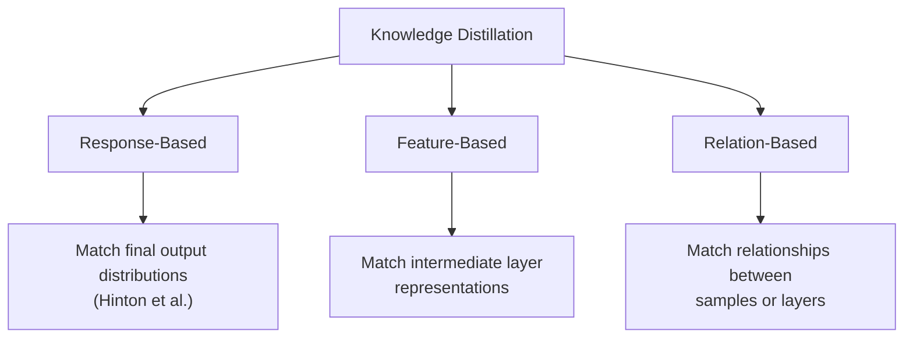
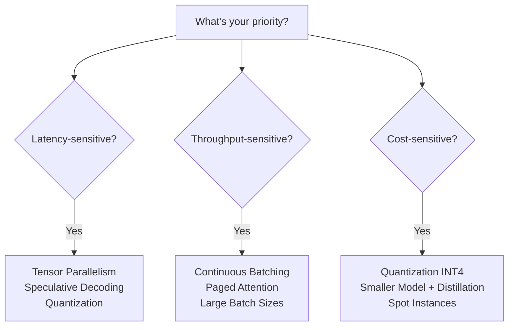

# Topic 23: LLM Inference Optimization & Deployment

## Table of Contents
1. [The Inference Challenge](#1-the-inference-challenge)
2. [LLM Inference Mechanics](#2-llm-inference-mechanics)
3. [The KV Cache](#3-the-kv-cache)
4. [Flash Attention](#4-flash-attention)
5. [Paged Attention & vLLM](#5-paged-attention--vllm)
6. [Quantization Fundamentals](#6-quantization-fundamentals)
7. [Post-Training Quantization Methods](#7-post-training-quantization-methods)
8. [Quantization-Aware Training & NF4](#8-quantization-aware-training--nf4)
9. [Knowledge Distillation](#9-knowledge-distillation)
10. [Pruning](#10-pruning)
11. [Batching Strategies](#11-batching-strategies)
12. [Parallelism for Inference](#12-parallelism-for-inference)
13. [Serving Frameworks & Deployment](#13-serving-frameworks--deployment)
14. [Speculative Decoding](#14-speculative-decoding)
15. [Latency vs Throughput vs Cost](#15-latency-vs-throughput-vs-cost)
16. [End-to-End: Serving a 70B Model](#16-end-to-end-serving-a-70b-model)
17. [Interview Questions & Answers](#17-interview-questions--answers)

---

## 1. The Inference Challenge

Training an LLM is a one-time cost. **Inference is the recurring cost** — it runs every time a user sends a query. For a model like GPT-4 handling millions of requests per day, inference cost dominates the total cost of ownership.

### Why Inference Is Hard

| Challenge | Root Cause |
|-----------|-----------|
| Memory-bound | Autoregressive decoding reads entire model weights per token |
| Low arithmetic intensity | Each generated token does massive memory reads for tiny compute |
| Quadratic attention | Self-attention over long contexts grows as $O(n^2)$ |
| Variable sequence lengths | Requests have different prompt/generation lengths → wasted compute |
| Latency-sensitive | Users expect real-time responses (< 1s first token) |

### The Memory Wall

Modern LLMs are **memory-bandwidth bound**, not compute-bound during inference:

```
Generating 1 token with a 70B FP16 model:
- Must read: ~140 GB of weights from GPU memory
- Compute: ~140 GFLOPs (tiny)
- A100 memory bandwidth: 2 TB/s → ~70ms just to read weights
- A100 compute: 312 TFLOPS → ~0.4ms for the math

The GPU spends 99% of time waiting for memory!
```

This **memory-boundedness** is the fundamental reason why quantization (shrinking weights) matters more than faster math.

---

## 2. LLM Inference Mechanics

Autoregressive inference has two distinct phases:

### Prefill Phase (Prompt Processing)

Process all input tokens in parallel:

$$
K_i = W_K \cdot X_i, \quad V_i = W_V \cdot X_i, \quad Q_i = W_Q \cdot X_i \quad \forall \, i \in \{1, \ldots, n\}
$$

This phase is **compute-bound** — it processes many tokens at once and has high arithmetic intensity (like training).

### Decode Phase (Token Generation)

Generate tokens one at a time, autoregressively:

$$
q_t = W_Q \cdot x_t, \quad \text{attn}_t = \text{softmax}\!\left(\frac{q_t \cdot K_{1:t}^T}{\sqrt{d_k}}\right) V_{1:t}
$$

This phase is **memory-bound** — each step generates exactly one token but must read all model weights and the full KV cache.

### The Two-Phase Asymmetry

```
┌─────────────────────────────────────────────┐
│              PREFILL PHASE                  │
│  Input: "Explain quantum computing"         │
│  Process: All tokens in parallel            │
│  Nature: Compute-bound (like training)      │
│  Metric: Time-to-first-token (TTFT)         │
├─────────────────────────────────────────────┤
│              DECODE PHASE                   │
│  Output: "Quantum computing uses..."        │
│  Process: One token at a time               │
│  Nature: Memory-bound (reads all weights)   │
│  Metric: Tokens-per-second (TPS)            │
└─────────────────────────────────────────────┘
```

### Key Inference Metrics

| Metric | Definition | User Impact |
|--------|-----------|-------------|
| **TTFT** (Time to First Token) | Latency until first output token | Perceived responsiveness |
| **TPS** (Tokens per Second) | Generation speed per request | Reading speed for user |
| **Throughput** | Total tokens/sec across all concurrent requests | Cost efficiency |
| **TPOT** (Time per Output Token) | Average inter-token latency | Streaming smoothness |

---

## 3. The KV Cache

### Why Cache?

During autoregressive generation, at step $t$, the model computes attention over all previous positions $1, \ldots, t$. Without caching, we would redundantly recompute $K$ and $V$ for all prior tokens at every step.

**Solution**: Cache the key and value projections for all previous tokens.

### KV Cache Size

For a single request with sequence length $s$:

$$
\text{KV Cache Size} = 2 \times L \times s \times n_{\text{heads}} \times d_{\text{head}} \times \text{bytes\_per\_param}
$$

where:
- $2$ — both keys and values
- $L$ — number of layers
- $n_{\text{heads}}$ — number of KV heads (may differ from query heads in GQA)
- $d_{\text{head}}$ — dimension per head

**Example: Llama 2 70B with 4K context**

$$
\text{KV Cache} = 2 \times 80 \times 4096 \times 8 \times 128 \times 2 \text{ bytes} = 1.31 \text{ GB per request}
$$

(Using GQA with 8 KV heads.) For 100 concurrent users, that's **131 GB** just for the KV cache — more than the model weights!

### GQA Reduces KV Cache

| Attention Type | KV Heads | KV Cache Reduction |
|---------------|----------|-------------------|
| Multi-Head (MHA) | $n_{\text{heads}}$ | 1× (baseline) |
| Multi-Query (MQA) | 1 | $n_{\text{heads}}$× smaller |
| Grouped-Query (GQA) | $n_{\text{groups}}$ | $n_{\text{heads}}/n_{\text{groups}}$× smaller |

This is a primary reason why modern LLMs (Llama 2/3, Mistral) use GQA — it dramatically reduces the KV cache bottleneck at inference.

---

## 4. Flash Attention

### The Problem: Standard Attention Is IO-Bound

Standard attention computes:

$$
\text{Attention}(Q, K, V) = \text{softmax}\!\left(\frac{QK^T}{\sqrt{d_k}}\right) V
$$

The naive implementation materializes the full $n \times n$ attention matrix in HBM (GPU main memory):

```
Standard Attention IO:
1. Read Q, K from HBM → compute S = QK^T → write S to HBM     [O(n²d) read, O(n²) write]
2. Read S from HBM → compute P = softmax(S) → write P to HBM  [O(n²) read, O(n²) write]
3. Read P, V from HBM → compute O = PV → write O to HBM       [O(n²) + O(nd) read, O(nd) write]

Total HBM accesses: O(n²d + n²)  ← dominated by the n² attention matrix
```

### The Key Insight: Tiling + Online Softmax

Flash Attention's breakthrough: **never materialize the full attention matrix**. Instead, compute attention in tiles that fit in SRAM (on-chip fast memory).

**GPU Memory Hierarchy**:

```
┌──────────────────────────────┐
│   SRAM (on-chip)             │
│   ~20 MB, ~19 TB/s           │  ← Flash Attention works HERE
├──────────────────────────────┤
│   HBM (GPU main memory)     │
│   ~80 GB, ~2 TB/s            │  ← Standard attention stores n×n matrix HERE
└──────────────────────────────┘
     ~10× bandwidth gap
```

### The Online Softmax Trick

The challenge with tiling softmax: you need the global maximum and sum. Flash Attention uses the **online softmax** algorithm:

For blocks $B_1, B_2, \ldots$, maintain running statistics:

$$
m^{(j)} = \max(m^{(j-1)}, \max(S_{B_j}))
$$

$$
\ell^{(j)} = e^{m^{(j-1)} - m^{(j)}} \ell^{(j-1)} + \sum_{i \in B_j} e^{S_i - m^{(j)}}
$$

$$
O^{(j)} = \text{diag}(e^{m^{(j-1)} - m^{(j)}})^{-1} \cdot O^{(j-1)} + e^{S_{B_j} - m^{(j)}} \cdot V_{B_j}
$$

The output is rescaled incrementally as new blocks arrive, producing the **exact same result** as standard attention.

### Flash Attention Complexity

| | Standard Attention | Flash Attention |
|--|-------------------|----------------|
| HBM reads/writes | $O(n^2 d + n^2)$ | $O(n^2 d^2 / M)$ |
| Memory for attention matrix | $O(n^2)$ | $O(n)$ — never materialized |
| Compute | $O(n^2 d)$ (same) | $O(n^2 d)$ (same) |

Where $M$ is the SRAM size. Since $d \ll M$ in practice, Flash Attention achieves **sub-quadratic HBM access** while performing exactly the same computation.

### Flash Attention Versions

| Version | Key Improvement |
|---------|----------------|
| **FA-1** | Tiled attention with online softmax, fused kernel |
| **FA-2** | Reduced non-matmul FLOPs, better parallelism over sequence length, ~2× faster than FA-1 |
| **FA-3** | Exploits H100 features (FP8, asynchronous execution, warp specialization), hardware-specific |

### Practical Impact

- **2-4× wall-clock speedup** over standard attention
- Enables **much longer context** (memory from $O(n^2)$ → $O(n)$)
- **Exact computation** — not an approximation
- Now standard in all major frameworks (PyTorch 2.0+ `scaled_dot_product_attention`)

---

## 5. Paged Attention & vLLM

### The Problem: KV Cache Fragmentation

In standard serving systems, each request pre-allocates a **contiguous** block of GPU memory for its maximum possible KV cache. This leads to massive waste:

```
Request 1: allocated 2048 tokens, used 512    → 75% wasted
Request 2: allocated 2048 tokens, used 1800   → 12% wasted
Request 3: allocated 2048 tokens, used 200    → 90% wasted

Average memory utilization: ~30-40%
```

Because memory is fragmented and over-allocated, the system serves **fewer concurrent requests** than it could.

### Paged Attention: Inspired by Virtual Memory

vLLM introduces **Paged Attention**, directly inspired by OS virtual memory paging:

| OS Concept | Paged Attention Analogue |
|-----------|------------------------|
| Virtual memory pages | KV cache blocks |
| Page table | Block table mapping logical → physical blocks |
| Physical frames | Non-contiguous GPU memory blocks |
| On-demand allocation | Blocks allocated only as tokens are generated |

### How It Works

```
┌────────────────────────────────────────┐
│           Logical KV Cache             │
│  Request 1: [Block 0][Block 1][Block 2]│
│  Request 2: [Block 0][Block 1]         │
│  Request 3: [Block 0]                  │
├────────────────────────────────────────┤
│           Block Table                  │
│  Req 1, Block 0 → Physical Block 7    │
│  Req 1, Block 1 → Physical Block 2    │
│  Req 1, Block 2 → Physical Block 5    │
│  Req 2, Block 0 → Physical Block 1    │
│  Req 2, Block 1 → Physical Block 9    │
│  ...                                   │
├────────────────────────────────────────┤
│        Physical GPU Memory             │
│  [B1][B2][B3][B4][B5][B6][B7][B8][B9] │
│   R2  R1  .. ..  R1  .. R1  ..  R2    │
│  Blocks can be anywhere, non-contiguous│
└────────────────────────────────────────┘
```

Key benefits:
- **Near-zero waste**: memory allocated on-demand in small blocks
- **No fragmentation**: blocks need not be contiguous
- **Copy-on-write**: shared prefixes (system prompts) share physical blocks
- **Preemption**: can evict/swap blocks to serve higher-priority requests

### Impact

vLLM achieves **2-4× higher throughput** compared to HuggingFace TGI and FasterTransformer by increasing memory utilization from ~30% to ~96%.

---

## 6. Quantization Fundamentals

### What Is Quantization?

Quantization maps high-precision floating-point weights to lower-precision representations:

$$
w_{\text{quantized}} = \text{round}\!\left(\frac{w - z}{s}\right), \quad w_{\text{dequantized}} = w_{\text{quantized}} \times s + z
$$

where $s$ is the **scale** and $z$ is the **zero-point**.

### Number Format Hierarchy

```
Format      Bits   Range (approx)              Model Size (7B)
─────────────────────────────────────────────────────────────
FP32        32     ±3.4 × 10^38               28 GB
BF16        16     ±3.4 × 10^38 (less prec.)  14 GB
FP16        16     ±6.5 × 10^4                14 GB
FP8 (E4M3)  8     ±448                         7 GB
INT8         8     -128 to 127                  7 GB
INT4         4     -8 to 7                     3.5 GB
NF4          4     Normal-float quantiles      3.5 GB
```

### BF16 vs FP16

```
FP16:  [1 sign][5 exponent][10 mantissa]  → more precision, smaller range
BF16:  [1 sign][8 exponent][7 mantissa]   → less precision, same range as FP32

BF16 is preferred for LLMs because:
- Same exponent range as FP32 → no overflow issues during training
- Precision loss is tolerable for large models
- Drop-in replacement for FP32 without loss scaling
```

### Symmetric vs Asymmetric Quantization

**Symmetric** (zero-point = 0):

$$
s = \frac{\max(|w|)}{2^{b-1} - 1}, \quad w_q = \text{round}\!\left(\frac{w}{s}\right)
$$

**Asymmetric** (non-zero zero-point):

$$
s = \frac{\max(w) - \min(w)}{2^b - 1}, \quad z = \text{round}\!\left(\frac{-\min(w)}{s}\right)
$$

Symmetric is simpler and faster (no zero-point offset in matmul); asymmetric handles skewed distributions better.

### Per-Tensor vs Per-Channel vs Per-Group

| Granularity | Scales | Accuracy | Overhead |
|-------------|--------|----------|----------|
| Per-tensor | 1 scale per weight matrix | Lowest | Negligible |
| Per-channel | 1 scale per output channel (row) | Medium | Low |
| Per-group | 1 scale per group of $g$ values (e.g., $g=128$) | Highest | Moderate |

**Per-group quantization** (used by GPTQ, AWQ) is the standard for LLMs — group size 128 provides a good accuracy–overhead trade-off.

---

## 7. Post-Training Quantization Methods

These methods quantize a pre-trained model without additional training.

### GPTQ (GPT Quantization)

**Core idea**: Use second-order information (Hessian) to minimize quantization error.

Based on **Optimal Brain Quantization (OBQ)**, which quantizes weights one at a time and compensates the remaining weights:

$$
\delta_F = \frac{(w_q - w)^2}{2 \cdot [\mathbf{H}_F^{-1}]_{qq}}
$$

$$
\mathbf{w}_F \leftarrow \mathbf{w}_F - \frac{w_q - w}{[\mathbf{H}_F^{-1}]_{qq}} \cdot (\mathbf{H}_F^{-1})_{:,q}
$$

where $\mathbf{H}_F = 2 X X^T$ is the Hessian of the layer's reconstruction loss and $F$ is the set of remaining (not yet quantized) weights.

**GPTQ's innovations**:
1. **Quantize columns in order** (not by largest error) — enables batched computation
2. **Lazy batch updates** — update blocks of 128 columns together for better GPU utilization
3. **Cholesky-based Hessian inverse** — numerically stable and efficient

**Result**: Quantize a 175B model in ~4 GPU-hours with near-lossless INT4 quality.

### AWQ (Activation-Aware Weight Quantization)

**Key insight**: Not all weights are equally important. A small fraction (~1%) of weights corresponding to **large activation magnitudes** are critical.

**Method**:
1. Identify **salient weight channels** based on activation statistics (not weight magnitude)
2. Apply per-channel scaling **before quantization** to protect salient channels:

$$
Q(w \cdot s) \cdot \frac{x}{s} \approx w \cdot x
$$

The scale $s$ is chosen to minimize:

$$
s^* = \arg\min_s \|Q(W \cdot \text{diag}(s)) \cdot \text{diag}(s)^{-1} \cdot X - W \cdot X\|
$$

**Advantages over GPTQ**:
- **No calibration data dependency** (uses activation statistics, not reconstruction)
- **Faster quantization** (no Hessian computation)
- **Better generalization** to unseen tasks

### SqueezeLLM

Addresses outlier weights through **non-uniform quantization**:
- Uses **sensitivity-weighted k-means clustering** to find optimal quantization centroids
- Stores outlier weights in a **sparse matrix** (typically <0.5% of weights)
- Combines dense low-bit representation + sparse outlier storage

### Comparison

| Method | Approach | Speed | Quality (INT4) | Calibration Data |
|--------|----------|-------|----------------|-----------------|
| **GPTQ** | Hessian-based compensation | Moderate | Excellent | Required (~128 samples) |
| **AWQ** | Activation-aware scaling | Fast | Excellent | Minimal |
| **SqueezeLLM** | Non-uniform + sparse outliers | Slow | Best | Required |
| **Round-to-nearest** | Naive rounding | Instant | Poor at INT4 | None |

---

## 8. Quantization-Aware Training & NF4

### Quantization-Aware Training (QAT)

QAT simulates quantization during training/fine-tuning so the model learns to be robust to quantization noise.

**Forward pass**: Use quantized weights

$$
\hat{W} = \text{dequantize}(\text{quantize}(W))
$$

**Backward pass**: Use **Straight-Through Estimator (STE)** — gradient flows through the quantization function as if it were the identity:

$$
\frac{\partial \mathcal{L}}{\partial W} \approx \frac{\partial \mathcal{L}}{\partial \hat{W}}
$$

QAT produces higher-quality quantized models than PTQ but requires training compute.

### NF4: NormalFloat4

NF4 is the data type behind **QLoRA**. Its key insight: pretrained neural network weights are approximately **normally distributed**.

**Construction**:
1. Assume weights $\sim \mathcal{N}(0, \sigma^2)$
2. Divide the normal CDF into $2^b = 16$ quantiles of **equal probability**
3. Each quantile bin has the same number of weights → **information-theoretically optimal**

$$
q_i = \Phi^{-1}\!\left(\frac{2i + 1}{2 \times 2^b}\right) \quad \text{for } i = 0, 1, \ldots, 2^b - 1
$$

where $\Phi^{-1}$ is the inverse normal CDF (quantile function).

```
Normal distribution with NF4 quantization levels:
            ╱╲
           ╱  ╲
          ╱    ╲
         ╱      ╲
        ╱        ╲
       ╱          ╲
      ╱            ╲
─┼──┼──┼──┼──┼──┼──┼──┼──┼──┼──┼──┼──┼──┼──┼──┼─
 q0 q1 q2 q3 q4 q5 q6 q7 q8 q9 ...           q15

Dense near center (more levels where more weights are)
Sparse in tails  (fewer levels where fewer weights are)
```

**Double quantization** (QLoRA's second trick): The FP32 quantization constants (scales) themselves are quantized to FP8, saving an additional ~0.4 bits per parameter.

### GGUF Format

**GGUF** (GPT-Generated Unified Format) is the standard format for **CPU inference** via llama.cpp:

- Supports mixed quantization (different layers at different precision)
- Common variants: Q4_K_M, Q5_K_M, Q8_0
- The "K" variants use **k-quants**: different groups within a block use different precision based on importance
- Optimized for CPU with AVX/NEON SIMD instructions

---

## 9. Knowledge Distillation

### Teacher-Student Framework

A large **teacher** model transfers knowledge to a smaller **student** model:

$$
\mathcal{L}_{\text{distill}} = \alpha \cdot \mathcal{L}_{\text{hard}} + (1 - \alpha) \cdot \mathcal{L}_{\text{soft}}
$$

**Hard loss** (standard cross-entropy with ground truth):

$$
\mathcal{L}_{\text{hard}} = -\sum_i y_i \log p_i^{(S)}
$$

**Soft loss** (KL divergence between teacher and student soft distributions):

$$
\mathcal{L}_{\text{soft}} = T^2 \cdot \text{KL}\!\left(\sigma\!\left(\frac{z^{(T)}}{T}\right) \| \sigma\!\left(\frac{z^{(S)}}{T}\right)\right)
$$

where $T$ is the **temperature** (typically 2–20) and $\sigma$ is softmax. The $T^2$ scaling compensates for the reduced gradient magnitude at high temperature.

### Why Temperature Matters

$$
p_i = \frac{\exp(z_i / T)}{\sum_j \exp(z_j / T)}
$$

| Temperature | Effect |
|-------------|--------|
| $T = 1$ | Standard softmax (peaked) |
| $T > 1$ | Softer distribution — reveals "dark knowledge" |
| $T \to \infty$ | Uniform distribution |

**Dark knowledge**: The teacher's soft probabilities encode inter-class similarities. If a cat image gets $P(\text{cat}) = 0.9, P(\text{dog}) = 0.08, P(\text{car}) = 0.02$, the student learns "cats look more like dogs than cars" — information absent from hard labels.

### Types of Distillation



### DistilBERT: A Case Study

| | BERT-base | DistilBERT |
|--|----------|------------|
| Layers | 12 | 6 (every other layer initialized from teacher) |
| Parameters | 110M | 66M (40% smaller) |
| Speed | 1× | 1.6× faster |
| GLUE Score | ~82 | ~79 (97% of BERT's performance) |

**Distillation recipe**:
1. Initialize student with every other layer of teacher
2. Train with triple loss: MLM loss + distillation loss + cosine embedding loss (hidden state alignment)
3. Remove NSP entirely (following RoBERTa)

### LLM-Era Distillation

Modern distillation for LLMs often uses **synthetic data generation**:

```
Teacher (GPT-4, Claude):
  → Generate training data / reasoning traces

Student (Llama, Mistral):
  → Fine-tune on teacher-generated data
```

Examples:
- **Alpaca**: GPT-3.5 generates 52K instruction-following examples → fine-tune Llama 7B
- **Orca**: GPT-4 generates step-by-step reasoning → student learns the reasoning process
- **Phi**: GPT-4 generates "textbook-quality" synthetic data → train from scratch

---

## 10. Pruning

### Core Idea

Remove redundant weights or structures to create sparse, smaller models.

### Unstructured Pruning

Remove individual weights (set to zero):

$$
m_{ij} = \begin{cases} 1 & \text{if } |w_{ij}| > \theta \\ 0 & \text{if } |w_{ij}| \leq \theta \end{cases}
$$

$$
W_{\text{pruned}} = W \odot M
$$

**Pros**: Can achieve high sparsity (90%+) with minimal accuracy loss.
**Cons**: Resulting sparse matrices are hard to accelerate on standard hardware — you need specialized sparse kernels/hardware.

### Structured Pruning

Remove entire structures (attention heads, neurons, layers):

```
Unstructured:                  Structured:
┌─────────────┐                ┌─────────────┐
│ x 0 x x 0 x │                │ x x x x x x │
│ 0 x 0 x x 0 │                │ 0 0 0 0 0 0 │  ← entire row removed
│ x x 0 0 x x │                │ x x x x x x │
│ 0 0 x x 0 x │                │ 0 0 0 0 0 0 │  ← entire row removed
│ x x x 0 0 0 │                │ x x x x x x │
└─────────────┘                └─────────────┘
 Hard to accelerate              Dense submatrix → actual speedup
```

### Movement Pruning

For fine-tuned models, **magnitude** is misleading (large pretrained weights may be irrelevant to the fine-tuning task). Movement pruning removes weights that are **moving toward zero** during fine-tuning:

$$
S_{ij} = -w_{ij} \cdot \frac{\partial \mathcal{L}}{\partial w_{ij}}
$$

If $S_{ij} > 0$, the weight is moving toward zero → prune it.

### The Lottery Ticket Hypothesis

**Claim** (Frankle & Carlin, 2019): Dense networks contain sparse subnetworks (winning tickets) that, when trained in isolation from their original initialization, can match the full network's performance.

**Implications**: The value of over-parameterization may lie in increasing the probability of containing a good sparse subnetwork, not in the capacity of the full network itself.

### SparseGPT

Prunes LLMs to 50-60% sparsity in a **single shot** using row-wise Hessian-based weight reconstruction (similar to GPTQ but for pruning):

$$
\text{Prune } w_q, \text{ then update remaining: } \mathbf{w}_F \leftarrow \mathbf{w}_F - \frac{w_q}{[\mathbf{H}_F^{-1}]_{qq}} \cdot (\mathbf{H}_F^{-1})_{:,q}
$$

---

## 11. Batching Strategies

### Why Batching Matters

Autoregressive decoding is memory-bound — the GPU reads model weights regardless of batch size. Increasing batch size **amortizes the weight-reading cost** across more requests:

$$
\text{Throughput} \approx \frac{B \times \text{tokens\_per\_request}}{\text{max}(\text{compute\_time}(B), \text{memory\_time})}
$$

Throughput increases with batch size $B$ until compute becomes the bottleneck.

### Static Batching

All requests in a batch run together until the **longest** one finishes:

```
Time ──────────────────────────────────►
Req 1: [████████████████████]
Req 2: [██████████░░░░░░░░░░]  ← idle, waiting for Req 1
Req 3: [████░░░░░░░░░░░░░░░░]  ← idle, waiting for Req 1

░ = GPU cycles wasted
```

**Problem**: Short requests waste GPU time waiting for long ones.

### Dynamic Batching

Collect requests in a queue and dispatch batches at fixed intervals or when the batch is full. Better than static, but still suffers from the stragglers problem within each batch.

### Continuous Batching (Iteration-Level Batching)

The key innovation in modern serving (vLLM, TGI, TensorRT-LLM):

```
Time ──────────────────────────────────►
Req 1: [████████████████████]
Req 2: [██████████] → Req 4: [████████]  ← new request fills the slot
Req 3: [████] → Req 5: [█████████████]   ← new request fills the slot

No wasted cycles! New requests enter as old ones finish.
```

**Mechanism**: At each decode step, check if any request has finished. If so, immediately insert a new request (prefill its prompt) and continue decoding for the batch.

**Impact**: 2-3× throughput improvement over static batching.

### Disaggregated Prefill and Decode

An emerging architecture that **separates prefill and decode into different GPU pools**:

```
┌──────────────┐     KV Cache     ┌──────────────┐
│  Prefill GPU  │ ───transfer───► │  Decode GPU   │
│  (compute-    │                 │  (memory-     │
│   bound)      │                 │   bound)      │
└──────────────┘                 └──────────────┘
```

**Rationale**: Prefill is compute-bound, decode is memory-bound — they have different optimal hardware configurations. Mixing them in the same batch causes interference.

---

## 12. Parallelism for Inference

### Tensor Parallelism (TP)

Split individual weight matrices across GPUs:

$$
Y = XW = X[W_1 | W_2] = [XW_1 | XW_2]
$$

Each GPU holds a **shard** of every layer. All GPUs are active for every token.

```
      Input X
      ╱    ╲
   GPU 0   GPU 1
   X·W₁    X·W₂
      ╲    ╱
   AllReduce
      Output
```

**Properties**:
- Reduces per-GPU memory by $\text{TP}$×
- Requires fast inter-GPU communication (NVLink) — **all-reduce every layer**
- Best within a single node (8 GPUs connected by NVLink)
- Reduces latency (all GPUs work on same token)

### Pipeline Parallelism (PP)

Different layers on different GPUs:

```
GPU 0: Layers 0-19   →   GPU 1: Layers 20-39   →   GPU 2: Layers 40-59   →   GPU 3: Layers 60-79
```

**Properties**:
- Less communication than TP (only send activations between stages)
- Adds latency (sequential pipeline)
- Better for multi-node setups (inter-node bandwidth is lower)
- Creates pipeline bubbles (GPUs idle while waiting)

### Typical Configuration for a 70B Model

```
┌─────────────────────────────────────────┐
│  4× A100 80GB on a single node          │
│  TP=4: each GPU holds 1/4 of weights    │
│  ~35 GB weights (FP16) / 4 = ~8.75 GB  │
│  Remaining memory for KV cache          │
│  NVLink provides 600 GB/s inter-GPU     │
└─────────────────────────────────────────┘
```

Or with quantization:

```
┌─────────────────────────────────────────┐
│  2× A100 80GB with INT4 quantization    │
│  ~35 GB weights (INT4) / 2 = ~17.5 GB  │
│  Plenty of room for KV cache            │
└─────────────────────────────────────────┘
```

---

## 13. Serving Frameworks & Deployment

### Framework Comparison

| Framework | Key Feature | Best For |
|-----------|------------|----------|
| **vLLM** | Paged Attention, continuous batching | High-throughput serving |
| **TGI** (HuggingFace) | Production-ready, Rust backend | HuggingFace ecosystem |
| **TensorRT-LLM** (NVIDIA) | Deep NVIDIA GPU optimization | Maximum single-GPU perf |
| **SGLang** | RadixAttention (prefix caching), structured generation | Complex prompting patterns |
| **llama.cpp** | CPU/Metal inference, GGUF | Edge/local deployment |
| **Ollama** | User-friendly wrapper around llama.cpp | Local development |

### SGLang's RadixAttention

**Key innovation**: Automatic prefix caching using a **radix tree** (prefix tree) for KV cache reuse:

```
                    [System Prompt]
                    /              \
         [User: "What is"]    [User: "Explain"]
          /          \               \
   ["AI?"]     ["ML?"]        ["transformers"]
```

If multiple requests share the same system prompt, the KV cache for that prefix is computed **once** and reused. This is especially powerful for:
- Shared system prompts
- Few-shot examples
- Multi-turn conversations
- Tree-of-thought / branching generation

### API Platforms

| Platform | Models | Differentiation |
|----------|--------|----------------|
| **OpenAI** | GPT-4o, o1, o3 | First-mover, broadest adoption |
| **Anthropic** | Claude 4.5/4.6 | Safety focus, long context |
| **AWS Bedrock** | Multiple providers | Enterprise, VPC integration |
| **Google Vertex AI** | Gemini family | Multi-modal native |
| **Together AI** | Open-source models | Cost-effective open-source serving |
| **Fireworks AI** | Open-source models | Low-latency optimized |

---

## 14. Speculative Decoding

### The Insight

Autoregressive decoding is slow because each token requires a full forward pass through the large model. But **verification is cheaper than generation**: checking whether multiple tokens are correct can be done in a single forward pass.

### How It Works

1. A small **draft model** generates $K$ candidate tokens autoregressively (fast)
2. The large **target model** verifies all $K$ tokens in a single forward pass (parallel)
3. Accept tokens from left to right until the first disagreement
4. Resample the rejected position from the corrected distribution

```
Draft model (fast):   "The" → "cat" → "sat" → "on" → "the" → "mat"
                                                  ↑
Target model (1 pass): ✓       ✓       ✓       ✗ (target prefers "upon")

Accept: "The cat sat"  +  sample from adjusted distribution at position 4
```

### Acceptance Probability

For draft token $x$ with draft probability $q(x)$ and target probability $p(x)$:

$$
P(\text{accept } x) = \min\!\left(1, \frac{p(x)}{q(x)}\right)
$$

If rejected, sample from the **residual distribution**:

$$
p'(x) = \frac{\max(0, p(x) - q(x))}{\sum_{x'} \max(0, p(x') - q(x'))}
$$

**Guarantee**: The output distribution is **exactly** the target model's distribution — speculative decoding is lossless.

### Expected Speedup

If the draft model's acceptance rate is $\alpha$ and we draft $K$ tokens:

$$
\text{Expected tokens per step} = \frac{1 - \alpha^{K+1}}{1 - \alpha}
$$

With a good draft model ($\alpha \approx 0.8$) and $K = 5$: ~3.4 tokens per target forward pass → **~2-3× speedup**.

### Variants

| Variant | Draft Source |
|---------|-------------|
| **Standard** | Separate small model (same vocabulary) |
| **Self-speculative** | Early exit from target model's own layers |
| **Medusa** | Additional prediction heads on the target model |
| **EAGLE** | Feature-level draft using target model's hidden states |
| **Lookahead** | Uses n-gram patterns from Jacobi iteration |

---

## 15. Latency vs Throughput vs Cost

### The Three-Way Trade-Off

```
                    Latency
                    (fast response)
                      ╱╲
                     ╱  ╲
                    ╱    ╲
                   ╱ PICK ╲
                  ╱  TWO   ╲
                 ╱          ╲
                ╱            ╲
    Throughput ──────────────── Cost
    (many users)            (cheap)
```

| Optimization | Latency | Throughput | Cost |
|-------------|---------|-----------|------|
| Larger batch size | ↑ (worse) | ↑↑ (better) | ↓ (better) |
| More GPUs (TP) | ↓ (better) | ↔ | ↑ (worse) |
| Quantization (INT4) | ↓ (better) | ↑ (better) | ↓ (better) |
| Speculative decoding | ↓ (better) | ↔ or ↓ | ↔ |
| Longer context | ↑ (worse) | ↓ (worse) | ↑ (worse) |

### Cost Model

$$
\text{Cost per token} = \frac{\text{GPU cost per hour}}{\text{tokens per hour}} = \frac{\text{GPU cost per hour}}{\text{throughput (tok/s)} \times 3600}
$$

**Example**: A100 80GB at $2/hr generating 1000 tok/s:

$$
\text{Cost per 1M tokens} = \frac{\$2}{1000 \times 3600} \times 10^6 = \$0.56
$$

### Optimization Decision Tree



---

## 16. End-to-End: Serving a 70B Model

### Step 1: Hardware Sizing

**Model memory** (Llama 2 70B):

| Precision | Model Size | Min GPUs (A100 80GB) |
|-----------|-----------|---------------------|
| FP16 | 140 GB | 2× (tight) or 4× |
| INT8 | 70 GB | 1× (barely) or 2× |
| INT4 | 35 GB | 1× with room for KV cache |

**KV cache memory** (per request, 4K context, GQA with 8 KV heads):
- FP16: ~1.3 GB per request
- INT8 KV cache: ~0.65 GB per request

### Step 2: Choose Optimization Stack

```
┌─────────────────────────────────────────────────────┐
│                 Production Stack                     │
├─────────────────────────────────────────────────────┤
│  Model: Llama 2 70B-Chat                            │
│  Quantization: AWQ INT4 (35 GB)                     │
│  Framework: vLLM                                     │
│  Hardware: 2× A100 80GB (TP=2)                      │
│  Features:                                           │
│    ✓ Paged Attention (memory efficiency)             │
│    ✓ Continuous batching (throughput)                │
│    ✓ Flash Attention 2 (attention speed)            │
│    ✓ Prefix caching (shared system prompts)         │
│  Expected: ~1500 tok/s throughput, ~100ms TTFT      │
└─────────────────────────────────────────────────────┘
```

### Step 3: Deployment Architecture

```
                Load Balancer
               ╱      |      ╲
         ┌─────┐  ┌─────┐  ┌─────┐
         │Node1│  │Node2│  │Node3│    ← Horizontal scaling
         │2×A100│  │2×A100│  │2×A100│   (each node runs full model)
         └─────┘  └─────┘  └─────┘
              TP=2     TP=2     TP=2
```

### Step 4: Monitoring

Key metrics to track:
- **TTFT p50/p99**: Time to first token at 50th/99th percentile
- **TPS**: Tokens per second per request
- **Queue depth**: Requests waiting to be served
- **GPU utilization**: Should be >80% for cost efficiency
- **KV cache utilization**: % of allocated KV cache memory used

---

## 17. Interview Questions & Answers

### Q1: How does Flash Attention reduce memory from O(n²) to O(n)? What is the key insight?

**Answer**: Flash Attention's key insight is that the $n \times n$ attention matrix doesn't need to exist in GPU main memory (HBM). Standard attention materializes this full matrix, requiring $O(n^2)$ memory. Flash Attention uses **tiling**: it splits $Q$, $K$, $V$ into blocks that fit in the GPU's fast on-chip SRAM (~20MB), computes partial attention within each tile, and uses an **online softmax** algorithm to maintain running statistics (max and sum) that allow exact incremental computation. The attention matrix is never written to HBM — each tile's contribution is accumulated into the output directly. This reduces HBM memory to $O(n)$ (just input/output matrices) while performing exactly the same computation. It's an **IO optimization**, not an approximation.

### Q2: Explain GPTQ vs AWQ. When would you choose each?

**Answer**: Both are INT4 post-training quantization methods, but differ in philosophy. **GPTQ** uses second-order information (the Hessian of the reconstruction loss) to optimally quantize weights one column at a time, compensating remaining weights for each quantization error — achieving excellent quality but requiring calibration data and moderate quantization time. **AWQ** observes that ~1% of weight channels (those corresponding to large activations) disproportionately affect quality. It applies per-channel scaling to protect these salient channels before quantization. AWQ is faster to quantize, requires minimal calibration data, and generalizes better to unseen tasks. **Choose GPTQ** when you need maximum quality on a known task distribution. **Choose AWQ** when you want fast quantization, good generalization, or when calibration data is limited.

### Q3: What is paged attention? Why does it improve throughput?

**Answer**: Paged attention (vLLM) borrows from OS virtual memory. Standard serving pre-allocates contiguous GPU memory for each request's maximum KV cache, leading to ~60-70% memory waste from internal fragmentation and over-allocation. Paged attention divides the KV cache into fixed-size **blocks** (like memory pages) that can be stored **non-contiguously** in GPU memory, allocated on-demand as tokens are generated, and tracked via a **block table** (like a page table). This achieves near-zero waste (~96% utilization). Higher memory utilization → can fit more concurrent requests in the same GPU memory → higher throughput. It also enables **copy-on-write** sharing for common prefixes (system prompts shared across requests).

### Q4: Walk through serving a 70B model. What hardware and optimization decisions would you make?

**Answer**: A 70B model in FP16 is ~140 GB, so we first consider **quantization**: AWQ INT4 reduces this to ~35 GB, fitting on a single A100 80GB. However, we need KV cache headroom (~1.3 GB per concurrent request at 4K context with GQA), so **2× A100 80GB with TP=2** provides 160 GB total with ample room for KV cache. For the serving stack: **vLLM** with continuous batching, paged attention, and Flash Attention 2. For further optimization: prefix caching for shared system prompts, FP8 KV cache to double concurrent capacity. Horizontal scaling with a load balancer for handling traffic spikes. Monitor TTFT p99, throughput, and KV cache utilization. If latency is critical, add **speculative decoding** with a 7B draft model.

### Q5: Explain knowledge distillation. What is "dark knowledge" and why does temperature matter?

**Answer**: Knowledge distillation trains a smaller student model to mimic a larger teacher's outputs. The loss combines standard cross-entropy with ground truth (hard labels) and KL divergence with the teacher's softened predictions (soft labels). **Temperature** $T > 1$ softens the teacher's output distribution, amplifying the small probabilities. These small probabilities encode **dark knowledge**: inter-class relationships that hard labels lack. For example, a teacher might assign $P(\text{dog}|\text{cat image}) = 0.08$, revealing that cats resemble dogs — information compressed to $P = 0$ in the hard one-hot label. The temperature is applied identically to teacher and student, and the $T^2$ scaling in the loss compensates for reduced gradient magnitude. Typical temperatures range from 2 to 20.

### Q6: What is speculative decoding? Why is it lossless?

**Answer**: Speculative decoding uses a small fast **draft model** to generate $K$ candidate tokens, then verifies all $K$ in a **single forward pass** of the large target model. Tokens are accepted left-to-right using the criterion $P(\text{accept}) = \min(1, p(x)/q(x))$ where $p$ is the target probability and $q$ is the draft probability. If rejected, we sample from the **residual distribution** $\max(0, p(x) - q(x))$, normalized. This acceptance-rejection scheme mathematically guarantees the output distribution is **exactly** the target model's distribution — no approximation. The speedup comes from the target model verifying $K$ tokens in parallel (one forward pass) instead of generating them one by one ($K$ forward passes). With acceptance rate $\alpha \approx 0.8$ and $K = 5$, we get ~3× speedup.

### Q7: Compare structured vs unstructured pruning. Why is structured pruning more practical?

**Answer**: **Unstructured pruning** removes individual weights (sets them to zero), creating arbitrary sparsity patterns. It can achieve high sparsity (90%+) with minimal accuracy loss, but the resulting sparse matrices are **irregular** — standard GPU hardware can't exploit this pattern efficiently, so you get no actual speedup without specialized sparse hardware/kernels. **Structured pruning** removes entire structures (attention heads, neurons, FFN channels, or even layers), producing smaller **dense** submatrices that run efficiently on standard hardware. The trade-off: structured pruning typically tolerates less sparsity before quality degrades, because you can't surgically remove the least important individual weights. In practice, structured pruning is preferred for deployment because it delivers **real speedups** on commodity GPUs.

### Q8: Explain the difference between prefill and decode phases. Why does this matter for optimization?

**Answer**: **Prefill** processes all input tokens in parallel — it's compute-bound with high arithmetic intensity (many tokens × model weights), similar to training. **Decode** generates one token at a time — it's memory-bound because it reads all model weights for a single token of computation. This matters because they have fundamentally different bottlenecks: prefill benefits from compute optimizations (higher FLOPS GPUs), while decode benefits from memory bandwidth optimizations (quantization, better memory access patterns). Modern systems like **disaggregated serving** (Splitwise, DistServe) exploit this by routing prefill and decode to different GPU pools optimized for each workload. It also explains why Flash Attention helps more for prefill (reducing IO for a compute-bound phase) while quantization helps more for decode (reducing the data that must be read per token).

### Q9: What is NF4 quantization? Why is it better than uniform INT4 for neural network weights?

**Answer**: NF4 (NormalFloat4) is an **information-theoretically optimal** 4-bit data type for normally distributed data. Since pretrained neural network weights are approximately $\mathcal{N}(0, \sigma^2)$, NF4 places its 16 quantization levels at the **quantiles of the normal distribution** — each level covers an equal-probability region. This means more quantization levels are placed near zero (where most weights cluster) and fewer in the tails (where few weights exist). Uniform INT4, by contrast, spaces levels evenly across the range, wasting resolution in the sparse tails and under-resolving the dense center. NF4 minimizes expected quantization error for normally distributed data. Combined with **double quantization** (quantizing the quantization constants themselves), NF4 is the backbone of QLoRA, enabling 4-bit fine-tuning of large models on a single GPU.

### Q10: Compare continuous batching to static batching. Why is continuous batching critical for LLM serving?

**Answer**: **Static batching** runs all requests in a batch until the longest one finishes — shorter requests sit idle, wasting GPU cycles. If one request generates 20 tokens and another generates 2000, the first wastes 99% of its allocated time. **Continuous batching** operates at the **iteration level**: after each decode step, finished requests are evicted and new requests are immediately inserted. The GPU is never idle waiting for stragglers. This typically yields **2-3× throughput improvement**. It's critical because LLM requests have highly variable generation lengths (some answers are one sentence, others are paragraphs), so static batching's waste is especially severe. All modern serving frameworks (vLLM, TGI, TensorRT-LLM, SGLang) implement continuous batching as a baseline feature.

---

*End of Topic 23: LLM Inference Optimization & Deployment*
