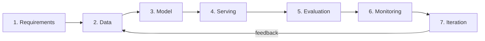
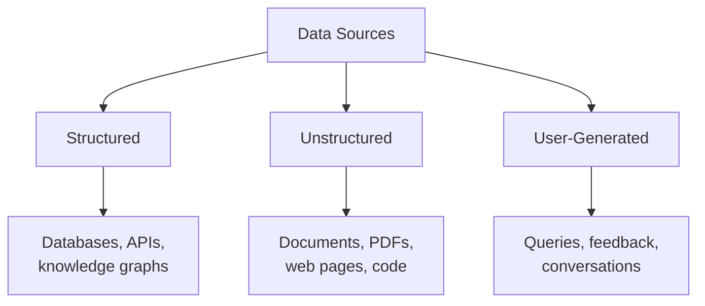
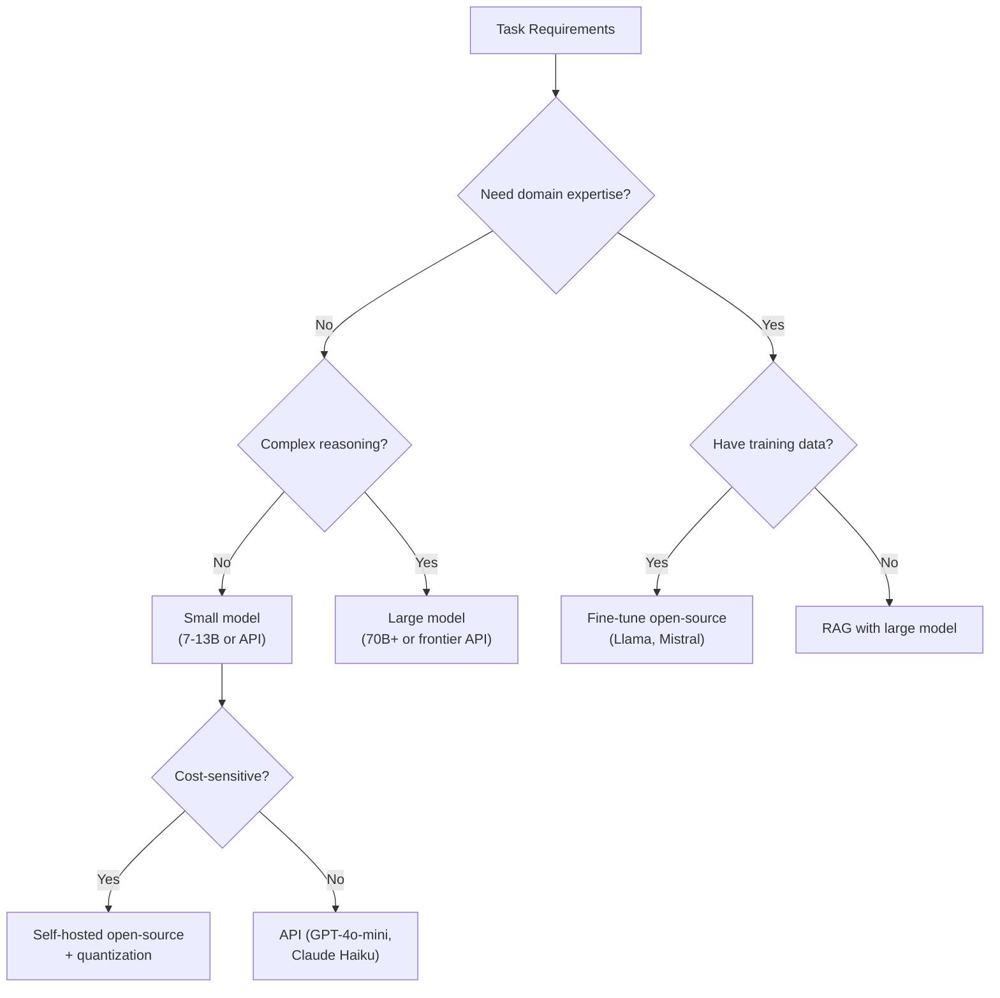
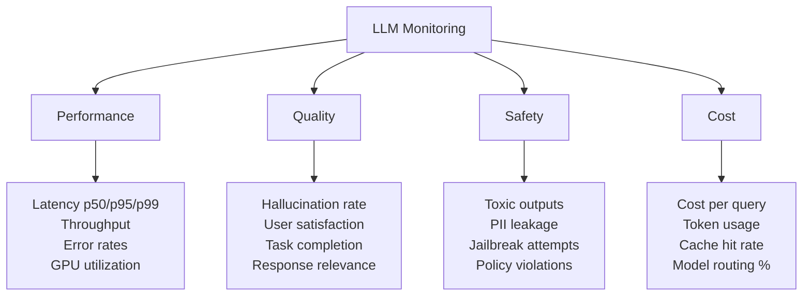

# Topic 24: ML System Design for GenAI

## Table of Contents
1. [The System Design Framework](#1-the-system-design-framework)
2. [Step 1 — Requirements](#2-step-1--requirements)
3. [Step 2 — Data Pipeline](#3-step-2--data-pipeline)
4. [Step 3 — Model Selection & Architecture](#4-step-3--model-selection--architecture)
5. [Step 4 — Serving & Inference Pipeline](#5-step-4--serving--inference-pipeline)
6. [Step 5 — Evaluation & Metrics](#6-step-5--evaluation--metrics)
7. [Step 6 — Monitoring & Observability](#7-step-6--monitoring--observability)
8. [Step 7 — Iteration & Continuous Improvement](#8-step-7--iteration--continuous-improvement)
9. [Guardrails & Safety](#9-guardrails--safety)
10. [Cost Optimization](#10-cost-optimization)
11. [Practice Design: RAG-Based Enterprise Q&A](#11-practice-design-rag-based-enterprise-qa)
12. [Practice Design: Conversational AI Chatbot](#12-practice-design-conversational-ai-chatbot)
13. [Practice Design: Content Moderation at Scale](#13-practice-design-content-moderation-at-scale)
14. [Practice Design: Code Generation Assistant](#14-practice-design-code-generation-assistant)
15. [Practice Design: LLM-Powered Search & Recommendation](#15-practice-design-llm-powered-search--recommendation)
16. [Practice Design: Document Summarization Pipeline](#16-practice-design-document-summarization-pipeline)
17. [Practice Design: Multi-Agent Customer Service](#17-practice-design-multi-agent-customer-service)
18. [Common Pitfalls & Anti-Patterns](#18-common-pitfalls--anti-patterns)
19. [Interview Questions & Answers](#19-interview-questions--answers)

---

## 1. The System Design Framework

Every GenAI system design interview follows the same structured framework. Interviewers assess your ability to think end-to-end, make principled trade-offs, and anticipate production concerns.

### The 7-Step Framework



### Time Allocation (45-minute interview)

| Step | Time | Focus |
|------|------|-------|
| Requirements | 5 min | Scope, constraints, success criteria |
| Data | 5 min | Sources, pipeline, quality |
| Model | 10 min | Architecture, training, key decisions |
| Serving | 10 min | Inference pipeline, scaling |
| Evaluation | 5 min | Offline + online metrics |
| Monitoring | 5 min | Observability, drift, alerts |
| Iteration | 5 min | Improvement loops, retraining |

### The Golden Rule

Always start with: **"What problem are we solving, and for whom?"** Then work from the simplest viable solution toward complexity only as requirements demand it.

---

## 2. Step 1 — Requirements

### Functional Requirements

What the system **does**:
- Input/output format (text → text, document → summary, query → answer)
- Supported languages and modalities
- Context requirements (single-turn vs multi-turn, document grounding)
- Output constraints (length, format, citations)

### Non-Functional Requirements

How the system **performs**:

| Dimension | Key Questions | Typical Targets |
|-----------|--------------|----------------|
| **Latency** | Time to first token? End-to-end response? | TTFT < 500ms, full response < 5s |
| **Throughput** | Concurrent users? Requests per second? | 100-10K concurrent, 1K-100K RPS |
| **Availability** | SLA requirements? | 99.9% (8.7 hrs/yr downtime) |
| **Scale** | Data volume? User growth? | 10M documents, 100K DAU |
| **Cost** | Budget per query? Monthly budget? | $0.001-$0.05 per query |
| **Quality** | Acceptable error rate? | Task-dependent |
| **Safety** | PII handling? Content policies? Compliance? | GDPR, SOC 2 |

### Clarifying Questions to Always Ask

```
1. Who are the users? (Internal/external, technical literacy)
2. What is the acceptable latency? (Real-time vs batch)
3. What scale are we designing for? (Day-1 vs Year-3)
4. What is the cost budget?
5. Are there compliance/regulatory requirements?
6. What data is available? (Labeled/unlabeled, public/proprietary)
7. What's the acceptable failure mode? (Refuse vs hallucinate)
```

---

## 3. Step 2 — Data Pipeline

### Data Sources for GenAI Systems



### Document Processing Pipeline

For RAG and grounding systems:

```
Raw Documents
     │
     ▼
┌──────────┐    ┌──────────┐    ┌──────────┐    ┌──────────┐
│  Parse    │ →  │  Clean   │ →  │  Chunk   │ →  │  Embed   │
│  (PDF,    │    │  (strip  │    │  (split  │    │  (vector │
│   HTML,   │    │   noise, │    │   into   │    │   repre- │
│   DOCX)   │    │   dedup) │    │   pieces)│    │   senta- │
└──────────┘    └──────────┘    └──────────┘    │   tions) │
                                                └──────────┘
                                                     │
                                                     ▼
                                              Vector Database
```

### Chunking Strategies (Recap from Topic 20)

| Strategy | How It Works | Best For |
|----------|-------------|----------|
| **Fixed-size** | Split every $N$ tokens with overlap | Simple, predictable |
| **Recursive** | Split by hierarchy: `\n\n` → `\n` → `. ` → ` ` | General-purpose |
| **Semantic** | Group by embedding similarity | Coherent meaning units |
| **Parent-child** | Small chunks for retrieval, return parent for context | Precision + context |
| **Document-aware** | Respect headers, sections, tables | Structured documents |

### Data Quality Matters More Than Quantity

```
                     Model Quality
                          ▲
                          │        ┌─── Data quality ceiling
                          │       ╱
                          │     ╱    ← Diminishing returns
                          │   ╱
                          │  ╱
                          │╱
                          └──────────────────► Data Volume

Key insight: Cleaning 10% of your data often helps more
than collecting 10× more noisy data.
```

### Data Freshness

| System Type | Freshness Requirement | Update Strategy |
|-------------|---------------------|----------------|
| News chatbot | Minutes | Streaming ingestion |
| Enterprise Q&A | Hours-days | Scheduled batch + change detection |
| Code assistant | Days-weeks | PR-triggered re-indexing |
| Knowledge base | Weeks-months | Periodic full reindex |

---

## 4. Step 3 — Model Selection & Architecture

### The Model Selection Decision Tree



### Build vs Buy

| Factor | Self-Hosted Open Source | API Provider |
|--------|----------------------|-------------|
| **Control** | Full (weights, infra, data) | Limited (prompt, parameters) |
| **Cost at low volume** | High (GPU fixed cost) | Low (pay per token) |
| **Cost at high volume** | Lower (amortized GPU) | Higher (per-token adds up) |
| **Latency** | Controllable | Depends on provider |
| **Data privacy** | Data stays in your infra | Sent to third party |
| **Maintenance** | You manage everything | Provider handles it |
| **Time to market** | Weeks-months | Days |

### Model Cascading / Routing

Use cheaper models for easy queries, expensive models for hard ones:

$$
\text{Cost}_{\text{cascade}} = p_{\text{easy}} \cdot c_{\text{small}} + (1 - p_{\text{easy}}) \cdot c_{\text{large}}
$$

```
User Query
    │
    ▼
┌──────────────┐     Easy (70%)      ┌─────────────┐
│   Router /    │ ──────────────────► │  Small Model │ → Response
│   Classifier  │                     │  (7B / cheap │
│               │     Hard (30%)      │   API)       │
│               │ ──────────────────► ├─────────────┤
└──────────────┘                     │  Large Model │ → Response
                                     │  (70B / GPT-4)│
                                     └─────────────┘

Average cost = 0.7 × $0.001 + 0.3 × $0.03 = $0.0097  (vs $0.03 for all-large)
                                                        → 3× cheaper
```

**Router approaches**:
- Classifier trained on difficulty features (query length, domain, complexity)
- LLM self-evaluation: small model generates answer + confidence → escalate if low confidence
- Rule-based: keyword matching, query type detection

### When to Fine-Tune vs RAG vs Prompt Engineering

| Approach | When to Use | Data Needed | Cost | Latency Impact |
|----------|------------|-------------|------|---------------|
| **Prompt engineering** | First attempt, always | 0 (examples in prompt) | Lowest | None |
| **RAG** | Need current/proprietary knowledge | Documents (no labels) | Medium | +200-500ms |
| **Fine-tuning** | Need behavior change, format control, domain adaptation | 100-10K labeled examples | High (one-time) | None (faster at inference) |
| **RAG + Fine-tuning** | Maximum quality on domain tasks | Both | Highest | +200-500ms |

---

## 5. Step 4 — Serving & Inference Pipeline

### End-to-End Inference Pipeline

```
┌─────────────────────────────────────────────────────────────────┐
│                    Inference Pipeline                            │
│                                                                 │
│  ┌─────────┐  ┌──────────┐  ┌─────────┐  ┌──────┐  ┌────────┐│
│  │ Input    │→ │ Pre-     │→ │ Model   │→ │ Post-│→ │ Output ││
│  │ Guard-   │  │ process  │  │ Infer-  │  │ proc-│  │ Guard- ││
│  │ rails    │  │ (RAG,    │  │ ence    │  │ ess  │  │ rails  ││
│  │          │  │  prompt  │  │         │  │      │  │        ││
│  │ • PII    │  │  build)  │  │ • LLM   │  │ • Parse│ • Fact  ││
│  │ • Toxic  │  │ • Retrieve│ │ • Cache │  │ • Format│  check ││
│  │ • Inject │  │ • Rerank │  │ • Route │  │ • Cite│ • Toxic ││
│  │   detect │  │ • Augment│  │         │  │      │  │ • PII  ││
│  └─────────┘  └──────────┘  └─────────┘  └──────┘  └────────┘│
└─────────────────────────────────────────────────────────────────┘
```

### Caching Strategies

| Cache Level | What's Cached | Hit Rate | Savings |
|------------|---------------|----------|---------|
| **Exact match** | Full query → response | 5-15% | 100% per hit |
| **Semantic cache** | Similar queries → response | 15-30% | 100% per hit |
| **KV cache reuse** | Shared prefixes (system prompt) | 80-95% | Prefill savings |
| **Embedding cache** | Document embeddings | ~100% | Embedding compute |

**Semantic caching** uses embedding similarity:

$$
\text{cache\_hit}(q) = \begin{cases} \text{cached\_response}(q') & \text{if } \cos(e_q, e_{q'}) > \theta \\ \text{generate}(q) & \text{otherwise} \end{cases}
$$

Typical threshold $\theta \approx 0.95$ for high-precision matching.

### Scaling Patterns

```
                    Vertical Scaling              Horizontal Scaling
                    ──────────────              ────────────────────
                    Bigger GPUs                  More GPU nodes
                    (A100 → H100)               (1 node → N nodes)

                    ✓ Simple                     ✓ Linear scaling
                    ✗ Hardware ceiling            ✗ Load balancing
                    ✗ Single point of failure     ✗ State management

                    Best for: latency            Best for: throughput
```

**Auto-scaling based on queue depth**:

$$
N_{\text{replicas}} = \max\!\left(N_{\text{min}}, \left\lceil \frac{\text{queue\_depth}}{\text{target\_queue\_per\_replica}} \right\rceil\right)
$$

### Typical Latency Budget Breakdown

For a RAG-based chatbot targeting 2s total response:

| Component | Budget | Optimization |
|-----------|--------|-------------|
| Input guardrails | 50ms | Lightweight classifier |
| Embedding query | 20ms | Cached model, batch |
| Vector search | 30ms | ANN index (HNSW) |
| Re-ranking | 100ms | Cross-encoder on top-20 |
| LLM generation (TTFT) | 200ms | Flash Attention, quantization |
| LLM generation (decode) | 1500ms | Continuous batching |
| Output guardrails | 100ms | Async / streaming |
| **Total** | **~2000ms** | |

---

## 6. Step 5 — Evaluation & Metrics

### Offline Metrics (Before Deployment)

| Metric Category | Metrics | Measures |
|----------------|---------|---------|
| **Task quality** | Accuracy, F1, ROUGE, BLEU | Core task performance |
| **Factuality** | Faithfulness score, citation accuracy | Hallucination rate |
| **Safety** | Toxicity rate, refusal rate, PII leakage | Safety compliance |
| **Robustness** | Performance on adversarial inputs | Attack resistance |
| **Efficiency** | Latency, throughput, cost per query | Operational fitness |

### LLM-as-Judge

Use a strong LLM to evaluate outputs when human evaluation is too expensive:

```
System: You are an expert evaluator. Rate the following response
on a scale of 1-5 for: Relevance, Accuracy, Completeness, Clarity.

Context: {retrieved_documents}
Question: {user_question}
Response: {model_response}

Provide scores and brief justifications for each dimension.
```

**Calibration**: Always validate LLM-as-Judge against human annotations on a held-out set. Common biases:
- **Position bias**: Prefers first option in pairwise comparison
- **Verbosity bias**: Prefers longer responses
- **Self-bias**: Prefers its own style

### Online Metrics (After Deployment)

| Metric | Signal | How to Measure |
|--------|--------|---------------|
| **Click-through rate** | Relevance | User clicks on suggested actions |
| **Thumbs up/down** | Satisfaction | Explicit user feedback |
| **Regeneration rate** | Quality | User hits "regenerate" |
| **Session length** | Engagement | Turns per conversation |
| **Task completion** | Utility | User achieves their goal |
| **Escalation rate** | Failure | User asks for human agent |

### A/B Testing for LLMs

**Challenge**: LLM responses are stochastic and multidimensional — a single metric rarely captures "better."

**Approach**:

$$
\text{Sample size} = \frac{2(z_{\alpha/2} + z_\beta)^2 \sigma^2}{\delta^2}
$$

where $\delta$ is the minimum detectable effect. For LLMs, $\sigma$ is high (responses vary), so you need **larger sample sizes** than typical A/B tests.

**Interleaving**: For ranking/search, show results from both models mixed together and track user preferences — more efficient than split A/B.

---

## 7. Step 6 — Monitoring & Observability

### What to Monitor



### Drift Detection

| Drift Type | What Changes | Detection Method |
|-----------|-------------|-----------------|
| **Data drift** | Input distribution shifts | Embedding distribution monitoring, statistical tests (KS, PSI) |
| **Concept drift** | Relationship between input and desired output changes | Performance metric degradation |
| **Model drift** | API model updates (provider changes weights) | Regression test suite, benchmark monitoring |
| **Retrieval drift** | Knowledge base becomes stale | Document freshness tracking, retrieval quality metrics |

### Hallucination Detection

```
Approach 1: Retrieval-grounded checking
  - Compare generated claims against retrieved documents
  - NLI model: entailment/contradiction/neutral per claim

Approach 2: Self-consistency
  - Generate N responses at temperature > 0
  - Claims that appear in most responses → likely factual
  - Claims that vary across responses → likely hallucinated

Approach 3: Uncertainty estimation
  - Token-level log probabilities
  - High entropy spans → potential hallucinations
```

### Alerting Strategy

| Severity | Condition | Action |
|----------|-----------|--------|
| **P0 (Critical)** | System down, PII leaked, harmful outputs | Page on-call, auto-disable |
| **P1 (High)** | Latency > 3× SLA, quality drop > 10% | Alert team, investigate immediately |
| **P2 (Medium)** | Cost spike, cache hit rate drop | Alert during business hours |
| **P3 (Low)** | Gradual drift, minor metric changes | Weekly review |

---

## 8. Step 7 — Iteration & Continuous Improvement

### The Flywheel

```
┌─────────────────────────────────────────┐
│                                         │
│    Deploy ──► Monitor ──► Collect       │
│      ▲         │         Feedback       │
│      │         │            │           │
│      │         ▼            ▼           │
│    Retrain ◄── Analyze ◄── Curate      │
│                                         │
│  Each cycle: better data → better model │
└─────────────────────────────────────────┘
```

### Retraining Triggers

| Trigger | Signal | Approach |
|---------|--------|----------|
| **Scheduled** | Time-based (weekly/monthly) | Full pipeline re-run |
| **Performance** | Quality metric drops below threshold | Targeted fine-tuning |
| **Data** | New knowledge base content | Re-embed, re-index |
| **Feedback** | Accumulated negative user signals | Curate examples, RLHF |
| **Drift** | Statistical drift detected | Investigate + retrain |

### Human-in-the-Loop Patterns

```
                     Confidence
                     ──────────
High confidence      → Auto-serve (95% of queries)
Medium confidence    → Serve with disclaimer + log for review
Low confidence       → Route to human agent
Flagged by guardrail → Block + route to human review queue
```

---

## 9. Guardrails & Safety

### Input Guardrails

```
User Input
    │
    ├──► PII Detection ──► Redact SSN, emails, phone numbers
    │
    ├──► Prompt Injection Detection ──► Block/flag adversarial inputs
    │    (classify: benign vs injection)
    │
    ├──► Topic Boundary ──► Reject off-topic queries
    │    ("I can only help with X")
    │
    ├──► Rate Limiting ──► Prevent abuse
    │
    └──► Content Policy ──► Block harmful/illegal requests
         (toxicity classifier)
```

### Prompt Injection Defense

**Layered defense** (no single technique is sufficient):

| Layer | Technique | Effectiveness |
|-------|-----------|--------------|
| **Detection** | Classifier trained on injection examples | Medium-high |
| **Isolation** | Separate system prompt from user content with delimiters/tags | Medium |
| **Instruction hierarchy** | System prompt > user prompt > retrieved content | Medium |
| **Output validation** | Check if output follows expected format/policy | High |
| **Dual LLM** | Privileged LLM (sees instructions) + quarantined LLM (sees user input) | High but costly |

### Output Guardrails

```
LLM Response
    │
    ├──► Factuality Check ──► NLI against retrieved sources
    │    (entailment score < θ → flag)
    │
    ├──► Toxicity Filter ──► Classifier on response text
    │
    ├──► PII Scrubbing ──► Remove any generated PII
    │
    ├──► Format Validation ──► Ensure JSON/structured output is valid
    │
    └──► Citation Verification ──► Check that citations reference real sources
```

### Guardrail Latency vs Safety Trade-off

Guardrails add latency. Prioritize by risk:

$$
\text{Priority}(\text{guardrail}_i) = \frac{\text{Risk}_i \times P(\text{violation}_i)}{\text{Latency}_i}
$$

**Streaming-compatible guardrails**: Run asynchronously on partial outputs. If a violation is detected mid-stream, truncate and append a correction.

---

## 10. Cost Optimization

### The Cost Stack

For a typical GenAI application:

```
Monthly Cost Breakdown (example: enterprise chatbot)
─────────────────────────────────────────────────────
LLM inference (API or GPU)     ████████████░░  60%
Embedding + retrieval          ███░░░░░░░░░░░  15%
Infrastructure (load balancer, │
  storage, networking)         ██░░░░░░░░░░░░  10%
Vector database                █░░░░░░░░░░░░░   5%
Monitoring + logging           █░░░░░░░░░░░░░   5%
Other (auth, CDN, etc.)        █░░░░░░░░░░░░░   5%
```

### Cost Reduction Strategies

#### 1. Model Routing (3-5× savings)
Route easy queries to cheap models (see cascading above).

#### 2. Caching (2-5× savings)
Semantic cache eliminates redundant LLM calls. Especially effective for:
- FAQ-like queries (many users ask similar questions)
- Repeated system prompts (KV cache reuse)

#### 3. Prompt Compression (1.5-2× savings)

Reduce token count without losing information:

$$
\text{Savings} = 1 - \frac{\text{compressed\_tokens}}{\text{original\_tokens}}
$$

Techniques:
- **LLMLingua**: Perplexity-based token pruning — remove tokens with low perplexity (predictable from context)
- **Shorter prompts**: Remove verbose instructions, use concise examples
- **Retrieved context pruning**: Only include most relevant chunks, not all top-K

#### 4. Quantized Self-Hosting (2-10× savings at scale)

Break-even analysis:

$$
\text{Break-even queries/month} = \frac{\text{GPU cost/month}}{\text{API cost/query} - \text{self-hosted cost/query}}
$$

**Example**: 2× A100 at $6K/month, serving Llama 70B INT4 at 50K queries/day:
- Self-hosted: $6K / (50K × 30) = $0.004 per query
- API (GPT-4o): ~$0.03 per query
- Savings: ~7.5×

#### 5. Batching & Async Processing

For non-real-time use cases (summarization, analysis), batch requests to maximize GPU utilization and minimize cost per token.

### Cost Monitoring Dashboard

Track daily:
- Total token usage (input + output) by model
- Cost per query (p50, p95)
- Cache hit rate (target: >20%)
- Model routing distribution
- Cost per user / per feature

---

## 11. Practice Design: RAG-Based Enterprise Q&A

### Problem Statement
Design a Q&A system for a company's internal knowledge base (10K documents, 500 concurrent users, <3s latency).

### Architecture

```
┌──────────────────────────────────────────────────────────┐
│                    Enterprise Q&A System                  │
│                                                          │
│  ┌──────────┐   ┌──────────────────────────────────────┐│
│  │ Document  │   │         Online Serving                ││
│  │ Ingestion │   │                                      ││
│  │ Pipeline  │   │  Query → Embed → Search → Rerank    ││
│  │           │   │    │                          │      ││
│  │ Parse     │   │    ▼                          ▼      ││
│  │ Chunk     │   │  Input         ┌─────────────────┐  ││
│  │ Embed     │   │  Guardrails    │ Prompt Builder   │  ││
│  │ Index     │   │                │ (query + context  │  ││
│  │    │      │   │                │  + chat history)  │  ││
│  │    ▼      │   │                └────────┬─────────┘  ││
│  │ Vector DB │◄──┤                         ▼            ││
│  │ (Qdrant)  │   │                ┌────────────────┐    ││
│  └──────────┘   │                │  LLM (Claude /  │    ││
│                  │                │  GPT-4o-mini)   │    ││
│                  │                └────────┬────────┘    ││
│                  │                         ▼             ││
│                  │                  Output Guardrails    ││
│                  │                  + Citation           ││
│                  └──────────────────────────────────────┘│
└──────────────────────────────────────────────────────────┘
```

### Key Design Decisions

| Decision | Choice | Rationale |
|----------|--------|-----------|
| Chunking | Recursive, 512 tokens, 50-token overlap | Balance retrieval precision and context |
| Embedding | BGE-large or E5-large | Strong open-source, can self-host |
| Vector DB | Qdrant / Pinecone | Managed, horizontal scaling |
| Retrieval | Hybrid (dense + BM25) with RRF | Best recall across query types |
| Reranking | Cross-encoder on top-20 | Significant precision boost |
| LLM | GPT-4o-mini (easy) / GPT-4o (hard) | Cost-quality cascade |
| Guardrails | PII redaction, topic boundary, citation check | Enterprise compliance |

### Handling Scale (500 Concurrent Users)

- **Embedding**: Batch encode, cache embeddings (never recompute)
- **Vector search**: HNSW index, ~30ms per query at 10M vectors
- **LLM**: Continuous batching via vLLM or API with auto-scaling
- **Cache**: Semantic cache for common questions (target 25% hit rate)
- **Total capacity**: 3 API replicas handle ~500 QPS at <3s

### Handling Multi-Turn

Store conversation history per session. At each turn:

$$
\text{Standalone query} = \text{LLM}(\text{chat\_history}, \text{latest\_question})
$$

Rewrite the user's follow-up into a standalone query before retrieval. This prevents retrieval failures on pronouns like "What about that one?" or "Tell me more."

---

## 12. Practice Design: Conversational AI Chatbot

### Problem Statement
Design a customer-facing chatbot for an e-commerce platform (100K DAU, multi-turn, need guardrails).

### Architecture

```
┌────────────────────────────────────────────────────────┐
│                   Chatbot System                        │
│                                                        │
│  User ──► API Gateway ──► Session Manager              │
│                               │                        │
│                               ▼                        │
│                    ┌──────────────────┐                │
│                    │  Input Pipeline   │                │
│                    │  • Auth check     │                │
│                    │  • PII redaction  │                │
│                    │  • Intent detect  │                │
│                    │  • Injection guard│                │
│                    └────────┬─────────┘                │
│                             │                          │
│              ┌──────────────┼──────────────┐           │
│              ▼              ▼              ▼           │
│         ┌────────┐   ┌──────────┐   ┌──────────┐     │
│         │ FAQ    │   │ Product  │   │ Order    │     │
│         │ Agent  │   │ Search   │   │ Status   │     │
│         │ (RAG)  │   │ Agent    │   │ Agent    │     │
│         └────────┘   └──────────┘   └──────────┘     │
│              │              │              │           │
│              └──────────────┼──────────────┘           │
│                             ▼                          │
│                    ┌──────────────────┐                │
│                    │  Output Pipeline  │                │
│                    │  • Safety filter  │                │
│                    │  • Tone check     │                │
│                    │  • PII scrub      │                │
│                    └────────┬─────────┘                │
│                             ▼                          │
│                        Response to User                │
└────────────────────────────────────────────────────────┘
```

### Key Design Decisions

| Decision | Choice | Rationale |
|----------|--------|-----------|
| Architecture | Router + specialized agents | Different tools per intent |
| Memory | Short-term (session) + user profile (long-term) | Personalization |
| Escalation | Confidence threshold + user request | Safety net |
| Tone | Consistent brand voice via system prompt | Brand consistency |
| Fallback | "Let me connect you with a human" | Graceful degradation |

### Multi-Turn State Management

```
Session Store (Redis):
┌─────────────────────────────────────────┐
│ session_id: "abc123"                    │
│ user_id: "user_456"                     │
│ messages: [                             │
│   {role: "user", content: "..."},       │
│   {role: "assistant", content: "..."},  │
│   ...                                   │
│ ]                                       │
│ context: {cart: [...], order: "..."}    │
│ turn_count: 5                           │
│ created_at: "2026-02-15T..."            │
└─────────────────────────────────────────┘
```

**Context window management**: When conversation exceeds context limit, summarize earlier turns:

$$
\text{Context} = [\text{system\_prompt}] + [\text{summary of turns 1-N}] + [\text{recent K turns verbatim}]
$$

---

## 13. Practice Design: Content Moderation at Scale

### Problem Statement
Design a system to moderate user-generated content (text + images) at 100K posts/hour.

### Architecture

```
Content
  │
  ▼
┌─────────────┐     ┌─────────────┐     ┌─────────────┐
│  Tier 1:    │     │  Tier 2:    │     │  Tier 3:    │
│  Fast       │ ──► │  LLM-Based  │ ──► │  Human      │
│  Classifiers│     │  Analysis   │     │  Review     │
│             │     │             │     │             │
│ • Toxicity  │     │ • Nuanced   │     │ • Edge cases│
│   classifier│     │   context   │     │ • Appeals   │
│ • Spam      │     │   analysis  │     │ • Policy    │
│   detector  │     │ • Policy    │     │   updates   │
│ • NSFW      │     │   violation │     │             │
│   (image)   │     │   reasoning │     │             │
│             │     │             │     │             │
│ Latency:    │     │ Latency:    │     │ Latency:    │
│ ~50ms       │     │ ~2s         │     │ Hours-days  │
│ Cost: ~free │     │ Cost: $$$   │     │ Cost: $$$$$ │
└─────────────┘     └─────────────┘     └─────────────┘
   90% resolved        8% resolved        2% reviewed
```

### The Tiered Approach

**Tier 1 — Fast classifiers** (handle 90%):
- Lightweight models (BERT-based or distilled) trained on labeled moderation data
- Binary decision: clearly safe → pass, clearly violating → remove
- Uncertain → escalate to Tier 2

**Tier 2 — LLM analysis** (handle 8%):
- Send borderline cases to LLM with detailed policy guidelines
- LLM provides reasoning + violation category
- Handles nuance (sarcasm, cultural context, coded language)

**Tier 3 — Human review** (handle 2%):
- Edge cases, appeals, novel violation types
- Human decisions become training data for Tier 1/2

### Key Metrics

$$
\text{Precision} = \frac{\text{True positives}}{\text{True positives} + \text{False positives}} \quad \text{(Don't over-censor)}
$$

$$
\text{Recall} = \frac{\text{True positives}}{\text{True positives} + \text{False negatives}} \quad \text{(Don't miss violations)}
$$

**Trade-off**: High recall is critical (missing harmful content is worse than over-removing), but precision matters for user experience. Typical target: 95%+ recall, 85%+ precision.

---

## 14. Practice Design: Code Generation Assistant

### Problem Statement
Design a code completion and generation system for a developer IDE plugin.

### Architecture

```
IDE Plugin
    │
    ├── Inline Completion (fast, streaming)
    │       │
    │       ▼
    │   ┌───────────────────┐
    │   │ Context Builder    │
    │   │ • Current file     │
    │   │ • Open tabs        │
    │   │ • Repository index │
    │   │ • Recent edits     │
    │   └────────┬──────────┘
    │            ▼
    │   ┌───────────────────┐
    │   │ Code LLM          │     Latency budget: <500ms
    │   │ (small, fast:     │     for first suggestion
    │   │  StarCoder 3B or  │
    │   │  custom fine-tune) │
    │   └───────────────────┘
    │
    └── Chat / Generation (thorough)
            │
            ▼
        ┌───────────────────┐
        │ Full Context +    │     Latency budget: <3s
        │ RAG over codebase │     for first token
        │ + Large model     │
        │ (GPT-4o / Claude) │
        └───────────────────┘
```

### Key Design Decisions

| Decision | Choice | Rationale |
|----------|--------|-----------|
| Inline completion model | Small (1-3B), fast | Latency critical, suggestions must feel instant |
| Chat model | Large (70B+ / frontier API) | Quality > latency for explicit requests |
| Context | Fill-in-the-middle (prefix + suffix) | IDE has both sides of the cursor |
| Repository awareness | Embedding-based code search | Find relevant functions/types |
| Evaluation | HumanEval, pass@k, user acceptance rate | Code correctness matters |

### Fill-in-the-Middle (FIM)

Most code models are trained with FIM objective to support cursor-position completion:

```
Training format:
<PRE> {prefix code} <SUF> {suffix code} <MID> {middle code to generate}

Inference:
<PRE> def fibonacci(n):
    if n <= 1:
        return n
    <SUF>
    return fibonacci(n-1) + fibonacci(n-2) <MID>

Model generates: "    "  (or appropriate logic)
```

---

## 15. Practice Design: LLM-Powered Search & Recommendation

### Problem Statement
Design a semantic search system for an e-commerce platform with 10M products.

### Architecture

```
┌──────────────────────────────────────────────────────────┐
│              Semantic Search Pipeline                     │
│                                                          │
│  User Query: "warm jacket for hiking in winter"          │
│       │                                                  │
│       ▼                                                  │
│  ┌──────────┐    ┌──────────┐    ┌──────────┐          │
│  │ Query    │    │ Retrieval│    │ Ranking  │          │
│  │ Under-   │ →  │ (Multi-  │ →  │ (Cross-  │          │
│  │ standing │    │  stage)  │    │  encoder) │          │
│  └──────────┘    └──────────┘    └──────────┘          │
│  • Query         • BM25 (keyword)  • Relevance          │
│    expansion     • Dense (semantic) • Personalization    │
│  • Intent        • Hybrid + RRF    • Price/availability  │
│    detection     • Category filter  • Diversity          │
│  • Spell check                                           │
│                                                          │
│       │                                                  │
│       ▼                                                  │
│  ┌──────────────────────────────────────────────┐       │
│  │ LLM-Enhanced Features                         │       │
│  │ • Generate search summaries                   │       │
│  │ • "Why this result" explanations              │       │
│  │ • Conversational refinement                   │       │
│  │ • Natural language filters ("under $100")     │       │
│  └──────────────────────────────────────────────┘       │
└──────────────────────────────────────────────────────────┘
```

### Key Design Decisions

| Decision | Choice | Rationale |
|----------|--------|-----------|
| Retrieval | Hybrid (BM25 + dense) | Handles exact matches and semantic |
| Index | HNSW (dense) + inverted index (BM25) | Latency: <50ms at 10M scale |
| Ranking | Cross-encoder fine-tuned on click data | Best relevance |
| Personalization | User embedding from purchase history | Contextual results |
| LLM usage | Post-retrieval only (summaries, explanations) | Cost control |

### Handling Scale

- **10M products**: HNSW index in ~20GB memory, search <50ms
- **Embedding updates**: Batch re-embed new/changed products nightly
- **Ranking model**: Small cross-encoder (~100M params), <50ms for top-50 candidates
- **LLM**: Only invoked for premium features, cached aggressively

---

## 16. Practice Design: Document Summarization Pipeline

### Problem Statement
Design a system to summarize long documents (10-100 pages) for legal/financial analysts.

### The Challenge: Long Documents Exceed Context

For documents beyond the model's context window, use hierarchical summarization:

### Map-Reduce Summarization

```
Long Document (100 pages)
        │
        ▼
┌───────────────────────────┐
│  Split into chunks        │
│  (1-2 pages each)         │
│  → 50-100 chunks          │
└───────────┬───────────────┘
            │
            ▼
┌───────────────────────────┐
│  MAP: Summarize each      │     Can be parallelized
│  chunk independently      │     across API calls
│  → 50-100 summaries       │
└───────────┬───────────────┘
            │
            ▼
┌───────────────────────────┐
│  REDUCE: Combine chunk    │
│  summaries into final     │     May need multiple
│  summary                  │     reduction steps
└───────────────────────────┘
```

### Refine Strategy (Alternative)

```
Chunk 1 → Summary₁
Chunk 2 + Summary₁ → Summary₂    (refine with new info)
Chunk 3 + Summary₂ → Summary₃    (refine with new info)
...
Chunk N + Summary_{N-1} → Final Summary
```

**Trade-offs**:
| | Map-Reduce | Refine |
|--|-----------|--------|
| Parallelizable | Yes (map phase) | No (sequential) |
| Coherence | May lose cross-chunk context | Better (running context) |
| Latency | Lower (parallel) | Higher (sequential) |
| Lost info | Independent chunks can't cross-reference | Later chunks may override earlier |

### Modern Approach: Long-Context Models

With 128K-1M token context models (Gemini, Claude), many documents fit in one pass:

$$
\text{If document tokens} < \text{context window}: \text{single-pass summarization}
$$

But even with long context, **stuffing everything into one prompt isn't always best**:
- Attention dilution on very long contexts
- Lost-in-the-middle effect (models attend less to middle of long contexts)
- Higher cost ($\propto$ token count)

**Hybrid approach**: Long-context model with explicit section-by-section instructions:

```
Summarize this document. Process it in order:
1. First, identify the key sections and themes
2. For each section, extract the critical points
3. Synthesize into a coherent executive summary

[Full document here]
```

---

## 17. Practice Design: Multi-Agent Customer Service

### Problem Statement
Design an AI customer service system that handles order management, technical support, billing, and general inquiries.

### Architecture

```
┌────────────────────────────────────────────────────────────┐
│                Multi-Agent Customer Service                  │
│                                                            │
│  User ──► Supervisor Agent                                 │
│               │                                            │
│               ├──► Order Agent ──► Order DB, Shipping API  │
│               │    (track, cancel, return)                  │
│               │                                            │
│               ├──► Billing Agent ──► Payment System         │
│               │    (refunds, invoices, plans)               │
│               │                                            │
│               ├──► Tech Support Agent ──► KB, Diagnostics  │
│               │    (troubleshoot, escalate)                 │
│               │                                            │
│               ├──► FAQ Agent ──► RAG over help docs         │
│               │    (general questions)                      │
│               │                                            │
│               └──► Human Handoff                           │
│                    (complex cases)                          │
│                                                            │
│  Shared: Conversation history, user profile, policy rules  │
└────────────────────────────────────────────────────────────┘
```

### Supervisor Routing Logic

The supervisor agent classifies intent and routes:

```
Supervisor System Prompt:
"You are a routing agent. Based on the user's message, route to:
- ORDER: order tracking, cancellation, returns
- BILLING: payments, refunds, subscription changes
- TECH: technical issues, troubleshooting
- FAQ: general questions about products/services
- HUMAN: emotional distress, legal threats, complex multi-issue

Respond with exactly one category."
```

### Tool-Equipped Agents

Each agent has specific tools:

| Agent | Tools | Authority |
|-------|-------|-----------|
| Order Agent | `get_order_status`, `initiate_return`, `cancel_order` | Can cancel orders < $100 |
| Billing Agent | `issue_refund`, `get_invoice`, `update_plan` | Can refund < $50 |
| Tech Support | `run_diagnostic`, `search_kb`, `create_ticket` | Can create tickets |
| FAQ Agent | `search_docs`, `get_policy` | Read-only |

**Escalation rules**: Actions above authority limits → human approval required.

### Handoff Between Agents

When the conversation spans multiple intents:

```
User: "My order is late and I want a refund"
    → Supervisor routes to Order Agent
    → Order Agent checks status, confirms delay
    → Order Agent says: "Let me transfer you to billing for the refund"
    → Supervisor routes to Billing Agent (with context from Order Agent)
    → Billing Agent processes refund
```

**Critical**: Pass conversation context and findings between agents to avoid the user repeating themselves.

---

## 18. Common Pitfalls & Anti-Patterns

### Design Anti-Patterns

| Anti-Pattern | Problem | Fix |
|-------------|---------|-----|
| **"Use GPT-4 for everything"** | Expensive, slow, overkill for simple tasks | Model cascading, use small models where possible |
| **No caching** | Redundant LLM calls for repeated queries | Semantic cache, KV cache reuse |
| **Ignoring latency budget** | Individual components fast, pipeline slow | Set per-component budgets, parallelize where possible |
| **RAG without evaluation** | No way to know if retrieval quality is sufficient | RAGAS evaluation, retrieval metrics (MRR, recall@K) |
| **No guardrails** | First jailbreak attempt succeeds | Layered defense, input/output filtering |
| **Monolithic design** | Can't scale or update individual components | Microservices, separate retrieval/generation/guardrails |
| **Over-engineering day 1** | Premature optimization, delayed launch | Start simple, iterate based on real traffic |

### The Simplicity Principle

```
Iteration 0: Prompt engineering with API               (days)
Iteration 1: + RAG for domain knowledge                (weeks)
Iteration 2: + Guardrails and caching                  (weeks)
Iteration 3: + Fine-tuning for quality/cost            (months)
Iteration 4: + Model cascading, advanced optimization  (months)

Don't jump to Iteration 4 on day 1!
```

### Interview Red Flags

Things interviewers watch for:
- **No requirements clarification** — jumping to architecture immediately
- **No baselines** — starting with the most complex solution
- **Ignoring cost** — unlimited GPU budget assumption
- **No evaluation plan** — can't measure success
- **No monitoring** — "deploy and forget"
- **Security afterthought** — guardrails mentioned last or not at all

---

## 19. Interview Questions & Answers

### Q1: Design a RAG-based Q&A system for 10K concurrent users. Cover end-to-end architecture.

**Answer**: Start with requirements: 10K concurrent users, <3s response time, enterprise documents. **Data pipeline**: Ingest documents via parsers (PDF, HTML), recursive chunking (512 tokens, 50 overlap), embed with BGE-large, store in Qdrant with HNSW index. **Retrieval**: Hybrid search (BM25 + dense) with RRF fusion, cross-encoder reranking on top-20. **Generation**: Model cascade — GPT-4o-mini for straightforward questions (70%), GPT-4o for complex (30%), with system prompt enforcing grounded answers and citations. **Serving**: API gateway → load balancer → auto-scaling inference pods. Semantic cache (~25% hit rate), KV cache reuse for shared system prompts. For 10K concurrent: ~20 inference pods with continuous batching. **Guardrails**: Input (PII redaction, topic boundary, injection detection), output (citation verification, toxicity filter). **Monitoring**: Latency p99, retrieval recall, user thumbs up/down, hallucination rate via NLI-based checking. **Iteration**: Collect negative feedback, curate for reranker fine-tuning and prompt improvement.

### Q2: Design a content moderation system using LLMs. How do you handle scale and latency?

**Answer**: The key insight is a **tiered architecture**. **Tier 1**: Fast classifiers (BERT-based toxicity, spam, NSFW image detector) handle 90% of content in <50ms — clearly safe passes, clearly violating gets removed. Cost is near-zero per item. **Tier 2**: Borderline cases (10%) go to an LLM with detailed content policy — it understands nuance (sarcasm, context), outputs reasoning + violation category in ~2s. Use a smaller model (GPT-4o-mini) for cost control. **Tier 3**: True edge cases (2%) and appeals go to human reviewers. At 100K posts/hour: Tier 1 handles 90K (compute cost ~$10/hr), Tier 2 handles ~10K (API cost ~$50/hr), Tier 3 handles ~2K (human cost dominates). **Feedback loop**: Human decisions become training data for Tier 1/2 classifiers. Priority: maximize recall (never miss harmful content), then optimize precision (reduce false positives). Monitor: false negative rate by category, average moderation latency, human reviewer queue depth.

### Q3: How would you implement guardrails for a customer-facing chatbot?

**Answer**: Implement **layered defense** at both input and output. **Input guardrails**: (1) PII detection — regex + NER model to redact SSN, emails, credit cards before LLM sees them; (2) Prompt injection detection — fine-tuned classifier on known injection patterns; (3) Topic boundary enforcement — classify intent and reject off-topic queries; (4) Rate limiting per user. **Output guardrails**: (1) Toxicity classifier on generated text; (2) PII scrubbing — ensure the model doesn't surface PII from training data; (3) Factuality check — NLI model to verify claims against retrieved sources; (4) Format validation — ensure structured outputs are well-formed. **System-level**: (1) System prompt with explicit behavioral boundaries; (2) Conversation length limits; (3) Human escalation for low-confidence responses; (4) Logging all interactions for audit. **Critical trade-off**: Each guardrail adds ~50-100ms latency. Prioritize by risk × probability. Run output guardrails asynchronously with streaming where possible.

### Q4: Your LLM chatbot costs $50K/month. How do you reduce costs by 5× without significant quality loss?

**Answer**: Target: $10K/month. Attack the biggest cost drivers systematically. **(1) Model cascading** (largest savings): Analyze query difficulty distribution. Route simple queries (70%) to GPT-4o-mini ($0.15/1M input tokens) instead of GPT-4o ($2.50/1M). Savings: ~60% of LLM cost. **(2) Semantic caching**: Hash + embedding similarity cache. For a typical chatbot, 20-30% of queries are semantically similar. Savings: 20-30%. **(3) Prompt optimization**: Audit prompts — remove verbose instructions, compress few-shot examples, use shorter system prompts. Typical savings: 30-50% of input tokens. **(4) Reduce output tokens**: Set appropriate max_tokens, use structured output formats. **(5) Self-hosting evaluation**: If volume is high enough, serve Llama 70B INT4 on 2× A100. At $6K/month GPU cost, this is cheaper than API if you exceed ~200K queries/day. Combined strategy: cascading (60% savings) + caching (25% savings) + prompt compression (30% savings) → approximately 5× total reduction while maintaining quality on hard queries through the large model tier.

### Q5: Walk through designing a code generation assistant. What are the key latency and quality considerations?

**Answer**: Two modes with different requirements. **Inline completion** (latency-critical, <500ms): Use a small specialized model (StarCoder 3B or DeepSeek-Coder 1.3B), quantized INT4, self-hosted. Fill-in-the-middle format using prefix + suffix context. Send the current file + relevant imports as context. Speculative decoding for additional speedup. Cache completions for repeated patterns. **Chat/generation mode** (quality-critical, <3s TTFT): Use a frontier model (Claude/GPT-4o). RAG over the repository: embed functions/classes, retrieve relevant code for context. Larger context window for complex generation. **Shared infrastructure**: Repository indexer that maintains embeddings of all code symbols, updated on each git commit. Language-aware chunking (function-level, class-level). **Evaluation**: HumanEval pass@1 for offline testing, user acceptance rate (% of suggestions accepted) for online. **Key trade-off**: Inline completions must be fast even if less accurate (users quickly dismiss bad suggestions), while chat generations must be thorough even if slower.

### Q6: How would you design monitoring for hallucination detection in production?

**Answer**: Multi-pronged approach. **Real-time checks**: (1) For RAG systems, run an NLI model comparing each generated claim against retrieved sources — flag responses where entailment score < 0.7. (2) Track token-level log probabilities from the LLM — high-entropy spans (low confidence) correlate with hallucination. This adds ~100ms but catches factual errors. **Batch analysis**: (1) Self-consistency — periodically sample queries, generate N responses at temperature > 0, claims that vary across responses are likely hallucinated. (2) LLM-as-judge — use a strong model to fact-check a sample of responses against the knowledge base. **User signals**: Track regeneration rate, thumbs-down rate, and explicit "this is wrong" feedback. Spike detection on these metrics → alert. **Ground truth**: Maintain a curated test set of known-answer queries; run regression tests on each model/prompt update. **Dashboard**: Hallucination rate by topic/category, trend over time, correlation with query types. Alert if rate exceeds threshold (e.g., >5% flagged responses).

### Q7: Compare model cascading vs. a single large model. When is each appropriate?

**Answer**: **Single large model**: Simplest architecture. Every query gets the best quality. Appropriate when (a) query volume is low enough that cost doesn't matter, (b) all queries require complex reasoning, or (c) the latency of a routing step is unacceptable. **Model cascading**: Route easy queries to cheap/fast models, hard queries to expensive/powerful models. Saves 3-5× in cost when the query difficulty distribution is skewed (most real-world distributions are). **Implementation**: Train a router classifier on features (query length, topic, presence of reasoning keywords). Or use the small model's own confidence — if it's uncertain, escalate. **When cascading works**: most queries are straightforward (FAQ, simple lookups), and only 20-30% require deep reasoning. **When it doesn't**: all queries are equally complex (e.g., research-level scientific QA), or the routing error rate is too high (misrouted hard queries give bad answers). **Key metric**: Track the quality gap between the cascade and all-large-model baseline. If cascaded quality degrades >2% on a key metric, the savings aren't worth it.

### Q8: Design a multi-agent system for customer service. How do you handle routing and context passing?

**Answer**: **Supervisor architecture**: A lightweight routing agent classifies user intent (order, billing, tech support, FAQ) and dispatches to specialized agents. The supervisor is fast (~200ms) — can be a fine-tuned classifier or small LLM. **Specialized agents**: Each has a focused system prompt and specific tool access (order agent → order DB, billing agent → payment API). Restricted tool access prevents errors (billing agent can't cancel orders). **Authority levels**: Each agent has spending/action limits (e.g., refund < $50 auto-approved). Exceeding limits triggers human approval. **Context passing**: All agents share a conversation state object containing the full message history, extracted entities (order ID, user ID), and previous agent findings. When the supervisor re-routes, the new agent receives this state to avoid repetition. **Handoff protocol**: Agent explicitly signals completion or handoff need ("I've confirmed the order is delayed. Transferring to billing for the refund."). The supervisor re-routes with accumulated context. **Failure handling**: If an agent fails (tool error, timeout), the supervisor catches the error, informs the user, and either retries or escalates to human. Track per-agent success rates and escalation rates.

### Q9: How do you evaluate a RAG system end-to-end? What metrics matter?

**Answer**: Evaluate each component independently then end-to-end. **Retrieval metrics**: (1) Recall@K — what fraction of relevant documents appear in top-K retrieved? Target: >90% at K=10. (2) MRR (Mean Reciprocal Rank) — how high is the first relevant document? (3) Precision@K — fraction of top-K that are relevant. **Generation metrics**: (1) Faithfulness — does the answer only use information from retrieved context? Measured via NLI-based claim verification. (2) Relevance — does the answer address the question? LLM-as-judge or human evaluation. (3) Completeness — does it cover all aspects? **End-to-end metrics**: (1) Answer correctness on a curated QA test set. (2) Citation accuracy — are cited sources actually used? **RAGAS framework** provides automated metrics: context precision, context recall, faithfulness, answer relevance. **Human evaluation**: Golden standard — sample 200+ queries monthly, have domain experts rate quality on 1-5 scale. **Online metrics**: User thumbs-up rate, follow-up question rate (lower is better — the first answer was sufficient), query abandonment rate.

### Q10: You need to build a GenAI feature from scratch. Walk through your approach from day 0 to production.

**Answer**: **Week 1-2 (Prototype)**: Start with the simplest possible version — prompt engineering against an API (GPT-4o or Claude). No infrastructure, just a notebook. Validate that the task is feasible and collect qualitative feedback. **Week 3-4 (MVP)**: Add the minimum required infrastructure: basic API server, input/output guardrails, simple caching, logging. If RAG is needed, set up a basic chunking + embedding pipeline. Deploy to internal users. **Month 2 (Iterate)**: Analyze logs to understand failure modes. Add evaluation pipeline (automated metrics + weekly human review). Optimize prompts based on failure patterns. Add semantic caching if costs are high. **Month 3 (Harden)**: Add monitoring (latency, quality, cost dashboards). Implement model cascading if cost is a concern. Fine-tune if specific quality gaps exist. Stress test at expected production load. **Month 4+ (Scale)**: A/B test against baselines. Set up the feedback flywheel (user signals → data curation → model improvement). Gradually expand user base. Plan for 10× growth. **Throughout**: Never skip evaluation. Each iteration must demonstrate measurable improvement on a metric that matters.

---

*End of Topic 24: ML System Design for GenAI*
